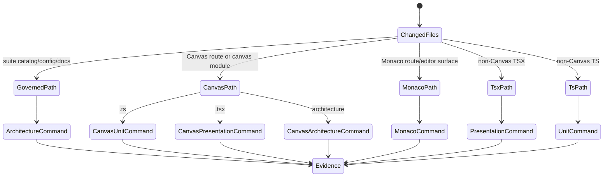
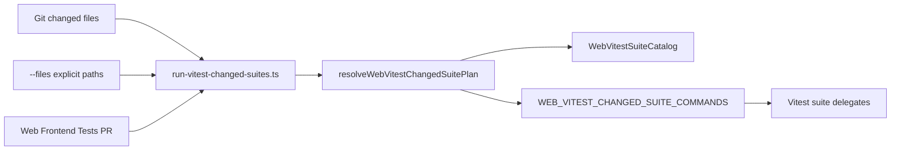

# Web Vitest Changed Suite Router Component

## Purpose

Own the query that maps changed `@dvt/web` files to the smallest safe Vitest
suite command for local development and non-root-sensitive pull requests.

Owned concern: `WebVitestChangedSuiteRouter` converts file paths into catalog
owned suite commands. It accelerates local development and the `Web Frontend
Tests` pull-request lane while preserving full primary-suite coverage on
`main`, manual workflow runs, and root-build-sensitive changes.

## Public API

<!-- markdownlint-disable MD060 -->

| Surface                             | Type     | Responsibility                                              |
| ----------------------------------- | -------- | ----------------------------------------------------------- |
| `resolveWebVitestChangedSuitePlan`  | function | Maps changed paths to ordered suite names and commands.     |
| `WEB_VITEST_CHANGED_SUITE_COMMANDS` | constant | Names the package-local command for each routed suite.      |
| `test:changed`                      | command  | Runs dependency build once, then routed web suite commands. |
| `test:canvas-unit`                  | command  | Runs Canvas unit-model focus tests.                         |
| `test:canvas-presentation`          | command  | Runs Canvas presentation focus tests.                       |
| `test:canvas-architecture`          | command  | Runs Canvas architecture focus tests.                       |
| `test:monaco`                       | command  | Runs Monaco route-surface focus tests.                      |
| `test:web:changed`                  | command  | Root alias for the package-local changed-suite command.     |
| `run-vitest-changed-suites.ts`      | adapter  | Reads Git change sets or explicit `--files` arguments.      |
| `Web Frontend Tests` PR route       | CI job   | Runs changed-suite routing for ordinary web PR changes.     |

<!-- markdownlint-enable MD060 -->

## Invariants

- The router never changes primary suite ownership.
- Architecture-governance paths route to `architecture`.
- Canvas-scoped paths route to `canvas-unit`, `canvas-presentation`, or
  `canvas-architecture` when the file type makes that safe.
- Monaco-scoped paths route to `monaco` when the change is local to Code,
  Artifacts/Diff Monaco guards, or shared Monaco code surfaces.
- Non-Canvas `.tsx` paths route to `presentation`.
- Non-Canvas `.ts` paths route to `unit`.
- If no web-relevant changed file exists, the command exits successfully
  without running a Vitest suite.
- Pull-request CI may use `test:web:changed` only when the test scope is web
  and not root-build-sensitive.
- `main`, manual workflow runs, and root-build-sensitive PRs still use
  `test:web:ci`.

## Transitions

## Consumers

- Local frontend developers use `pnpm --filter @dvt/web test:changed`.
- Reviewers use `pnpm test:web:changed -- --files <paths>` to validate a patch
  without running the full web suite.
- The `Web Frontend Tests` GitHub job uses `pnpm test:web:changed` for
  ordinary web pull requests after the dependency graph has been built.
- Architecture tests use the router API to prevent command drift.
- Documentation uses this component to explain local feedback-loop sizing.

## Component Flow

## Negative Rules

- Do not use this command for `main`, manual workflow runs, or
  root-build-sensitive pull requests.
- Do not add route-local changed-test scripts when the catalog can route them.
- Do not duplicate include/exclude glob semantics in the command adapter.
- Do not make source files under `apps/web/src/testing/**` production services.
