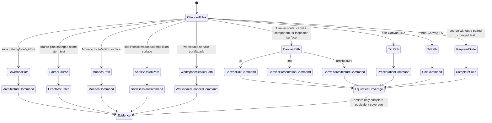
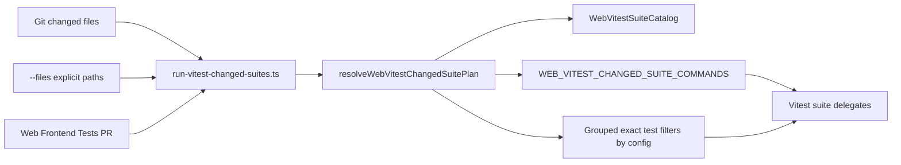
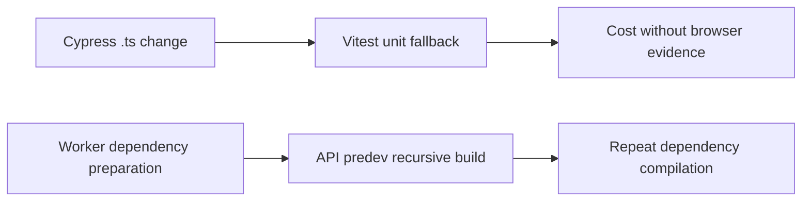
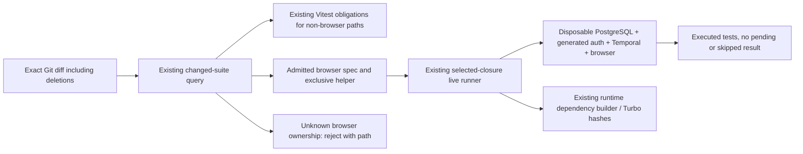

# Web Vitest Changed Suite Router Component

## Purpose

Own the query that maps changed `@dvt/web` files to the smallest safe test
obligations for local development and non-root-sensitive pull requests.

Owned concern: `WebVitestChangedSuiteRouter` converts file paths into catalog
owned suite commands. It accelerates local development and the `Web Frontend
Tests` pull-request lane while preserving full primary-suite coverage on
`main`, manual workflow runs, and root-build-sensitive changes.

## Public API

<!-- markdownlint-disable MD060 -->

| Surface                             | Type     | Responsibility                                                 |
| ----------------------------------- | -------- | -------------------------------------------------------------- |
| `resolveWebVitestChangedSuitePlan`  | function | Maps changed paths to ordered suite names and commands.        |
| `WEB_VITEST_CHANGED_SUITE_COMMANDS` | constant | Names the package-local command for each routed suite.         |
| `test:changed`                      | command  | Runs dependency build once, then routed web suite commands.    |
| `test:canvas-unit`                  | command  | Runs Canvas unit-model focus tests.                            |
| `test:canvas-presentation`          | command  | Runs Canvas presentation focus tests.                          |
| `test:canvas-architecture`          | command  | Runs Canvas architecture focus tests.                          |
| `test:monaco`                       | command  | Runs Monaco route-surface focus tests.                         |
| `test:shell-session`                | command  | Runs app shell, session, scope, and service-composition tests. |
| `test:workspace-services`           | command  | Runs workspace service port/facade focus tests.                |
| `test:web:changed`                  | command  | Root alias for the package-local changed-suite command.        |
| `run-vitest-changed-suites.ts`      | adapter  | Reads Git/`--files` inputs and runs grouped suite commands.    |
| `Web Frontend Tests` PR route       | CI job   | Runs changed-suite routing for ordinary web PR changes.        |

<!-- markdownlint-enable MD060 -->

## Invariants

- The router never changes primary suite ownership.
- Architecture-governance paths route to `architecture`.
- Canvas route paths and Canvas-owned component/inspector surfaces route to
  `canvas-unit`, `canvas-presentation`, or `canvas-architecture` when the file
  type makes that safe.
- Canvas-owned component surfaces under `src/app/components/canvas/**`,
  `src/app/components/inspector/**`, and `src/app/components/InspectorPanel.tsx`
  stay in Canvas focus lanes. They must not fall back to the full `unit`,
  `presentation`, or `architecture` primary suites only because they live
  outside `src/app/views/canvas/**`.
- Monaco-scoped paths route to `monaco` when the change is local to Code,
  Artifacts/Diff Monaco guards, or shared Monaco code surfaces.
- App shell, session context, workspace-scope selection, session store,
  API-client context propagation, service composition, and their shared test
  doubles route to `shell-session` before the broad `unit` or `presentation`
  fallback.
- Workspace service paths under `src/app/services/workspace/**` route to
  `workspace-services` before the broad `unit` fallback.
- When a changed source file and its same-stem `*.test.*` or `*.spec.*` file
  both appear in the same diff, the router may run that exact test file instead
  of the broader suite.
- A source without a directly paired changed test requires its complete suite.
  Unrelated exact tests in that suite cannot cancel this requirement. When a
  complete suite is required, its exact tests are included by that run rather
  than executed again in a separate batch.
- Exact changed-test execution is batched by Vitest config, so one changed set
  with many architecture files still pays for one Vitest process for that
  architecture config.
- Governance changes to the suite catalog, configs, package scripts, router
  adapter, or router docs run all current `src/testing/vitestSuites*.architecture.test.ts`
  guards in one exact batch instead of the broad architecture suite. The
  inventory contract detects guards omitted after a split or addition.
- A complete primary suite absorbs its equivalent Canvas focus suite, including
  exact focus tests. The catalog contract proves file-set containment and equal
  execution configuration outside include/exclude patterns. An exact primary
  batch is not a complete suite and cannot absorb a Canvas focus run.
- Monaco, shell-session, and workspace-services retain their own execution
  contexts: their jsdom defaults are not interchangeable with Node primary
  suites. This normalization does not change environments, isolation or workers.
- Source files without a changed same-stem test keep the existing suite
  fallback, so unpaired source edits do not silently lose coverage.
- Non-Canvas `.tsx` paths route to `presentation`.
- Non-Canvas `.ts` paths route to `unit`.
- If no web-relevant changed file exists, the command exits successfully
  without running a Vitest suite.
- Pull-request CI may use `test:web:changed` only when the test scope is web
  and not root-build-sensitive.
- `main`, manual workflow runs, and root-build-sensitive PRs still use
  `test:web:ci`.

## Transitions

```mermaid
stateDiagram-v2
  [*] --> ChangedFiles
  ChangedFiles --> GovernedPath: suite catalog/config/docs
  ChangedFiles --> PairedSource: source plus changed same-stem test
  ChangedFiles --> RequiredSuite: source without a paired changed test
  ChangedFiles --> CanvasPath: Canvas route, canvas component, or inspector surface
  ChangedFiles --> MonacoPath: Monaco route/editor surface
  ChangedFiles --> ShellSessionPath: shell/session/scope/composition surface
  ChangedFiles --> WorkspaceServicePath: workspace service port/facade
  ChangedFiles --> TsxPath: non-Canvas TSX
  ChangedFiles --> TsPath: non-Canvas TS
  GovernedPath --> ArchitectureCommand
  PairedSource --> ExactTestBatch
  RequiredSuite --> CompleteSuite
  CanvasPath --> CanvasUnitCommand: .ts
  CanvasPath --> CanvasPresentationCommand: .tsx
  CanvasPath --> CanvasArchitectureCommand: architecture
  MonacoPath --> MonacoCommand
  ShellSessionPath --> ShellSessionCommand
  WorkspaceServicePath --> WorkspaceServicesCommand
  TsxPath --> PresentationCommand
  TsPath --> UnitCommand
  ArchitectureCommand --> Evidence
  ExactTestBatch --> Evidence
  CanvasUnitCommand --> EquivalentCoverage
  CanvasPresentationCommand --> EquivalentCoverage
  CanvasArchitectureCommand --> EquivalentCoverage
  MonacoCommand --> Evidence
  ShellSessionCommand --> Evidence
  WorkspaceServicesCommand --> Evidence
  PresentationCommand --> EquivalentCoverage
  UnitCommand --> EquivalentCoverage
  CompleteSuite --> EquivalentCoverage
  EquivalentCoverage --> Evidence: absorb only complete equivalent coverage
```

## Consumers

- Local frontend developers use `pnpm --filter @dvt/web test:changed`.
- Reviewers use `pnpm test:web:changed -- --files <paths>` to validate a patch
  without running the full web suite.
- The `Web Frontend Tests` GitHub job uses `pnpm test:web:changed` for
  ordinary web pull requests after the dependency graph has been built.
- Architecture tests use the router API to prevent command drift.
- Documentation uses this component to explain local feedback-loop sizing.

## Component Flow

```mermaid
flowchart LR
  Git["Git changed files"] --> Adapter["run-vitest-changed-suites.ts"]
  Args["--files explicit paths"] --> Adapter
  Adapter --> Router["resolveWebVitestChangedSuitePlan"]
  Router --> Catalog["WebVitestSuiteCatalog"]
  Router --> Commands["WEB_VITEST_CHANGED_SUITE_COMMANDS"]
  Router --> ExactBatches["Grouped exact test filters by config"]
  Commands --> Vitest["Vitest suite delegates"]
  ExactBatches --> Vitest
  Workflow["Web Frontend Tests PR"] --> Adapter
```

## Negative Rules

- Do not substitute changed Vitest selection for full primary suites on `main`,
  manual workflow runs, or root-build-sensitive pull requests.
- Do not add route-local changed-test scripts when the catalog can route them.
- Do not duplicate include/exclude glob semantics in the command adapter.
- Do not spawn one Vitest process per exact test when the same config can run
  the exact filters together.
- Do not suppress an unpaired source's suite because another test was changed.
- Do not treat Vitest as evidence for a Cypress change. Browser obligations use
  the admitted runtime below; unsupported browser changes fail closed.
- Do not make source files under `apps/web/src/testing/**` production services.

## Browser Evidence Boundary — GH-3540

This section specifies the next implementation of the existing
`RouteChangedWebVitestSuites` query and `RunWebCypressNative` command. GitHub
[#3540](https://github.com/dunay2/dvt/issues/3540) owns delivery status; this
design does not assert that its acceptance has already passed.

The root cause is a type-based fallback: a Cypress `.ts` file selects the
complete Vitest unit suite, but that suite never executes the changed browser
flow. A second cost is API `predev` rebuilding its dependencies recursively
outside the existing Turbo runtime-dependency builder.

```mermaid
flowchart LR
  Before["Cypress .ts change"] --> Fallback["Vitest unit fallback"]
  Fallback --> Wrong["Cost without browser evidence"]
  Worker["Worker dependency preparation"] --> Api["API predev recursive build"]
  Api --> Repeat["Repeat dependency compilation"]
```

```mermaid
flowchart LR
  Diff["Exact Git diff including deletions"] --> Router["Existing changed-suite query"]
  Router --> Vitest["Existing Vitest obligations for non-browser paths"]
  Router --> Admitted["Admitted browser spec and exclusive helper"]
  Router --> Reject["Unknown browser ownership: reject with path"]
  Admitted --> Runner["Existing selected-closure live runner"]
  Runner --> Runtime["Disposable PostgreSQL + generated auth + Temporal + browser"]
  Runner --> Build["Existing runtime dependency builder / Turbo hashes"]
  Runtime --> Evidence["Executed tests, no pending or skipped result"]
```

### Admission And Execution

- Initially admit only `canvas-dvt-terminal-transform-preview-live.cy.ts` and
  its exclusive `liveRunEventRecovery.proof.ts` helper to the existing
  `test:e2e:selected-closure:live` command. This is not coverage of the complete
  Cypress inventory. Shared support, other specs, Cypress configuration and
  unknown executable paths require explicit consumer/runtime admission; they
  cannot silently fall back to Vitest or succeed with no command.
- The browser policy is a small pure module (`apps/web/cypress.changed.ts`),
  composed by the existing query. It is not a second repository diff detector
  or a new Vitest suite catalog. The adapter still owns Git discovery and
  process execution only. Policy/adapter/runner changes require the admitted
  live proof as well as their own contract tests.
- Git discovery includes deleted paths. Failure to read the requested range,
  index, working tree or untracked inventory is an error, not an empty diff.
  A deleted admitted spec fails rather than reporting an empty successful run.
  Rename detection is disabled so moving a spec cannot hide its removed path.
- Ordinary changed routing executes both independent obligations. A browser
  change does not require unrelated Vitest unit tests; a mixed diff retains
  the Vitest plan for its genuine Web sources.
- CI resolves the plan before provisioning the browser runtime. PostgreSQL,
  dbt and Cypress preparation is conditional on a browser obligation. Use an
  explicit disposable CI PostgreSQL URL and generated local proof identity;
  no tenant credential, repository secret or development database is required.
- `main`, manual and root-sensitive runs retain `test:web:ci` and execute the
  admitted browser baseline as a separate obligation. A browser-only adapter
  invocation is not a substitute for that full Vitest command. Required check
  names and the Test Suite aggregate stay unchanged.
- The existing live runner owns allocation and cleanup. Missing runtime,
  zero executed tests, pending tests or skipped tests are failures. POSIX
  teardown must stop child process groups and wait before disposing its lease.
  Native browser execution uses a small `run-selected-closure-cypress.cjs`
  child adapter over the installed Cypress module API; it validates the real
  result counters and the one expected spec. Credentials stay in environment
  variables, never CLI arguments. Process lifecycle belongs to
  `live-proof-process.cjs`, shared only by this live runner and its browser child;
  this keeps teardown out of selection policy and result validation.
  The admitted route explicitly selects native execution. The pre-existing
  manual Docker utility is not admitted CI evidence and is not certified by
  this cut.
- API `predev` delegates to `build-workspace-runtime-deps.cjs dvt-api`. pnpm
  still owns the production dependency closure; Turbo owns ordering, input
  hashes and output restoration. No timestamp cache, build bypass or separate
  freshness authority is added. Other API lifecycle scripts are out of scope.
- The existing repository command catalog classifies the two new runtime
  helpers explicitly as test tooling; unknown commands remain root-sensitive.
  Local `hasWebChange` and CI Web scope include their exact paths so a runner-only
  change cannot miss the live obligation. Workflow contracts inspect effective
  job/step settings rather than counting repeated YAML strings.

### Planning Matrix

| Scenario                 | Opportunity          | Fowler pattern                | DDD owner                            | Command/query rail          | Implementation surfaces                                                                    | Unit or package test                                     | Architecture test                                                     | User-flow test                                                             | Out of scope                                      |
| ------------------------ | -------------------- | ----------------------------- | ------------------------------------ | --------------------------- | ------------------------------------------------------------------------------------------ | -------------------------------------------------------- | --------------------------------------------------------------------- | -------------------------------------------------------------------------- | ------------------------------------------------- |
| Changed browser evidence | Test-only confidence | Policy and adapter separation | WebVitestChangedSuiteRouter          | RouteChangedWebVitestSuites | `cypress.changed.ts`, `vitest.suites.ts`, changed-suite adapter and existing router guards | Spec/helper/source/mixed/unknown/deleted/Git failure     | Exclusive helper consumers, independent obligations, workflow routing | Existing terminal live proof                                               | Admission of every legacy spec                    |
| Real browser CI          | Hidden authority     | Application controller        | Browser proof runtime                | RunWebCypressNative         | `test.yml`, its executable contracts, selected-closure runner/tests, terminal spec         | Runtime unavailable and cleanup failure                  | Full/PR/draft obligations and no skipped evidence                     | Protected API, Temporal and PostgreSQL proof on Linux CI and local Windows | New workflows, check names or mock runtime        |
| API preparation          | Duplicate semantics  | Reuse existing build owner    | Workspace runtime dependency closure | RunWebCypressNative         | `apps/api/package.json`, existing bootstrap contracts                                      | Same dependency closure, repeated invocation uses hashes | No recursive preparation in predev                                    | API readiness in the same live proof                                       | Other lifecycle refactors or application behavior |

The implementation must record exact commands, local and CI timings, and
comparison limits in the issue. Fewer Vitest launches alone do not establish
the repository-wide 50% time target. No isolation, coverage, worker or
authorization rule is relaxed by this boundary.
