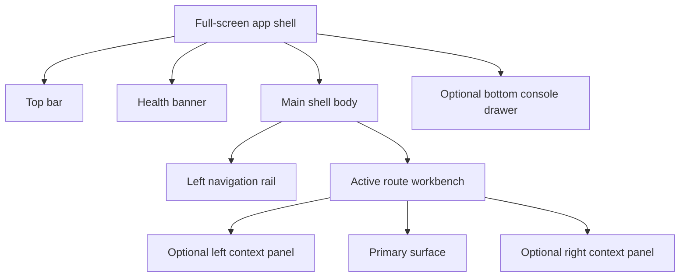

# Workbench UI Contract And Component Inventory

## Purpose

This document is the canonical UI inventory for the DVT operator workbench.

Its job is to answer four practical questions before implementation expands:

1. what the main screen and shell must contain;
2. which components are shared across the product;
3. which route-specific components each workbench needs;
4. which pieces are current, missing, or future work.

Use it with:

- [Frontend Architecture](./index.md)
- [Main Workspace Views And UX](./main-workspace-views-and-ux.md)
- [Iconography And Design Tokens Contract](./iconography-and-design-tokens-contract.md)
- [Screen Layout And Cross-Surface Behavior Rules](./screen-layout-and-cross-surface-behavior-rules.md)
- [UX Implementation Guide](./ux-implementation-guide.md)
- [Screen Manuals And User Stories](./screen-manuals-and-user-stories.md)

## Design Position

The product should behave like a mature operator control panel:

- full-screen persistent shell;
- one active workbench route at a time;
- coherent left-to-right navigation and context model;
- dense but readable information design;
- fast route-level actions without hidden state changes;
- explicit `loading`, `empty`, `error`, `degraded`, and `read-only` states.

It should not behave like:

- a set of unrelated dashboards;
- floating fixed-size windows;
- a form-heavy admin console;
- a freeform IDE where every route tries to do everything.

## Layout Contract

The shell is full-screen, but the internal panels are flexible, not hard-fixed.

Layout rules:

- the shell fills the viewport;
- the top bar stays persistent;
- the navigation rail is the primary route switcher;
- route workbenches own their own toolbar and contextual panels;
- side panels are collapsible and resizable with sensible min/max widths;
- the bottom drawer is optional and never replaces the current route.

## Navigation And Menus

| Surface                         | Ownership        | What belongs there                                                                   | What does not belong there                                 |
| ------------------------------- | ---------------- | ------------------------------------------------------------------------------------ | ---------------------------------------------------------- |
| Top bar                         | Global shell     | tenant, project, environment, health, global search or command, user/session actions | graph commands, route-local filters, route-local mutations |
| Left navigation rail            | Global shell     | route switching, route badges, plugin-contributed route entries                      | route-local inspector tabs, node actions                   |
| Route toolbar                   | Active workbench | route-local commands, toggles, filters, mode switches                                | tenant switch, shell health, user settings                 |
| Context menus                   | Local surface    | node actions, row actions, artifact actions, inline route actions                    | global navigation                                          |
| Right or left contextual panels | Active workbench | explorer, inspector, filters, metadata, secondary detail                             | primary route navigation                                   |

Primary route inventory:

1. `Canvas`
2. `Runs`
3. `Lineage`
4. `Code`
5. `Diff`
6. `Artifacts`
7. `Templates`
8. `Plugins`
9. `Admin`

## Iconography Contract

The active icon pack is `lucide-react`.

Detailed visual and token rules live in
[Iconography And Design Tokens Contract](./iconography-and-design-tokens-contract.md).

Rules:

- use `lucide-react` as the standard icon family;
- do not mix icon packs for product UI;
- use icon plus label in main navigation and primary commands;
- use icon-only actions only for secondary actions with tooltip support;
- keep icon meaning semantic and stable across routes.

Core icon categories:

| Category   | Examples                                                                |
| ---------- | ----------------------------------------------------------------------- |
| Navigation | Canvas, Runs, Lineage, Code, Diff, Artifacts, Templates, Plugins, Admin |
| Status     | success, failed, running, paused, degraded, offline, read-only          |
| Actions    | add, remove, play, stop, inspect, compare, download, upload, filter     |
| Panels     | open explorer, hide explorer, open inspector, hide inspector, console   |
| Domain     | graph, table, columns, artifacts, SQL, templates, metrics               |

## Shared Workbench Components

These are the cross-route UI building blocks that should exist once and be reused.

| Component             | Responsibility                                                            | Status                              |
| --------------------- | ------------------------------------------------------------------------- | ----------------------------------- |
| `AppShellFrame`       | Full-screen shell layout wrapper                                          | Needed as explicit contract         |
| `ShellTopBar`         | Global context and global actions                                         | Current, should be hardened         |
| `ShellHealthBanner`   | Health and degraded-state visibility                                      | Current                             |
| `LeftNavigationRail`  | Primary route navigation                                                  | Current, should be standardized     |
| `RouteWorkbenchFrame` | Shared route layout with optional left/right panels                       | Current, initial primitive          |
| `RouteToolbar`        | Standard route command bar                                                | Needed as explicit shared primitive |
| `ContextPanel`        | Shared side-panel container with title, collapse, scroll, and actions     | Needed                              |
| `PrimarySurfaceFrame` | Shared main surface wrapper with route-level spacing and loading handling | Needed                              |
| `BottomConsoleDrawer` | Shared shell console surface                                              | Current, needs product hardening    |
| `AppIcon`             | Shared icon wrapper for size, stroke, color, and state                    | Needed                              |
| `LoadingState`        | Standard loading treatment                                                | Needed as reusable primitive        |
| `EmptyState`          | Standard empty treatment                                                  | Needed as reusable primitive        |
| `ErrorState`          | Standard error treatment                                                  | Needed as reusable primitive        |
| `DegradedState`       | Standard stale or partial-data treatment                                  | Needed as reusable primitive        |
| `ReadOnlyState`       | Standard non-mutation treatment                                           | Needed as reusable primitive        |
| `PermissionGate`      | Explains disabled or unavailable actions                                  | Needed                              |
| `CommandPalette`      | Global search or command surface                                          | Optional later                      |

## Current Primitive Fit

The frontend already has enough live code to avoid building these pieces from
zero.

The current problem is organization and extraction, not total absence.

| Target primitive                                                             | Current implementation                                                                                                                                                                                                                                                                                                                                                                                                                                                               | Reuse decision                     | Current gap                                                                                           |
| ---------------------------------------------------------------------------- | ------------------------------------------------------------------------------------------------------------------------------------------------------------------------------------------------------------------------------------------------------------------------------------------------------------------------------------------------------------------------------------------------------------------------------------------------------------------------------------ | ---------------------------------- | ----------------------------------------------------------------------------------------------------- |
| `AppShellFrame`                                                              | [`Root.tsx`](../../../../apps/web/src/app/Root.tsx) plus `RootShell` composition                                                                                                                                                                                                                                                                                                                                                                                                     | Reuse and extract                  | shell contract is implicit in one file, not a reusable frame                                          |
| `ShellTopBar`                                                                | [`TopAppBar.tsx`](../../../../apps/web/src/app/components/TopAppBar.tsx)                                                                                                                                                                                                                                                                                                                                                                                                             | Reuse core behavior                | hard-coded colors, mixed shell controls, no tokenized wrapper                                         |
| `ShellHealthBanner`                                                          | [`ShellHealthBanner.tsx`](../../../../apps/web/src/app/components/ShellHealthBanner.tsx)                                                                                                                                                                                                                                                                                                                                                                                             | Reuse as-is with styling cleanup   | still directly styled per component                                                                   |
| `LeftNavigationRail`                                                         | [`LeftNavigation.tsx`](../../../../apps/web/src/app/components/LeftNavigation.tsx)                                                                                                                                                                                                                                                                                                                                                                                                   | Reuse plugin-aware routing logic   | icon-only rail, hard-coded chrome, direct capability query still bypasses governed service boundary   |
| `BottomConsoleDrawer`                                                        | [`Root.tsx`](../../../../apps/web/src/app/Root.tsx) plus [`Console.tsx`](../../../../apps/web/src/app/components/Console.tsx)                                                                                                                                                                                                                                                                                                                                                        | Reuse layout pattern               | live streaming and product-ready console states are not hardened yet                                  |
| `RouteToolbar`                                                               | [`CanvasToolbar.tsx`](../../../../apps/web/src/app/views/canvas/CanvasToolbar.tsx)                                                                                                                                                                                                                                                                                                                                                                                                   | Use as the first extraction source | other routes still hand-build headers instead of using one toolbar primitive                          |
| `RouteWorkbenchFrame`                                                        | [`RouteWorkbenchFrame.tsx`](../../../../apps/web/src/app/components/workbench/RouteWorkbenchFrame.tsx) now wraps [`CodeView.tsx`](../../../../apps/web/src/app/views/CodeView.tsx), [`DiffView.tsx`](../../../../apps/web/src/app/views/DiffView.tsx), [`LineageView.tsx`](../../../../apps/web/src/app/views/LineageView.tsx), [`ArtifactsView.tsx`](../../../../apps/web/src/app/views/ArtifactsView.tsx), and [`AdminView.tsx`](../../../../apps/web/src/app/views/AdminView.tsx) | Reuse and extend                   | `Runs` and route-specific contextual panel primitives still need migration and shell-level extraction |
| `ContextPanel`                                                               | [`DbtExplorer.tsx`](../../../../apps/web/src/app/components/DbtExplorer.tsx) and [`InspectorPanel.tsx`](../../../../apps/web/src/app/components/InspectorPanel.tsx)                                                                                                                                                                                                                                                                                                                  | Reuse panel behavior and content   | panel frame, header, collapse affordance, and scroll treatment are duplicated                         |
| `PrimarySurfaceFrame`                                                        | repeated `div` wrappers per route                                                                                                                                                                                                                                                                                                                                                                                                                                                    | Missing shared primitive           | each route owns its own surface chrome and spacing                                                    |
| `LoadingState`, `EmptyState`, `ErrorState`, `DegradedState`, `ReadOnlyState` | partial ad hoc states in [`RunStates.tsx`](../../../../apps/web/src/app/views/runs/RunStates.tsx) and inline route markup                                                                                                                                                                                                                                                                                                                                                            | Missing reusable primitives        | route states are inconsistent and mostly text-plus-card implementations                               |
| `AppIcon`                                                                    | direct `lucide-react` imports across shell and routes                                                                                                                                                                                                                                                                                                                                                                                                                                | Missing shared wrapper             | size, stroke, semantic color, and accessibility are not standardized                                  |

## Reuse, Extract, Retire

To keep the implementation honest, current code falls into three buckets.

### Reuse directly

- [`ShellHealthBanner.tsx`](../../../../apps/web/src/app/components/ShellHealthBanner.tsx)
- `ResizablePanelGroup` usage pattern in [`Root.tsx`](../../../../apps/web/src/app/Root.tsx)
- plugin-driven navigation source from [`registry.ts`](../../../../apps/web/src/app/plugins/registry.ts)
- node-kind and plugin icon registries already used by explorer and inspector

### Extract into shared primitives

- [`TopAppBar.tsx`](../../../../apps/web/src/app/components/TopAppBar.tsx) -> `ShellTopBar`
- [`LeftNavigation.tsx`](../../../../apps/web/src/app/components/LeftNavigation.tsx) -> `LeftNavigationRail`
- [`Console.tsx`](../../../../apps/web/src/app/components/Console.tsx) -> `BottomConsoleDrawer`
- [`CanvasToolbar.tsx`](../../../../apps/web/src/app/views/canvas/CanvasToolbar.tsx) -> base `RouteToolbar`
- panel header patterns inside [`DbtExplorer.tsx`](../../../../apps/web/src/app/components/DbtExplorer.tsx) and [`InspectorPanel.tsx`](../../../../apps/web/src/app/components/InspectorPanel.tsx) -> base `ContextPanel`

### Retire or quarantine as legacy

- [`GraphCanvas.tsx`](../../../../apps/web/src/app/components/GraphCanvas.tsx): legacy graph path; do not design new shared primitives around it
- [`stores/index.ts`](../../../../apps/web/src/app/stores/index.ts): duplicate store surface from an older architecture pass
- hard-coded route chrome in views that should become tokenized shared frames

## Recommended Organization

The current folder layout is usable, but the shell and workbench layer should
become explicit.

Recommended direction:

| Path                                      | Responsibility                                                                                      |
| ----------------------------------------- | --------------------------------------------------------------------------------------------------- |
| `apps/web/src/app/components/ui/*`        | low-level shadcn/Radix primitives only                                                              |
| `apps/web/src/app/components/shell/*`     | shell-only chrome such as top bar, nav rail, health banner, console drawer                          |
| `apps/web/src/app/components/workbench/*` | cross-route primitives such as `RouteWorkbenchFrame`, `RouteToolbar`, `ContextPanel`, shared states |
| `apps/web/src/app/components/icons/*`     | `AppIcon` and semantic icon registry                                                                |
| `apps/web/src/app/views/<route>/*`        | route-specific composition and route-only panels                                                    |

Organization rule:

- if a component knows route-specific domain semantics, it stays in the route;
- if a component only knows workbench layout semantics, it moves to
  `components/workbench`;
- if a component only knows shell/global semantics, it moves to
  `components/shell`.

## Main Screen Inventory

The main screen should be `Canvas` inside the persistent shell.

That means the operator lands in:

- shell top bar;
- left navigation rail;
- `Canvas` workbench as the default primary route;
- optional bottom console drawer.

Main screen composition:

| Area         | Component                                        | Behavior                                                    |
| ------------ | ------------------------------------------------ | ----------------------------------------------------------- |
| Shell top    | `ShellTopBar`                                    | shows tenant, project, environment, health, global controls |
| Shell left   | `LeftNavigationRail`                             | switches between route workbenches                          |
| Route top    | `CanvasToolbar` or `RouteToolbar` specialization | owns graph-local actions and toggles                        |
| Route left   | `CanvasExplorerPanel`                            | optional, restorable, resizable                             |
| Route center | `CanvasViewport`                                 | primary graph interaction surface                           |
| Route right  | `CanvasInspectorPanel`                           | optional, selection-driven, restorable                      |
| Route modal  | `PlanPreviewModal`                               | explicit plan review before run                             |
| Route modal  | `ConfirmEdgeModal`                               | explicit graph mutation confirmation                        |
| Route modal  | `SourceImportWizard`                             | source import flow                                          |
| Shell bottom | `BottomConsoleDrawer`                            | execution and supporting context, not main navigation       |

## Main Screen Behavior Rules

| Rule           | Expected behavior                                                           |
| -------------- | --------------------------------------------------------------------------- |
| Default route  | open `Canvas` as the main authoring surface                                 |
| Explorer       | hidden or shown without breaking graph interaction                          |
| Inspector      | reacts to selection, not to global shell navigation                         |
| Toolbar        | holds graph actions, overlays, plan, run, layout, local filters             |
| Top bar        | never becomes a dump for route-local graph commands                         |
| Route handoff  | `Run` from `Canvas` navigates explicitly to `Runs` detail                   |
| Context change | tenant or environment change refreshes route context without breaking shell |
| Failure        | route frame stays intact and explains error or degraded condition           |

## Route-Specific Component Inventory

### Canvas

| Component              | Responsibility                        | Status                                                |
| ---------------------- | ------------------------------------- | ----------------------------------------------------- |
| `CanvasWorkbench`      | Route composition root                | Current, implicit through `Canvas` plus `CanvasShell` |
| `CanvasToolbar`        | Graph-local commands and toggles      | Current                                               |
| `CanvasExplorerPanel`  | Graph source browser and entry points | Current as `DbtExplorer`, should be normalized        |
| `CanvasViewport`       | React Flow graph surface              | Current                                               |
| `CanvasInspectorPanel` | Selection detail                      | Current through `InspectorPanel`                      |
| `PlanPreviewModal`     | Plan review before run                | Current                                               |
| `ConfirmEdgeModal`     | Graph mutation confirmation           | Current                                               |
| `SourceImportWizard`   | Import source flow                    | Current                                               |
| `CanvasLoadingState`   | Graph-specific loading treatment      | Needed                                                |
| `CanvasEmptyState`     | Empty graph treatment                 | Needed                                                |
| `CanvasErrorState`     | Graph route failure treatment         | Needed                                                |
| `CanvasReadOnlyBanner` | Permission or mutation gating         | Needed                                                |

### Runs

| Component            | Responsibility                                       | Status                   |
| -------------------- | ---------------------------------------------------- | ------------------------ |
| `RunsWorkbench`      | Route composition root                               | Current, needs hardening |
| `RunsToolbar`        | Route-local filters and actions                      | Needed                   |
| `RunsListTable`      | Dense operational run list                           | Needed                   |
| `RunsListFilters`    | status, tenant, environment, time filters            | Needed                   |
| `RunWorkspaceHeader` | run identity and global run actions                  | Current in partial form  |
| `RunTabs`            | tabs for timeline, steps, events, metrics, artifacts | Current                  |
| `RunTimelinePanel`   | timeline view                                        | Current in partial form  |
| `RunStepsTable`      | dense step-level execution view                      | Needed                   |
| `RunEventsTable`     | event stream view                                    | Needed                   |
| `RunMetricsPanel`    | metrics and charts                                   | Current in partial form  |
| `RunArtifactsPanel`  | artifact handoff surface                             | Current in partial form  |
| `RunsEmptyState`     | guides user back to `Canvas`                         | Needed                   |
| `RunMissingState`    | run-not-found state                                  | Needed                   |
| `RunDegradedState`   | stale or partial data visibility                     | Needed                   |

### Lineage

| Component                     | Responsibility              | Status                   |
| ----------------------------- | --------------------------- | ------------------------ |
| `LineageWorkbench`            | Route composition root      | Current, needs hardening |
| `LineageToolbar`              | search and mode controls    | Needed                   |
| `LineageSearchBar`            | node lookup                 | Current in basic form    |
| `LineageBreadcrumb`           | lineage focus path          | Current                  |
| `LineageImpactSummary`        | upstream/downstream summary | Current in basic form    |
| `LineageGraphCards`           | layered lineage cards       | Current                  |
| `LineageColumnsToggle`        | column-lineage mode         | Current                  |
| `LineageEmptyState`           | no focus available          | Needed                   |
| `LineageMetadataMissingState` | missing column metadata     | Needed                   |

### Code

| Component           | Responsibility                            | Status                   |
| ------------------- | ----------------------------------------- | ------------------------ |
| `CodeWorkbench`     | Route composition root                    | Current, needs hardening |
| `CodeToolbar`       | file-level actions and history entry      | Needed                   |
| `FileTreePanel`     | workspace file selection                  | Current                  |
| `CodePreviewPane`   | read-only Monaco file preview             | Current                  |
| `FileHistoryPanel`  | recent commit history for selected file   | Planned                  |
| `CodeEmptyState`    | no file or no workspace files available   | Needed                   |
| `CodeErrorState`    | preserve selected-file context on failure | Needed                   |
| `CodeReadOnlyState` | explicit non-editing treatment            | Needed                   |

### Diff

| Component                 | Responsibility                      | Status                   |
| ------------------------- | ----------------------------------- | ------------------------ |
| `DiffWorkbench`           | Route composition root              | Current, needs hardening |
| `DiffToolbar`             | compare mode and filters            | Needed                   |
| `DiffCompareModeSelector` | diff mode selection                 | Current in basic form    |
| `DiffSeverityFilters`     | review prioritization               | Current in basic form    |
| `DiffSummaryCards`        | summary and deltas                  | Current                  |
| `DiffTabs`                | graph, SQL, catalog segmentation    | Current                  |
| `GraphDiffPane`           | structural graph review             | Current in basic form    |
| `SqlDiffPane`             | Monaco-backed SQL diff              | Needed                   |
| `CatalogDiffPane`         | structured catalog diff             | Needed                   |
| `DiffEmptyState`          | no diff available                   | Needed                   |
| `DiffErrorState`          | preserve compare context on failure | Needed                   |

### Artifacts

| Component                     | Responsibility                      | Status                   |
| ----------------------------- | ----------------------------------- | ------------------------ |
| `ArtifactsWorkbench`          | Route composition root              | Current, needs hardening |
| `ArtifactsToolbar`            | import, filter, and inspect actions | Needed                   |
| `ArtifactImportZone`          | local manifest import               | Current                  |
| `ArtifactList`                | artifact inventory                  | Current in basic form    |
| `ArtifactPreviewTabs`         | manifest, run results, catalog      | Current                  |
| `ArtifactJsonViewer`          | structured read-only payload view   | Needed                   |
| `ArtifactSearch`              | payload navigation                  | Needed                   |
| `ArtifactsEmptyState`         | no artifact loaded                  | Needed                   |
| `ArtifactsInvalidImportState` | import rejection explanation        | Needed                   |

### Templates

| Component                  | Responsibility                    | Status  |
| -------------------------- | --------------------------------- | ------- |
| `TemplatesWorkbench`       | Future source-generation route    | Planned |
| `TemplateCatalog`          | template selection                | Planned |
| `ProviderProfileSelector`  | target platform or profile choice | Planned |
| `TemplateParameterForm`    | schema-driven input               | Planned |
| `GeneratedSourcePreview`   | Monaco-backed preview             | Planned |
| `GeneratedSourceDiffPane`  | review before export or apply     | Planned |
| `GeneratedSourceActions`   | export, copy, dispatch            | Planned |
| `TemplatesEmptyState`      | no template or context            | Planned |
| `TemplatesValidationState` | invalid input explanation         | Planned |

### Plugins And Admin

| Component               | Responsibility                | Status  |
| ----------------------- | ----------------------------- | ------- |
| `PluginsWorkbench`      | Installed plugin inspection   | Current |
| `PluginCapabilityTable` | plugin availability and state | Needed  |
| `AdminWorkbench`        | administrative route shell    | Current |
| `AdminSectionLayout`    | shared admin section layout   | Needed  |

## Common State Inventory

Every route should implement these states explicitly:

| State       | Required treatment                                                      |
| ----------- | ----------------------------------------------------------------------- |
| `loading`   | keep shell visible, show local route loading                            |
| `empty`     | explain what is missing and the next useful action                      |
| `error`     | preserve route context and offer retry if useful                        |
| `degraded`  | say data is stale, partial, or unavailable without pretending otherwise |
| `read-only` | keep analysis and navigation available, block mutation clearly          |

## Context Reactions

These reactions should be standard across the product:

| Trigger                       | Reaction                                                      |
| ----------------------------- | ------------------------------------------------------------- |
| Tenant or environment changed | refresh active route context, preserve shell frame            |
| Node selected in `Canvas`     | open or update route-local inspector                          |
| `Run` started in `Canvas`     | navigate explicitly to `/runs/:runId`                         |
| Backend health degraded       | show shell-level degraded signal and local route consequences |
| Permission denied             | disable action and explain why                                |
| Missing metadata              | degrade the affected feature, do not invent data              |

## Responsive Rules

| Screen mode           | Behavior                                                            |
| --------------------- | ------------------------------------------------------------------- |
| Large desktop         | left and right contextual panels can be open together               |
| Laptop                | panels stay collapsible and resizable, with restore affordances     |
| Narrow width          | one side panel at a time, or convert contextual panel to sheet      |
| Very narrow or mobile | keep shell framing but reduce density and promote drawers or sheets |

The product should never depend on fixed-size floating windows as the core
interaction model.

## Build Priority

### Foundation first

1. `AppShellFrame`
2. `LeftNavigationRail`
3. `ShellTopBar`
4. `RouteWorkbenchFrame`
5. `RouteToolbar`
6. `ContextPanel`
7. `BottomConsoleDrawer`
8. shared state components
9. `AppIcon`

### Main workbench second

1. `CanvasWorkbench`
2. `RunsWorkbench`
3. `LineageWorkbench`

### Review and inspection third

1. `DiffWorkbench`
2. `ArtifactsWorkbench`
3. Monaco-backed review panes

### Future governed workbench fourth

1. `TemplatesWorkbench`
2. source-generation preview and diff

## Immediate Decisions Locked By This Document

1. The interface is a full-screen workbench, not a set of fixed windows.
2. The main screen is `Canvas` inside the persistent shell.
3. Primary navigation lives in the left rail.
4. Global context lives in the top bar.
5. Route-local commands live in each route toolbar.
6. Side panels are contextual and resizable.
7. The bottom drawer is supporting context, not route navigation.
8. `lucide-react` is the standard icon family.
