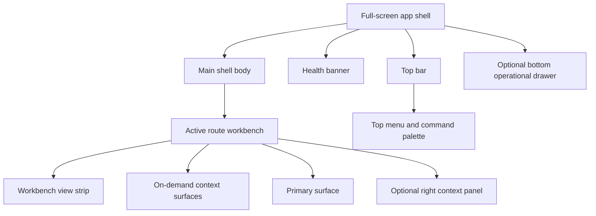

# Workbench UI Contract And Component Inventory

This peer-route component inventory is retired. Current product placement is
governed by [Screen Manuals And User Stories](./screen-manuals-and-user-stories.md),
while component ownership and relationships live in Planning DB.

## Purpose

This document is the canonical UI inventory for the DVT operator workbench.

Its job is to answer four practical questions before implementation expands:

1. what the main screen and shell must contain;
2. which components are shared across the product;
3. which route-specific components each workbench needs;
4. which pieces are current, missing, or future work.

Use it with:

- [Frontend Architecture](./index.md)
- [Main Workspace Views And UX](./main-workspace-views-and-ux.md)
- [Iconography And Design Tokens Contract](./iconography-and-design-tokens-contract.md)
- [Screen Layout And Cross-Surface Behavior Rules](./screen-layout-and-cross-surface-behavior-rules.md)
- [UX Implementation Guide](./ux-implementation-guide.md)
- [Screen Manuals And User Stories](./screen-manuals-and-user-stories.md)
- [Shell Workspace Context Component](./appshell/shell-workspace-context-component.md)
- [Shell Workspace Context User Stories](./appshell/shell-workspace-context-user-stories.md)

## Design Position

The product should behave like a mature operator control panel:

- full-screen persistent shell;
- one active workbench route at a time;
- coherent top-menu, workbench-tab, and contextual command model;
- dense but readable information design;
- fast route-level actions without hidden state changes;
- explicit `loading`, `empty`, `error`, `degraded`, and `read-only` states.

It should not behave like:

- a set of unrelated dashboards;
- floating fixed-size windows;
- a form-heavy admin console;
- a freeform IDE where every route tries to do everything.

## Layout Contract

The shell is full-screen, but the internal panels are flexible, not hard-fixed.

Layout rules:

- the shell fills the viewport;
- the top bar stays persistent;
- the top menu and command palette are the canonical command discovery
  surfaces;
- the Canvas workbench must not include a fixed left navigation rail;
- workbench views are route-local projections, not global navigation;
- route workbenches own their own toolbar and contextual panels;
- side panels are contextual, collapsible, and resizable with sensible min/max
  widths;
- the bottom drawer is optional and never replaces the current route.

## Navigation And Menus

| Surface                         | Ownership        | What belongs there                                                             | What does not belong there                                  |
| ------------------------------- | ---------------- | ------------------------------------------------------------------------------ | ----------------------------------------------------------- |
| Top bar                         | Global shell     | compact context labels, health, global menus or commands, user/session actions | dominant scope selectors, graph-local mutations             |
| Top menu and command palette    | Global shell     | File/Edit/View/Insert/Export/Run/Admin/Help commands and command discovery     | parallel command semantics or route-local service shortcuts |
| Workbench view strip            | Active workbench | route-local projections such as Graph, SQL, Lineage, Logs, Metrics, and More   | global route navigation                                     |
| Route toolbar                   | Active workbench | route-local commands, toggles, filters, mode switches                          | tenant switch, shell health, user settings                  |
| Context menus                   | Local surface    | node actions, row actions, artifact actions, inline route actions              | global navigation                                           |
| Right or left contextual panels | Active workbench | explorer, inspector, filters, metadata, secondary detail                       | primary route navigation                                    |

Workbench view-strip labels are presentation labels resolved by the active
workbench read model and capability registry. They must not imply independent
route IDs or route-local hard-coded view lists.

Primary route inventory:

1. `Canvas`
2. `Runs`
3. `Lineage`
4. `Code`
5. `Diff`
6. `Artifacts`
7. `Templates`
8. `Plugins`
9. `Admin`

## Iconography Contract

The active icon pack is `lucide-react`.

Detailed visual and token rules live in
[Iconography And Design Tokens Contract](./iconography-and-design-tokens-contract.md).

Rules:

- use `lucide-react` as the standard icon family;
- do not mix icon packs for product UI;
- use icon plus label in main navigation and primary commands;
- use icon-only actions only for secondary actions with tooltip support;
- keep icon meaning semantic and stable across routes.

Core icon categories:

| Category   | Examples                                                                |
| ---------- | ----------------------------------------------------------------------- |
| Navigation | Canvas, Runs, Lineage, Code, Diff, Artifacts, Templates, Plugins, Admin |
| Status     | success, failed, running, paused, degraded, offline, read-only          |
| Actions    | add, remove, play, stop, inspect, compare, download, upload, filter     |
| Panels     | open explorer, hide explorer, open inspector, hide inspector, console   |
| Domain     | graph, table, columns, artifacts, SQL, templates, metrics               |

## Shared Workbench Components

These are the cross-route UI building blocks that should exist once and be reused.

| Component                 | Responsibility                                                            | Status                              |
| ------------------------- | ------------------------------------------------------------------------- | ----------------------------------- |
| `AppShellFrame`           | Full-screen shell layout wrapper                                          | Current, v1 shell frame primitive   |
| `ShellTopBar`             | Global context and global actions                                         | Current, should be hardened         |
| `Shell workspace context` | Read-only project identity plus on-demand read-only context details       | Current Stage 1 split               |
| `ShellHealthBanner`       | Health and degraded-state visibility                                      | Current                             |
| `LeftNavigationRail`      | Primary route navigation                                                  | Current, should be standardized     |
| `RouteWorkbenchFrame`     | Shared route layout with semantic slots only                              | Current, no-legacy slot API seeded  |
| `RouteToolbar`            | Standard route command bar                                                | Needed as explicit shared primitive |
| `ContextPanel`            | Shared side-panel container with title, collapse, scroll, and actions     | Needed                              |
| `PrimarySurfaceFrame`     | Shared main surface wrapper with route-level spacing and loading handling | Needed                              |
| `BottomOperationalDrawer` | Shared shell operational drawer                                           | Current, content model now explicit |
| `AppIcon`                 | Shared icon wrapper for size, stroke, color, and state                    | Needed                              |
| `LoadingState`            | Standard loading treatment                                                | Current, seeded from `Runs`         |
| `EmptyState`              | Standard empty treatment                                                  | Current, seeded from `Runs`         |
| `ErrorState`              | Standard error treatment                                                  | Current, seeded from `Runs`         |
| `DegradedState`           | Standard stale or partial-data treatment                                  | Current, seeded from `Runs`         |
| `ReadOnlyState`           | Standard non-mutation treatment                                           | Current, seeded from `Code`         |
| `PermissionGate`          | Explains disabled or unavailable actions                                  | Needed                              |
| `CommandPalette`          | Global search or command surface                                          | Optional later                      |

## Current Primitive Fit

The frontend already has enough live code to avoid building these pieces from
zero.

The current problem is organization and extraction, not total absence.

### `RouteWorkbenchFrame` contract

The current shared frame remains intentionally smaller than the long-term
workbench vision, but it now owns the local semantic slot vocabulary for route
workbenches.

Its active contract is:

- header stack lives outside the route-owned scroll body;
- summary or secondary header bands stay in that header stack unless a governed
  UX change says otherwise;
- the scrollable body owns route padding for standard routes;
- `scroll={false}` exists for routes like `Code` that own split-pane body
  geometry directly;
- anonymous route body `children` are forbidden; direct consumers must use
  `RouteWorkbenchFrameSlots`;
- `RouteWorkbenchFrameSlots` provides the semantic slot API for `leftPanel`,
  `primarySurface`, `rightPanel`, and route-local `bottomDrawer`;
- richer panel behavior remains future work under `ContextPanel` and
  route-toolbar extraction.

Local guide:
[Route Workbench Frame Component](./route-workbench-frame-component.md)

Shell-specific current fit:

- `AppShellFrame`
  Current implementation: [AppShellFrame.tsx](../../../../apps/web/src/app/components/shell/AppShellFrame.tsx) plus [Root.tsx](../../../../apps/web/src/app/Root.tsx)
  Reuse decision: reuse within the v1 shell contract.
  Current gap: shell frame exists, but console product hardening and richer frame API remain future work.
- `ShellTopBar`
  Current implementation: [TopAppBar.tsx](../../../../apps/web/src/app/components/TopAppBar.tsx) plus shell controls under `components/shell/*`
  Reuse decision: reuse core behavior and keep workspace scope as a read-only presentation model.
  Current gap: shell ownership is aligned; command palette and richer top-menu semantics remain future work.
- `Shell workspace context`
  Current implementation: [projectIdentityBadge.ts](../../../../apps/web/src/app/shell/projectIdentityBadge.ts), [ShellProjectIdentityBadge.tsx](../../../../apps/web/src/app/components/shell/ShellProjectIdentityBadge.tsx), and [ShellWorkspaceContextMenu.tsx](../../../../apps/web/src/app/components/shell/ShellWorkspaceContextMenu.tsx)
  Reuse decision: treat `ProjectIdentityBadge` as the stable read-only top-bar
  projection and `ShellWorkspaceContextMenu` as an on-demand read-only context
  detail surface.
  Current gap: project selection belongs to a separate governed screen outside
  this Stage 1 main-workbench shell boundary; grant refresh and richer
  unavailable-state copy remain future auth work.
  Local guide: [shell-workspace-context-component.md](./appshell/shell-workspace-context-component.md)
  Scenario guide: [shell-workspace-context-user-stories.md](./appshell/shell-workspace-context-user-stories.md)
- `ShellHealthBanner`
  Current implementation: [ShellHealthBanner.tsx](../../../../apps/web/src/app/components/ShellHealthBanner.tsx)
  Reuse decision: reuse as-is with styling cleanup.
  Current gap: still directly styled per component.
- `LeftNavigationRail`
  Current implementation: [LeftNavigation.tsx](../../../../apps/web/src/app/components/LeftNavigation.tsx) plus shell navigation model under `apps/web/src/app/shell/*`
  Reuse decision: reuse plugin-aware routing logic.
  Current gap: route badges and richer unavailable-state treatment still need a shared navigation state.
- `BottomOperationalDrawer`
  Current implementation: [AppShellFrame.tsx](../../../../apps/web/src/app/components/shell/AppShellFrame.tsx) plus [BottomOperationalDrawer.tsx](../../../../apps/web/src/app/components/shell/BottomOperationalDrawer.tsx) and [bottomOperationalDrawerLogModel.ts](../../../../apps/web/src/app/components/shell/bottomOperationalDrawerLogModel.ts)
  Reuse decision: reuse the layout pattern and explicit state model.
  Current gap: shared event presentation semantics plus headline copy now exist, but typed live-log states and the final structured-versus-terminal decision remain future work while durable run-detail authority stays with the Runs workspace.

| Target primitive                                                             | Current implementation                                                                                                                                              | Reuse decision                                 | Current gap                                                                              |
| ---------------------------------------------------------------------------- | ------------------------------------------------------------------------------------------------------------------------------------------------------------------- | ---------------------------------------------- | ---------------------------------------------------------------------------------------- |
| `RouteToolbar`                                                               | [`CanvasToolbar.tsx`](../../../../apps/web/src/app/views/canvas/CanvasToolbar.tsx)                                                                                  | Use as the first extraction source             | other routes still hand-build headers instead of using one toolbar primitive             |
| `RouteWorkbenchFrame`                                                        | Shared frame already adopted by the `Code`, `Diff`, `Lineage`, `Artifacts`, `Admin`, and `Plugins` routes                                                           | Reuse within the v1 frame contract             | side panels, shared route toolbars, and richer shell extraction remain future primitives |
| `ContextPanel`                                                               | [`DbtExplorer.tsx`](../../../../apps/web/src/app/components/DbtExplorer.tsx) and [`InspectorPanel.tsx`](../../../../apps/web/src/app/components/InspectorPanel.tsx) | Reuse panel behavior and content               | panel frame, header, collapse affordance, and scroll treatment are duplicated            |
| `PrimarySurfaceFrame`                                                        | repeated `div` wrappers per route                                                                                                                                   | Missing shared primitive                       | each route owns its own surface chrome and spacing                                       |
| `Lineage panel tokens`                                                       | [`lineageChromeTokens.ts`](../../../../apps/web/src/app/views/lineage/lineageChromeTokens.ts)                                                                       | Reuse within Lineage route panels              | broader shell-global token convergence remains under F-24                                |
| `React Flow graph visual tokens`                                             | [`graphVisualTokens.ts`](../../../../apps/web/src/app/plugins/graph/graphVisualTokens.ts)                                                                           | Reuse within Canvas and plugin graph rendering | broader shell-global token convergence remains under F-24/F-25                           |
| `Monaco visual tokens`                                                       | [`monacoVisualTokens.ts`](../../../../apps/web/src/app/components/monaco/monacoVisualTokens.ts)                                                                     | Reuse within Monaco code and diff surfaces     | richer editor theming remains governed by the Monaco component guide                     |
| `LoadingState`, `EmptyState`, `ErrorState`, `DegradedState`, `ReadOnlyState` | shared workbench primitives in [`WorkbenchStates.tsx`](../../../../apps/web/src/app/components/workbench/state/WorkbenchStates.tsx) consumed by `Runs` and `Code`   | Shared primitive seeded from `Runs` and `Code` | broader route adoption still needs delivery                                              |
| `AppIcon`                                                                    | direct `lucide-react` imports across shell and routes                                                                                                               | Missing shared wrapper                         | size, stroke, semantic color, and accessibility are not standardized                     |

## Reuse, Extract, Retire

To keep the implementation honest, current code falls into three buckets.

### Reuse directly

- [`ShellHealthBanner.tsx`](../../../../apps/web/src/app/components/ShellHealthBanner.tsx)
- `ResizablePanelGroup` usage pattern in [`Root.tsx`](../../../../apps/web/src/app/Root.tsx)
- plugin-driven navigation source from [`registry.ts`](../../../../apps/web/src/app/plugins/registry.ts)
- node-kind and plugin icon registries already used by explorer and inspector

### Extract into shared primitives

- [`TopAppBar.tsx`](../../../../apps/web/src/app/components/TopAppBar.tsx) -> `ShellTopBar`
- [`LeftNavigation.tsx`](../../../../apps/web/src/app/components/LeftNavigation.tsx) -> `LeftNavigationRail`
- [`BottomOperationalDrawer.tsx`](../../../../apps/web/src/app/components/shell/BottomOperationalDrawer.tsx) -> `BottomOperationalDrawer`
- [`CanvasToolbar.tsx`](../../../../apps/web/src/app/views/canvas/CanvasToolbar.tsx) -> base `RouteToolbar`
- panel header patterns inside [`DbtExplorer.tsx`](../../../../apps/web/src/app/components/DbtExplorer.tsx) and [`InspectorPanel.tsx`](../../../../apps/web/src/app/components/InspectorPanel.tsx) -> base `ContextPanel`

### Retire or quarantine

- `GraphCanvas.tsx`: retired graph path removed from active source; do not
  recreate shared primitives around it
- root store barrels and mirror-writing aggregate stores: removed from active
  source; keep new state in named concern slices
- hard-coded route chrome in views that should become tokenized shared frames

## Recommended Organization

The current folder layout is usable, but the shell and workbench layer should
become explicit.

Recommended direction:

| Path                                      | Responsibility                                                                                      |
| ----------------------------------------- | --------------------------------------------------------------------------------------------------- |
| `apps/web/src/app/components/ui/*`        | low-level shadcn/Radix primitives only                                                              |
| `apps/web/src/app/components/shell/*`     | shell-only chrome such as top bar, nav rail, health banner, operational drawer                      |
| `apps/web/src/app/components/workbench/*` | cross-route primitives such as `RouteWorkbenchFrame`, `RouteToolbar`, `ContextPanel`, shared states |
| `apps/web/src/app/components/icons/*`     | `AppIcon` and semantic icon registry                                                                |
| `apps/web/src/app/views/<route>/*`        | route-specific composition and route-only panels                                                    |

Organization rule:

- if a component knows route-specific domain semantics, it stays in the route;
- if a component only knows workbench layout semantics, it moves to
  `components/workbench`;
- if a component only knows shell/global semantics, it moves to
  `components/shell`.

## Main Screen Inventory

The main screen should be `Canvas` inside the persistent shell.

That means the operator lands in:

- shell top bar;
- top menu and command palette access;
- `Canvas` workbench as the default primary route;
- Canvas contextual graph surface;
- optional bottom operational drawer.

Main screen composition:

| Area          | Component                                        | Behavior                                                     |
| ------------- | ------------------------------------------------ | ------------------------------------------------------------ |
| Shell top     | `ShellTopBar`                                    | shows compact context labels, health, menus, global controls |
| Route top     | `CanvasToolbar` or `RouteToolbar` specialization | owns graph-local actions and toggles                         |
| Route surface | `CanvasViewport` and contextual surfaces         | keep Graph primary and open source/code/preview on demand    |
| Route overlay | `CanvasExplorerPanel`                            | optional, contextual, restorable, never a fixed nav rail     |
| Route center  | `CanvasViewport`                                 | primary graph interaction surface                            |
| Route right   | `CanvasInspectorPanel`                           | optional, selection-driven, restorable                       |
| Route modal   | `PlanPreviewModal`                               | explicit plan review before run                              |
| Route modal   | `SourceImportWizard`                             | source import flow                                           |
| Shell bottom  | `BottomOperationalDrawer`                        | execution and supporting context, not main navigation        |

## Main Screen Behavior Rules

| Rule           | Expected behavior                                                           |
| -------------- | --------------------------------------------------------------------------- |
| Default route  | open `Canvas` as the main authoring surface                                 |
| Explorer       | hidden or shown without breaking graph interaction                          |
| Inspector      | reacts to selection, not to global shell navigation                         |
| Toolbar        | holds graph actions, overlays, plan, run, layout, local filters             |
| Top bar        | never becomes a dump for route-local graph commands                         |
| Route handoff  | `Run` from `Canvas` navigates explicitly to `Runs` detail                   |
| Context change | tenant or environment change refreshes route context without breaking shell |
| Failure        | route frame stays intact and explains error or degraded condition           |

## Route-Specific Component Inventory

### Canvas

| Component              | Responsibility                                  | Status                                         |
| ---------------------- | ----------------------------------------------- | ---------------------------------------------- |
| `CanvasWorkbench`      | Route composition root                          | Current, state model explicit                  |
| `CanvasToolbar`        | Graph-local commands and toggles                | Current                                        |
| `CanvasExplorerPanel`  | Graph source browser and entry points           | Current as `DbtExplorer`, should be normalized |
| `CanvasViewport`       | React Flow graph surface                        | Current                                        |
| `CanvasInspectorPanel` | Selection detail                                | Current through `InspectorPanel`               |
| `PlanPreviewModal`     | Plan review before run                          | Current                                        |
| `SourceImportWizard`   | Import source flow and immediate canvas handoff | Current                                        |
| `CanvasLoadingState`   | Graph-specific loading treatment                | Current                                        |
| `CanvasEmptyState`     | Empty graph treatment                           | Current                                        |
| `CanvasErrorState`     | Graph route failure treatment                   | Current                                        |
| `CanvasReadOnlyBanner` | Permission or mutation gating                   | Current                                        |

### Runs

| Component            | Responsibility                                       | Status                             |
| -------------------- | ---------------------------------------------------- | ---------------------------------- |
| `RunsWorkbench`      | Route composition root                               | Current, state model explicit      |
| `RunsToolbar`        | Route-local filters and actions                      | Needed                             |
| `RunsListTable`      | Dense operational run list                           | Needed                             |
| `RunsListFilters`    | status, tenant, environment, time filters            | Needed                             |
| `RunWorkspaceHeader` | run identity and global run actions                  | Current in partial form            |
| `RunTabs`            | tabs for timeline, steps, events, metrics, artifacts | Current                            |
| `RunTimelinePanel`   | timeline view                                        | Current in partial form            |
| `RunStepsTable`      | dense step-level execution view                      | Needed                             |
| `RunEventsTable`     | event stream view                                    | Needed                             |
| `RunMetricsPanel`    | metrics and charts                                   | Current in partial form            |
| `RunArtifactsPanel`  | artifact handoff surface                             | Current in partial form            |
| `RunsEmptyState`     | guides user back to `Canvas`                         | Current, built on shared primitive |
| `RunsErrorState`     | governed list-load failure explanation               | Current, built on shared primitive |
| `RunMissingState`    | run-not-found state                                  | Current                            |
| `RunDegradedState`   | stale or partial data visibility                     | Current, built on shared primitive |

### Lineage

| Component                     | Responsibility              | Status                        |
| ----------------------------- | --------------------------- | ----------------------------- |
| `LineageWorkbench`            | Route composition root      | Current, state model explicit |
| `LineageToolbar`              | search and mode controls    | Needed                        |
| `LineageSearchBar`            | node lookup                 | Current in basic form         |
| `LineageBreadcrumb`           | lineage focus path          | Current                       |
| `LineageImpactSummary`        | upstream/downstream summary | Current in basic form         |
| `LineageGraphCards`           | layered lineage cards       | Current                       |
| `LineageColumnsToggle`        | column-lineage mode         | Current                       |
| `LineageEmptyState`           | no focus available          | Current                       |
| `LineageMetadataMissingState` | missing column metadata     | Current                       |

### Code

| Component           | Responsibility                            | Status                   |
| ------------------- | ----------------------------------------- | ------------------------ |
| `CodeWorkbench`     | Route composition root                    | Current, needs hardening |
| `CodeToolbar`       | file-level actions and history entry      | Needed                   |
| `FileTreePanel`     | workspace file selection                  | Current                  |
| `CodePreviewPane`   | Monaco local editable buffer              | Current                  |
| `FileHistoryPanel`  | recent commit history for selected file   | Planned                  |
| `CodeEmptyState`    | no file or no workspace files available   | Current                  |
| `CodeErrorState`    | preserve selected-file context on failure | Current                  |
| `CodeReadOnlyState` | explicit non-editing treatment            | Current via shared state |

### Diff

| Component                 | Responsibility                      | Status                        |
| ------------------------- | ----------------------------------- | ----------------------------- |
| `DiffWorkbench`           | Route composition root              | Current, state model explicit |
| `DiffToolbar`             | compare mode and filters            | Needed                        |
| `DiffCompareModeSelector` | diff mode selection                 | Current in basic form         |
| `DiffSeverityFilters`     | review prioritization               | Current in basic form         |
| `DiffSummaryCards`        | summary and deltas                  | Current                       |
| `DiffTabs`                | graph, SQL, catalog segmentation    | Current                       |
| `GraphDiffPane`           | structural graph review             | Current in basic form         |
| `SqlDiffPane`             | Monaco-backed SQL diff              | Current                       |
| `CatalogDiffPane`         | structured catalog diff             | Current                       |
| `DiffEmptyState`          | no diff available                   | Current                       |
| `DiffErrorState`          | preserve compare context on failure | Current                       |

### Artifacts

| Component                     | Responsibility                           | Status                        |
| ----------------------------- | ---------------------------------------- | ----------------------------- |
| `ArtifactsWorkbench`          | Route composition root                   | Current, state model explicit |
| `ArtifactsToolbar`            | import, filter, and inspect actions      | Needed                        |
| `ArtifactImportZone`          | local manifest import                    | Current                       |
| `ArtifactList`                | artifact inventory                       | Current in basic form         |
| `ArtifactPreviewTabs`         | manifest, run results, catalog           | Current                       |
| `ArtifactMonacoPreviewPanel`  | structured read-only Monaco payload view | Current                       |
| `ArtifactSearch`              | payload navigation                       | Needed                        |
| `ArtifactsEmptyState`         | no artifact loaded                       | Current                       |
| `ArtifactsInvalidImportState` | import rejection explanation             | Current                       |

### Templates

| Component                  | Responsibility                    | Status                              |
| -------------------------- | --------------------------------- | ----------------------------------- |
| `TemplatesWorkbench`       | Source-generation route           | Current                             |
| `TemplateCatalog`          | template selection                | Current                             |
| `ProviderProfileSelector`  | target platform or profile choice | Current in catalog cards            |
| `TemplateParameterForm`    | schema-driven input               | Current                             |
| `GeneratedSourcePreview`   | read-only Monaco source preview   | Current                             |
| `GeneratedSourceDiffPane`  | review before export or apply     | Planned                             |
| `GeneratedSourceActions`   | export, copy, dispatch            | Planned after backend/provider rail |
| `TemplatesEmptyState`      | no template or context            | Not needed for built-in catalog v1  |
| `TemplatesValidationState` | invalid input explanation         | Current                             |

### Plugins And Admin

| Component                     | Responsibility                          | Status  |
| ----------------------------- | --------------------------------------- | ------- |
| `PluginsWorkbench`            | Installed plugin inspection             | Current |
| `PluginCapabilityTable`       | plugin availability and state           | Current |
| `PluginUxIntegrationContract` | governed plugin docks and runtime rails | Current |
| `AdminWorkbench`              | administrative route shell              | Current |
| `AdminSectionLayout`          | shared admin section layout             | Needed  |

## Common State Inventory

Every route should implement these states explicitly:

| State       | Required treatment                                                      |
| ----------- | ----------------------------------------------------------------------- |
| `loading`   | keep shell visible, show local route loading                            |
| `empty`     | explain what is missing and the next useful action                      |
| `error`     | preserve route context and offer retry if useful                        |
| `degraded`  | say data is stale, partial, or unavailable without pretending otherwise |
| `read-only` | keep analysis and navigation available, block mutation clearly          |

## Context Reactions

These reactions should be standard across the product:

| Trigger                       | Reaction                                                      |
| ----------------------------- | ------------------------------------------------------------- |
| Tenant or environment changed | refresh active route context, preserve shell frame            |
| Node selected in `Canvas`     | open or update route-local inspector                          |
| `Run` started in `Canvas`     | navigate explicitly to `/runs/:runId`                         |
| Backend health degraded       | show shell-level degraded signal and local route consequences |
| Permission denied             | disable action and explain why                                |
| Missing metadata              | degrade the affected feature, do not invent data              |

## Responsive Rules

| Screen mode           | Behavior                                                            |
| --------------------- | ------------------------------------------------------------------- |
| Large desktop         | left and right contextual panels can be open together               |
| Laptop                | panels stay collapsible and resizable, with restore affordances     |
| Narrow width          | one side panel at a time, or convert contextual panel to sheet      |
| Very narrow or mobile | keep shell framing but reduce density and promote drawers or sheets |

The product should never depend on fixed-size floating windows as the core
interaction model.

## Build Priority

### Foundation first

1. `AppShellFrame`
2. `LeftNavigationRail`
3. `ShellTopBar`
4. `RouteWorkbenchFrame`
5. `RouteToolbar`
6. `ContextPanel`
7. `BottomOperationalDrawer`
8. shared state components
9. `AppIcon`

### Main workbench second

1. `CanvasWorkbench`
2. `RunsWorkbench`
3. `LineageWorkbench`

### Review and inspection third

1. `DiffWorkbench`
2. `ArtifactsWorkbench`
3. Monaco-backed review panes
4. Monaco bundle isolation guardrails

### Future governed workbench fourth

1. `TemplatesWorkbench`
2. source-generation preview and diff
3. bundle isolation guardrails for heavy editor vendors

## Immediate Decisions Locked By This Document

1. The interface is a full-screen workbench, not a set of fixed windows.
2. The main screen is `Canvas` inside the persistent shell.
3. Canvas does not use a fixed left navigation rail.
4. Top menus and the command palette are the canonical command discovery
   surfaces.
5. Global context lives in compact top-bar labels, not dominant dropdowns.
6. Route-local commands live in each route toolbar and workbench command
   surfaces.
7. Side panels are contextual and resizable.
8. The bottom drawer is supporting context, not route navigation.
9. `lucide-react` is the standard icon family.
