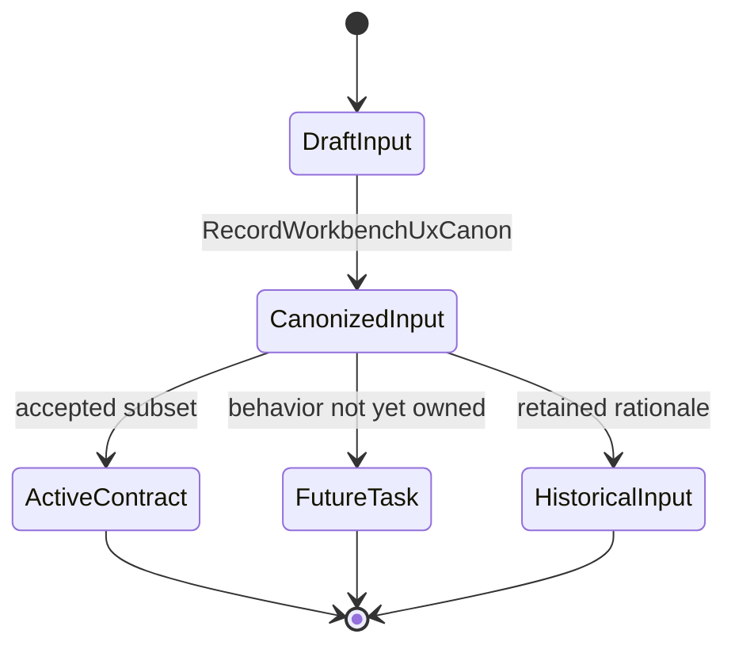
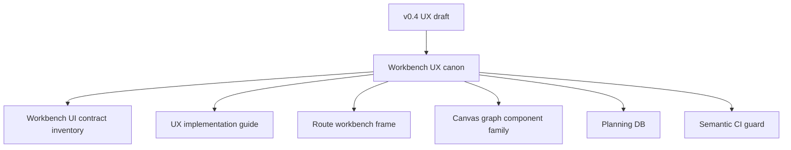

# Workbench UX Canon Component

Owned concern: classify workbench UX specifications, drafts, and design inputs
against the active route workbench contract so they do not become parallel
execution queues.

## Public API

- `RecordWorkbenchUxCanon`: records a UX draft disposition, the accepted active
  contract, and whether remaining behavior must become a new Planning DB task.
- `ClassifyWorkbenchUxDisposition`: returns `active-contract`,
  `historical-input`, `superseded`, or `future-task-material` for a workbench UX
  document.
- `ValidateWorkbenchShellContract`: verifies that the active shell contract
  keeps global shell, route workbench, Canvas, plugin, and runtime concerns
  separated.

## Invariants

- `workbench-ui-contract-and-component-inventory.md` is the active cross-route
  workbench contract.
- The v0.4 UX draft is historical input after `F-MAND-WORKBENCH-UX`; it is not
  a second backlog.
- Canvas must not regain a permanent left navigation rail.
- Product-facing labels must be resolved by route/tab read models before they
  become UI changes.
- Runtime execution intent stays behind planner and engine boundaries.

## Transitions

## Consumers

- Frontend maintainers use this component before changing shell grammar or route
  workbench layout.
- Canvas maintainers use it to keep Canvas-specific affordances in the graph
  component family.
- Route workbench owners use it to decide whether a draft UX rule belongs in a
  route component guide or a new Planning DB task.
- Planning stewards use it to prevent UX drafts from becoming untracked queues.

## Command And Query Rail

| Rail                             | Type    | Owner                               | Surface                                          |
| -------------------------------- | ------- | ----------------------------------- | ------------------------------------------------ |
| `RecordWorkbenchUxCanon`         | command | Workbench UX canon aggregate        | Planning DB closure and draft disposition        |
| `ClassifyWorkbenchUxDisposition` | query   | Workbench UX disposition read model | Component guide, plan, and semantic CI test      |
| `ValidateWorkbenchShellContract` | query   | Workbench shell contract read model | Semantic architecture and shell-contract reviews |

## Semantic Fitness Function

`tools/ci/workbench-ux-canon.test.mjs` validates that the canon plan, draft
frontmatter disposition, component guide, user stories, portfolio map, web
component index, and buzon analysis agree on the same semantic rails.

It checks ownership and disposition rather than only checking barrel thinness or
link presence.

## Component Grouping

## Related Docs

- [Workbench UX Canon User Stories](./workbench-ux-canon-user-stories.md)
- [DVT Workbench UX Canon Plan 2026-05-24](../../planning/proposals/mandatory/frontend-and-ux/dvt-workbench-ux-canon-plan-20260524.md)
- [Workbench UI Contract And Component Inventory](./workbench-ui-contract-and-component-inventory.md)
- [UX Implementation Guide](./ux-implementation-guide.md)
- [Workbench UX Canon Mailbox Analysis](../../../../buzon/20260524-codex-fowler-workbench-ux-canon.md)
