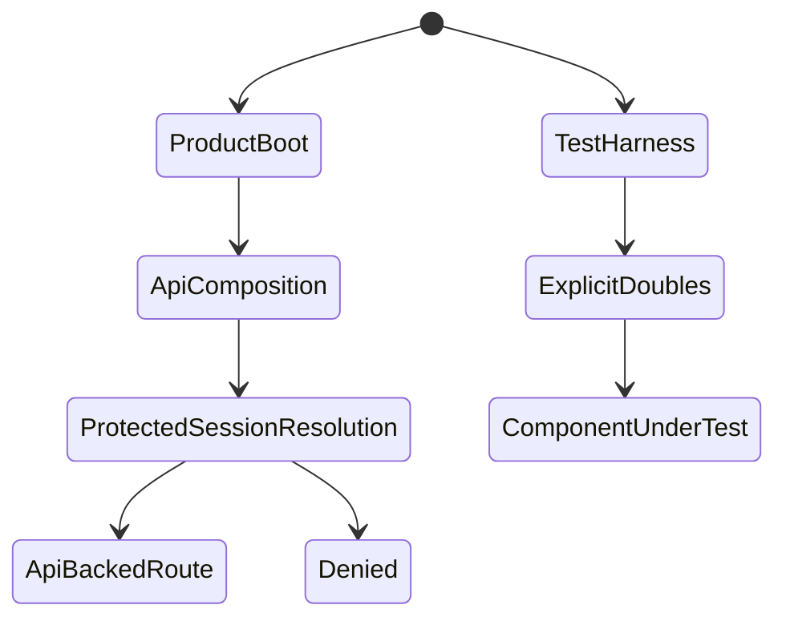
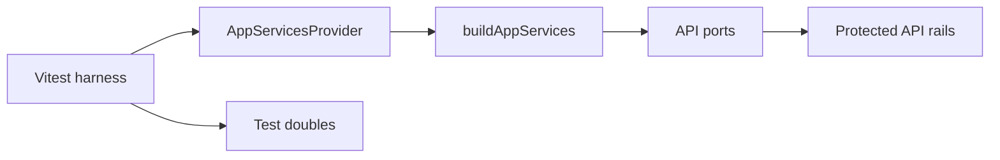
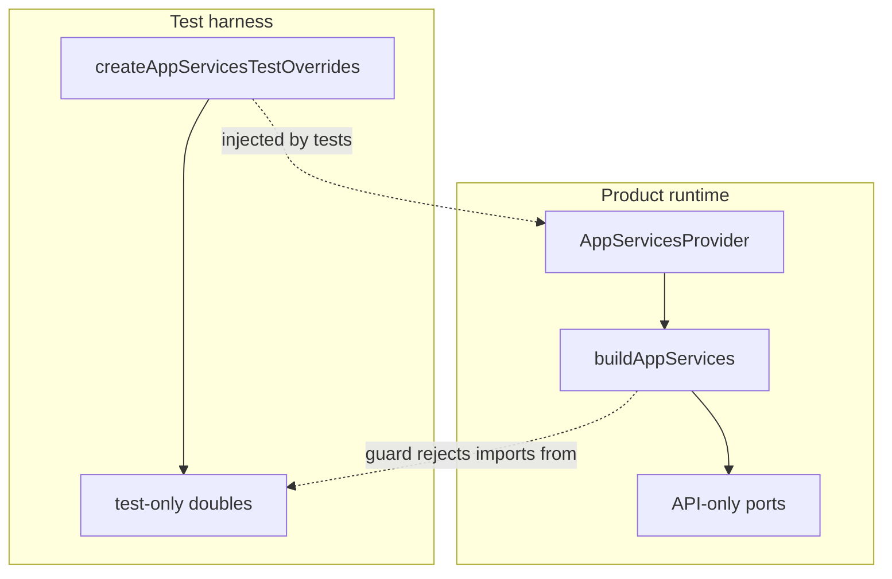

# Web Mock Runtime Hardcut Component

## Purpose

The web composition root is API-only. Fixture data may exist only behind
explicit test doubles and must never be selected by product runtime mode.

## Public API

| Surface                          | Ownership                         | Consumers                        |
| -------------------------------- | --------------------------------- | -------------------------------- |
| `buildAppServices`               | Product app service composition   | `AppServicesProvider`            |
| `createWorkspacePorts`           | API workspace port composition    | `buildAppServices`               |
| `createPlansService`             | API plan port composition         | `buildAppServices`               |
| `createRunsService`              | API run port composition          | `buildAppServices`               |
| `createAppServicesTestOverrides` | Test-only service double assembly | Vitest suites and test harnesses |

## Invariants

- Product composition never imports `*.mock.ts` or test-double modules.
- `DataSourceMode` resolves to API-only for product runtime.
- Protected routes always resolve session and workspace context through API
  rail code; there is no mock bypass.
- Missing backend rails fail closed in API adapters.
- Tests that need local data inject explicit port doubles.
- Every hardcut module starts with an `Owned concern:` docblock.
- Documentation describes product behavior as API-only and fixture behavior as
  test-only.

## State Transitions

## Architecture

## Component Boundary

## Transitions

| Transition                       | Allowed owner             | Invariant                                                    |
| -------------------------------- | ------------------------- | ------------------------------------------------------------ |
| Product app boot                 | `AppServicesProvider`     | Calls `buildAppServices` with API ports.                     |
| Protected route session startup  | `AuthRouteGate`           | Resolves API session and workspace context before rendering. |
| Missing backend rail             | API port adapter          | Returns unavailable before transport or command execution.   |
| View/component test data setup   | Test harness              | Injects explicit test doubles through provider overrides.    |
| New runtime capability migration | Owning command/query rail | Adds backend route or keeps product port fail-closed.        |

## Negative Tests

- Product composition source cannot import or call mock adapters.
- Product data-source resolution cannot return `mock`.
- `AuthRouteGate` cannot bypass session resolution for `mock`.
- No non-test `*.mock.ts` files may live under `apps/web/src/app/services`.
