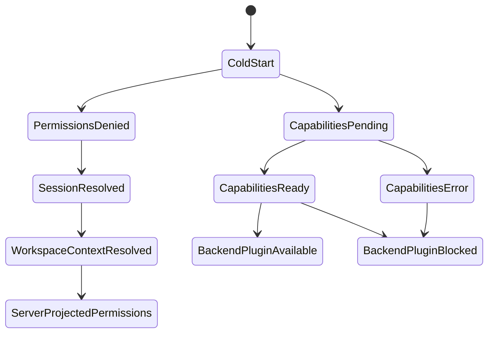
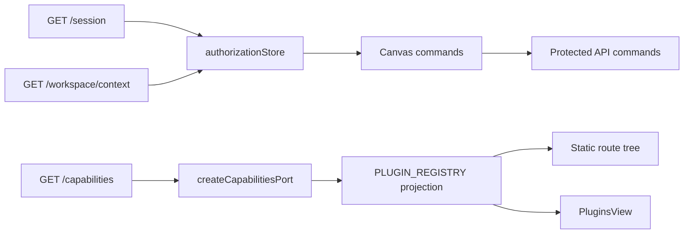

# Web API Authority Hardcut Component

## Purpose

The component makes browser-local authorization and capability state a
server-projected cache, not an authority source.

## Public API

| Surface                       | Kind                           | Owner                           | Consumers                                  |
| ----------------------------- | ------------------------------ | ------------------------------- | ------------------------------------------ |
| `DEFAULT_USER_PERMISSIONS`    | fail-closed value object       | Web authorization projection    | `useAuthorizationStore`, tests             |
| `useAuthorizationStore`       | local projection cache         | Web route presentation          | Canvas controller, admin presentation      |
| `createCapabilitiesPort`      | API query adapter              | Runtime capabilities projection | `buildAppServices`, `useCapabilitiesQuery` |
| `getRuntimePlugins`           | plugin projection query        | Web plugin composition          | shell navigation, Canvas plugin registries |
| `getRouteViews`               | static route composition query | Web plugin composition          | React Router route tree                    |
| `PluginsView` readiness model | presentation read model        | Plugin observability            | plugin workbench route                     |

## Invariants

- Default permissions deny plan, run, edge-edit, plugin, and RBAC actions.
- Tests may grant permissions explicitly; product runtime must not rely on a
  permissive default.
- `/capabilities` network failures are visible query failures.
- A backend-backed plugin is executable only when the backend publishes an
  explicit `{ available: true }` row for its backend plugin id.
- A static plugin declaration is not backend execution authority.
- Static route composition may keep a backend-backed route mounted so direct
  links can be guarded and redirected, but shell navigation and runtime
  registries must still hide the plugin until backend capability is available.
- Plugin surfaces without a backend plugin id remain frontend composition only
  and still rely on API command authorization when they execute backend work.
- Every touched module has an owned-concern docblock.

## Transitions

## Component Map

## Consumers

| Consumer                      | Dependency                                             | Rule                                                                                  |
| ----------------------------- | ------------------------------------------------------ | ------------------------------------------------------------------------------------- |
| Canvas toolbar and controller | `useAuthorizationStore` through `useCanvasStoreFacade` | Button enablement is presentation only; API commands remain final authority.          |
| Plugin registry helpers       | runtime capabilities DTO                               | Backend-backed plugin rows must be explicit and available.                            |
| React Router route tree       | static plugin route declarations                       | Direct links are routable, then guarded by runtime plugin availability.               |
| `PluginsView`                 | capabilities query plus static registry                | Can display declarations, but readiness is degraded or blocked without backend proof. |
| App bootstrap                 | capabilities query state                               | Capability failure degrades bootstrap instead of creating a local authority payload.  |

## Negative Tests

- `authorizationStore` defaults cannot grant any executable permission.
- `createCapabilitiesPort` cannot return `frontend-local` capabilities on
  network failure.
- `getRuntimePlugins(undefined)` cannot include backend-backed plugins.
- `getRuntimePlugins({ plugins: {} })` cannot include backend-backed plugins.
- `getRouteViews()` must keep static route ownership separate from runtime
  plugin availability.
- Architecture guard checks docs, docblocks, and forbidden fail-open vocabulary.
