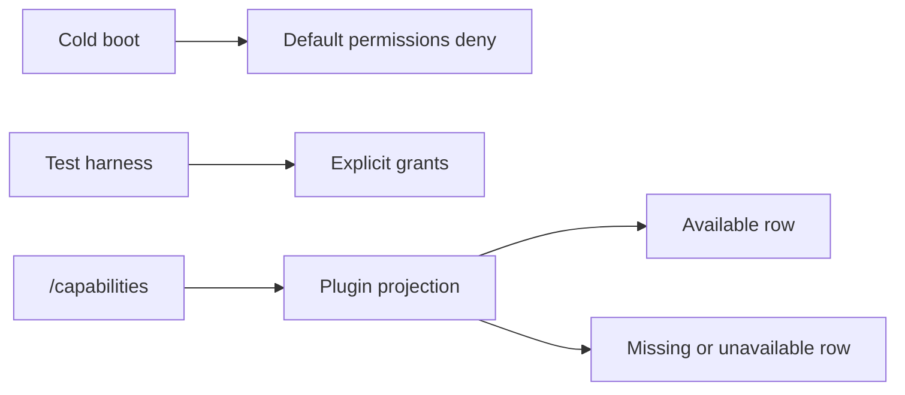

# Web API Authority Hardcut User Stories

## Scenario Coverage Matrix

| Story           | Scenario                                                       | Acceptance                                                                                           |
| --------------- | -------------------------------------------------------------- | ---------------------------------------------------------------------------------------------------- |
| US-WEB-AUTH-001 | Cold web boot before session/workspace projections settle      | Plan, run, edge edit, plugin management, and RBAC actions are disabled by default.                   |
| US-WEB-AUTH-002 | Test harness needs an allowed user                             | The test injects permissions explicitly and does not rely on product defaults.                       |
| US-WEB-AUTH-003 | `/capabilities` returns a backend-backed plugin as unavailable | Plugin route and runtime projections exclude executable/backend-backed surfaces for that plugin.     |
| US-WEB-AUTH-004 | `/capabilities` omits a backend-backed plugin                  | The plugin is shown as unknown/degraded in inspection and excluded from runtime projection.          |
| US-WEB-AUTH-005 | `/capabilities` cannot be reached                              | The query errors visibly and backend-backed plugins are not enabled through frontend-local fallback. |
| US-WEB-AUTH-006 | A static frontend plugin has no backend plugin id              | The shell can show presentation surfaces, but API commands still require backend authorization.      |
| US-WEB-AUTH-007 | A developer adds a new backend-backed plugin                   | They must add a backend capability row and tests proving missing rows fail closed.                   |

## Story Details

### US-WEB-AUTH-001 - Cold boot denies command authority

As a protected-route user, I need the UI to deny executable actions until the
server grants permissions so that a browser default cannot start runs or change
workspace state.

Acceptance:

- `DEFAULT_USER_PERMISSIONS` has every field set to `false`.
- Canvas can still render, but command buttons use denied permissions until
  the projection is hydrated.

### US-WEB-AUTH-002 - Tests grant permission explicitly

As a web test author, I need explicit test permissions so that fixtures do not
look like product authority.

Acceptance:

- Tests call `setUserPermissions` or inject store doubles with explicit values.
- The product default remains fail-closed.

### US-WEB-AUTH-003 - Backend blocks plugin readiness

As an operator, I need unavailable backend plugin capabilities to remove
executable plugin surfaces so that the browser cannot run a backend feature
that the server denies.

Acceptance:

- `getRuntimePlugins({ plugins: { cost: { available: false } } })` excludes
  `cost`.
- `PluginsView` renders the backend reason as blocked.

### US-WEB-AUTH-004 - Missing backend row fails closed

As an operator, I need missing backend plugin rows to be treated as unknown and
not ready so that absence is not interpreted as permission.

Acceptance:

- `getRuntimePlugins({ plugins: {} })` excludes backend-backed plugins.
- `PluginsView` renders `Unknown` and degraded readiness for the missing row.

### US-WEB-AUTH-005 - Capability query failure is visible

As a user, I need backend capability query failure to be visible as degraded
state so that the UI does not silently fabricate availability.

Acceptance:

- `createCapabilitiesPort` rejects network failures.
- App bootstrap and plugin inspection consume the query error path.

### US-WEB-AUTH-006 - Static frontend surfaces remain presentation

As a user, I need core frontend routes to remain visible when they are local
composition surfaces so that shell navigation does not disappear just because a
backend plugin id is not needed.

Acceptance:

- Plugins without `backendPluginId` may still appear in shell projections.
- API commands under those routes remain protected by API authorization.

### US-WEB-AUTH-007 - New backend plugin additions prove authority

As a maintainer, I need new backend-backed plugins to include capability tests
so that future extensions do not reintroduce fail-open behavior.

Acceptance:

- The semantic architecture guard names the authority invariant.
- Registry tests cover unavailable and missing backend rows.
