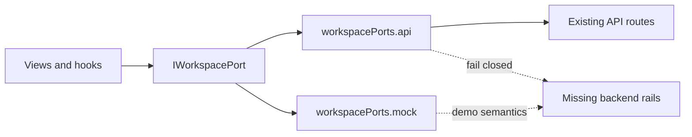
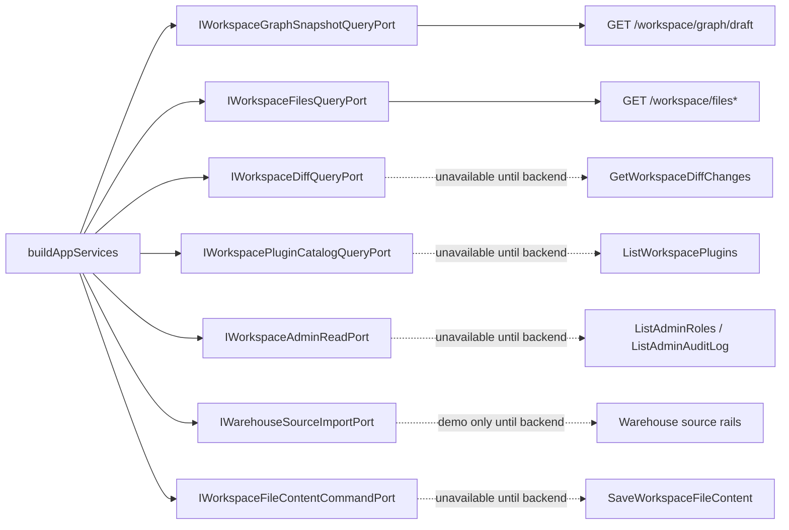
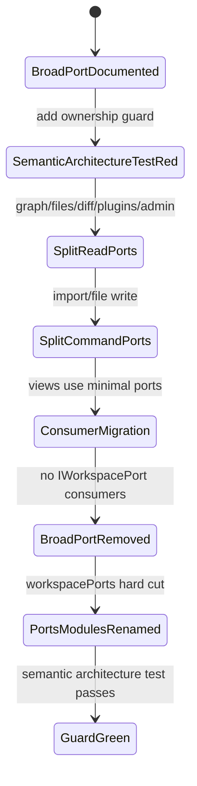

# Workspace Port Decomposition Component

## Purpose

The workspace port decomposition component replaces the broad presentation
`IWorkspacePort` with smaller ports whose names match owned web/API concerns and
accepted or missing command/query rails.

The component prevents one frontend module from looking like the authority for
graph snapshots, files, diff, plugins, admin read models, warehouse import, and
file writes at the same time.

## Owned Concern

Owns web composition of workspace-facing ports by capability.

It does not own backend route implementation, graph draft persistence,
authorization policy, warehouse connector semantics, plugin runtime execution,
admin RBAC truth, or file write semantics.

## Public API

| API                                | Kind                   | Rail                                                                        | Responsibility                                                                                                          |
| ---------------------------------- | ---------------------- | --------------------------------------------------------------------------- | ----------------------------------------------------------------------------------------------------------------------- |
| `IWorkspaceGraphSnapshotQueryPort` | web query port         | `GetWorkspaceGraphDraft`                                                    | Return a presentation graph snapshot projected from the protected graph draft read model.                               |
| `IWorkspaceFilesQueryPort`         | web query port         | `ListWorkspaceFiles`, `GetWorkspaceFileContent`                             | List and read workspace files through existing protected API reads.                                                     |
| `IWorkspaceDiffQueryPort`          | web query port         | `GetWorkspaceDiffChanges`                                                   | Return authoritative diff changes when the backend rail exists; otherwise unavailable in API mode.                      |
| `IWorkspacePluginCatalogQueryPort` | web query port         | `ListWorkspacePlugins`                                                      | Return backend-published plugin catalog/readiness when the backend rail exists; presentation registry remains separate. |
| `IWorkspaceAdminReadPort`          | web query port         | `ListAdminRoles`, `ListAdminAuditLog`                                       | Return admin roles and audit read models when backend rails exist; unavailable in API mode until then.                  |
| `IWarehouseSourceImportPort`       | web command/query port | `ListWarehouseConnections`, `ListWarehouseTables`, `ImportWarehouseSources` | Discover and import warehouse source metadata when backend rails exist; demo-only in mock mode until then.              |
| `IWorkspaceFileContentCommandPort` | web command port       | `SaveWorkspaceFileContent`                                                  | Persist file content only after an accepted backend command exists.                                                     |

## Invariants

- A web view depends only on the smallest port matching the capability it uses.
- API mode must not expose callable methods for routes that do not exist.
- Missing backend rails fail closed before transport.
- Mock/demo ports may support local behavior only when their capability is
  explicitly marked demo-only.
- Read ports do not expose commands.
- Command ports do not return screen-shaped read models as their primary
  purpose.
- `IWorkspaceGraphDraftAuthoringPort` remains separate from graph snapshot
  presentation reads.
- The composition root may assemble multiple ports, but no broad workspace port
  may become the product API again.

## Previous Shape



## Implemented Shape



## Transitions



## Consumers

| Consumer                              | Target dependency                                              |
| ------------------------------------- | -------------------------------------------------------------- |
| `DiffView` and `useDiffData`          | `IWorkspaceDiffQueryPort`                                      |
| `AdminView` and `useAdminViewData`    | `IWorkspaceAdminReadPort`                                      |
| `ArtifactsView` and artifact loaders  | `IWorkspaceFilesQueryPort`                                     |
| `CodeView` and workspace file queries | `IWorkspaceFilesQueryPort`                                     |
| `LineageView` read path               | `IWorkspaceGraphSnapshotQueryPort` until a lineage rail exists |
| `SourceImportWizard`                  | `IWarehouseSourceImportPort`                                   |
| Canvas plan/run handlers              | smallest graph/files/provenance port required by each action   |
| `buildAppServices`                    | composition-only holder of all ports                           |

## Semantic Fitness Function

The architecture guard for this component must validate semantics, not only a
thin barrel:

- no `IWorkspacePort` interface remains as a broad capability surface;
- every workspace-facing port name has one owned concern;
- read ports do not expose command verbs such as `save` or `import`;
- API-mode unavailable ports reject before transport;
- views import the narrow port they consume instead of a composition-root
  workspace service.
- no `workspaceService*` module remains in the workspace service directory
  after the hard cut.

## Module Docblock Rule

Every module touched by the implementation must start with a short owned-concern
docblock, for example:

```ts
/** Owned concern: adapt workspace file read queries to the protected API file read rails. */
```

Docblocks must name ownership, not implementation mechanics.
