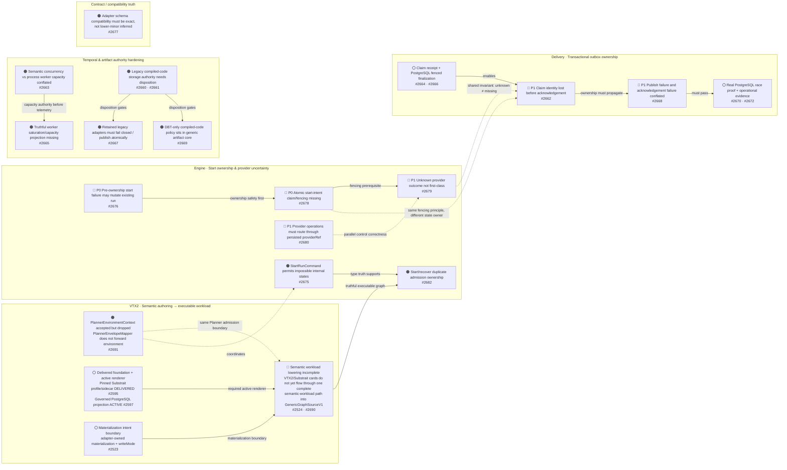

# DVT+ Architecture Problem Register

Source-first register of **current architecture problems and their delivery owners**.

Baseline reviewed: `main@53ab4051c72794f279076513246306dbee782613`.

This page preserves the useful pattern of the architecture problem graph while preventing historical reviews from becoming phantom backlog.

## Governance rule

A red/orange problem may appear here only when all of the following are true:

1. current source/tests/configuration still evidence the problem;
2. the problem has an explicit GitHub issue/epic owner, or is marked `UNOWNED` until one is created;
3. the entry links the concrete source seam and delivery owner;
4. closed/delivered prerequisites are not presented as unresolved defects;
5. issue/document text never outranks current executable source.

Issue state is not itself proof that a defect still exists. Every implementation cut refreshes `main` and closes/narrows stale entries when source changed.

## Consolidated current problem graph

## Traceability register

Each entry has one explicit primary delivery owner. Coordinating issues are listed only where they explain dependency order.

### VTX2 / Planning

- **S1 — Semantic workload lowering incomplete.** Current evidence: `GenericGraphSourceV1` plus current SQL-first compiler/topology seams. Primary delivery owner: [#2524](https://github.com/dunay2/dvt/issues/2524). Parent programmes: [#2690](https://github.com/dunay2/dvt/issues/2690) and [#2594](https://github.com/dunay2/dvt/issues/2594). Status: `OWNED`.
- **S2 — Planner environment accepted but silently dropped.** Current evidence: `packages/@dvt/planner/src/application/PlannerEnvelopeMapper.ts`. Primary delivery owner: [#2691](https://github.com/dunay2/dvt/issues/2691). Parent: [#2690](https://github.com/dunay2/dvt/issues/2690). Status: `OWNED`.
- **S3 — Substrait foundation delivered; SQL projection still active.** Current evidence: `@dvt/contracts/substrait` and the renderer/projection path. Active delivery owner: [#2597](https://github.com/dunay2/dvt/issues/2597). Parent programmes: [#2594](https://github.com/dunay2/dvt/issues/2594) and [#2650](https://github.com/dunay2/dvt/issues/2650). [#2595](https://github.com/dunay2/dvt/issues/2595) is a delivered prerequisite, not open debt.
- **S4 — Materialization intent must stay adapter-owned and capability-truthful.** Current evidence: PostgreSQL relational execution capability. Primary delivery owner: [#2523](https://github.com/dunay2/dvt/issues/2523). Parent: [#2327](https://github.com/dunay2/dvt/issues/2327). Status: `OWNED`.

### Engine / Start ownership

- **E1 — Pre-ownership start failure may mutate an existing run.** Current evidence: `StartRunApplicationService.ts` and `StartRunFailurePolicy.ts`. Primary delivery owner: [#2676](https://github.com/dunay2/dvt/issues/2676). Parent: [#2673](https://github.com/dunay2/dvt/issues/2673). Status: `OWNED`.
- **E2 — Concurrent starts lack durable claim ownership and fenced transitions.** Current evidence: intent service/store and PostgreSQL intent persistence. Primary delivery owner: [#2678](https://github.com/dunay2/dvt/issues/2678). Parent: [#2673](https://github.com/dunay2/dvt/issues/2673). Status: `OWNED`.
- **E3 — Unknown provider outcome is not first-class.** Current evidence: start execution timeout, failure and reconciliation seams. Primary delivery owner: [#2679](https://github.com/dunay2/dvt/issues/2679). Parent: [#2673](https://github.com/dunay2/dvt/issues/2673). Status: `OWNED`.
- **E4 — Provider operations must route through persisted provider identity.** Current evidence: run command, signal and enrichment services. Primary delivery owner: [#2680](https://github.com/dunay2/dvt/issues/2680). Parent: [#2673](https://github.com/dunay2/dvt/issues/2673). Status: `OWNED`.
- **E5 — `StartRunCommand` permits impossible internal states.** Current evidence: Start Run contracts/schema. Primary delivery owner: [#2675](https://github.com/dunay2/dvt/issues/2675). Parent: [#2674](https://github.com/dunay2/dvt/issues/2674). Status: `OWNED`.
- **E6 — Fresh start and recovery duplicate shared admission ownership.** Current evidence: `StartRunAdmissionService` and `RecoverRunApplicationService`. Primary delivery owner: [#2682](https://github.com/dunay2/dvt/issues/2682). Parent: [#2673](https://github.com/dunay2/dvt/issues/2673). Status: `OWNED`.

### Transactional outbox

- **O1 — Claim identity is lost before acknowledgement.** Current evidence: `packages/@dvt/adapter-postgres/src/PostgresOutboxStore.ts`. Primary programme owner: [#2662](https://github.com/dunay2/dvt/issues/2662), with contract and PostgreSQL implementation in [#2664](https://github.com/dunay2/dvt/issues/2664) and [#2666](https://github.com/dunay2/dvt/issues/2666). Status: `OWNED`.
- **O2 — Publish failure and acknowledgement/finalization failure are conflated.** Current evidence: `packages/@dvt/delivery/src/application/OutboxWorker.ts`. Primary delivery owner: [#2668](https://github.com/dunay2/dvt/issues/2668). Parent: [#2662](https://github.com/dunay2/dvt/issues/2662). Status: `OWNED`.
- **O3 — Claim receipt and fenced PostgreSQL finalization are explicit prerequisites.** Owners: [#2664](https://github.com/dunay2/dvt/issues/2664) and [#2666](https://github.com/dunay2/dvt/issues/2666). Parent: [#2662](https://github.com/dunay2/dvt/issues/2662). Status: `OWNED`.
- **O4 — Race safety needs real PostgreSQL and operational proof.** Current evidence: PostgreSQL smoke, worker and monitor rails. Owners: [#2670](https://github.com/dunay2/dvt/issues/2670) and [#2672](https://github.com/dunay2/dvt/issues/2672). Parent: [#2662](https://github.com/dunay2/dvt/issues/2662). Status: `OWNED`.

### Temporal / Artifacts

- **T1 — Semantic concurrency and worker-process capacity have different owners/lifecycles.** Current evidence: `TemporalPolicyMapper`, `TemporalWorkerHost` and worker config. Primary delivery owner: [#2663](https://github.com/dunay2/dvt/issues/2663). Parent: [#2660](https://github.com/dunay2/dvt/issues/2660). Status: `OWNED`.
- **T2 — Worker capacity/saturation lacks one bounded truthful projection.** Current evidence: Temporal worker host/observability. Primary delivery owner: [#2665](https://github.com/dunay2/dvt/issues/2665). Parent: [#2660](https://github.com/dunay2/dvt/issues/2660). Status: `OWNED`.
- **A1 — Canonical CAS coexists with a legacy SQL-specific compiled-code storage surface whose reachability needs disposition.** Current evidence: `@dvt/artifacts` CAS plus `ICompiledCodeStorage`. Primary delivery owner: [#2661](https://github.com/dunay2/dvt/issues/2661). Parent: [#2660](https://github.com/dunay2/dvt/issues/2660). Status: `OWNED`.
- **A2 — Retained legacy adapters must fail closed and publish safely.** Current evidence: compiled-code adapters. Primary delivery owner: [#2667](https://github.com/dunay2/dvt/issues/2667). Parent: [#2660](https://github.com/dunay2/dvt/issues/2660). Status: `OWNED`.
- **A3 — DBT eligibility/resource policy is misplaced inside generic artifact core if retained.** Current evidence: `attachCompiledCodeRefs()`. Primary delivery owner: [#2669](https://github.com/dunay2/dvt/issues/2669). Parent: [#2660](https://github.com/dunay2/dvt/issues/2660). Status: `OWNED`.

### Contract / Compatibility truth

- **G1 — Adapter schema compatibility must be exact and must not become a second runtime admission authority.** Current evidence: `PlanAdmission.v1.ts`, `contracts/compat/plan-compat.json` and the Temporal support descriptor. Primary delivery owner: [#2677](https://github.com/dunay2/dvt/issues/2677). Parent: [#2674](https://github.com/dunay2/dvt/issues/2674). Status: `OWNED`.

## Coverage result — 2026-08-28

- **19 graph entries checked: 15 active problems and 4 explicit prerequisites/gates.**
- **All active problems have an explicit issue/epic owner.**
- **0 unresolved defects are unowned.**
- **0 new issues are required by this reconciliation.**
- `#2595` is deliberately recorded as a **delivered prerequisite**, not reopened as backlog.

If a future source-first audit finds a current defect without an owner, the audit is not complete until either:

- an issue is created and linked here, or
- the finding is explicitly classified `NO-ACTION` / `NOT-A-PROBLEM` with source evidence and removed from the red/orange graph.

## Source hierarchy used

This register integrates the surviving architectural principles from the historical V2 material with the current source-first architecture synthesis:

- Planner, Engine, State and UI remain distinct authorities.
- Planning remains separate from orchestration.
- Persistent state outranks provider memory.
- Reuse-before-build and standards-before-private-semantics remain design heuristics.
- Substrait is the bounded semantic center for VTX2, with DVT-owned stable identity/provenance.
- Canvas cards, Substrait operators and runtime steps are deliberately different granularities.

Historical V2 package trees, proposed providers and speculative components are not AS-IS evidence.

## Maintenance rule

For every update:

1. resolve `main` to an exact SHA;
2. reproduce/inspect the source seam;
3. search active issues and PR overlap;
4. update or remove the graph node;
5. ensure every remaining red/orange node has exactly one primary delivery owner;
6. link secondary/coordinating issues without creating duplicate ownership;
7. keep delivered prerequisites visible only when they explain dependency order, never as open defects.
