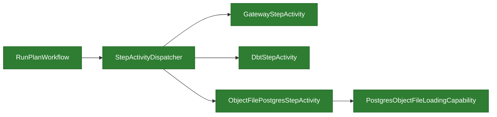

# Engine Internal Components

Extracted from the implementation architecture pack to keep engine internals
manageable as an actively maintained surface.

## Current Design

The engine follows a hexagonal (ports-and-adapters) architecture with five
internal and adjacent service layers:

1. **Facade** (`IWorkflowEngine` via `buildWorkflowEngineFacade` ->
   `WorkflowEngine`): Public command and canonical-read surface. Normalizes
   inputs, resolves initial context (sets `logicalAttemptId=1`,
   `originRunId=runId`), and delegates to specialized services that are wired
   explicitly by the composition root.
2. **Application Services**: `StartRunApplicationService` orchestrates the
   happy path (admission -> plan integrity -> intent -> execution) and the failure
   path (`StartRunFailurePolicy`). `RecoverRunApplicationService` owns
   retry/recover orchestration on top of the same start-run pipeline.
   `StartRunAdmissionGuard` composes validation and capability checks.
3. **Control Domain**: `WorkflowEngineCoreService` handles cancel and signal.
   `SignalTransitionGuard` validates signal preconditions against the current
   snapshot. `SnapshotProjector` rebuilds state from events.
4. **Explicit non-facade services**: `RunStatusQueryService` owns canonical
   status reads. `RunEnrichmentService` composes canonical status plus provider
   diagnostics. `RunHealthService` exposes runtime liveness checks against the
   state store and registered adapters without widening `IWorkflowEngine`.
5. **Maintenance**: `RunMaintenanceService` orchestrates stuck-run detection
   and orphaned-intent reconciliation. `IntentReconcilerWorker` is a periodic
   scheduler with exponential backoff and jitter. This maintenance path is
   wired by runtime/admin composition and is adjacent to, not behind,
   `IWorkflowEngine`.

The **Security Layer** cross-cuts all paths: `RunAccessPolicy` gates tenant
access, `PlanIntegrityValidator` verifies plan bytes via SHA-256 + JCS
canonicalization, and `PlanRefPolicy` enforces URI allowlists.

Temporal runtime internals no longer assume dbt-only step execution. The
runtime now routes task steps through `StepActivityDispatcher`, and
provider-owned capability registries can attach non-dbt execution paths without
editing workflow control flow. The shipped example is the relational PostgreSQL
capability in `@dvt/adapter-postgres`, exercised through separate Temporal
baseline, transformation, and Postgres integration lanes.

The engine documentation tracks seven declared southbound seams. Four are
unconditionally runtime-wired in the current delivery path. One
(`IRunExecutionContextResolver`) is wired only when the composition root
provides it. `IProjector` remains a package-exposed target seam, while
`IMetricsCollector` currently exists only as a source-tree target seam because
the shipped package surface still routes telemetry through `IObservability`.
Concrete test doubles (`InMemoryProviderAdapter`, `InMemoryRunStateStore`,
`InMemoryStartRunIntentStore`) are engine-internal unit-test aids that model
real provider ids. Production adapters live in separate packages. Blue nodes
below therefore represent the declared engine seam, while each node label
carries the current posture.

## Known Problems

- **`WorkflowEngineCoreService` still mixes cancel, signal, and telemetry**:
  canonical read now lives in `RunStatusQueryService`, but the remaining
  control path is still broader than the target architecture.
- **`StartRunApplicationService` / `RecoverRunApplicationService` still share
  admission machinery implicitly**: the facade-width residual is closed, but
  recover-run and start-run still rely on a common guard/policy cluster that
  has not yet been decomposed to the target posture.
- **Plan artifact reader ownership is now normalized**:
  `IStoredPlanArtifactReader` and `StoredPlanArtifact` live in
  `@dvt/artifacts`, while `IPlanIntegrityValidator` lives in `@dvt/engine`.
  `IRunStateStore` stays focused on run metadata, event log, snapshots, and
  maintenance.

## Unidentified Design Concerns

- **`StartRunApplicationService` constructs its own collaborators**: The
  constructor builds `StartRunEventFactory`, `StartRunFailurePolicy`, and
  `StartRunExecutionService` internally. This makes it impossible to inject
  test doubles for these collaborators individually, forcing tests to mock at
  the port boundary (state store, intent store) rather than at the
  collaborator boundary. Extracting construction to an explicit builder/factory
  would improve testability.
- **`coreRuntime.ts` is a utility grab-bag**: It contains `getAdapterOrThrow`,
  `resolveMetaOrThrow`, `withTimeout`, `buildMetricTags`, `buildTraceContext`,
  `normalizeEngineRunRef`, `emitSignalDerivedRunEvent`, and `buildRunEvents`.
  These span adapter resolution, observability, and event construction - three
  different concerns. A refactor into focused modules (`adapterResolution.ts`,
  `observabilityHelpers.ts`, `eventBuilders.ts`) would improve discoverability.
- **No explicit error taxonomy at the facade boundary**: Each internal service
  throws its own error types (`RunNotFoundError`, `AdapterNotRegisteredError`,
  `PlanIntegrityError`, `InvalidStateTransitionError`), but there is no
  facade-level error mapper that guarantees callers receive a stable, documented
  error surface. The API layer must defensively catch a wide variety of engine
  error types.

Detailed decomposition of `@dvt/engine` showing actual classes, services,
ports, and their relationships.

## Declared Southbound Port Surface

| Port                           | Current posture               | Notes                                                                                           |
| ------------------------------ | ----------------------------- | ----------------------------------------------------------------------------------------------- |
| `IRunStateStore`               | `runtime-wired`               | Canonical state/event/snapshot seam                                                             |
| `IStartRunIntentStore`         | `runtime-wired`               | Crash-consistency seam                                                                          |
| `IProviderAdapter`             | `runtime-wired`               | Provider runtime seam                                                                           |
| `IPlanIntegrityValidator`      | `runtime-wired`               | Engine integrity gate that consumes the artifacts-owned plan reader                             |
| `IRunExecutionContextResolver` | `optional runtime wiring`     | Conditional start-run seam; wired only when the composition root provides it                    |
| `IProjector`                   | `package-exposed target seam` | Declared seam; mainline still uses `SnapshotProjector` directly                                 |
| `IMetricsCollector`            | `source-tree target seam`     | Declared in source; not exported from the package root. Mainline still injects `IObservability` |

```mermaid
flowchart TB
  classDef impl fill:#2E7D32,color:#fff,stroke:#1B5E20
  classDef port fill:#1565C0,color:#fff,stroke:#0D47A1
  classDef planned fill:#FF9800,color:#fff,stroke:#E65100,stroke-dasharray:5 5
  classDef security fill:#C62828,color:#fff,stroke:#B71C1C

  subgraph Facade["Public API Layer"]
    Builder["buildWorkflowEngineFacade<br/>(public builder)"]:::impl
    WE["WorkflowEngine<br/>(facade)"]:::impl
  end

  RuntimeRoot["Runtime / admin composition"]:::impl

  subgraph Application["Application Services"]
    SRAS["StartRunApplicationService"]:::impl
    RRAS["RecoverRunApplicationService"]:::impl
    SRAG["StartRunAdmissionGuard"]:::impl
    SREP["StartRunExecutionService"]:::impl
    SRFP["StartRunFailurePolicy"]:::impl
    SRVP["StartRunValidationPolicy"]:::impl
    RCAP["RunExecutionContextAdmissionPolicy"]:::impl
  end

  subgraph Core["Core Domain"]
    RSQS["RunStatusQueryService<br/>(canonical status)"]:::impl
    WECS["WorkflowEngineCoreService<br/>(cancel, signal)"]:::impl
    SP["SnapshotProjector"]:::impl
    IKB["IdempotencyKeyBuilder"]:::impl
    STG["SignalTransitionGuard"]:::impl
    CR["coreRuntime<br/>(shared lifecycle utils)"]:::impl
  end

  subgraph ExplicitServices["Explicit Non-facade Services"]
    RES["RunEnrichmentService<br/>(provider-backed enrichment)"]:::impl
    RHS["RunHealthService<br/>(runtime health)"]:::impl
  end

  subgraph Maintenance["Maintenance Services"]
    RMS["RunMaintenanceService"]:::impl
    SSRS["RunMaintenanceStuckRunService"]:::impl
    OIRS["RunMaintenanceOrphanedIntentService"]:::impl
    PIRP["PendingIntentReconciliationPolicy"]:::impl
    DIRP["DispatchedIntentReconciliationPolicy"]:::impl
    IRW["IntentReconcilerWorker<br/>(periodic sweep)"]:::impl
  end

  subgraph Security["Security Layer"]
    RAP["RunAccessPolicy"]:::security
    PIV["PlanIntegrityValidator<br/>(SHA-256 + JCS)"]:::security
    PRP["PlanRefPolicy<br/>(URI allowlist)"]:::security
    HRC["HostRiskClassifier"]:::security
    AUTH["Authorizer<br/>(IRunAccessPolicy)"]:::security
  end

  subgraph Ports["Engine Ports"]
    IRSS["IRunStateStore<br/>(runtime-wired)"]:::port
    ISRIS["IStartRunIntentStore<br/>(runtime-wired)"]:::port
    IPA["IProviderAdapter<br/>(runtime-wired)"]:::port
    IPF["IPlanIntegrityValidator<br/>(runtime-wired)"]:::port
    IREC["IRunExecutionContextResolver<br/>(optional runtime wiring)"]:::port
    IPROJ["IProjector<br/>(package-exposed target seam)"]:::port
    IMC["IMetricsCollector<br/>(source-tree target seam)"]:::port
  end

  subgraph Adapters["Concrete Adapters"]
    IMPA["InMemoryProviderAdapter<br/>(unit-test double)"]:::impl
    IMSS["InMemoryRunStateStore"]:::impl
    IMIS["InMemoryStartRunIntentStore"]:::impl
  end

  Builder --> WE
  WE --> SRAS
  WE --> RRAS
  WE --> RSQS
  WE --> WECS
  RuntimeRoot --> RMS
  RuntimeRoot --> IRW
  RRAS --> SRAS
  RRAS --> RAP
  RRAS --> IRSS
  RRAS --> IPA
  RRAS --> IPF
  RRAS --> IREC
  SRAS --> SRAG
  SRAS --> SREP
  SRAS --> SRFP
  SRAS --> PIV
  SRAG --> SRVP
  SRAG --> RCAP
  SRAG --> RAP
  SREP --> IPA
  SREP --> IRSS
  SREP --> ISRIS
  SREP --> IKB
  RSQS --> SP
  RSQS --> RAP
  WECS --> STG
  WECS --> CR
  WECS --> IPA
  WECS --> IRSS
  RES --> SP
  RES --> RAP
  RES --> IPA
  RES --> IRSS
  RHS --> IPA
  RHS --> IRSS
  RMS --> SSRS
  RMS --> OIRS
  OIRS --> PIRP
  OIRS --> DIRP
  IRW --> RMS
  RAP --> AUTH
  RAP --> PRP
  RAP --> HRC
  PIV --> IPF

  IMPA -.-> IPA
  IMSS -.-> IRSS
  IMIS -.-> ISRIS
```

## Runtime Capability Dispatch Inside The Shipped Temporal Path

---
