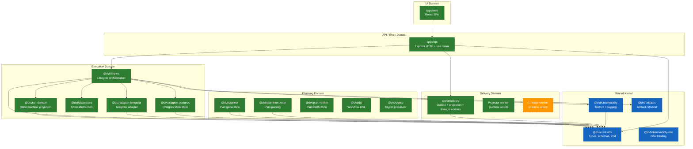
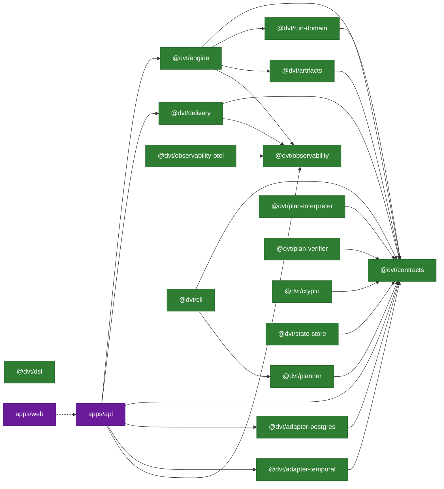
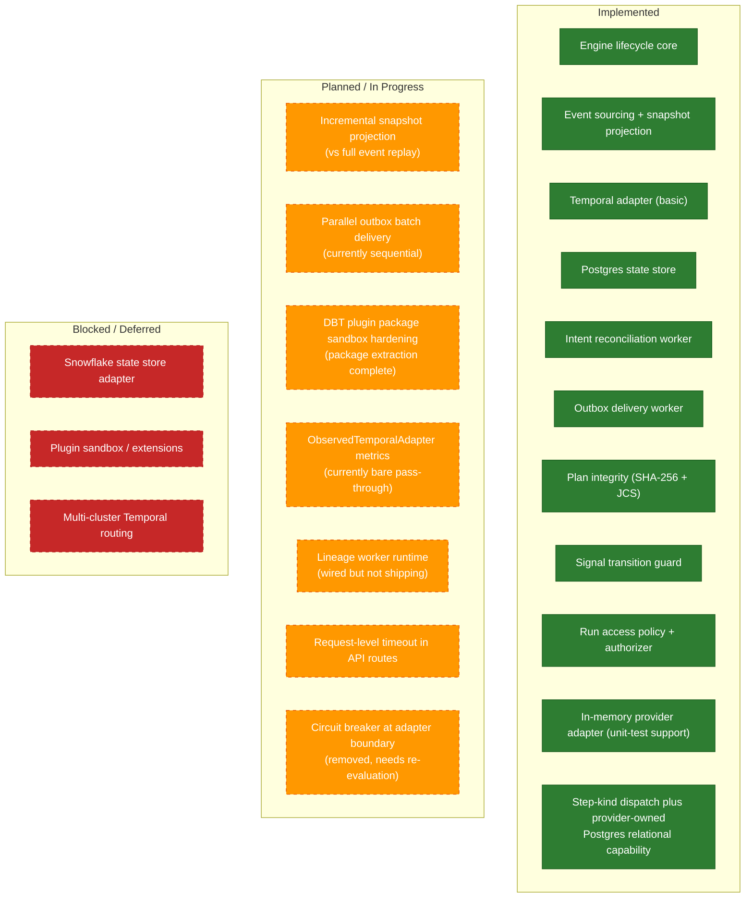

# Implementation Architecture Diagrams

Code-grounded diagrams showing what is **implemented now** vs what is
**planned or desired**. Every solid green element maps to shipped code.
Orange dashed elements are queued or aspirational. Blue solid port nodes are
also code-grounded: the interface exists in mainline, and the node label states
whether that port is `runtime-wired` today, exposed as a package-level target
seam, or currently present only as a source-tree seam.

**Legend**:

- **Green** (solid): implemented and tested
- **Blue** (solid): declared port surface; label states current posture
- **Orange** (dashed): planned, stubbed, or desired

**Primary code sources**: all diagrams trace to files under `packages/@dvt/`,
`apps/api/`, and `apps/web/`.

---

## 1. Domain Model - Bounded Contexts

Maps the actual repository packages to their bounded context and shows
real import-time dependency direction.

### Current Design

The monorepo is organized into seven bounded contexts. The **Execution** domain
is the heaviest, owning five packages (`engine`, `run-domain`, `state-store`,
`adapter-temporal`, `adapter-postgres`). The **Shared Kernel** (`@dvt/contracts`,
`@dvt/observability`, `@dvt/artifacts`) is imported by almost every other
package and acts as the cross-cutting type surface.

Key design decisions:

- `@dvt/run-domain` was extracted from the engine to isolate pure state-machine
  projection (`applyRunEvent`, `transitionPolicy`) from orchestration concerns.
  This means the same transition rules apply identically in engine, storage
  adapters, and snapshot rebuilds.
- `@dvt/contracts` carries Zod schemas and runtime parsers, not just types.
  All inter-package boundaries validate at parse time (`parsePlanRef`,
  `parseRunContext`, etc.), which prevents invalid data from crossing domain
  boundaries.
- Adapter packages (`adapter-temporal`, `adapter-postgres`) are independently
  deployable and import only `@dvt/contracts`, never `@dvt/engine`. The engine
  references them only via `IProviderAdapter` / `IRunStateStore` ports.

### Known Problems

- **Provider-vocabulary hard cut is recent**: active provider contracts now
  expose only implemented runtime providers, but future-runtime planning must
  stay outside active contract/docs surfaces until it has an ADR-backed adapter
  and conformance suite.
- **`@dvt/state-store` abstraction gap**: The package exists but most of the real
  store behavior lives in `@dvt/adapter-postgres` and `@dvt/engine` in-memory
  stores. The boundary between these three is not yet sharp.

### Unidentified Design Concerns

- **Shared Kernel surface area**: `@dvt/contracts` combines Zod validation,
  TypeScript types, and runtime schema parsing in a single package. As the
  contract surface grows, this creates a heavy transitive dependency for
  lightweight consumers (e.g., `@dvt/crypto`, `@dvt/dsl`) that only need
  types, not Zod runtime. Splitting into `@dvt/contracts-types` (zero-runtime)
  and `@dvt/contracts-schemas` (Zod) would reduce bundle weight for leaf
  packages.
- **Delivery domain boundary ambiguity**: `@dvt/delivery` groups three
  conceptually distinct workers (outbox, projector, lineage) under one package.
  If lineage and projection grow different lifecycle/scaling needs, the current
  single-package grouping will force coordinated releases for unrelated concerns.
- **Missing explicit anti-corruption layer between Planning and Execution**:
  The planner output flows into engine via `PlanRef` + byte fetch, but there is
  no declared adapter or mapper that guards against planner-side schema evolution
  breaking engine assumptions. The engine's `PlanIntegrityValidator` partially
  covers this, but it sits in the security layer rather than at the domain
  boundary where its role is most visible.

### Aggregate and Value Object Map

**Current drift**: `Run` is not modeled as a first-class aggregate class in the
codebase. Instead, its behavior is spread across `RunMetadata` (identity and
provider references), `WorkflowSnapshot` (projected state), and
`EventEnvelope[]` (event log), with responsibilities distributed across
`applyRunEvent` (projection), `InMemoryRunStateStore` (persistence), and
`WorkflowEngineCoreService` (commands). Event sourcing explains why state is
reconstructed from events, but it does not require aggregate behavior to remain
this dispersed. The current shape should be treated as cohesion debt, not as
target architecture.

**Unidentified concern**: `EngineRunRef` carries both the logical `runId` and
the provider-assigned `providerWorkflowId` / `providerRunId`, but these two
identity spaces can diverge. The engine indexes everything by `runId`, while
the provider (Temporal) indexes by `workflowId`. When a consumer receives an
`EngineRunRef`, it must know which ID to use for which system. A more explicit
separation (e.g., `LogicalRunId` vs `ProviderRunRef` as distinct value objects)
would reduce confusion at the API boundary.

---

## 2. Package Dependency Graph

### Current Design

18 `@dvt/*` packages plus two apps (`api`, `web`). The dependency graph is
intentionally acyclic: leaf packages like `@dvt/contracts` and
`@dvt/observability` sit at the bottom; composition roots (`apps/api`) sit at
the top and wire concrete adapters into engine ports at startup.

The engine enforces import boundaries via ESLint: `@dvt/engine/src/**` must not
import `@dvt/planner`, `@dvt/adapter-temporal`, or any concrete adapter. This
is checked by the `lint:determinism` script.

### Known Problems

- **`apps/api` directly imports `@dvt/adapter-postgres` and
  `@dvt/adapter-temporal`**: This is intentional (composition root wiring), but
  it means the API process is tightly coupled to two specific infrastructure
  implementations at compile time. A provider registry or DI container would
  make this pluggable, but the current direct-import approach is simpler and
  adequate for the single-runtime deployment model.

### Unidentified Design Concerns

- **`@dvt/observability` depends on `@dvt/contracts`**: This creates a circular
  conceptual dependency. Observability is a cross-cutting concern that should
  ideally sit below or beside contracts, not above it. Currently the dependency
  is on type definitions only, but if `@dvt/contracts` ever needs to emit
  telemetry, the relationship would need inversion.
- **`@dvt/crypto` is missing from the graph**: The `lint:determinism` script
  builds `@dvt/crypto` as a prerequisite, but the package does not appear in
  most import paths. Its actual consumer chain should be audited.
- **No package-level build order enforcement beyond `type-check` script**: The
  root `type-check` script manually chains `--filter` calls in a specific order.
  A declarative build topology (e.g., Turborepo pipeline or pnpm workspace
  `dependsOn`) would be more resilient to new packages being added without
  updating the build chain.

Actual `import` relationships between all `@dvt/*` packages and apps.

---

## 3. Extracted Diagram Packs

- [Engine Internal Components](./engine-internal-components.md)
- [Run State Machines](./run-state-machines.md)
- [Start-run Sequences](./start-run-sequences.md)
- [Maintenance And Reconciliation](./maintenance-and-reconciliation.md)
- [Outbox Delivery Architecture](./outbox-delivery-architecture.md)

These pages were extracted from this overview so engine and runtime changes can
be updated locally without scanning the full implementation pack.

## 4. Desired Architecture Delta

### Current Design

This section consolidates all gaps between current implementation and target
architecture, gathered from the section analyses above.

### Consolidated Problem Inventory

**Identified bugs (from audit)**:

| ID    | Component                 | Summary                             | Severity |
| ----- | ------------------------- | ----------------------------------- | -------- |
| E-02  | SignalTransitionGuard     | Asymmetric PAUSE/RESUME idempotency | Medium   |
| DL-01 | OutboxWorker.processBatch | Sequential record processing        | Medium   |

Closed audit items such as the earlier `DispatchedIntentReconciliationPolicy`
outcome-key bug, the Temporal native-cancel cutover, and the WE-HX-1
stored-plan artifact ownership split is intentionally omitted from the active
inventory.

**Design improvement opportunities (not previously identified):**

- `@dvt/contracts`: Zod runtime bundled with types; leaf packages carry
  unnecessary weight. Impact: build size and compile speed.
- `@dvt/delivery`: Three workers in one package with a coupled release cycle.
  Impact: operational flexibility.
- Engine facade: No facade-level error mapper; callers must handle a wide error
  taxonomy. Impact: API stability.
- `coreRuntime.ts`: Utility grab-bag spanning adapter, observability, and event
  concerns. Impact: discoverability.
- `StartRunApplicationService`: Constructs its own collaborators and lacks an
  injection seam for tests. Impact: testability.
- Signal flow: Signal-derived event emission is fire-and-forget after adapter
  success. Impact: data consistency.
- Reconciler: No concurrency control; `getRunMetadata` errors are swallowed as
  null. Impact: correctness under load.
- Outbox: No publish timeout, no claim lock in contract, and observer errors
  are swallowed. Impact: reliability.
- State machine: No PAUSED stuck-run detection and no `PAUSED -> FAILED`
  transition. Impact: operational coverage.
- Plan fetch: No size limit or timeout on plan byte fetch. Impact: security and
  availability.

What is **planned or desired** but not yet implemented (orange elements from
above diagrams), consolidated here.

---

## Code Anchors

| Diagram               | Primary source files                                                                                                                                                                                                                  |
| --------------------- | ------------------------------------------------------------------------------------------------------------------------------------------------------------------------------------------------------------------------------------- |
| Domain model          | `packages/@dvt/*/package.json`, `contracts/src/types/contracts.ts`                                                                                                                                                                    |
| Package dependencies  | `packages/@dvt/*/package.json` dependency fields                                                                                                                                                                                      |
| Engine components     | `buildWorkflowEngineFacade.ts`, `WorkflowEngine.ts`, `StartRunApplicationService.ts`, `RecoverRunApplicationService.ts`, `WorkflowEngineCoreService.ts`, `RunStatusQueryService.ts`, `RunHealthService.ts`, `RunEnrichmentService.ts` |
| Run state machine     | `@dvt/run-domain/src/transitionPolicy.ts`, `applyRunEvent.ts`                                                                                                                                                                         |
| Step state machine    | `@dvt/run-domain/src/transitionPolicy.ts`                                                                                                                                                                                             |
| startRun sequence     | `StartRunApplicationService.ts`, `StartRunExecutionService.ts`, `PlanIntegrityValidator.ts`                                                                                                                                           |
| Signal/cancel         | `WorkflowEngineCoreService.ts`, `SignalTransitionGuard.ts`, `coreRuntime.ts`                                                                                                                                                          |
| Intent reconciliation | `IntentReconcilerWorker.ts`, `RunMaintenanceService.ts`, `*IntentReconciliationPolicy.ts`                                                                                                                                             |
| Outbox delivery       | `@dvt/delivery/src/application/OutboxWorker.ts`                                                                                                                                                                                       |

## Related Pages

- [C4 Engine Architecture](../components/engine/architecture/c4-engine.md)
- [WorkflowEngine Subsystem Context](../components/engine/architecture/workflow-engine-subsystem-context.md)
- [Domain Map](../domain-map.md)
- [Execution Domain](../domain-execution.md)
- [System Delivery Status](../system-delivery-status.md)
