# Implementation Architecture Diagrams

Code-grounded diagrams showing what is **implemented now** vs what is
**planned or desired**. Every solid green element maps to shipped code.
Orange dashed elements are queued or aspirational. Blue solid port nodes are
also code-grounded: the interface exists in mainline, and the node label states
whether that port is `runtime-wired` today or intentionally kept visible as a
`target-line exposed` seam.

**Legend**:

- **Green** (solid): implemented and tested
- **Blue** (solid): declared port surface; label states current posture
- **Orange** (dashed): planned, stubbed, or desired

**Primary code sources**: all diagrams trace to files under `packages/@dvt/`,
`apps/api/`, and `apps/web/`.

---

## 1. Domain Model — Bounded Contexts

Maps the actual repository packages to their bounded context and shows
real import-time dependency direction.

### Current Design

The monorepo is organized into seven bounded contexts. The **Execution** domain
is the heaviest, owning five packages (`engine`, `run-domain`, `state-store`,
`adapter-temporal`, `adapter-postgres`). The **Shared Kernel** (`@dvt/contracts`,
`@dvt/observability`, `@dvt/artifacts`) is imported by almost every other
package and acts as the cross-cutting type surface.

Key design decisions:

- `@dvt/run-domain` was extracted from the engine to isolate pure state-machine
  projection (`applyRunEvent`, `transitionPolicy`) from orchestration concerns.
  This means the same transition rules apply identically in engine, storage
  adapters, and snapshot rebuilds.
- `@dvt/contracts` carries Zod schemas and runtime parsers, not just types.
  All inter-package boundaries validate at parse time (`parsePlanRef`,
  `parseRunContext`, etc.), which prevents invalid data from crossing domain
  boundaries.
- Adapter packages (`adapter-temporal`, `adapter-postgres`) are independently
  deployable and import only `@dvt/contracts`, never `@dvt/engine`. The engine
  references them only via `IProviderAdapter` / `IRunStateStore` ports.

### Known Problems

- **Conductor stub pollution**: `ConductorAdapterStub` exists in engine adapters
  and leaks a `'conductor'` provider variant into the `Provider` type union. The
  Conductor runtime is not on the active delivery path and should be cleaned up
  (tracked as `AR-A8`).
- **`@dvt/state-store` abstraction gap**: The package exists but most of the real
  store behavior lives in `@dvt/adapter-postgres` and `@dvt/engine` in-memory
  stores. The boundary between these three is not yet sharp.

### Unidentified Design Concerns

- **Shared Kernel surface area**: `@dvt/contracts` combines Zod validation,
  TypeScript types, and runtime schema parsing in a single package. As the
  contract surface grows, this creates a heavy transitive dependency for
  lightweight consumers (e.g., `@dvt/canonical`, `@dvt/dsl`) that only need
  types, not Zod runtime. Splitting into `@dvt/contracts-types` (zero-runtime)
  and `@dvt/contracts-schemas` (Zod) would reduce bundle weight for leaf
  packages.
- **Delivery domain boundary ambiguity**: `@dvt/delivery` groups three
  conceptually distinct workers (outbox, projector, lineage) under one package.
  If lineage and projection grow different lifecycle/scaling needs, the current
  single-package grouping will force coordinated releases for unrelated concerns.
- **Missing explicit anti-corruption layer between Planning and Execution**:
  The planner output flows into engine via `PlanRef` + byte fetch, but there is
  no declared adapter or mapper that guards against planner-side schema evolution
  breaking engine assumptions. The engine's `PlanIntegrityValidator` partially
  covers this, but it sits in the security layer rather than at the domain
  boundary where its role is most visible.

```mermaid
flowchart TB
  classDef impl fill:#2E7D32,color:#fff,stroke:#1B5E20
  classDef planned fill:#FF9800,color:#fff,stroke:#E65100,stroke-dasharray:5 5
  classDef shared fill:#1565C0,color:#fff,stroke:#0D47A1

  subgraph UI["UI Domain"]
    web["apps/web<br/>React SPA"]:::impl
  end

  subgraph Entry["API / Entry Domain"]
    api["apps/api<br/>Express HTTP + use cases"]:::impl
  end

  subgraph Execution["Execution Domain"]
    engine["@dvt/engine<br/>Lifecycle orchestration"]:::impl
    rundomain["@dvt/run-domain<br/>State machine projection"]:::impl
    statestore["@dvt/state-store<br/>Store abstraction"]:::impl
    temporal["@dvt/adapter-temporal<br/>Temporal adapter"]:::impl
    postgres["@dvt/adapter-postgres<br/>Postgres state store"]:::impl
    conductor["Conductor adapter<br/>(stub only)"]:::planned
  end

  subgraph Planning["Planning Domain"]
    planner["@dvt/planner<br/>Plan generation"]:::impl
    plancontracts["@dvt/planner-contracts<br/>Planner interfaces"]:::impl
    interpreter["@dvt/plan-interpreter<br/>Plan parsing"]:::impl
    verifier["@dvt/plan-verifier<br/>Plan verification"]:::impl
    dsl["@dvt/dsl<br/>Workflow DSL"]:::impl
    canonical["@dvt/canonical<br/>Canonical forms"]:::impl
  end

  subgraph Delivery["Delivery Domain"]
    delivery["@dvt/delivery<br/>Outbox + projection + lineage workers"]:::impl
    projector["Projector worker<br/>(runtime wired)"]:::impl
    lineage["Lineage worker<br/>(runtime wired)"]:::planned
  end

  subgraph Shared["Shared Kernel"]
    contracts["@dvt/contracts<br/>Types, schemas, Zod"]:::shared
    obs["@dvt/observability<br/>Metrics + logging"]:::shared
    obsotel["@dvt/observability-otel<br/>OTel binding"]:::shared
    artifacts["@dvt/artifacts<br/>Artifact retrieval"]:::shared
  end

  web --> api
  api --> engine
  api --> delivery
  engine --> contracts
  engine --> rundomain
  engine --> statestore
  engine --> temporal
  engine --> postgres
  engine -.-> conductor
  rundomain --> contracts
  delivery --> contracts
  planner --> contracts
  planner --> plancontracts
  interpreter --> contracts
  temporal --> contracts
  postgres --> contracts
  api --> contracts
  obs --> contracts
  engine --> obs
  engine --> artifacts
```

### Aggregate and Value Object Map

**Current drift**: `Run` is not modeled as a first-class aggregate class in the
codebase. Instead, its behavior is spread across `RunMetadata` (identity and
provider references), `WorkflowSnapshot` (projected state), and
`EventEnvelope[]` (event log), with responsibilities distributed across
`applyRunEvent` (projection), `InMemoryRunStateStore` (persistence), and
`WorkflowEngineCoreService` (commands). Event sourcing explains why state is
reconstructed from events, but it does not require aggregate behavior to remain
this dispersed. The current shape should be treated as cohesion debt, not as
target architecture.

**Unidentified concern**: `EngineRunRef` carries both the logical `runId` and
the provider-assigned `providerWorkflowId` / `providerRunId`, but these two
identity spaces can diverge. The engine indexes everything by `runId`, while
the provider (Temporal) indexes by `workflowId`. When a consumer receives an
`EngineRunRef`, it must know which ID to use for which system. A more explicit
separation (e.g., `LogicalRunId` vs `ProviderRunRef` as distinct value objects)
would reduce confusion at the API boundary.

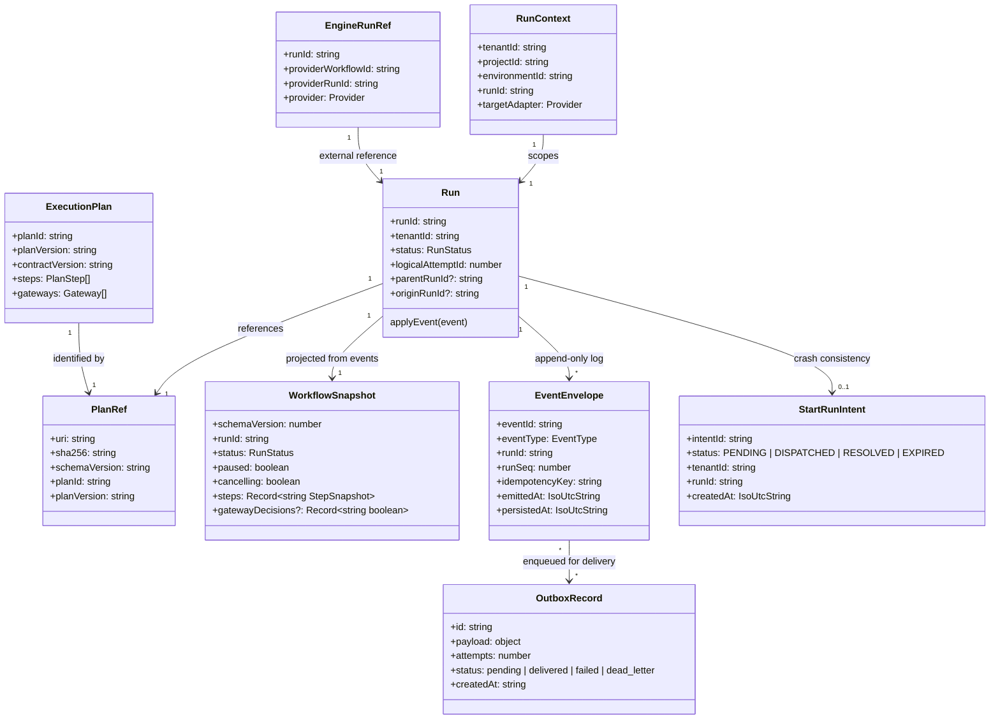

---

## 2. Package Dependency Graph

### Current Design

18 `@dvt/*` packages plus two apps (`api`, `web`). The dependency graph is
intentionally acyclic: leaf packages like `@dvt/contracts` and
`@dvt/observability` sit at the bottom; composition roots (`apps/api`) sit at
the top and wire concrete adapters into engine ports at startup.

The engine enforces import boundaries via ESLint: `@dvt/engine/src/**` must not
import `@dvt/planner`, `@dvt/adapter-temporal`, or any concrete adapter. This
is checked by the `lint:determinism` script.

### Known Problems

- **`apps/api` directly imports `@dvt/adapter-postgres` and
  `@dvt/adapter-temporal`**: This is intentional (composition root wiring), but
  it means the API process is tightly coupled to two specific infrastructure
  implementations at compile time. A provider registry or DI container would
  make this pluggable, but the current direct-import approach is simpler and
  adequate for the single-runtime deployment model.

### Unidentified Design Concerns

- **`@dvt/observability` depends on `@dvt/contracts`**: This creates a circular
  conceptual dependency. Observability is a cross-cutting concern that should
  ideally sit below or beside contracts, not above it. Currently the dependency
  is on type definitions only, but if `@dvt/contracts` ever needs to emit
  telemetry, the relationship would need inversion.
- **`@dvt/crypto` is missing from the graph**: The `lint:determinism` script
  builds `@dvt/crypto` as a prerequisite, but the package does not appear in
  most import paths. Its actual consumer chain should be audited.
- **No package-level build order enforcement beyond `type-check` script**: The
  root `type-check` script manually chains `--filter` calls in a specific order.
  A declarative build topology (e.g., Turborepo pipeline or pnpm workspace
  `dependsOn`) would be more resilient to new packages being added without
  updating the build chain.

Actual `import` relationships between all `@dvt/*` packages and apps.

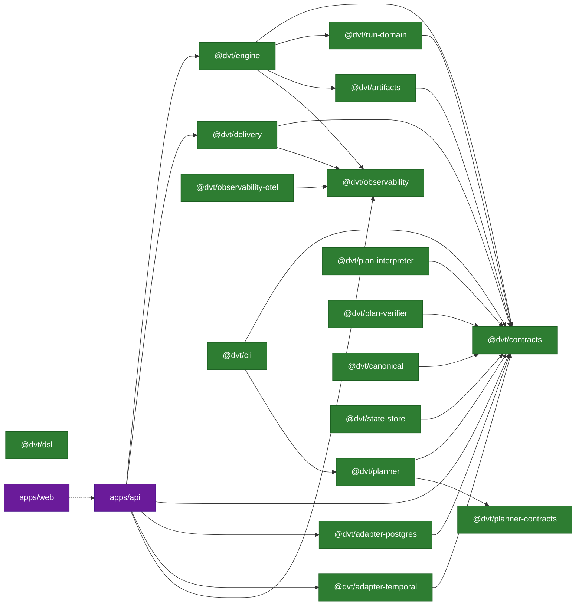

---

## 3. Engine Internal Components

### Current Design

The engine follows a hexagonal (ports-and-adapters) architecture with four
internal layers:

1. **Facade** (`WorkflowEngine`): Public API surface. Normalizes inputs,
   resolves initial context (sets `logicalAttemptId=1`, `originRunId=runId`),
   and delegates to specialized services that are now wired explicitly by the
   composition root.
2. **Application Services**: `StartRunApplicationService` orchestrates the
   happy path (admission → plan integrity → intent → execution) and the failure
   path (`StartRunFailurePolicy`). `StartRunAdmissionGuard` composes validation
   and capability checks.
3. **Core Domain**: `WorkflowEngineCoreService` handles cancel and signal.
   `RunStatusQueryService` owns canonical status reads. `RunEnrichmentService`
   composes canonical status plus provider diagnostics.
   `SignalTransitionGuard` validates signal preconditions against the current
   snapshot. `SnapshotProjector` rebuilds state from events.
4. **Maintenance**: `RunMaintenanceService` orchestrates stuck-run detection
   and orphaned-intent reconciliation. `IntentReconcilerWorker` is a periodic
   scheduler with exponential backoff and jitter.

The **Security Layer** cross-cuts all paths: `RunAccessPolicy` gates tenant
access, `PlanIntegrityValidator` verifies plan bytes via SHA-256 + JCS
canonicalization, and `PlanRefPolicy` enforces URI allowlists.

Temporal runtime internals no longer assume dbt-only step execution. The
runtime now routes task steps through `StepActivityDispatcher`, and
provider-owned capability registries can attach non-dbt execution paths without
editing workflow control flow. The shipped example is the relational PostgreSQL
capability in `@dvt/adapter-postgres`, exercised through separate Temporal
baseline, transformation, and Postgres integration lanes.

Seven **ports** define the declared southbound contract surface. Five are
runtime-wired in the current delivery path. Two remain intentionally exposed as
target-line seams so the architecture keeps them visible while their dedicated
runtime adoption is still in progress. Concrete adapters
(`MockAdapter`, `InMemoryRunStateStore`, `InMemoryStartRunIntentStore`) are
engine-internal test doubles; production adapters live in separate packages.
Blue nodes below therefore represent the declared engine seam, while each node
label carries the current posture (`runtime-wired` or `target-line exposed`).

### Known Problems

- **`WorkflowEngine` facade is still too wide**: It includes normalization,
  recovery preflight, and health checks in a single class. The composition-root
  wiring drift is closed, but the facade still carries more than pure
  delegation.
- **`WorkflowEngineCoreService` still mixes cancel, signal, and telemetry**:
  canonical read now lives in `RunStatusQueryService`, but the remaining
  control path is still broader than the target architecture.
- **`IPlanFetcher` declaration is duplicated**: the dedicated port lives in
  `packages/@dvt/engine/src/adapters/IPlanFetcher.ts`, but a legacy declaration
  still exists in `packages/@dvt/engine/src/ports/IRunStateStore.ts`. The
  architectural seam is conceptually single, but the code anchor is not yet
  normalized.

### Unidentified Design Concerns

- **`StartRunApplicationService` constructs its own collaborators**: The
  constructor builds `StartRunEventFactory`, `StartRunFailurePolicy`, and
  `StartRunExecutionService` internally. This makes it impossible to inject
  test doubles for these collaborators individually, forcing tests to mock at
  the port boundary (state store, intent store) rather than at the
  collaborator boundary. Extracting construction to the facade or a factory
  would improve testability.
- **`coreRuntime.ts` is a utility grab-bag**: It contains `getAdapterOrThrow`,
  `resolveMetaOrThrow`, `withTimeout`, `buildMetricTags`, `buildTraceContext`,
  `normalizeEngineRunRef`, `emitSignalDerivedRunEvent`, and `buildRunEvents`.
  These span adapter resolution, observability, and event construction — three
  different concerns. A refactor into focused modules (`adapterResolution.ts`,
  `observabilityHelpers.ts`, `eventBuilders.ts`) would improve discoverability.
- **No explicit error taxonomy at the facade boundary**: Each internal service
  throws its own error types (`RunNotFoundError`, `AdapterNotRegisteredError`,
  `PlanIntegrityError`, `InvalidStateTransitionError`), but there is no
  facade-level error mapper that guarantees callers receive a stable, documented
  error surface. The API layer must defensively catch a wide variety of engine
  error types.

Detailed decomposition of `@dvt/engine` showing actual classes, services,
ports, and their relationships.

### Declared Southbound Port Surface

| Port                           | Current posture       | Notes                                                           |
| ------------------------------ | --------------------- | --------------------------------------------------------------- |
| `IRunStateStore`               | `runtime-wired`       | Canonical state/event/snapshot seam                             |
| `IStartRunIntentStore`         | `runtime-wired`       | Crash-consistency seam                                          |
| `IProviderAdapter`             | `runtime-wired`       | Provider runtime seam                                           |
| `IPlanFetcher`                 | `runtime-wired`       | Plan/artifact fetch seam                                        |
| `IRunExecutionContextResolver` | `runtime-wired`       | Conditional start-run seam                                      |
| `IProjector`                   | `target-line exposed` | Declared seam; mainline still uses `SnapshotProjector` directly |
| `IMetricsCollector`            | `target-line exposed` | Declared seam; mainline still injects `IObservability`          |

```mermaid
flowchart TB
  classDef impl fill:#2E7D32,color:#fff,stroke:#1B5E20
  classDef port fill:#1565C0,color:#fff,stroke:#0D47A1
  classDef planned fill:#FF9800,color:#fff,stroke:#E65100,stroke-dasharray:5 5
  classDef security fill:#C62828,color:#fff,stroke:#B71C1C

  subgraph Facade["Public API Layer"]
    WE["WorkflowEngine<br/>(facade)"]:::impl
  end

  subgraph Application["Application Services"]
    SRAS["StartRunApplicationService"]:::impl
    SRAG["StartRunAdmissionGuard"]:::impl
    SREP["StartRunExecutionService"]:::impl
    SRFP["StartRunFailurePolicy"]:::impl
    SRVP["StartRunValidationPolicy"]:::impl
    RCAP["RunExecutionContextAdmissionPolicy"]:::impl
  end

  subgraph Core["Core Domain"]
    RSQS["RunStatusQueryService<br/>(canonical status)"]:::impl
    WECS["WorkflowEngineCoreService<br/>(cancel, signal)"]:::impl
    SP["SnapshotProjector"]:::impl
    IKB["IdempotencyKeyBuilder"]:::impl
    STG["SignalTransitionGuard"]:::impl
    CR["coreRuntime<br/>(shared lifecycle utils)"]:::impl
  end

  subgraph Maintenance["Maintenance Services"]
    RMS["RunMaintenanceService"]:::impl
    SSRS["RunMaintenanceStuckRunService"]:::impl
    OIRS["RunMaintenanceOrphanedIntentService"]:::impl
    PIRP["PendingIntentReconciliationPolicy"]:::impl
    DIRP["DispatchedIntentReconciliationPolicy"]:::impl
    IRW["IntentReconcilerWorker<br/>(periodic sweep)"]:::impl
  end

  subgraph Security["Security Layer"]
    RAP["RunAccessPolicy"]:::security
    PIV["PlanIntegrityValidator<br/>(SHA-256 + JCS)"]:::security
    PRP["PlanRefPolicy<br/>(URI allowlist)"]:::security
    HRC["HostRiskClassifier"]:::security
    AUTH["Authorizer<br/>(IRunAccessPolicy)"]:::security
  end

  subgraph Ports["Engine Ports"]
    IRSS["IRunStateStore<br/>(runtime-wired)"]:::port
    ISRIS["IStartRunIntentStore<br/>(runtime-wired)"]:::port
    IPA["IProviderAdapter<br/>(runtime-wired)"]:::port
    IPF["IPlanFetcher<br/>(runtime-wired)"]:::port
    IREC["IRunExecutionContextResolver<br/>(runtime-wired)"]:::port
    IPROJ["IProjector<br/>(target-line exposed)"]:::port
    IMC["IMetricsCollector<br/>(target-line exposed)"]:::port
  end

  subgraph Adapters["Concrete Adapters"]
    MOCK["MockAdapter"]:::impl
    IMSS["InMemoryRunStateStore"]:::impl
    IMIS["InMemoryStartRunIntentStore"]:::impl
    TSTUB["TemporalAdapterStub"]:::impl
    CSTUB["ConductorAdapterStub"]:::planned
  end

  WE --> SRAS
  WE --> RSQS
  WE --> WECS
  WE --> RMS
  SRAS --> SRAG
  SRAS --> SREP
  SRAS --> SRFP
  SRAS --> PIV
  SRAG --> SRVP
  SRAG --> RCAP
  SRAG --> RAP
  SREP --> IPA
  SREP --> IRSS
  SREP --> ISRIS
  SREP --> IKB
  RSQS --> SP
  WECS --> STG
  WECS --> CR
  WECS --> IPA
  WECS --> IRSS
  RMS --> SSRS
  RMS --> OIRS
  OIRS --> PIRP
  OIRS --> DIRP
  IRW --> RMS
  RAP --> AUTH
  RAP --> PRP
  RAP --> HRC
  PIV --> IPF

  MOCK -.-> IPA
  IMSS -.-> IRSS
  IMIS -.-> ISRIS
  TSTUB -.-> IPA
  CSTUB -.-> IPA
```

### Runtime capability dispatch inside the shipped Temporal path

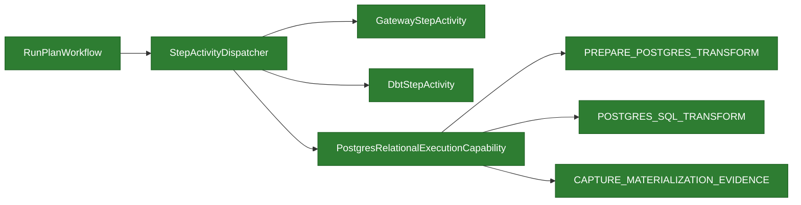

---

## 4. Run State Machine

### Current Design

The run state machine is the authoritative lifecycle model for all DVT runs.
It is implemented as a pure function (`applyRunEvent`) in `@dvt/run-domain`,
shared by engine projection, storage adapters, and snapshot rebuilds. This
guarantees that every consumer of run state sees identical transition rules.

Key design decisions:

- **CANCELLING is a flag, not a state**: `RunCancelRequested` sets
  `snapshot.cancelling = true` but does NOT change `snapshot.status`. The run
  remains in its current status (PENDING, RUNNING, or PAUSED) until the runtime
  execution context emits `RunCancelled`. This is per ADR-0007 and ADR-0047:
  the engine dispatches the cancel command, while the runtime owns the realized
  lifecycle facts `RunCancelRequested` and `RunCancelled`.
- **Terminal states are absorbing**: Once a run reaches COMPLETED, FAILED, or
  CANCELLED, `assertRunNotTerminal` rejects all further events.
- **`RunQueued` is a deliberate no-op**: The event exists for audit trail
  completeness but does not mutate the snapshot because queue admission is
  already represented by the bootstrapped pre-start snapshot.
- **`RunFailed` is reachable from PENDING**: The `detectStuckRuns` maintenance
  path emits `RunFailed` with `{reason: 'QUEUED_TIMEOUT'}` for runs that never
  transitioned to RUNNING.

### Known Problems

- **`CANCELLING` is expressed as substatus, not top-level status**:
  `RunCancelRequested` leaves the base `status` unchanged and sets the
  cancelling flag on the snapshot. `SnapshotProjector.snapshotToStatus()`
  projects that flag as substatus = 'CANCELLING', so callers do see the
  cancellation window, but they must interpret it through `substatus` rather
  than through a dedicated `CANCELLING` status value.

### Unidentified Design Concerns

- **No `PAUSED` → `FAILED` transition**: If a run is paused and the underlying
  infrastructure fails (provider crash, Temporal server outage), there is no
  direct path from PAUSED to FAILED. The stuck-run detector only checks PENDING
  and RUNNING+cancelling runs, not PAUSED runs that have been idle beyond a
  threshold. A long-paused run with a dead provider will not be detected.
- **No `PAUSED` → `CANCELLED` without RESUME**: The `RunCancelRequested`
  transition is allowed from PAUSED (the flag is set), but the adapter must
  still confirm `RunCancelled`. If the adapter is unable to cancel a paused
  workflow (e.g., Temporal workflow is sleeping in a `condition()` with no
  timeout), the run will remain in PAUSED+cancelling indefinitely.
- **Gateway decisions stored on snapshot but not on events**: `StepCompleted`
  events carry `gatewayDecision` in `payload`, but the snapshot projects this
  into `gatewayDecisions` map. If the snapshot is rebuilt from events, gateway
  decisions are recovered. However, if a consumer reads events directly
  (bypassing snapshot), they must parse payload to discover gateway outcomes —
  there is no dedicated event type for gateway resolution.

Derived from `@dvt/run-domain/src/transitionPolicy.ts` and
`applyRunEvent.ts`. Every transition maps to an `EventType`.

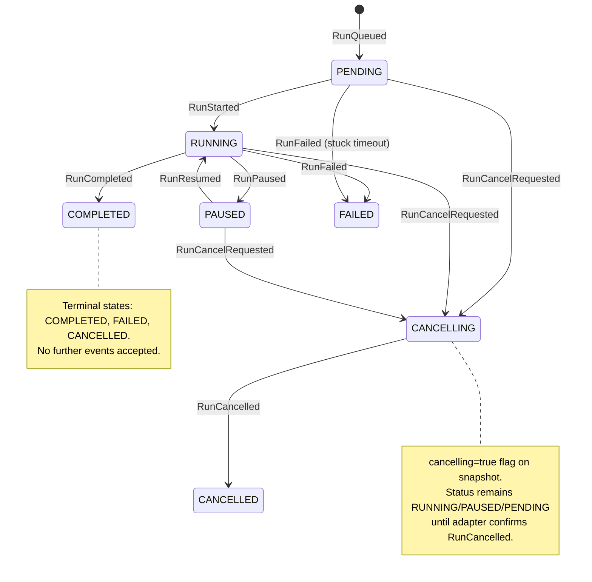

### Step State Machine

**Design note**: FAILED is intentionally NOT terminal for steps. This enables
step-level retries: a failed step can receive `StepStarted` again (the
`StepStarted` allowed-from set is `['PENDING', 'FAILED']`). The `attempts`
counter on the step snapshot is incremented on each `StepStarted`, providing
retry visibility.

**Unidentified concern**: There is no maximum retry limit enforced at the state
machine level. The retry limit is expected to be enforced by the adapter or
the execution policy, but nothing in `transitionPolicy.ts` prevents infinite
`FAILED → RUNNING → FAILED` cycles. A runaway step retry loop would produce
unbounded events in the event log.

Derived from `STEP_EVENT_ALLOWED_FROM` in `transitionPolicy.ts`.

```mermaid
stateDiagram-v2
  [*] --> PENDING: (implicit)
  PENDING --> RUNNING: StepStarted
  RUNNING --> COMPLETED: StepCompleted
  RUNNING --> FAILED: StepFailed
  PENDING --> SKIPPED: StepSkipped
  FAILED --> RUNNING: StepStarted (retry)

  note right of COMPLETED
    Terminal step states: COMPLETED, SKIPPED.
    FAILED is NOT terminal — supports step retries.
  end note
```

---

## 5. Sequence: startRun (Detailed)

### Current Design

`startRun` is the most complex flow in the engine, involving seven collaborators
across three layers. The key architectural challenge is ordering two
non-transactional operations — adapter dispatch and state-store bootstrap — so
that crashes at any point leave the system in a recoverable state.

Two execution paths exist:

1. **`startRunWithEstimatedRef`** (preferred): The adapter supports
   `estimateRunRef()` — it can predict the `providerWorkflowId` before
   dispatch. This allows bootstrapping state (metadata + `RunQueued` +
   `RunStarted`) BEFORE calling `adapter.startRun()`. If the adapter returns a
   different `providerRunId`, the engine calls `saveProviderRef()` to patch
   the metadata.
2. **`startRunWithoutEstimatedRef`** (fallback with compensation): The adapter
   cannot predict its run reference. The engine calls `adapter.startRun()` first,
   then `bootstrapRunTx()`. If bootstrap fails after a successful adapter
   dispatch, the engine calls `adapter.cancelRun()` as compensation.

The **intent log** (ADR-0030) provides crash consistency: a `StartRunIntent` is
created (PENDING) before dispatch. If the process crashes mid-flow, the
`IntentReconcilerWorker` will discover the orphaned intent and either cancel
the provider-side run or mark it expired.

### Known Problems

- **Intent log `markDispatched`/`markResolved` ordering**: After successful
  execution, the intent transitions PENDING → DISPATCHED → RESOLVED in a
  fire-and-forget style. If the process crashes between `markDispatched` and
  `markResolved`, the reconciler will find a DISPATCHED intent and must fall
  back to checking run metadata existence — which it does correctly.
- **`saveProviderRef` is optional and fail-soft**: If the state store does not
  implement `saveProviderRef?`, the metadata retains the estimated reference
  even if the adapter returned a different one. This is documented as acceptable
  for Temporal (where the estimated reference is deterministic), but would cause
  data inconsistency for a future adapter with non-deterministic run IDs.

### Unidentified Design Concerns

- **No idempotency on `adapter.startRun()` itself**: If the engine successfully
  dispatches to the adapter but the response is lost (network timeout), the
  retry will call `adapter.startRun()` again. Temporal handles this via
  workflow-ID-based deduplication, but this is an adapter implementation detail
  not enforced by the engine contract. A future adapter without built-in
  deduplication would create duplicate provider-side runs.
- **Plan fetch + validation is synchronous and unbounded**: The
  `PlanIntegrityValidator.fetchAndValidate()` call fetches plan bytes, computes
  SHA-256, parses JSON, validates metadata, and recomputes `planId` via JCS
  canonicalization. There is no timeout or size limit on the fetch. A
  maliciously large plan artifact could exhaust memory before any validation
  runs.
- **Admission guard and execution service receive the same adapter instance**:
  The admission guard checks `adapter.capabilities()` and the execution service
  calls `adapter.startRun()`, but both receive the adapter from the same map
  lookup. If the adapter's capabilities change between admission and execution
  (e.g., Temporal cluster goes down), the admission check is stale. This
  window is small but exists.

Traces actual method calls through the engine classes. Two paths exist:
`startRunWithEstimatedRef` (bootstrap before adapter) and
`startRunWithoutEstimatedRef` (adapter before bootstrap, with compensation).

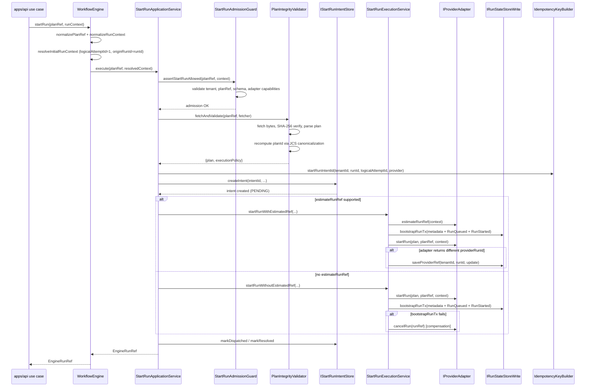

---

## 6. Sequence: Signal and Cancel

### Current Design

Signals (PAUSE, RESUME, CANCEL) flow through `WorkflowEngineCoreService`,
which implements a three-phase pattern:

1. **Guard**: Validate the signal is allowed given current run state.
2. **Forward**: Send the signal to the provider adapter.
3. **Emit**: Persist a signal-derived run event to the state store.

The `SignalTransitionGuard` is the most nuanced component here. It uses a
multi-strategy approach depending on signal type and snapshot freshness:

- **PAUSE**: Can be validated from snapshot alone (`isAlreadyAppliedFromSnapshot`
  checks `status === 'PAUSED' || paused`).
- **RESUME**: Requires event history scan because the snapshot might show
  `RUNNING` (after resume) but the engine needs to know whether a resume event
  was already emitted (`requiresEventHistoryForFreshSnapshot` returns true when
  `status === 'RUNNING' && !paused`).
- **Staleness detection**: If the state store implements
  `IRunSnapshotStalenessQuery.isSnapshotStale()`, the guard checks whether the
  snapshot is behind the event log and falls back to full replay if stale.

Cancel no longer follows an engine-emits-intent path in the current
implementation. The engine validates and dispatches the cancel command, while
the runtime workflow owns the ordered cancellation lifecycle that reaches the
event log.

### Known Problems

- **Bug E-02: Asymmetric idempotency checking in `SignalTransitionGuard`**:
  PAUSE uses snapshot-only checking when the snapshot is fresh, but RESUME
  always requires event history. This means PAUSE idempotency can give a false
  negative if the snapshot was written before the PAUSE event was committed
  (race window). In the worst case, a duplicate PAUSE signal could be forwarded
  to the adapter.
- **Truth drift after `T-01` closure**: the provider-native Temporal cancel
  path is now implemented, but older ADR and contract surfaces still disagree
  on whether `RunCancelRequested` is engine-owned request intent or
  runtime-owned cancellation lifecycle.

Current correction under `AR-C6`:

- `cancelRun()` uses `WorkflowHandle.cancel()`
- `signal(CANCEL)` remains the cooperative reason-carrying path
- the workflow catches native cancellation and emits ordered cancellation
  lifecycle from workflow context instead of treating `cancelRun()` as a signal
  alias

Follow-on contract-pack reset under `AR-A12-A`:

- align `ADR-0007`, `RunEvents`, and `IProviderAdapter` with the runtime-owned
  cancellation lifecycle already accepted elsewhere

### Unidentified Design Concerns

- **Signal-derived event emission is fire-and-forget**: After
  `adapter.signal()` succeeds, the engine calls
  `emitSignalDerivedRunEvent()` which calls `appendAndEnqueueTx()`. If this
  persistence fails, the signal was forwarded to the adapter but no event was
  recorded. The adapter-side state and engine-side state diverge. There is no
  compensation or retry for this failure mode.
- **No signal deduplication at the engine boundary**: The
  `SignalTransitionGuard` checks whether the signal effect is already applied
  (idempotency), but it does not check whether an identical signal request
  (same `signalId`) was already processed. Two distinct signal requests with
  different `signalId` values but the same `type: 'PAUSE'` will both pass the
  guard if the first hasn't been committed yet (race). The idempotency key
  for signal events includes `signalId`, so the state store will dedup at
  commit time, but the adapter will receive the duplicate signal.
- **`getAdapterOrThrow` uses the provider from RunMetadata, not from the
  signal request**: This is correct (the adapter is determined at run creation
  time), but if the adapter map changes at runtime (hot reload of adapter
  configuration), in-flight signals for previously created runs could fail with
  `AdapterNotRegisteredError` even though the adapter was available when the
  run was created.

Traces `WorkflowEngineCoreService.signal()` and `cancelRun()` flows.

### Signal Flow

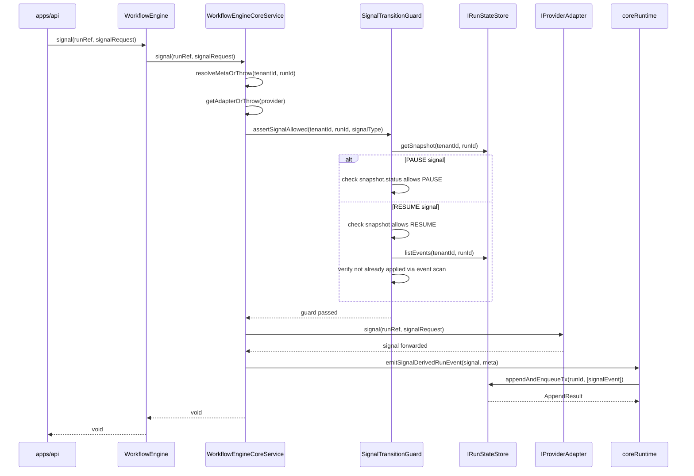

### Cancel Flow

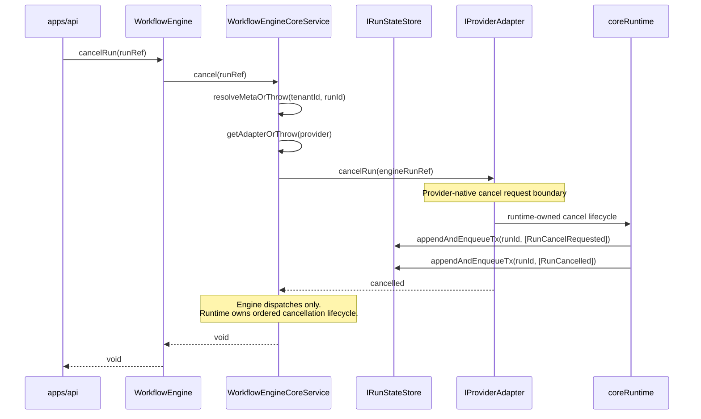

---

## 7. Sequence: Intent Reconciliation

### Current Design

Intent reconciliation is the crash-recovery subsystem introduced by ADR-0030.
It runs as a background worker (`IntentReconcilerWorker`) that periodically
sweeps for orphaned intents and stuck runs.

The system operates on two independent axes:

1. **Orphaned Intent Sweep** (`RunMaintenanceOrphanedIntentService`): Finds
   intents stuck in PENDING or DISPATCHED beyond a configurable threshold.
   Two policies handle each status:
   - `PendingIntentReconciliationPolicy`: The intent was created but never
     dispatched. Checks if run metadata exists → if so, looks up the adapter
     → cancels or expires.
   - `DispatchedIntentReconciliationPolicy`: The intent was dispatched but
     never resolved. Checks if run metadata exists → if so, marks resolved
     (the run succeeded). If no metadata, attempts adapter cancel.

2. **Stuck Run Detection** (`RunMaintenanceStuckRunService`):
   - `detectStuckRuns`: PENDING runs past a time threshold → emits `RunFailed`
     with `{reason: 'QUEUED_TIMEOUT'}`.
   - `detectStuckCancellingRuns`: RUNNING runs with `cancelling=true` past a
     threshold → emits `RunFailed` with `{reason: 'CANCEL_TIMEOUT'}`.

The worker uses exponential backoff with jitter to avoid thundering herd on
recovery. Infra errors (adapter unavailable) trigger backoff increase; business
outcomes (expired, resolved) reset backoff.

### Known Problems

- **Bug E-01: `DispatchedIntentReconciliationPolicy` returns wrong outcome
  key**: When run metadata exists and the intent is resolved, the code correctly
  calls `markResolved()` but the earlier version returned
  `{ cancelled: intentId }` instead of `{ resolved: intentId }`. This was
  fixed in a later iteration, but the current code at line 42 returns
  `{ resolved: intentId }` — verify against current source.
- **Stuck-run detection does not check PAUSED runs**: A run paused for longer
  than any reasonable threshold will never be detected as stuck. If the
  provider underneath crashed while the run was paused, the run will remain
  in PAUSED state indefinitely.

### Unidentified Design Concerns

- **No concurrency control on reconciliation**: If two
  `IntentReconcilerWorker` instances run in parallel (e.g., two API process
  replicas), both will discover the same orphaned intents and attempt to
  reconcile them simultaneously. The intent store's `markResolved` /
  `markExpired` calls are not guarded by optimistic locking or advisory locks.
  In the PostgreSQL implementation, this may result in benign duplicate
  updates, but in-memory stores could produce race conditions in tests.
- **`getRunMetadata` failure is swallowed as `null`**: Both reconciliation
  policies catch state-store errors and treat them as "metadata not found"
  (`.catch(() => null)` at `DispatchedIntentReconciliationPolicy:98`). This
  means a transient database error will cause the policy to incorrectly
  conclude that the run was never bootstrapped and attempt cancellation or
  expiry on a run that actually exists.
- **No upper bound on orphaned intent list size**: `listOrphaned(threshold)`
  returns all intents past the threshold with no pagination. In a degraded
  system with hundreds of orphaned intents, a single reconciliation tick
  could take very long and hold adapter connections.
- **Worker shutdown is not graceful**: `IntentReconcilerWorker` has a `stop()`
  method, but if `reconcileAll()` is mid-flight when `stop()` is called,
  the in-progress work is not awaited. Partial reconciliation (some intents
  processed, others not) is harmless but wasteful.

Traces `IntentReconcilerWorker` and `RunMaintenanceService` flows.

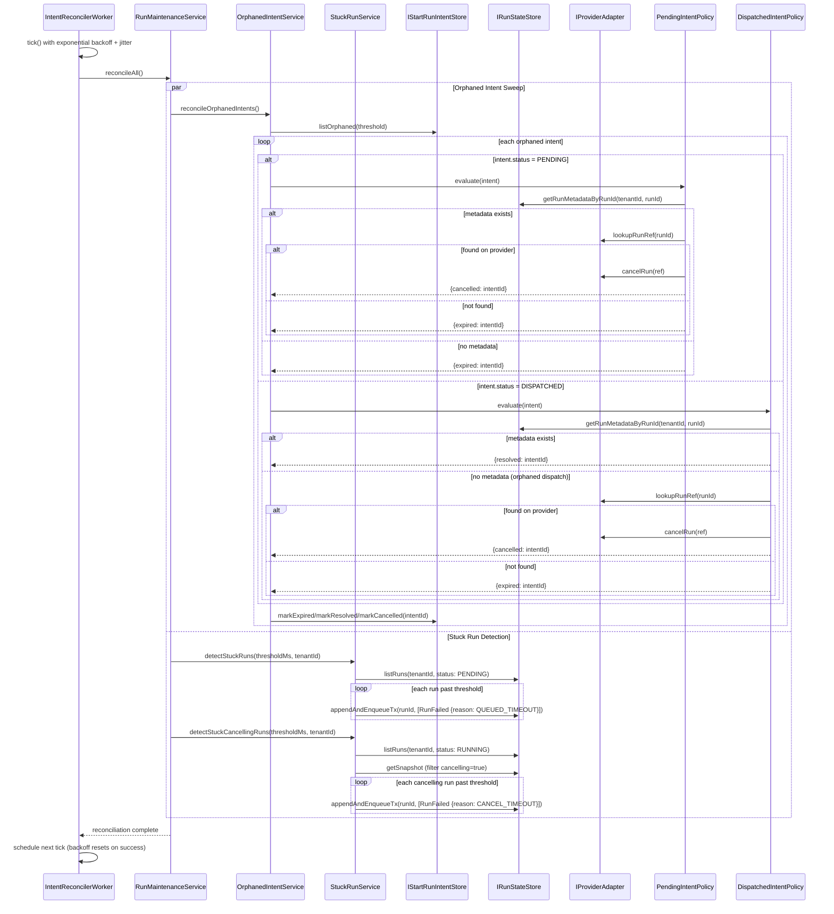

---

## 8. Sequence: Outbox Delivery

### Current Design

The outbox pattern guarantees at-least-once delivery of run lifecycle events
to external consumers (event bus, Kafka, etc.). The `OutboxWorker` implements
a claim-process-deliver loop:

1. **Claim**: `listPendingForClaim()` returns unclaimed outbox records up to
   `batchSize`. Records are filtered against a `seenRecordIds` set to avoid
   reprocessing within the same tick.
2. **Process**: Each record is published individually via `IEventBus.publish()`,
   then marked as delivered. If publishing fails, the record is marked as
   failed with the error message.
3. **Dead letter**: After `MAX_OUTBOX_ATTEMPTS` failures, the record
   disposition changes from `retry` to `dead_letter`.
4. **Backlog detection**: After processing, `hasPendingRetries()` is checked
   to signal whether the next tick should run sooner.

The worker supports configurable `stopOnError` behavior: when enabled, a single
publish failure aborts the entire tick and throws `OutboxWorkerTickError`.

Observer hooks (`onBatchClaimed`, `onRecordDelivered`, `onRecordFailed`) are
called via `safelyObserve()` which swallows observer errors to prevent
telemetry failures from breaking delivery.

### Known Problems

- **Bug DL-01: Sequential record processing**: `processBatch()` at line 117
  iterates records with `for...of` and `await`s each publish individually.
  For a batch of 100 records, this means 100 sequential network round-trips.
  Parallelizing with `Promise.allSettled()` or a concurrency pool would
  significantly improve throughput. The sequential approach was likely chosen
  for simplicity and ordering guarantees, but outbox records are already
  independently identifiable — ordering is provided by `runSeq` at the
  consumer side, not by publish order.

### Unidentified Design Concerns

- **No publish timeout**: `bus.publish([record.payload])` has no timeout. A
  slow or hung event bus connection will block the entire tick indefinitely.
  The `OutboxWorkerRuntime` scheduler will not schedule the next tick until
  the current one completes, so a single slow publish blocks all delivery.
- **`markDelivered` after `publish` is not atomic**: If the process crashes
  after `bus.publish()` succeeds but before `storage.markDelivered()` commits,
  the record will be re-delivered on the next tick. This is acceptable for
  at-least-once semantics, but consumers must be idempotent. This is by design
  but not documented as a contract requirement for `IEventBus` consumers.
- **`claimSelection` is evaluated once per tick**: The `resolveClaimSelection`
  function is called at tick start and the result is reused for all batches
  within the tick. If the selection criteria should change mid-tick (e.g.,
  based on backpressure feedback), the stale selection will be used for the
  entire tick duration.
- **No claim lock between workers**: Multiple `OutboxWorker` instances
  processing the same outbox table will claim overlapping records unless the
  storage implementation provides row-level locking via
  `listPendingForClaim`. The in-memory implementation has no locking, and the
  PostgreSQL implementation should use `SELECT FOR UPDATE SKIP LOCKED` — but
  this is an implementation detail not enforced by the `IOutboxStorage`
  contract.
- **Observer error swallowing hides instrumentation bugs**: `safelyObserve()`
  silently catches all observer errors with an empty `catch {}`. A broken
  metrics exporter or logging pipeline will produce no diagnostic signal.
  At minimum, the catch should increment a `telemetry_error` counter or write
  to `stderr`.

Traces `@dvt/delivery` `OutboxWorker.tick()` flow.

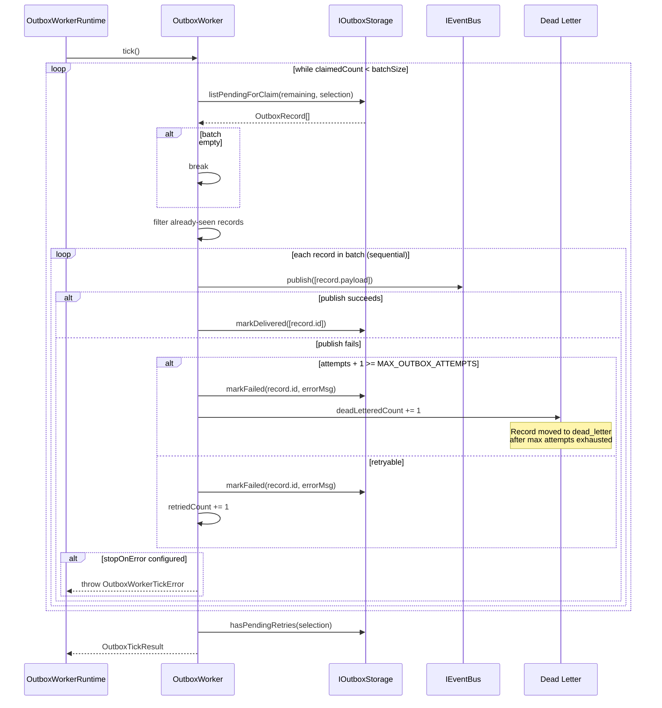

---

## 9. Desired Architecture Delta

### Current Design

This section consolidates all gaps between current implementation and target
architecture, gathered from the section analyses above.

### Consolidated Problem Inventory

**Identified bugs (from audit)**:

| ID    | Component                            | Summary                                                       | Severity |
| ----- | ------------------------------------ | ------------------------------------------------------------- | -------- |
| E-01  | DispatchedIntentReconciliationPolicy | Wrong outcome key in early revision                           | Medium   |
| E-02  | SignalTransitionGuard                | Asymmetric PAUSE/RESUME idempotency                           | Medium   |
| E-04  | Engine ports                         | `IPlanFetcher` declaration duplicated across two code anchors | Low      |
| T-01  | TemporalAdapter.cancelRun            | Uses signal instead of handle.cancel()                        | High     |
| DL-01 | OutboxWorker.processBatch            | Sequential record processing                                  | Medium   |

**Design improvement opportunities (not previously identified):**

- `@dvt/contracts`: Zod runtime bundled with types; leaf packages carry
  unnecessary weight. Impact: build size and compile speed.
- `@dvt/delivery`: Three workers in one package with a coupled release cycle.
  Impact: operational flexibility.
- Engine facade: No facade-level error mapper; callers must handle a wide error
  taxonomy. Impact: API stability.
- `coreRuntime.ts`: Utility grab-bag spanning adapter, observability, and event
  concerns. Impact: discoverability.
- `StartRunApplicationService`: Constructs its own collaborators and lacks an
  injection seam for tests. Impact: testability.
- Signal flow: Signal-derived event emission is fire-and-forget after adapter
  success. Impact: data consistency.
- Reconciler: No concurrency control; `getRunMetadata` errors are swallowed as
  null. Impact: correctness under load.
- Outbox: No publish timeout, no claim lock in contract, and observer errors
  are swallowed. Impact: reliability.
- State machine: No PAUSED stuck-run detection and no `PAUSED -> FAILED`
  transition. Impact: operational coverage.
- Plan fetch: No size limit or timeout on plan byte fetch. Impact: security and
  availability.
  What is **planned or desired** but not yet implemented (orange elements from
  above diagrams), consolidated here.

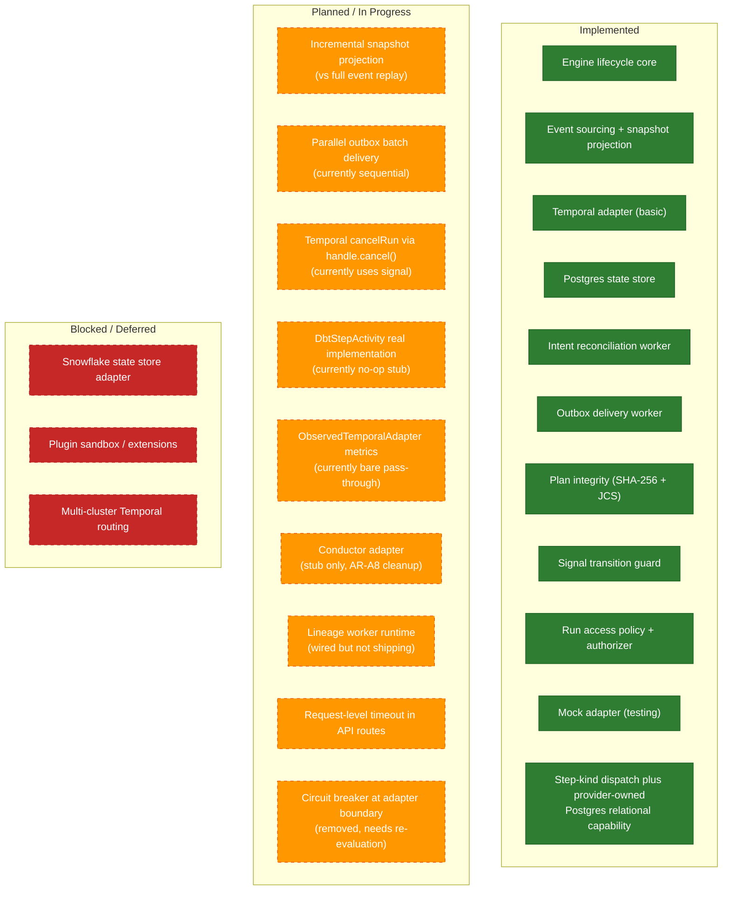

---

## Code Anchors

| Diagram               | Primary source files                                                                                            |
| --------------------- | --------------------------------------------------------------------------------------------------------------- |
| Domain model          | `packages/@dvt/*/package.json`, `contracts/src/types/contracts.ts`                                              |
| Package dependencies  | `packages/@dvt/*/package.json` dependency fields                                                                |
| Engine components     | `WorkflowEngine.ts`, `StartRunApplicationService.ts`, `WorkflowEngineCoreService.ts`, `RunEnrichmentService.ts` |
| Run state machine     | `@dvt/run-domain/src/transitionPolicy.ts`, `applyRunEvent.ts`                                                   |
| Step state machine    | `@dvt/run-domain/src/transitionPolicy.ts`                                                                       |
| startRun sequence     | `StartRunApplicationService.ts`, `StartRunExecutionService.ts`, `PlanIntegrityValidator.ts`                     |
| Signal/cancel         | `WorkflowEngineCoreService.ts`, `SignalTransitionGuard.ts`, `coreRuntime.ts`                                    |
| Intent reconciliation | `IntentReconcilerWorker.ts`, `RunMaintenanceService.ts`, `*IntentReconciliationPolicy.ts`                       |
| Outbox delivery       | `@dvt/delivery/src/application/OutboxWorker.ts`                                                                 |

## Related Pages

- [C4 Engine Architecture](../components/engine/architecture/c4-engine.md)
- [WorkflowEngine Subsystem Context](../components/engine/architecture/workflow-engine-subsystem-context.md)
- [Domain Map](../domain-map.md)
- [Execution Domain](../domain-execution.md)
- [System Delivery Status](../system-delivery-status.md)
