# Maintenance And Reconciliation

Maintenance worker and reconciliation flow diagrams extracted from the main
implementation architecture pack.

## Current Design

Intent reconciliation is the crash-recovery subsystem introduced by ADR-0030.
It runs as a background worker (`IntentReconcilerWorker`) that periodically
sweeps for orphaned intents and stuck runs.

The system operates on two independent axes:

1. **Orphaned Intent Sweep** (`RunMaintenanceOrphanedIntentService`): Finds
   intents stuck in PENDING or DISPATCHED beyond a configurable threshold.
   Two policies handle each status:
   - `PendingIntentReconciliationPolicy`: The intent was created but never
     dispatched. Checks run metadata, then uses provider lookup when supported
     to decide whether the intent should be expired immediately, cancelled and
     then expired, or deferred for a later sweep.
   - `DispatchedIntentReconciliationPolicy`: The intent was dispatched but
     never resolved. Checks if run metadata exists -> if so, marks resolved
     (the run succeeded). If no metadata, it cancels via the persisted
     `engineRunRef` when available, then marks the intent resolved; otherwise it
     reports `cancelFailed`.

2. **Stuck Run Detection** (`RunMaintenanceStuckRunService`):
   - `detectStuckRuns`: PENDING runs past a time threshold -> emits `RunFailed`
     with `{reason: 'QUEUED_TIMEOUT'}`.
   - `detectStuckCancellingRuns`: RUNNING runs with `cancelling=true` past a
     threshold -> emits `RunFailed` with `{reason: 'CANCEL_TIMEOUT'}`.

The worker uses exponential backoff with jitter to avoid thundering herd on
recovery. Infra errors (adapter unavailable) trigger backoff increase; business
outcomes (expired, resolved) reset backoff.

## Known Problems

- **Stuck-run detection does not check PAUSED runs**: A run paused for longer
  than any reasonable threshold will never be detected as stuck. If the
  provider underneath crashed while the run was paused, the run will remain
  in PAUSED state indefinitely.

## Unidentified Design Concerns

- **No concurrency control on reconciliation**: If two
  `IntentReconcilerWorker` instances run in parallel (e.g., two API process
  replicas), both will discover the same orphaned intents and attempt to
  reconcile them simultaneously. The intent store's `markResolved` /
  `markExpired` calls are not guarded by optimistic locking or advisory locks.
  In the PostgreSQL implementation, this may result in benign duplicate
  updates, but in-memory stores could produce race conditions in tests.
- **`getRunMetadata` failure is swallowed as `null`**: Both reconciliation
  policies catch state-store errors and treat them as "metadata not found"
  via a local `.catch(() => null)` fallback in the reconciliation policies.
  This means a transient database error will cause the policy to incorrectly
  conclude that the run was never bootstrapped and attempt cancellation or
  expiry on a run that actually exists.
- **No upper bound on orphaned intent list size**: `listOrphaned(threshold)`
  returns all intents past the threshold with no pagination. In a degraded
  system with hundreds of orphaned intents, a single reconciliation tick
  could take very long and hold adapter connections.
- **Worker shutdown is not graceful**: `IntentReconcilerWorker` has a `stop()`
  method, but if `reconcileAll()` is mid-flight when `stop()` is called,
  the in-progress work is not awaited. Partial reconciliation (some intents
  processed, others not) is harmless but wasteful.

Traces `IntentReconcilerWorker` and `RunMaintenanceService` flows.

```mermaid
sequenceDiagram
  participant Timer as IntentReconcilerWorker
  participant RMS as RunMaintenanceService
  participant OIRS as OrphanedIntentService
  participant SSRS as StuckRunService
  participant Intent as IStartRunIntentStore
  participant Store as IRunStateStore
  participant Adapter as IProviderAdapter
  participant PIRP as PendingIntentPolicy
  participant DIRP as DispatchedIntentPolicy

  Timer->>Timer: tick() with exponential backoff + jitter
  Timer->>RMS: reconcileAll()

  par Orphaned Intent Sweep
    RMS->>OIRS: reconcileOrphanedIntents()
    OIRS->>Intent: listOrphaned(threshold)

    loop each orphaned intent
      alt intent.status = PENDING
        OIRS->>PIRP: evaluate(intent)
        PIRP->>Store: getRunMetadataByRunId(tenantId, runId)
        alt metadata exists
          PIRP->>Adapter: lookupRunRef(runId)
          alt found on provider
            PIRP->>Adapter: cancelRun(ref)
            PIRP-->>OIRS: {cancelled: intentId}
          else not found
            PIRP-->>OIRS: {expired: intentId}
          end
        else no metadata
          PIRP-->>OIRS: {expired: intentId}
        end
      else intent.status = DISPATCHED
        OIRS->>DIRP: evaluate(intent)
        DIRP->>Store: getRunMetadataByRunId(tenantId, runId)
        alt metadata exists
          DIRP->>Intent: markResolved(intentId)
          DIRP-->>OIRS: {resolved: intentId}
        else no metadata (orphaned dispatch)
          alt adapter + engineRunRef available
            DIRP->>Adapter: cancelRun(engineRunRef)
            DIRP->>Intent: markResolved(intentId)
            DIRP-->>OIRS: {cancelled: intentId}
          else adapter missing or engineRunRef missing
            DIRP-->>OIRS: {cancelFailed: intentId}
          end
        end
      end
    end

  and Stuck Run Detection
    RMS->>SSRS: detectStuckRuns(thresholdMs, tenantId)
    SSRS->>Store: listRuns(tenantId, status: PENDING)
    loop each run past threshold
      SSRS->>Store: appendAndEnqueueTx(runId, [RunFailed {reason: QUEUED_TIMEOUT}])
    end

    RMS->>SSRS: detectStuckCancellingRuns(thresholdMs, tenantId)
    SSRS->>Store: listRuns(tenantId, status: RUNNING)
    SSRS->>Store: getSnapshot (filter cancelling=true)
    loop each cancelling run past threshold
      SSRS->>Store: appendAndEnqueueTx(runId, [RunFailed {reason: CANCEL_TIMEOUT}])
    end
  end

  RMS-->>Timer: reconciliation complete
  Timer->>Timer: schedule next tick (backoff resets on success)
```

---
