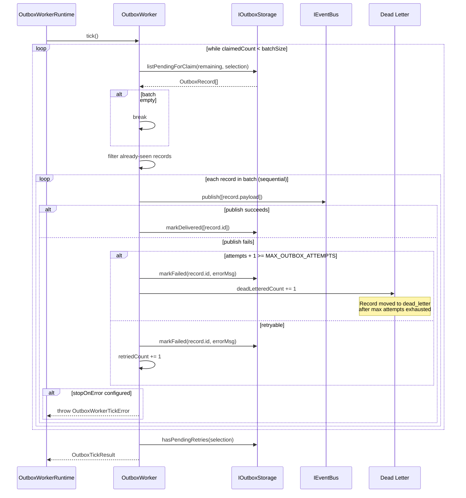

# Outbox Delivery Architecture

Outbox worker flow, risks, and architecture notes extracted from the main
implementation architecture pack.

## Current Design

The outbox pattern guarantees at-least-once delivery of run lifecycle events
to external consumers (event bus, Kafka, etc.). The `OutboxWorker` implements
a claim-process-deliver loop:

1. **Claim**: `listPendingForClaim()` returns unclaimed outbox records up to
   `batchSize`. Records are filtered against a `seenRecordIds` set to avoid
   reprocessing within the same tick.
2. **Process**: Each record is published individually via `IEventBus.publish()`,
   then marked as delivered. If publishing fails, the record is marked as
   failed with the error message.
3. **Dead letter**: After `MAX_OUTBOX_ATTEMPTS` failures, the record
   disposition changes from `retry` to `dead_letter`.
4. **Backlog detection**: After processing, `hasPendingRetries()` is checked
   to signal whether the next tick should run sooner.

The worker supports configurable `stopOnError` behavior: when enabled, a single
publish failure aborts the entire tick and throws `OutboxWorkerTickError`.

Observer hooks (`onBatchClaimed`, `onRecordDelivered`, `onRecordFailed`) are
called via `safelyObserve()` which swallows observer errors to prevent
telemetry failures from breaking delivery.

## Known Problems

- **Bug DL-01: Sequential record processing**: `processBatch()` at line 117
  iterates records with `for...of` and `await`s each publish individually.
  For a batch of 100 records, this means 100 sequential network round-trips.
  Parallelizing with `Promise.allSettled()` or a concurrency pool would
  significantly improve throughput. The sequential approach was likely chosen
  for simplicity and ordering guarantees, but outbox records are already
  independently identifiable - ordering is provided by `runSeq` at the
  consumer side, not by publish order.

## Unidentified Design Concerns

- **No publish timeout**: `bus.publish([record.payload])` has no timeout. A
  slow or hung event bus connection will block the entire tick indefinitely.
  The `OutboxWorkerRuntime` scheduler will not schedule the next tick until
  the current one completes, so a single slow publish blocks all delivery.
- **`markDelivered` after `publish` is not atomic**: If the process crashes
  after `bus.publish()` succeeds but before `storage.markDelivered()` commits,
  the record will be re-delivered on the next tick. This is acceptable for
  at-least-once semantics, but consumers must be idempotent. This is by design
  but not documented as a contract requirement for `IEventBus` consumers.
- **`claimSelection` is evaluated once per tick**: The `resolveClaimSelection`
  function is called at tick start and the result is reused for all batches
  within the tick. If the selection criteria should change mid-tick (e.g.,
  based on backpressure feedback), the stale selection will be used for the
  entire tick duration.
- **No claim lock between workers**: Multiple `OutboxWorker` instances
  processing the same outbox table will claim overlapping records unless the
  storage implementation provides row-level locking via
  `listPendingForClaim`. The in-memory implementation has no locking, and the
  PostgreSQL implementation should use `SELECT FOR UPDATE SKIP LOCKED` - but
  this is an implementation detail not enforced by the `IOutboxStorage`
  contract.
- **Observer error swallowing hides instrumentation bugs**: `safelyObserve()`
  silently catches all observer errors with an empty `catch {}`. A broken
  metrics exporter or logging pipeline will produce no diagnostic signal.
  At minimum, the catch should increment a `telemetry_error` counter or write
  to `stderr`.

Traces `@dvt/delivery` `OutboxWorker.tick()` flow.

---
