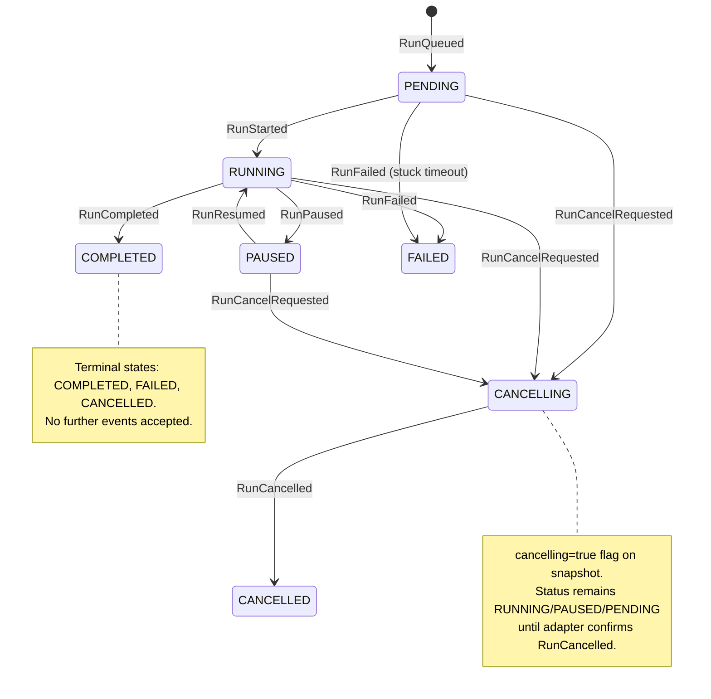
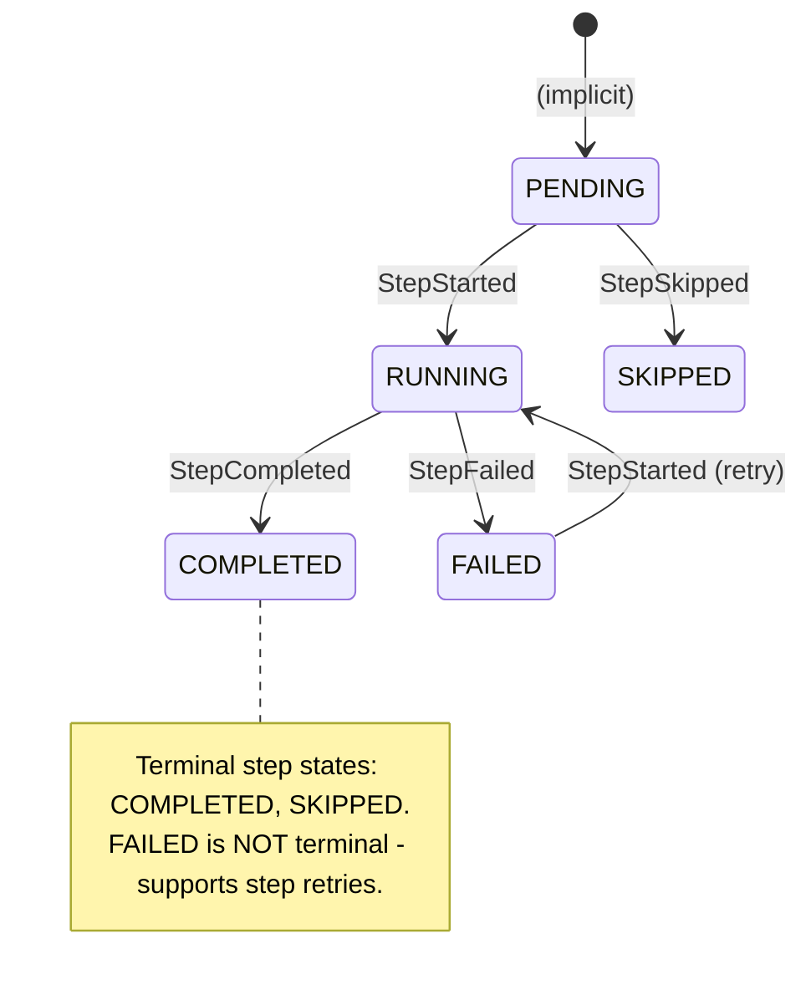

# Run State Machines

Engine and run-domain state-machine diagrams extracted from the implementation
architecture pack.

## Current Design

The run state machine is the authoritative lifecycle model for all DVT runs.
It is implemented as a pure function (`applyRunEvent`) in `@dvt/run-domain`,
shared by engine projection, storage adapters, and snapshot rebuilds. This
guarantees that every consumer of run state sees identical transition rules.

Key design decisions:

- **CANCELLING is a flag, not a state**: `RunCancelRequested` sets
  `snapshot.cancelling = true` but does NOT change `snapshot.status`. The run
  remains in its current status (PENDING, RUNNING, or PAUSED) until the runtime
  execution context emits `RunCancelled`. This is per ADR-0007 and ADR-0047:
  the engine dispatches the cancel command, while the runtime owns the realized
  lifecycle facts `RunCancelRequested` and `RunCancelled`.
- **Terminal states are absorbing**: Once a run reaches COMPLETED, FAILED, or
  CANCELLED, `assertRunNotTerminal` rejects all further events.
- **`RunQueued` is a deliberate no-op**: The event exists for audit trail
  completeness but does not mutate the snapshot because queue admission is
  already represented by the bootstrapped pre-start snapshot.
- **`RunFailed` is reachable from PENDING**: The `detectStuckRuns` maintenance
  path emits `RunFailed` with `{reason: 'QUEUED_TIMEOUT'}` for runs that never
  transitioned to RUNNING.

## Known Problems

- **`CANCELLING` is expressed as substatus, not top-level status**:
  `RunCancelRequested` leaves the base `status` unchanged and sets the
  cancelling flag on the snapshot. `SnapshotProjector.snapshotToStatus()`
  projects that flag as substatus = 'CANCELLING', so callers do see the
  cancellation window, but they must interpret it through `substatus` rather
  than through a dedicated `CANCELLING` status value.

## Unidentified Design Concerns

- **No `PAUSED` -> `FAILED` transition**: If a run is paused and the underlying
  infrastructure fails (provider crash, Temporal server outage), there is no
  direct path from PAUSED to FAILED. The stuck-run detector only checks PENDING
  and RUNNING+cancelling runs, not PAUSED runs that have been idle beyond a
  threshold. A long-paused run with a dead provider will not be detected.
- **No `PAUSED` -> `CANCELLED` without RESUME**: The `RunCancelRequested`
  transition is allowed from PAUSED (the flag is set), but the adapter must
  still confirm `RunCancelled`. If the adapter is unable to cancel a paused
  workflow (e.g., Temporal workflow is sleeping in a `condition()` with no
  timeout), the run will remain in PAUSED+cancelling indefinitely.
- **Gateway decisions stored on snapshot but not on events**: `StepCompleted`
  events carry `gatewayDecision` in `payload`, but the snapshot projects this
  into `gatewayDecisions` map. If the snapshot is rebuilt from events, gateway
  decisions are recovered. However, if a consumer reads events directly
  (bypassing snapshot), they must parse payload to discover gateway outcomes -
  there is no dedicated event type for gateway resolution.

Derived from `@dvt/run-domain/src/transitionPolicy.ts` and
`applyRunEvent.ts`. Every transition maps to an `EventType`.

## Step State Machine

**Design note**: FAILED is intentionally NOT terminal for steps. This enables
step-level retries: a failed step can receive `StepStarted` again (the
`StepStarted` allowed-from set is `['PENDING', 'FAILED']`). The `attempts`
counter on the step snapshot is incremented on each `StepStarted`, providing
retry visibility.

**Unidentified concern**: There is no maximum retry limit enforced at the state
machine level. The retry limit is expected to be enforced by the adapter or
the execution policy, but nothing in `transitionPolicy.ts` prevents infinite
`FAILED -> RUNNING -> FAILED` cycles. A runaway step retry loop would produce
unbounded events in the event log.

Derived from `STEP_EVENT_ALLOWED_FROM` in `transitionPolicy.ts`.

---
