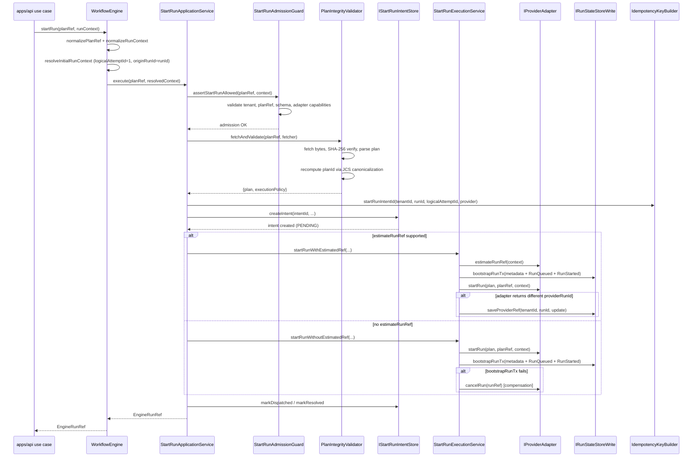
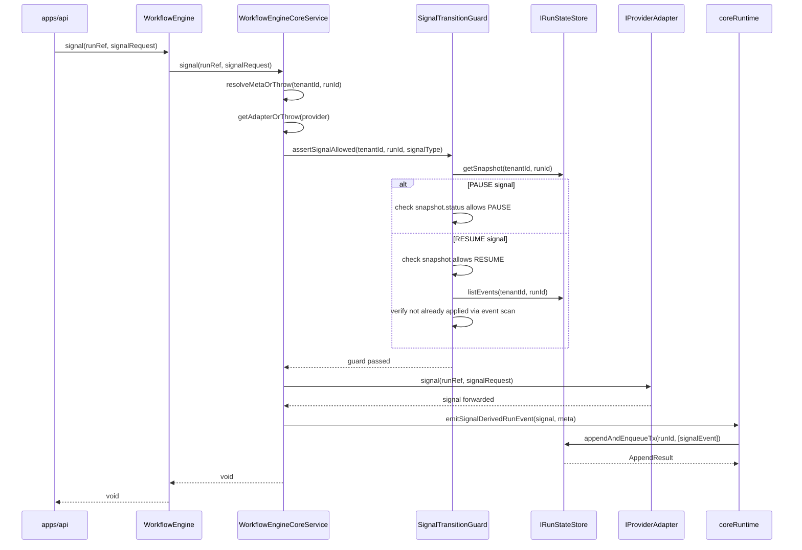
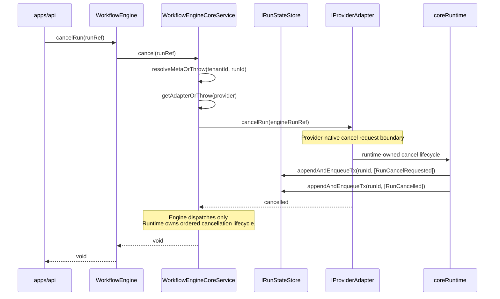

# Start-run Sequences

This pack covers the shipped start-run path plus the related signal and cancel
sequences that share the same engine/control boundary.

## Sequence: startRun (Detailed)

### Current Design

`startRun` is the most complex flow in the engine, involving seven collaborators
across three layers. The key architectural challenge is ordering two
non-transactional operations - adapter dispatch and state-store bootstrap - so
that crashes at any point leave the system in a recoverable state.

Two execution paths exist:

1. **`startRunWithEstimatedRef`** (preferred): The adapter supports
   `estimateRunRef()` - it can predict the `providerWorkflowId` before
   dispatch. This allows bootstrapping state (metadata + `RunQueued` +
   `RunStarted`) BEFORE calling `adapter.startRun()`. If the adapter returns a
   different `providerRunId`, the engine calls `saveProviderRef()` to patch
   the metadata.
2. **`startRunWithoutEstimatedRef`** (fallback with compensation): The adapter
   cannot predict its run reference. The engine calls `adapter.startRun()` first,
   then `bootstrapRunTx()`. If bootstrap fails after a successful adapter
   dispatch, the engine calls `adapter.cancelRun()` as compensation.

The **intent log** (ADR-0030) provides crash consistency: a `StartRunIntent` is
created (PENDING) before dispatch. If the process crashes mid-flow, the
`IntentReconcilerWorker` will discover the orphaned intent and either cancel
the provider-side run or mark it expired.

### Known Problems

- **Intent log `markDispatched`/`markResolved` ordering**: After successful
  execution, the intent transitions PENDING -> DISPATCHED -> RESOLVED in a
  fire-and-forget style. If the process crashes between `markDispatched` and
  `markResolved`, the reconciler will find a DISPATCHED intent and must fall
  back to checking run metadata existence - which it does correctly.
- **`saveProviderRef` is optional and fail-soft**: If the state store does not
  implement `saveProviderRef?`, the metadata retains the estimated reference
  even if the adapter returned a different one. This is documented as acceptable
  for Temporal (where the estimated reference is deterministic), but would cause
  data inconsistency for a future adapter with non-deterministic run IDs.

### Unidentified Design Concerns

- **No idempotency on `adapter.startRun()` itself**: If the engine successfully
  dispatches to the adapter but the response is lost (network timeout), the
  retry will call `adapter.startRun()` again. Temporal handles this via
  workflow-ID-based deduplication, but this is an adapter implementation detail
  not enforced by the engine contract. A future adapter without built-in
  deduplication would create duplicate provider-side runs.
- **Plan fetch + validation is synchronous and unbounded**: The
  `PlanIntegrityValidator.fetchAndValidate()` call fetches plan bytes, computes
  SHA-256, parses JSON, validates metadata, and recomputes `planId` via JCS
  canonicalization. There is no timeout or size limit on the fetch. A
  maliciously large plan artifact could exhaust memory before any validation
  runs.
- **Admission guard and execution service receive the same adapter instance**:
  The admission guard checks `adapter.capabilities()` and the execution service
  calls `adapter.startRun()`, but both receive the adapter from the same map
  lookup. If the adapter's capabilities change between admission and execution
  (e.g., Temporal cluster goes down), the admission check is stale. This
  window is small but exists.

Traces actual method calls through the engine classes. Two paths exist:
`startRunWithEstimatedRef` (bootstrap before adapter) and
`startRunWithoutEstimatedRef` (adapter before bootstrap, with compensation).

---

## Sequence: Signal and Cancel

### Current Design

Signals (PAUSE, RESUME, CANCEL) flow through `WorkflowEngineCoreService`,
which implements a three-phase pattern:

1. **Guard**: Validate the signal is allowed given current run state.
2. **Forward**: Send the signal to the provider adapter.
3. **Emit**: Persist a signal-derived run event to the state store.

The `SignalTransitionGuard` is the most nuanced component here. It uses a
multi-strategy approach depending on signal type and snapshot freshness:

- **PAUSE**: Can be validated from snapshot alone (`isAlreadyAppliedFromSnapshot`
  checks `status === 'PAUSED' || paused`).
- **RESUME**: Requires event history scan because the snapshot might show
  `RUNNING` (after resume) but the engine needs to know whether a resume event
  was already emitted (`requiresEventHistoryForFreshSnapshot` returns true when
  `status === 'RUNNING' && !paused`).
- **Staleness detection**: If the state store implements
  `IRunSnapshotStalenessQuery.isSnapshotStale()`, the guard checks whether the
  snapshot is behind the event log and falls back to full replay if stale.

Cancel no longer follows an engine-emits-intent path in the current
implementation. The engine validates and dispatches the cancel command, while
the runtime workflow owns the ordered cancellation lifecycle that reaches the
event log.

### Known Problems

- **Bug E-02: Asymmetric idempotency checking in `SignalTransitionGuard`**:
  PAUSE uses snapshot-only checking when the snapshot is fresh, but RESUME
  always requires event history. This means PAUSE idempotency can give a false
  negative if the snapshot was written before the PAUSE event was committed
  (race window). In the worst case, a duplicate PAUSE signal could be forwarded
  to the adapter.
- **Truth drift across governance surfaces**: the provider-native Temporal
  cancel path is now implemented, but older ADR and contract surfaces still
  disagree on whether `RunCancelRequested` is engine-owned request intent or
  runtime-owned cancellation lifecycle.

Current shipped cancel posture:

- `cancelRun()` uses the provider-native cancellation boundary
- `signal(CANCEL)` remains the cooperative reason-carrying path
- the runtime workflow emits the ordered `RunCancelRequested` ->
  `RunCancelled` lifecycle from workflow context instead of treating
  `cancelRun()` as a signal alias

### Unidentified Design Concerns

- **Signal-derived event emission is fire-and-forget**: After
  `adapter.signal()` succeeds, the engine calls
  `emitSignalDerivedRunEvent()` which calls `appendAndEnqueueTx()`. If this
  persistence fails, the signal was forwarded to the adapter but no event was
  recorded. The adapter-side state and engine-side state diverge. There is no
  compensation or retry for this failure mode.
- **No signal deduplication at the engine boundary**: The
  `SignalTransitionGuard` checks whether the signal effect is already applied
  (idempotency), but it does not check whether an identical signal request
  (same `signalId`) was already processed. Two distinct signal requests with
  different `signalId` values but the same `type: 'PAUSE'` will both pass the
  guard if the first hasn't been committed yet (race). The idempotency key
  for signal events includes `signalId`, so the state store will dedup at
  commit time, but the adapter will receive the duplicate signal.
- **`getAdapterOrThrow` uses the provider from RunMetadata, not from the
  signal request**: This is correct (the adapter is determined at run creation
  time), but if the adapter map changes at runtime (hot reload of adapter
  configuration), in-flight signals for previously created runs could fail with
  `AdapterNotRegisteredError` even though the adapter was available when the
  run was created.

Traces `WorkflowEngineCoreService.signal()` and `cancelRun()` flows.

### Signal Flow

### Cancel Flow

---
