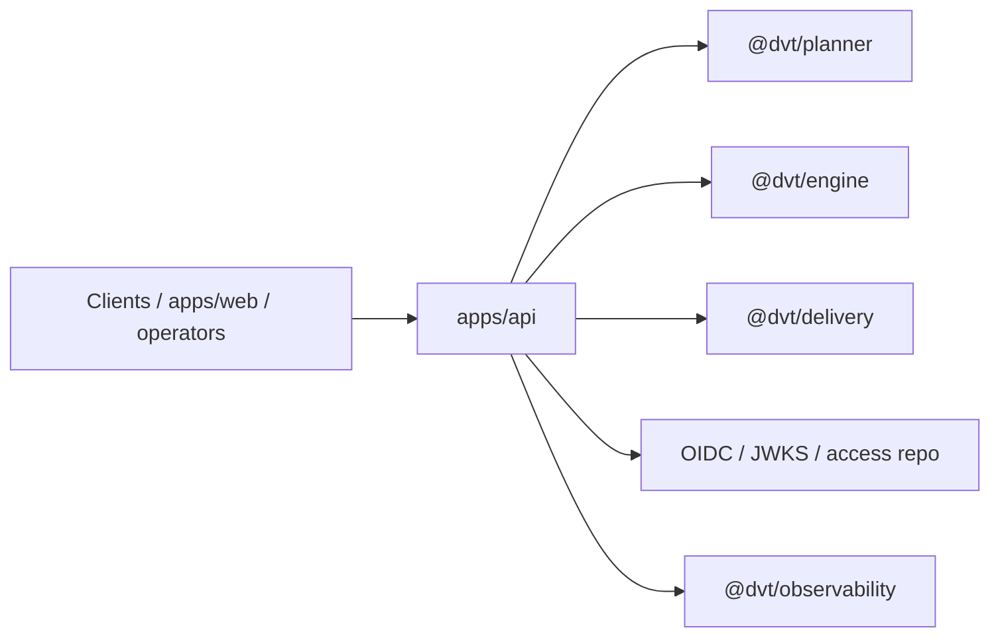

# API / Entry Domain

This domain owns the authenticated product entry surface.

It covers HTTP parsing, auth and tenant checks, admission, runtime command and
query routes, health and readiness, and the composition root that wires
planner, engine, delivery, and operational runtimes together inside `apps/api`.

## Scope

- `apps/api`
- OIDC and JWKS authentication
- tenant access checks and admission control
- runtime command and query routes
- readiness, health, version, and reconciler status

## Current Interactions

## Current Responsibilities

- translate HTTP input into typed application commands and query use cases;
- enforce auth, tenant, and admission checks before invoking runtime services;
- expose protected runtime routes and operational probes;
- bootstrap and surface the intent reconciler runtime in the API process.

## Code Anchors

- [app.ts](../../apps/api/src/app.ts)
- [server.ts](../../apps/api/src/server.ts)
- [buildProtectedRuntimeModule.ts](../../apps/api/src/modules/buildProtectedRuntimeModule.ts)
- [startRunRoute.ts](../../apps/api/src/entrypoints/http/startRunRoute.ts)
- [BackpressureAwareStartRunUseCase.ts](../../apps/api/src/application/services/BackpressureAwareStartRunUseCase.ts)

## Current Posture

The domain is real and partially productized today. Protected runtime routes,
OIDC auth, tenant policy, readiness and health endpoints, and reconciler
bootstrap are all implemented. The main remaining limitation is not the
existence of the surface, but the narrowness of the publicly consumable product
contract around it.

## Current To Target Walkthrough

- [API Current To Target Architecture](components/api/api-current-to-target-architecture.md)

## Queued Delta

- `MVP-E1`: publish the frontend-facing backend contract that matches the
  routes and auth behavior already implemented.
- `F-03`: keep platform-health signals stable enough for the shell banner and
  top-bar health UI to consume without mock fallback logic.

## Domain Rules

- The API composes and translates. It does not own lifecycle semantics that
  belong to execution and shared contracts.
- Unauthorized callers should fail before any deeper plan-reference or runtime
  detail is exposed.
- Query routes should keep reading through the delivery/read-model boundary
  instead of bypassing it with ad hoc storage access.

## Related Pages

- [apps/api](components/api/index.md)
- [API Current To Target Architecture](components/api/api-current-to-target-architecture.md)
- [DVT Component Map](component-map.md)
- [System Delivery Status](system-delivery-status.md)
- [API and Admission planning view](../planning/domains/api-and-admission.md)
