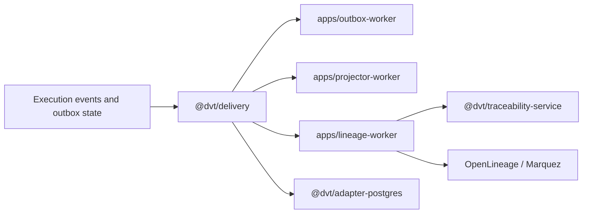

# Delivery Domain

This domain owns downstream processing after execution emits facts.

It covers outbox draining, snapshot projection, lineage publication, retention
and purge runtime wiring, and the worker composition roots that run those flows
in production.

## Scope

- `@dvt/delivery`
- `apps/outbox-worker` (`dvt-outbox-worker`)
- `apps/projector-worker`
- `apps/lineage-worker`

## Current Interactions

## Current Responsibilities

- drain and publish outbox records with worker-safe runtime primitives;
- rebuild and refresh read models through projector runtime flows;
- transform runtime facts into lineage payloads and ship them downstream;
- host retention, purge, and operational control behavior in worker processes.

## Code Anchors

- [OutboxWorkerRuntime.ts](../../packages/@dvt/delivery/src/application/OutboxWorkerRuntime.ts)
- [ProjectorWorkerRuntime.ts](../../packages/@dvt/delivery/src/application/ProjectorWorkerRuntime.ts)
- [LineageWorkerRuntime.ts](../../packages/@dvt/delivery/src/application/LineageWorkerRuntime.ts)
- [apps/outbox-worker/server.ts](../../apps/outbox-worker/src/server.ts)
- [apps/lineage-worker/server.ts](../../apps/lineage-worker/src/server.ts)

## Current Posture

The phase-1 delivery runtime is real and is no longer hidden inside the API or
engine composition roots. Projection, lineage, retention, and purge support
exist, but the remaining work is around hardening the seams, not inventing the
domain from scratch.

## Queued Delta

- `S05`: tighten event-envelope and payload-version handling at the delivery
  boundary.
- `S07`: fix OpenLineage job naming so downstream lineage is stable and
  diagnosable.
- `S11`: tighten `ILineageSink.jobFacets` and keep lineage contracts aligned
  with emitted payloads.

## Domain Rules

- Delivery consumes emitted runtime facts; it does not become a second owner of
  run lifecycle semantics.
- Worker apps are composition roots and operational hosts around
  `@dvt/delivery`, not parallel libraries with hidden business rules.
- Retention and purge policy must stay visible in docs because these paths are
  operationally sensitive even when the code is already present.

## Related Pages

- [@dvt/delivery](./components/delivery/index.md)
- [dvt-outbox-worker](./components/outbox-worker/index.md)
- [DVT Component Map](./component-map.md)
- [Event Lifecycle and Retention planning view](../planning/domains/event-lifecycle-and-retention.md)
