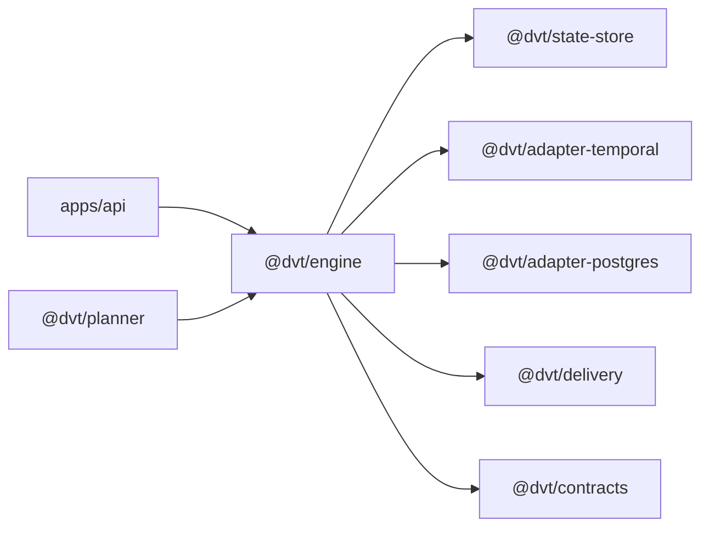

# Execution Domain

This domain owns runtime lifecycle semantics once a run begins.

It covers engine behavior, start-run coordination, access policy, state-store
contracts, and provider or persistence adapters behind those contracts.

## Scope

- `@dvt/engine`
- `@dvt/state-store`
- `@dvt/adapter-temporal`
- `@dvt/adapter-postgres`

## Current Interactions

## Current Responsibilities

- own lifecycle transitions, idempotency, and run-access policy;
- coordinate start-run and maintenance flows;
- apply runtime facts into snapshots and persistent state;
- translate DVT-owned semantics into Temporal and Postgres IO through adapters.

## Code Anchors

- [WorkflowEngine.ts](../../packages/@dvt/engine/src/core/WorkflowEngine.ts)
- [WorkflowEngineCoreService.ts](../../packages/@dvt/engine/src/core/WorkflowEngineCoreService.ts)
- [StartRunApplicationService.ts](../../packages/@dvt/engine/src/application/StartRunApplicationService.ts)
- [PostgresStateStoreRuntime.ts](../../packages/@dvt/adapter-postgres/src/PostgresStateStoreRuntime.ts)
- [TemporalAdapter.ts](../../packages/@dvt/adapter-temporal/src/TemporalAdapter.ts)

## Current Posture

The runtime exists and is actively used. The current work is execution
hardening, modularization, and ownership cleanup, not a greenfield execution
model rewrite. Start-run metadata now persists a single discriminated
`providerRef` identity and the shared trace-context seam lives under
`@dvt/engine/core/lifecycle`.

## Queued Delta

- `S02`: split state-store responsibilities more cleanly.
- `S03`: extract start-run coordination without moving runtime authority out of
  the engine.
- `TF-C2-A/B`: finish executor payload emission and caller-visible runtime
  evidence on top of the hardened `providerRef` contract.
- `DHM` and `RC-G1`: continue DDD or hexagonal modularization and shared-kernel
  cleanup without widening composition-root leakage.

## Domain Rules

- DVT owns lifecycle semantics; providers implement IO behind ports.
- State-store boundaries remain explicit even when Postgres currently satisfies
  several roles at once.
- Delivery may consume execution outputs, but it must not redefine execution
  state transitions.

## Related Pages

- [Engine](engine/index.md)
- [DVT Component Map](component-map.md)
- [System Delivery Status](system-delivery-status.md)
- [Execution Runtime planning view](../planning/domains/execution-runtime.md)
