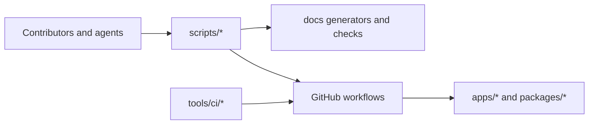

# Infra Domain

This domain owns the automation and operating surfaces around the repository.

It covers CI, local validation helpers, docs generators, policy checks, and the
tooling that keeps runtime and documentation changes governed.

## Scope

- `infra/`
- `scripts/`
- `tools/`
- `.github/workflows/`

## Current Interactions

## Current Responsibilities

- define and run local validation, hygiene, and docs-sync paths;
- encode CI policy in GitHub workflows and helper tools;
- generate governed views such as docs indexes and planning workboards;
- keep operational rules explicit instead of hiding them in tribal knowledge.

## Code Anchors

- [hygiene.ps1](../../scripts/hygiene.ps1)
- [sync-docs.cjs](../../scripts/sync-docs.cjs)
- [ci.yml](../../.github/workflows/ci.yml)
- [pr-quality-gate.yml](../../.github/workflows/pr-quality-gate.yml)
- [arc-check.mjs](../../tools/ci/arc-check.mjs)

## Current Posture

Infra is active and rule-bearing. It is not just repository scaffolding. The
docs, hooks, CI policies, and validation commands materially shape how safely
runtime changes can land.

## Queued Delta

- keep docs-governance surfaces aligned with the architecture cleanup so they do
  not regress into duplicate maps or stale links;
- continue removing CI policy drift where path matching and validation ownership
  are still duplicated.

## Domain Rules

- Generated docs and workboards are outputs. Their source of truth lives in the
  generators and controlled inputs, not in hand edits to generated files.
- Infra documents process and validation authority, not product runtime truth.
- No hidden bypasses: if the workflow changes, the docs and checks should say
  so explicitly.

## Related Pages

- [Infra Architecture](./infra/index.md)
- [Testing and CI Capabilities](../guides/testing-and-ci-capabilities.md)
- [Governance Document and Rule Inventory](../planning/status/governance-document-rule-inventory.md)
- [DVT Domain Map](./domain-map.md)
