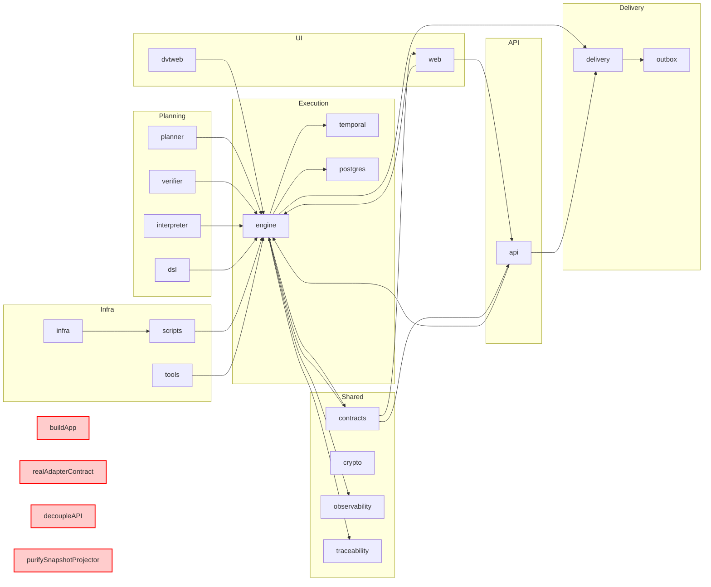
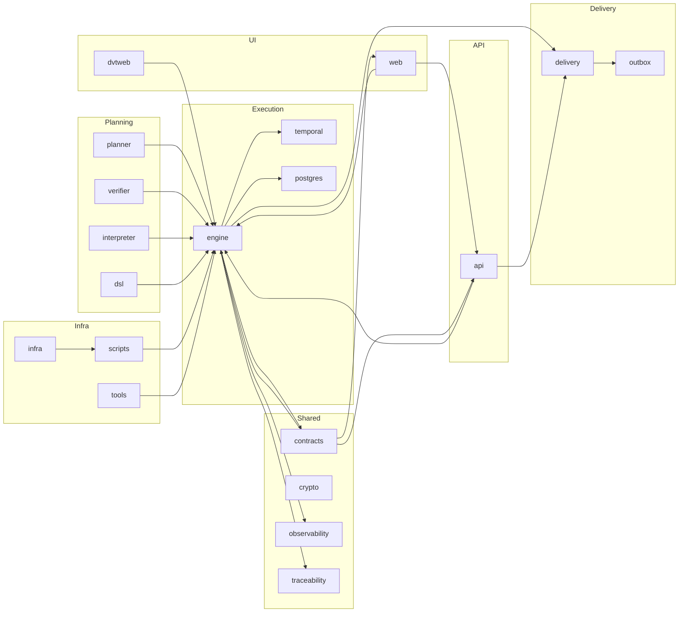

---
title: Domain Map
status: Draft
owner: Architecture / Docs
last_reviewed: 2026-03-15
---

# DVT Domain Map

## Purpose

Visual and textual map of the main domains in the DVT system, their
boundaries, responsibilities, and relationships.

## Domain Definitions

| Domain                              | Main Responsibility                                        | Boundaries (packages/entry points)                                                 | Example Interaction                       |
| ----------------------------------- | ---------------------------------------------------------- | ---------------------------------------------------------------------------------- | ----------------------------------------- |
| [Planning](domain-planning.md)      | Plan construction, compilation, and integrity validation   | `@dvt/planner`, `@dvt/plan-verifier`, `@dvt/plan-interpreter`, `@dvt/dsl`          | Delivers a plan to Execution              |
| [Execution](domain-execution.md)    | Workflow orchestration, adapters, and persistence          | `@dvt/engine`, `@dvt/adapter-temporal`, `@dvt/adapter-postgres`                    | Executes a plan and updates state         |
| [Delivery](domain-delivery.md)      | Outbox worker, retry, sharding, and delivery ownership     | `@dvt/delivery`, `dvt-outbox-worker`                                               | Publishes events and manages ownership    |
| [UI / Visualization](domain-ui.md)  | Visualization, monitoring, and user interaction            | `apps/web`, `@dvt/web`                                                             | Queries status and displays runs          |
| [API / Entry](domain-api.md)        | HTTP exposure, auth, routing, and background runtime       | `apps/api`                                                                         | Receives signals and exposes endpoints    |
| [Shared Boundary](domain-shared.md) | Contracts, types, observability, traceability, and hashing | `@dvt/contracts`, `@dvt/crypto`, `@dvt/observability`, `@dvt/traceability-service` | Defines interfaces and validates events   |
| [Infra](domain-infra.md)            | Infrastructure, scripts, tools, and CI/CD                  | `infra/`, `scripts/`, `tools/`                                                     | Provides environment and runs validations |

## Current Status Map

The following diagram highlights the current domain map and marks still-pending
areas in red.

## Mermaid Diagram - Domain Context

## Ownership and Dependencies

- Each domain has an explicit owner.
- Dependencies between domains are visualized in the diagram.
- Boundaries are defined by packages and entry points.

## Recommendations

- Integrate this map in `docs/architecture/index.md` and `system-map.md`.
- Add examples of domain flows in technical documentation.
- Formalize the use of bounded context and domain in the glossary.
