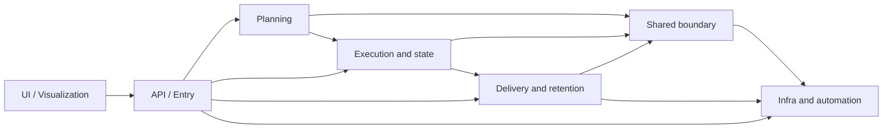

# DVT Domain Map

This page is the supporting bounded-context map for the repository as it exists
today.

It is grounded in current code, active component responsibilities, and the
queued follow-up work already visible on the workboard. It still does not
replace the normative architecture rules in
[Reference Architecture](reference-architecture.md) or the implementation truth
in [System Delivery Status](system-delivery-status.md).

## Read This With

1. [Reference Architecture](reference-architecture.md)
2. [System Delivery Status](system-delivery-status.md)
3. [DVT Component Map](component-map.md)
4. [Planning Control Tower](../planning/state/planning-control-tower.md)

## Current Domain Relationships

## Domain Catalog

| Domain                              | Owns today                                                                                                  | Main dependencies                                                              | Current posture                                                                      | Queued delta                                                                                                                                                 |
| ----------------------------------- | ----------------------------------------------------------------------------------------------------------- | ------------------------------------------------------------------------------ | ------------------------------------------------------------------------------------ | ------------------------------------------------------------------------------------------------------------------------------------------------------------ |
| [API / Entry](domain-api.md)        | `apps/api`, auth/runtime module composition, HTTP translation, readiness, and reconciler bootstrap          | inbound clients, planner, engine, delivery, observability, auth infrastructure | partial but real protected runtime surface                                           | keep the frontend/backend contract explicit and preserve admission/runtime-health correctness; related work includes `MVP-E1` plus residual Lane C hardening |
| [UI / Visualization](domain-ui.md)  | `apps/web` package surface, browser shell, routing, run views, and platform health                          | `apps/api`, client-side state and feature services                             | partial, with live backend integration in some slices and remaining mock-heavy views | finish shell cleanup and isolate mock-vs-API data sources; active work includes `F-01`, `F-03`, `F-04`, and `MVP-E1`                                         |
| [Planning](domain-planning.md)      | planner, verifier, interpreter, DSL, and artifact assembly inputs                                           | contracts, crypto, artifacts, manifest/backing stores                          | partially implemented and already used by runtime admission/start-run paths          | land `S08` and continue planner-private ownership cleanup without widening the shared kernel                                                                 |
| [Execution](domain-execution.md)    | engine lifecycle semantics, access policy, start-run coordination, state-store contracts, provider adapters | planner output, shared contracts, Postgres, Temporal                           | phase-1 runtime exists and is used, with hardening and modularization still open     | continue `S02`, `S03`, `S04`, `DHM`, and `RC-G1`                                                                                                             |
| [Delivery](domain-delivery.md)      | outbox draining, projection, lineage shipping, retention, purge, and worker composition roots               | execution events, Postgres persistence, traceability, observability            | phase-1 delivery runtime exists and owns downstream processing                       | tighten envelope and lineage seams under `S05`, `S07`, and `S11`; keep retention/restore policy explicit                                                     |
| [Shared Boundary](domain-shared.md) | shared contracts, telemetry abstractions, OTel binding, lineage mapping, and crypto helpers                 | consumed by planning, execution, delivery, API, and UI                         | implemented but deliberately narrow                                                  | keep ownership cleanup explicit under `RC-G1` and validate production observability behavior                                                                 |
| [Infra](domain-infra.md)            | workflows, scripts, tooling, and operational glue                                                           | every runtime domain                                                           | active and repo-wide                                                                 | continue docs/governance hardening and keep CI/tooling rules aligned with the actual system                                                                  |

## Domain Interaction Rules

- UI remains a consumer of entry surfaces, not a second backend boundary.
- Planning can enrich execution inputs, but execution still owns runtime
  lifecycle semantics once a run begins.
- Delivery and retention consume emitted runtime facts; they do not redefine the
  state-transition rules that belong to execution.
- Shared-boundary packages are cross-cutting support surfaces, not a place to
  hide ownerless behavior.
- Infra and automation are enablers for every domain, but they must not become
  undocumented product logic.

## Related Pages

- [DVT Component Map](component-map.md)
- [Architecture Component Surfaces](components/index.md)
- [DVT System Architecture](system-overview.md)
- [Planning Control Tower](../planning/state/planning-control-tower.md)
