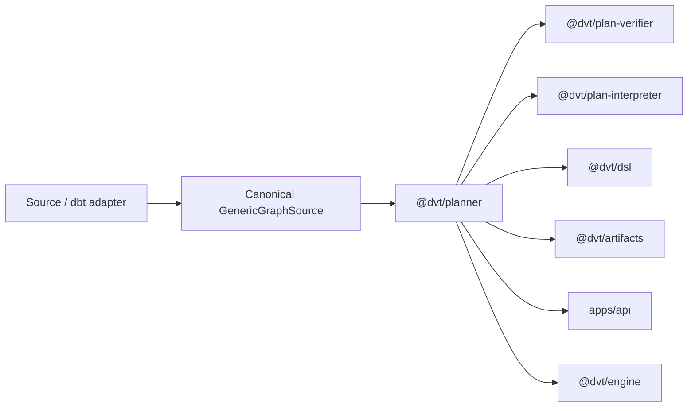

# Planning Domain

This domain owns plan derivation and validation before execution starts.

It covers planner orchestration, canonical graph-source admission, execution-plan
assembly, verification, deterministic interpretation, DSL evaluation, and the
artifact helpers that attach compiled-code references.

Current target reading for graph-source generalization:

- [DB-first Component Map](./component-map.md)
- `docs/guides/generic-graph-source-user-manual-20260404.md`
- `docs/planning/proposals/mandatory/runtime-and-contracts/mw-a2-generic-graph-source-plan-20260404.md`

## Scope

- `@dvt/planner`
- `@dvt/plan-verifier`
- `@dvt/plan-interpreter`
- `@dvt/dsl`
- `@dvt/artifacts`

## Current Interactions

## Current Responsibilities

- build execution plans from canonical `GenericGraphSource` inputs whose logical
  node identities have already been assigned by the owning authoring/source boundary;
- validate plan structure, integrity, and compatibility;
- provide deterministic DAG interpretation helpers used by runtimes;
- attach and store compiled-code references needed by downstream execution and
  lineage flows.

Raw dbt manifests are external-authority inputs. They are not a Planner identity
source. Adapter/application boundaries must translate them into the canonical graph
contract before Planner admission, preserving explicit logical IDs rather than
manufacturing them from manifest keys, names, paths, providers, or ordinals.

## Code Anchors

- [PlannerFacade.ts](../../packages/@dvt/planner/src/application/PlannerFacade.ts)
- [PlannerEnvelopeMapper.ts](../../packages/@dvt/planner/src/application/PlannerEnvelopeMapper.ts)
- [verify.ts](../../packages/@dvt/plan-verifier/src/verify.ts)
- [dagAnalyzer.ts](../../packages/@dvt/plan-interpreter/src/dagAnalyzer.ts)
- [attachCompiledCodeRefs.ts](../../packages/@dvt/artifacts/src/compiledCode/attachCompiledCodeRefs.ts)

## Current Posture

The planning domain is already on the runtime path. `RC-G1-D` has closed the
planner-private behavior-port ownership drift by moving those ports to
`@dvt/planner` while keeping shared serializable vocabulary in `@dvt/contracts`.

The remaining open problem is not whether planning exists, but how to continue
formalizing plan records, plan storage, and artifact ownership seams without
collapsing domain behavior back into shared-kernel convenience exports.

## Queued Delta

- `S08`: formalize the plan-record and plan-store model and sequence the
  artifacts or storage ownership correctly.
- `RC-G1-D`: delivered. Planner-private behavior ports are now owner-local in
  `@dvt/planner`, with semantic architecture coverage guarding the split from
  shared serializable planner vocabulary.
- `MW-A2`: `GenericGraphSource` is the canonical planner input. GH-2904 hard-cuts
  the obsolete direct manifest-to-Planner compatibility bridge; source-specific
  translation remains outside the Planner boundary.

## Domain Rules

- Planning produces inputs to execution. It does not own runtime state
  transitions after admission succeeds.
- Planner consumes explicit logical graph identity and must not mint or repair it
  from physical bindings, names, paths, provider coordinates, manifest keys, or
  ordinals.
- Verifier, interpreter, and DSL packages should stay narrow and deterministic.
- Artifact and compiled-code handling should move toward the right owner rather
  than remaining implicitly planner-owned forever.

## Related Pages

- [Planner and Contracts planning view](../planning/domains/planner-and-contracts.md)
- [DVT Component Map](./component-map.md)
- [System Delivery Status](./system-delivery-status.md)
- [Shared Package Architecture](./shared/index.md)
