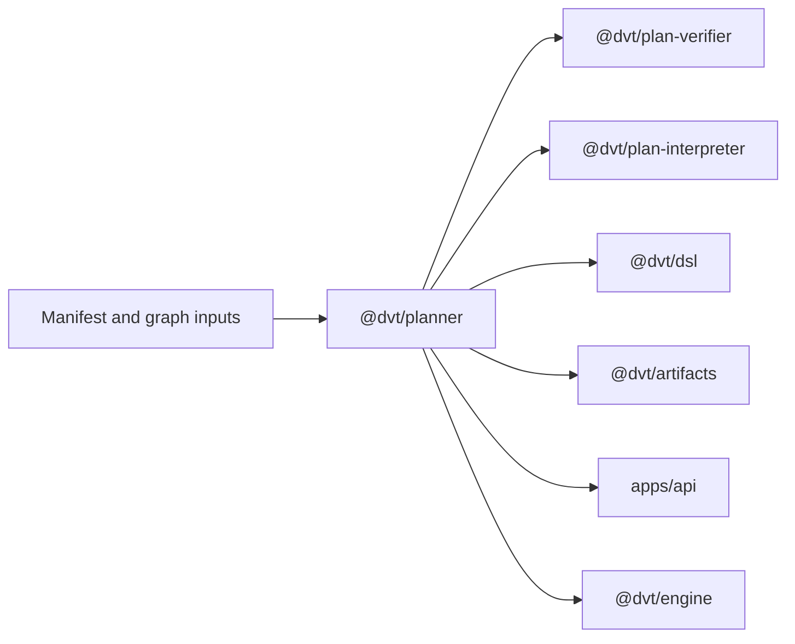

# Planning Domain

This domain owns plan derivation and validation before execution starts.

It covers planner orchestration, graph-source derivation, execution-plan
assembly, verification, deterministic interpretation, DSL evaluation, and the
artifact helpers that attach compiled-code references.

Current target reading for graph-source generalization:

- `docs/guides/generic-graph-source-technical-manual-20260404.md`
- `docs/guides/generic-graph-source-user-manual-20260404.md`
- `docs/planning/proposals/mandatory/runtime-and-contracts/mw-a2-generic-graph-source-plan-20260404.md`

## Scope

- `@dvt/planner`
- `@dvt/plan-verifier`
- `@dvt/plan-interpreter`
- `@dvt/dsl`
- `@dvt/artifacts`

## Current Interactions

## Current Responsibilities

- build execution plans from manifest and graph-source inputs;
- validate plan structure, integrity, and compatibility;
- provide deterministic DAG interpretation helpers used by runtimes;
- attach and store compiled-code references needed by downstream execution and
  lineage flows.

## Code Anchors

- [PlannerFacade.ts](../../packages/@dvt/planner/src/application/PlannerFacade.ts)
- [derivePlannerGraphSourceFromManifest.ts](../../packages/@dvt/planner/src/application/derivePlannerGraphSourceFromManifest.ts)
- [verify.ts](../../packages/@dvt/plan-verifier/src/verify.ts)
- [dagAnalyzer.ts](../../packages/@dvt/plan-interpreter/src/dagAnalyzer.ts)
- [attachCompiledCodeRefs.ts](../../packages/@dvt/artifacts/src/compiledCode/attachCompiledCodeRefs.ts)

## Current Posture

The planning domain is already on the runtime path. The main open problem is
not whether planning exists, but how to formalize plan records, plan storage,
and ownership seams without dragging planner-private behavior into the shared
kernel.

## Queued Delta

- `S08`: formalize the plan-record and plan-store model and sequence the
  artifacts or storage ownership correctly.
- `RC-G1-D`: keep planner-private ports private while preserving the shared
  planner contracts that are intentionally public.
- `MW-A2`: make `GenericGraphSource` the canonical planner input and demote dbt
  manifest ingestion to a compatibility adapter path.

## Domain Rules

- Planning produces inputs to execution. It does not own runtime state
  transitions after admission succeeds.
- Verifier, interpreter, and DSL packages should stay narrow and deterministic.
- Artifact and compiled-code handling should move toward the right owner rather
  than remaining implicitly planner-owned forever.

## Related Pages

- [Planner and Contracts planning view](../planning/domains/planner-and-contracts.md)
- [DVT Component Map](component-map.md)
- [System Delivery Status](system-delivery-status.md)
- [Shared Package Architecture](shared/index.md)
