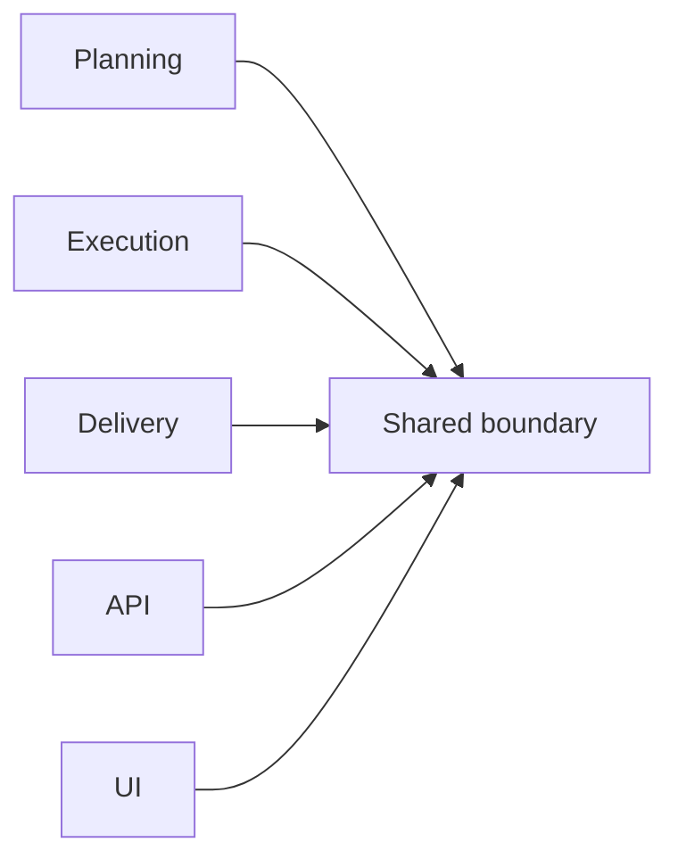

# Shared Boundary Domain

This domain contains the intentionally shared technical surfaces used across
planning, execution, delivery, API, and UI.

It is where genuinely shared contracts, telemetry abstractions, lineage
mapping, and canonicalization helpers belong. It is not a fallback bucket for
ownerless business logic.

## Scope

- `@dvt/contracts`
- `@dvt/planner-contracts`
- `@dvt/observability`
- `@dvt/observability-otel`
- `@dvt/traceability-service`
- `@dvt/crypto`

## Current Interactions

## Current Responsibilities

- publish shared transport and contract shapes that multiple domains really use;
- define observability contracts and the OTel binding path;
- resolve and map lineage payload inputs for downstream emission;
- provide canonicalization and hashing utilities used across planner and
  runtime boundaries.

## Code Anchors

- [contracts index](../../packages/@dvt/contracts/src/index.ts)
- [ExecutionPlan.v1.ts](../../packages/@dvt/contracts/src/contracts/planner/ExecutionPlan.v1.ts)
- [observability index](../../packages/@dvt/observability/src/index.ts)
- [StepStartedLineageMapper.ts](../../packages/@dvt/traceability-service/src/lineage/mapper/StepStartedLineageMapper.ts)
- [crypto index](../../packages/@dvt/canonical/src/index.ts)

## Current Posture

The shared boundary is implemented, but its hardest requirement is discipline:
keeping the shared surface intentionally small and moving domain-private
behavior back to its owning context when drift is discovered.

## Queued Delta

- `RC-G1`: continue shared-kernel ownership cleanup across engine, planner,
  delivery, and artifacts.
- `S11`: tighten lineage sink facets without widening the shared surface beyond
  what downstream consumers need.
- keep OTel binding validation honest so observability docs do not overstate
  production readiness.

## Domain Rules

- Only truly shared contracts and technical cross-cutting behavior belong here.
- When ownership is ambiguous, the default fix is owner clarification, not a
  new shared abstraction.
- Shared packages should expose stable boundaries, not hidden orchestration.

## Related Pages

- [Contracts Index](../contracts/index.md)
- [DVT Component Map](component-map.md)
- [Shared Package Architecture](shared/index.md)
- [System Delivery Status](system-delivery-status.md)
