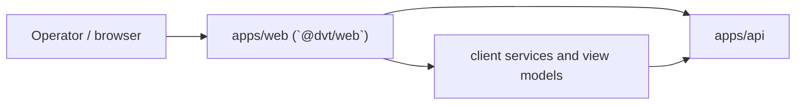

# UI / Visualization Domain

This domain owns the browser-facing DVT experience.

The code lives in the `apps/web` workspace, whose package name is `@dvt/web`.
Both names are valid depending on whether the question is about the deployable
application shell or the package-level frontend surface inside that workspace.

## Scope

- `apps/web`
- package surface `@dvt/web`
- frontend routing, client services, platform health, and run-monitoring views

## Current Interactions

## Current Responsibilities

- bootstrap the browser app and route operators through the current UI shell;
- render run and workspace views from client services and feature modules;
- poll and present platform-health state from backend endpoints;
- keep client-side composition separate from execution, planner, and storage
  concerns.

## Code Anchors

- [main.tsx](../../apps/web/src/main.tsx)
- [App.tsx](../../apps/web/src/app/App.tsx)
- [routes.ts](../../apps/web/src/app/routes.ts)
- [createApiClient.ts](../../apps/web/src/app/services/api/createApiClient.ts)
- [usePlatformHealthSnapshotQuery.ts](../../apps/web/src/capabilities/platform-health/presentation/usePlatformHealthSnapshotQuery.ts)

## Current Posture

The UI is real and partially backend-backed today. It still contains mock-heavy
paths, but it is no longer accurate to describe it as untested or purely
illustrative. Local frontend test files exist under `apps/web/src/**`; the
current gap is that the workspace still exposes `typecheck` and `build`, but no
declared `test` script or dedicated frontend CI lane.

## Queued Delta

- `MVP-E1`: document the backend contract the UI is actually allowed to rely on
  today.
- `F-03`: finish real backend health visibility in the top bar and degraded or
  offline banner.
- `F-04`: isolate mock-versus-API data sources so views stop consuming mock
  data directly.
- `F-05`: finish store decomposition so shell, graph, run, and status concerns
  stop leaking through one global store.
- `F-06`: standardize TanStack Query boundaries and invalidation across current
  views.
- `F-07`: align the frontend runtime contract to the protected API route map,
  including the real run-start route.
- `F-12`: remove the dead legacy GraphCanvas path so the active graph stack is
  singular.
- `F-14`: add a governed frontend test command and CI lane for `@dvt/web`.

## Domain Rules

- The UI consumes `apps/api`; it should not couple directly to execution
  adapters or storage.
- Client services and capability modules should isolate mock-data usage rather
  than letting views talk to mock sources directly.
- Frontend-local docs are useful, but the architecture surface in `docs/`
  remains the discoverable entrypoint.

## Related Pages

- [Frontend Architecture](frontend/index.md)
- [apps/web](components/web-app/index.md)
- [@dvt/web package surface](components/web/index.md)
- [DVT Component Map](component-map.md)
