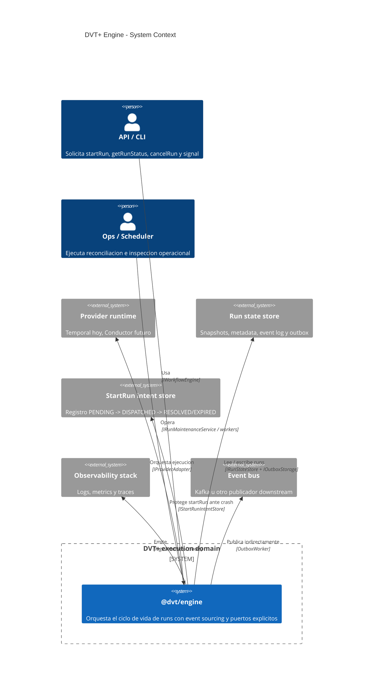
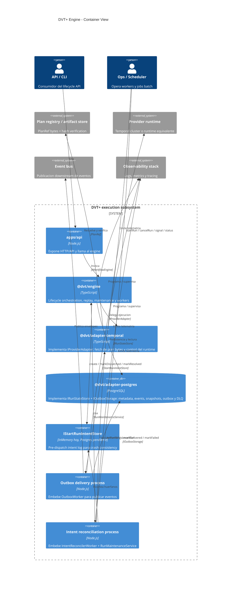
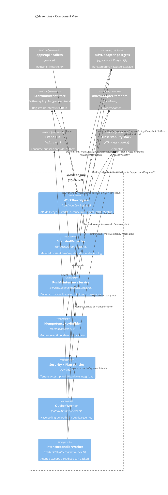

# C4 del Engine

**Fecha**: 2026-03-05  
**Alcance**: arquitectura logica de `@dvt/engine` y sus colaboradores directos  
**Nota**: este documento usa contenedores logicos C4. `@dvt/engine` es una libreria TypeScript, mientras que `apps/api`, el reconciler y el outbox worker representan procesos que la embeben en runtime.

**Fuentes primarias**:

- [WorkflowEngine.ts](../../../packages/@dvt/engine/src/core/WorkflowEngine.ts)
- [SnapshotProjector.ts](../../../packages/@dvt/engine/src/core/SnapshotProjector.ts)
- [RunMaintenanceService.ts](../../../packages/@dvt/engine/src/services/RunMaintenanceService.ts)
- [IntentReconcilerWorker.ts](../../../packages/@dvt/engine/src/workers/IntentReconcilerWorker.ts)
- [IRunStateStore.ts](../../../packages/@dvt/engine/src/ports/IRunStateStore.ts)
- [IProviderAdapter.ts](../../../packages/@dvt/engine/src/adapters/IProviderAdapter.ts)
- [ADR-0029](../../adr/ADR-0029-run-maintenance-service.md)
- [ADR-0030](../../adr/ADR-0030-pre-dispatch-intent-log.md)

## 1. Context View

## 2. Container View

## 3. Component View

## 4. Notas de lectura

- `WorkflowEngine` es la frontera de lifecycle; no debe conocer bytes del plan ni detalles del runtime.
- `SnapshotProjector` sigue siendo in-process. No hay servicio standalone de proyeccion a la fecha del 2026-03-05.
- `RunMaintenanceService` concentra mantenimiento batch segun ADR-0029 y ADR-0030.
- `@dvt/adapter-postgres` cubre state store y outbox; un intent store persistente sigue pendiente.
- `OutboxWorker` e `IntentReconcilerWorker` son piezas operacionales que embeben el package `@dvt/engine`, no contratos publicos del lifecycle API.
