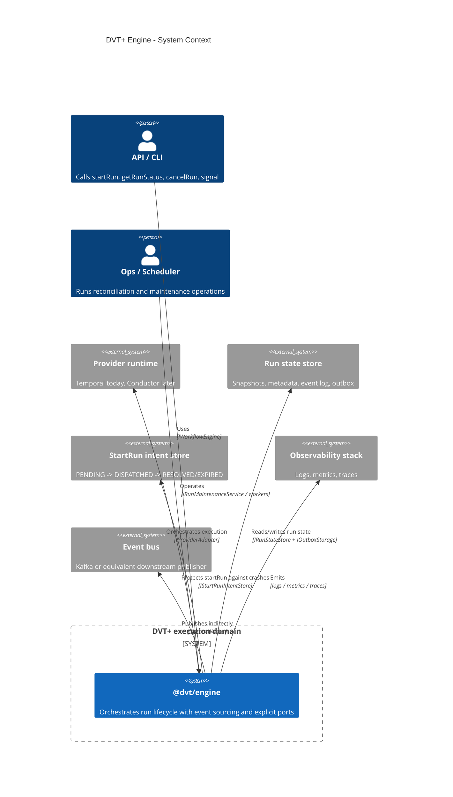
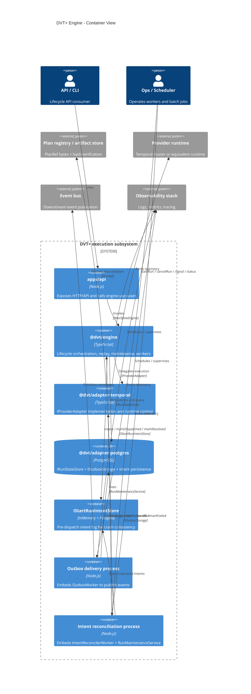
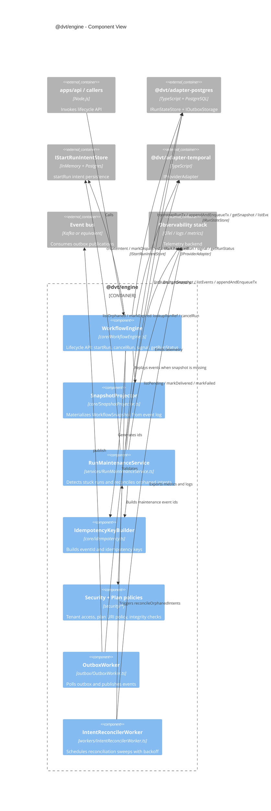
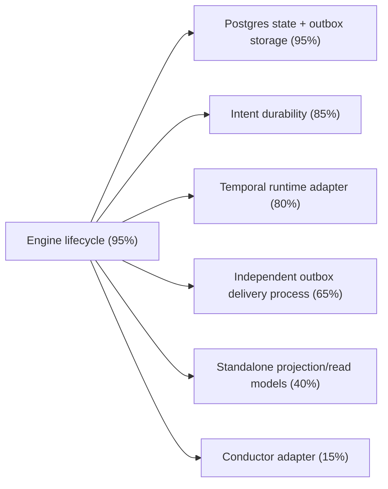

# Engine C4 Architecture

**Date**: 2026-03-06  
**Scope**: Logical architecture of `@dvt/engine` and direct collaborators.  
**Note**: C4 containers are logical/runtime boundaries. `@dvt/engine` is a TypeScript library embedded by processes such as `apps/api`, reconciler workers, and outbox workers.

**Primary sources**:

- [WorkflowEngine.ts](../../../packages/@dvt/engine/src/core/WorkflowEngine.ts)
- [SnapshotProjector.ts](../../../packages/@dvt/engine/src/core/SnapshotProjector.ts)
- [RunMaintenanceService.ts](../../../packages/@dvt/engine/src/services/RunMaintenanceService.ts)
- [IntentReconcilerWorker.ts](../../../packages/@dvt/engine/src/workers/IntentReconcilerWorker.ts)
- [IRunStateStore.ts](../../../packages/@dvt/engine/src/ports/IRunStateStore.ts)
- [IProviderAdapter.ts](../../../packages/@dvt/engine/src/adapters/IProviderAdapter.ts)
- [ADR-0029](../../adr/ADR-0029-run-maintenance-service.md)
- [ADR-0030](../../adr/ADR-0030-pre-dispatch-intent-log.md)

## 1. Context View

## 2. Container View

## 3. Component View

## 4. Reading Notes

- `WorkflowEngine` is the lifecycle boundary and should not own plan bytes or runtime internals.
- `SnapshotProjector` is still in-process; no standalone projector service yet.
- `RunMaintenanceService` centralizes maintenance behavior from ADR-0029 and ADR-0030.
- `@dvt/adapter-postgres` now covers state store, outbox, and persistent intent store (`PostgresStartRunIntentStore`).
- `OutboxWorker` and `IntentReconcilerWorker` are operational components that embed `@dvt/engine`.

## 5. Implementation Maturity Map

**Cutoff date**: 2026-03-06  
**Basis**: current code in `packages/@dvt/engine`, `@dvt/adapter-postgres`, `@dvt/adapter-temporal`, and local test coverage.

| Area                              | Implemented | Code evidence                                                               | Main gap                                                     |
| --------------------------------- | ----------- | --------------------------------------------------------------------------- | ------------------------------------------------------------ |
| Engine lifecycle core             | 95%         | `WorkflowEngine`, `SnapshotProjector`, `RunMaintenanceService`, broad tests | Operational hardening and integration debt                   |
| Postgres state + outbox storage   | 95%         | `PostgresStateStoreAdapter` with snapshots/event log/outbox + DLQ           | Real downstream publisher wiring and operational hardening   |
| Intent durability                 | 85%         | `PostgresStartRunIntentStore` + `IntentReconcilerWorker`                    | End-to-end wiring and production telemetry tuning            |
| Temporal runtime adapter          | 80%         | `TemporalAdapter`, `TemporalWorkerHost`, workflow/activities                | Remaining phase capabilities + CI integration lane stability |
| Standalone projection/read models | 40%         | In-process `SnapshotProjector` only                                         | Dedicated projector service and denormalized read models     |
| Conductor adapter                 | 15%         | `ConductorAdapterStub`                                                      | Real adapter implementation and parity validation            |

## 6. Missing Capabilities and Proposed Effort

| Gap                                      | Why it matters                                                                | Proposed implementation                                                                                                  | Estimated effort    |
| ---------------------------------------- | ----------------------------------------------------------------------------- | ------------------------------------------------------------------------------------------------------------------------ | ------------------- |
| Independent outbox delivery process      | Production reliability for async publication and isolation from API lifecycle | Harden `apps/outbox-worker`, add real publisher wiring, deploy profile, metrics, health checks, and retry/DLQ dashboards | 4-6 engineer-days   |
| Standalone projection/read model service | Scalable status queries and dashboard-friendly reads                          | Extract projector worker, add rebuild/replay tooling, introduce denormalized read models and indexes                     | 8-12 engineer-days  |
| Temporal integration hardening           | Reduce runtime risk and CI blind spots                                        | Stabilize Temporal integration lane (time-skipping/dev server), strengthen failure injection tests and shutdown behavior | 3-5 engineer-days   |
| Conductor real adapter                   | Multi-provider portability roadmap                                            | Replace `ConductorAdapterStub`, map signals/status/events, add capability parity tests                                   | 10-15 engineer-days |

### Sequencing proposal

1. Outbox delivery process
2. Temporal hardening
3. Standalone projection/read model service
4. Conductor adapter
