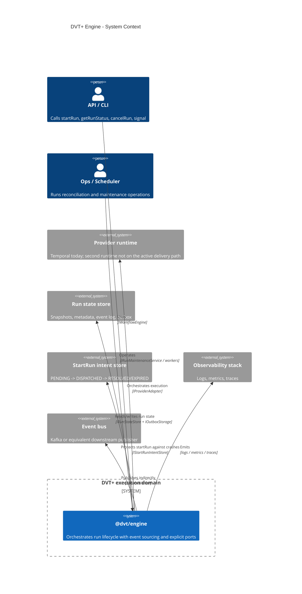
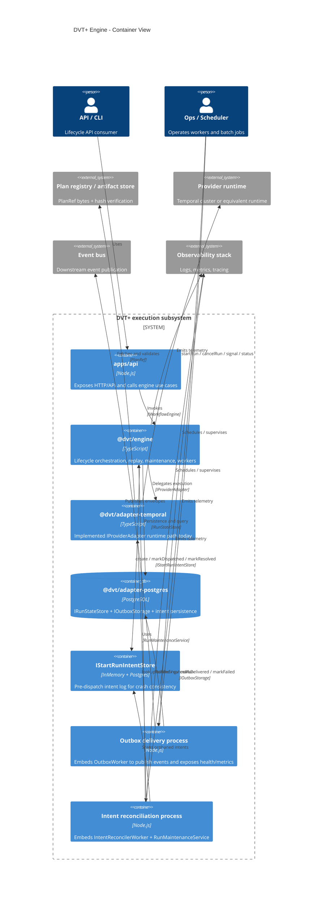
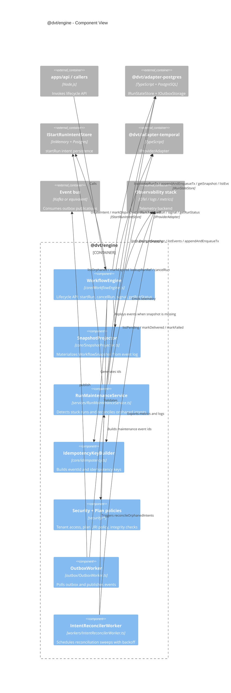
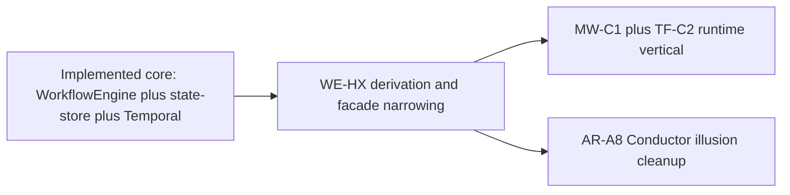

# Engine C4 Architecture

**Last reviewed**: 2026-04-09  
**Scope**: Logical architecture of `@dvt/engine` and direct collaborators.  
**Note**: C4 containers are logical/runtime boundaries. `@dvt/engine` is a TypeScript library embedded by processes such as `apps/api`, reconciler workers, and outbox workers.

**Primary sources**:

- [WorkflowEngine.ts](../../../packages/@dvt/engine/src/core/WorkflowEngine.ts)
- [SnapshotProjector.ts](../../../packages/@dvt/engine/src/core/SnapshotProjector.ts)
- [RunMaintenanceService.ts](../../../packages/@dvt/engine/src/services/RunMaintenanceService.ts)
- [IntentReconcilerWorker.ts](../../../packages/@dvt/engine/src/workers/IntentReconcilerWorker.ts)
- [IRunStateStore.ts](../../../packages/@dvt/engine/src/ports/IRunStateStore.ts)
- [IProviderAdapter.ts](../../../packages/@dvt/engine/src/adapters/IProviderAdapter.ts)
- [ADR-0029](../../adr/ADR-0029-run-maintenance-service.md)
- [ADR-0030](../../adr/ADR-0030-pre-dispatch-intent-log.md)

## 1. Context View

## 2. Container View

## 3. Component View

## 4. Reading Notes

- `WorkflowEngine` is the lifecycle boundary and should not own plan bytes or runtime internals.
- `SnapshotProjector` is still in-process; no standalone projector service yet.
- `RunMaintenanceService` centralizes maintenance behavior from ADR-0029 and ADR-0030.
- `@dvt/adapter-postgres` now covers state store, outbox, and persistent intent store (`PostgresStartRunIntentStore`).
- `OutboxWorker` and `IntentReconcilerWorker` are operational components that embed `@dvt/engine`.

## 5. Current delivery posture

This C4 view is structural. For delivery sequencing, use
[Engine Roadmap](roadmap/engine-phases.md) and the active Lane A/Lane C tasks.

| Area                                                  | Current posture                         | Code evidence                                                                                                 | Current projection                                                      |
| ----------------------------------------------------- | --------------------------------------- | ------------------------------------------------------------------------------------------------------------- | ----------------------------------------------------------------------- |
| Engine lifecycle core                                 | Implemented                             | `WorkflowEngine`, `SnapshotProjector`, `RunMaintenanceService`, broad tests                                   | Keep hardening under `WE-HX`, not a new MVP phase                       |
| Postgres state, outbox, and read-model path           | Implemented                             | `@dvt/adapter-postgres`, delivery runtime, projector/read-model ownership in current docs                     | Already absorbed into mainline; no longer a future engine roadmap claim |
| Temporal runtime adapter                              | Implemented with ongoing hardening      | `@dvt/adapter-temporal`, `RunPlanWorkflow`, integration coverage                                              | Continue hardening via `WE-HX`, `AR-C*`, and `MW-C1`                    |
| Compatibility facade and ownership seams              | In progress                             | `workflow-engine-subsystem-context.md`, `workflow-engine-target-architecture.v1.md`, `StartRunProtocol.v1.md` | Close `WE-HX-0..3`, then `WE-HX-5..6`                                   |
| Conductor truthfulness                                | Residual debt, not active product phase | `ConductorAdapterStub`, provider typing, draft Conductor docs                                                 | Close `AR-A8` before treating a second runtime as live roadmap work     |
| First execution-first transformation runtime vertical | Queued                                  | Lane C `MW-C1`, `TF-C2-A`, `TF-C2-B`                                                                          | This is the next real runtime value path                                |

## 6. Current sequencing

1. close the remaining `WE-HX` derivation waves so the engine boundary is
   truthful and easier to evolve;
2. remove the Conductor illusion from runtime typing and documentation through
   `AR-A8`;
3. deliver `MW-C1` plus `TF-C2-A/B` so persisted plans can drive the first
   PostgreSQL execution-first path with caller-visible evidence.
