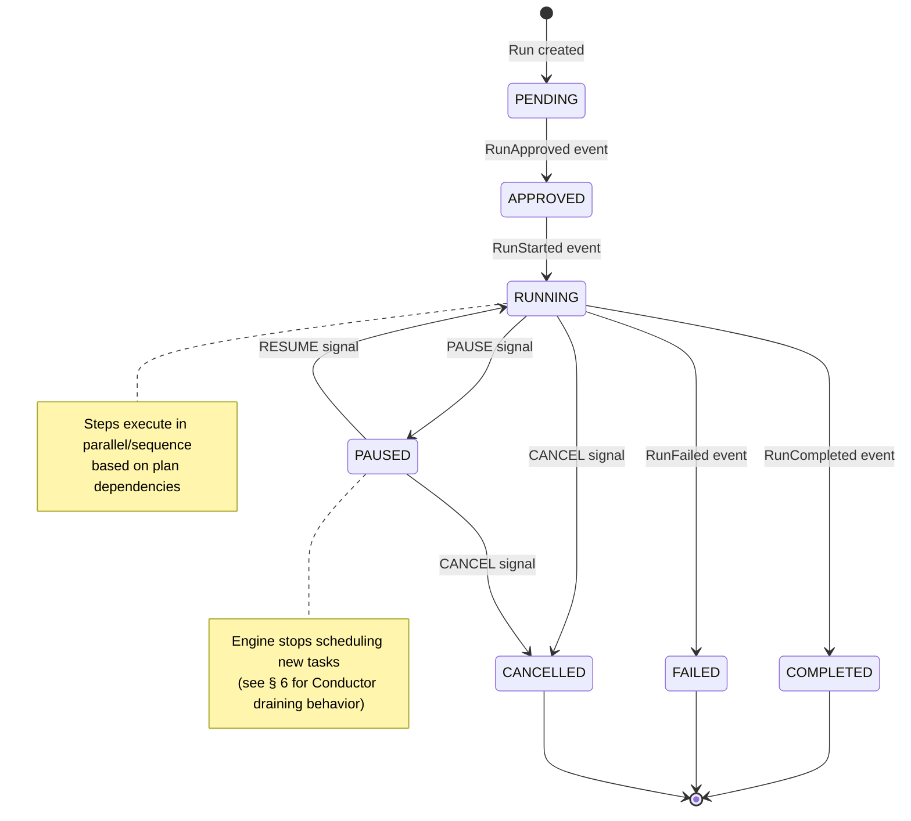
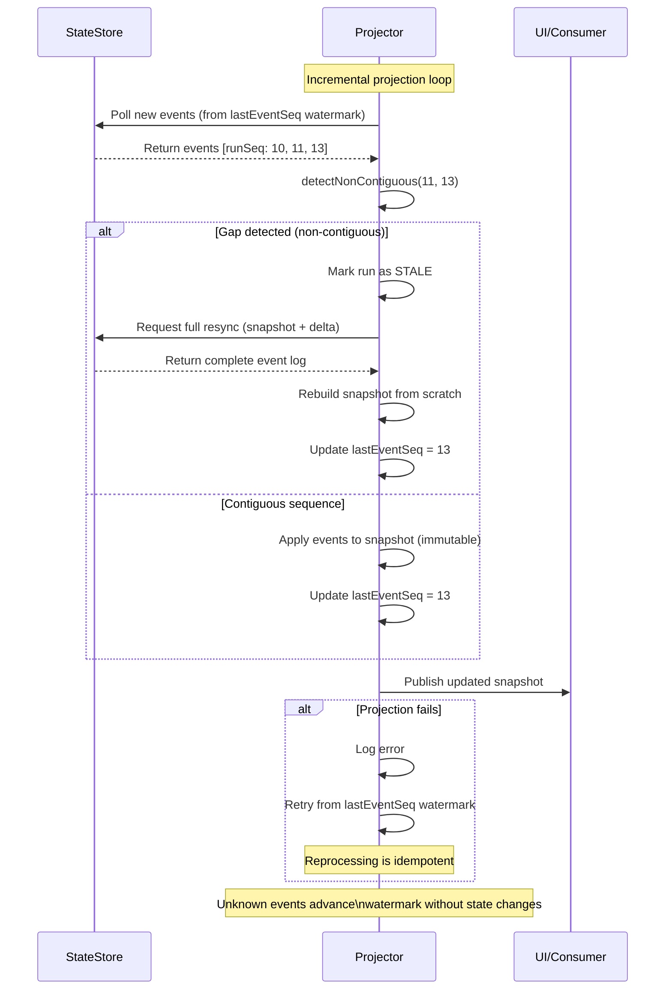
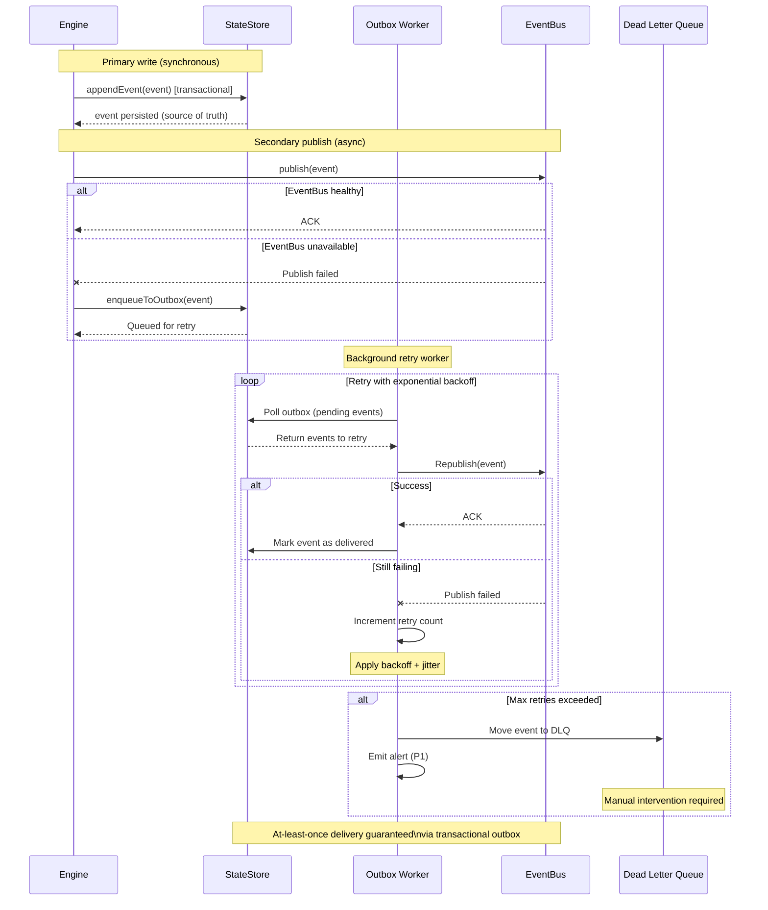
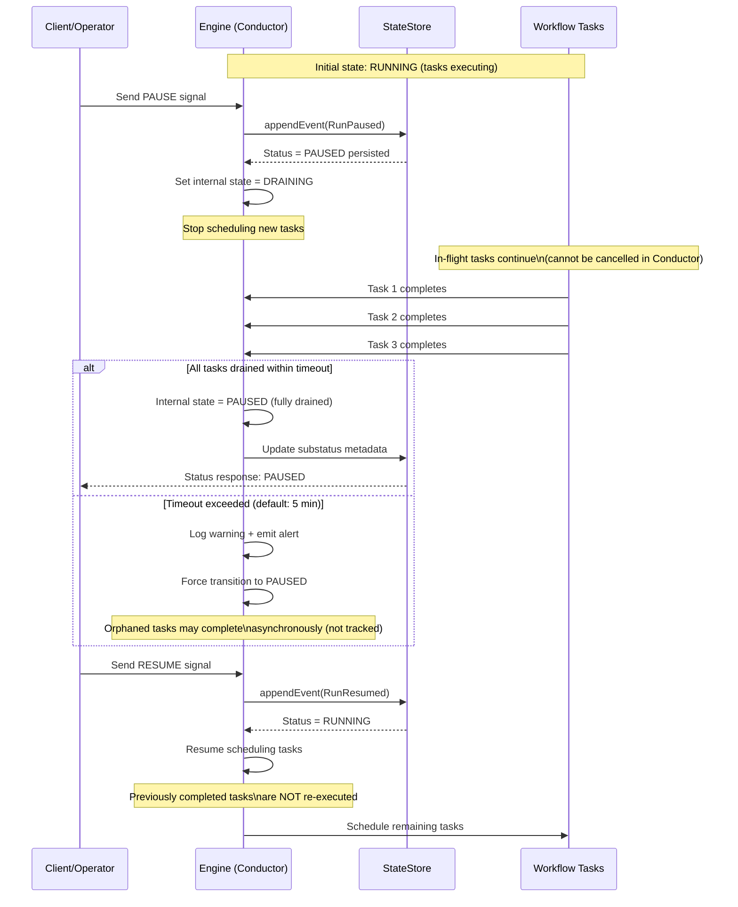

# Execution Semantics Contract (Normative v1.0)

**Status**: Normative (MUST / MUST NOT)  
**Version**: 1.1  
**Stability**: Core semantics — breaking changes require version bump  
**Consumers**: Engine, StateStore, Projector

**References**:
[IWorkflowEngine Contract](./IWorkflowEngine.v1.md)  
 [Contract Versioning Policy](../../VERSIONING.md) — how this contract evolves (minor/major bumps, deprecation)  
 [State Store Contract](../state-store/README.md) — storage-agnostic interface  
 [State Store Adapters](../../adapters/state-store/) — backend-specific implementations (Snowflake, Postgres, etc.)  
 [Temporal Engine Policies](../../adapters/temporal/EnginePolicies.md) — Temporal-specific policies (continue-as-new, limits)

**NOTE**: This document defines **core, storage/engine-agnostic semantics**. Physical schemas (DDLs), clustering strategies, and platform-specific policies (e.g., Temporal continue-as-new) are documented in adapter guides.

## **Diagram Note**: Mermaid diagrams are illustrative unless explicitly marked as NORMATIVE. In case of conflict, the normative text rules win

## 1) Source of Truth: StateStore Model

`IRunStateStore` is the **authoritative, persistent source of truth** for all execution state.

### 1.0 runSeq Design Decision

**Invariant**: `runSeq` is **monotonic per runId and event-ordered**, but NOT required to be contiguous. Gaps are allowed and natural.

**Why**:

- Distributed writers (activities, engine, planner) may batch events asynchronously
- Event bus + outbox pattern naturally creates gaps (not all seq#s are realized on every call)
- Contiguity requirement would force global sequencer (replica bottleneck; antipattern for distributed systems)
- Eventual consistency is explicit by design

**Implication**:

- UI observes non-contiguous fetches (e.g., `runSeq=10`, then `runSeq=12`) as normal behavior, not corruption
- Projector resumes from watermark (`lastEventSeq`); gaps are bridged by ongoing event emission
- Alert `PROJECTOR_NON_CONTIGUOUS_FETCH_DETECTED` indicates slow projection or lag, not data loss
- Operational monitoring focuses on watermark advancement, not gap closure

---

### 1.1 Monotonic Sequence Invariant (Storage-Agnostic)

Every event persisted to StateStore MUST include a **strictly increasing** `runSeq` (per `runId`).

**NORMATIVE invariants**:

- `runSeq` MUST be **monotonic** (strictly increasing per `runId`)
- `runSeq` is **NOT required to be contiguous** (gaps are allowed and natural)
- `runSeq` MUST be assigned by the **Append Authority** (see [State Store Contract § 3](../state-store/README.md#3-append-authority-pattern))

**Logical constraints** (MUST be enforced by all StateStore adapters):

- **Unique key**: `(runId, runSeq)` — no duplicate sequence numbers within a run
- **Uniqueness**: `(runId, idempotencyKey)` — same idempotency key cannot produce multiple events

**Physical implementation**: See backend-specific adapters:

- [Snowflake StateStore Adapter](../../adapters/state-store/snowflake/StateStoreAdapter.md) — DDL, MERGE patterns, clustering
- [Postgres StateStore Adapter](../../adapters/state-store/postgres/StateStoreAdapter.md) — SERIAL, ON CONFLICT, sequences

**UI consumption rule** (watermark-based polling):

UI polls events ordered by `runSeq`. If a non-contiguous fetch is observed (e.g., last seen `runSeq=10`, next fetched `runSeq=12`), it MUST be treated as **eventual consistency** (not corruption):

1. Mark run as `STALE`.
2. Trigger resync (refetch snapshot and/or refetch events from `lastEventSeq` watermark).
3. Resume once resync completes successfully AND `lastEventSeq` watermark advances beyond the previously observed non-contiguous range.

---

### 1.2 Append-Only Event Model

State is derived by reducing **append-only events** in order. No field is ever updated in-place.

**Canonical event types**:

| Event            | Emitted By     | Effect                                                 |
| ---------------- | -------------- | ------------------------------------------------------ |
| `RunApproved`    | Planner        | `status := APPROVED`                                   |
| `RunStarted`     | Engine         | `status := RUNNING`, `engineRunRef` recorded           |
| `StepStarted`    | Activity       | Step `status := RUNNING`                               |
| `StepCompleted`  | Activity       | Step `status := SUCCESS`, artifacts recorded           |
| `StepFailed`     | Activity       | Step `status := FAILED`, error recorded                |
| `StepSkipped`    | Engine         | Step `status := SKIPPED`, reason recorded              |
| `SignalAccepted` | IAuthorization | Decision recorded, does NOT change run status          |
| `SignalRejected` | IAuthorization | Signal denied                                          |
| `RunPaused`      | Engine         | `status := PAUSED` (see § 6 for Conductor limitations) |
| `RunResumed`     | Engine         | `status := RUNNING`                                    |
| `RunCompleted`   | Engine         | `status := COMPLETED`                                  |
| `RunFailed`      | Engine         | `status := FAILED`                                     |
| `RunCancelled`   | Engine         | `status := CANCELLED`                                  |

#### State Transition Diagram



**Diagram Notes**:

- State transitions are triggered by events or signals (see table above for event emitters)
- `RUNNING` state allows concurrent step execution based on plan dependencies
- `PAUSED` state behavior varies by adapter (Temporal: immediate; Conductor: draining)
- Terminal states (`COMPLETED`, `FAILED`, `CANCELLED`) are immutable

---

### 1.3 Dual Attempt Strategy (CRITICAL INVARIANT)

`attemptId` is decomposed into two distinct, required fields:

**`engineAttemptId` (infrastructure-level)**:

- Assigned by platform (Temporal SDK, Conductor runtime).
- Increments on ANY platform-level retry (network glitch, timeout, etc.).
- NOT used by Planner for dependencies, cost, or skip decisions.
- Visible to SRE for debugging.
- Example: `engineAttemptId=3` = Temporal retried activity 2 times before succeeding.

**`logicalAttemptId` (business-level)**:

- Assigned by Engine (monotonic per `stepId` per `runId`).
- Increments ONLY when:
  - Operator issues `RETRY_STEP` signal, OR
  - Planner policy dictates retry (e.g., backoff exhausted).
- Used by Planner for dependency resolution: **unique key is `(runId, stepId, logicalAttemptId)`**.
- Visible to UI as "Retry #1", "Retry #2", etc.
- Example: `logicalAttemptId=2` = operator/planner issued 1 retry signal.

**Idempotency key (NORMATIVE)**:

```
SHA256(runId | stepId | logicalAttemptId | eventType | planVersion)
```

NOT `engineAttemptId`. Same logical attempt retried by platform → same idempotency key.

---

### 1.4 Snapshot Projections (Derived State)

Two immutable views derived from append-only log:

```ts
interface RunSnapshot {
  runId: string;
  status: 'PENDING' | 'APPROVED' | 'RUNNING' | 'PAUSED' | 'COMPLETED' | 'FAILED' | 'CANCELLED';
  lastEventSeq: number; // High-water mark for UI sync
  steps: StepSnapshot[];
  artifacts: ArtifactRef[];
  startedAt?: string;
  completedAt?: string;
  totalDurationMs?: number;
}

interface StepSnapshot {
  stepId: string;
  status: 'PENDING' | 'RUNNING' | 'SUCCESS' | 'FAILED' | 'SKIPPED';
  logicalAttemptId: string;
  engineAttemptId?: string;
  startedAt?: string;
  completedAt?: string;
  artifacts: ArtifactRef[];
  error?: { code: string; message: string; retryable: boolean };
}
```

**Invariants**:

- Snapshots are **always immutable** (new object per projection, never in-place update).
- Projection lag SLA: ≤1s in normal operation.
- If lag > 5s, emit alert `PROJECTOR_LAG_HIGH` (P2).

---

### 1.5 Snapshot Projection Rules (Normative)

**Projector contract**:

```ts
interface SnapshotProjector {
  projectRun(runId: string, events: CanonicalEngineEvent[]): Promise<RunSnapshot>;
  incrementalProject(
    snapshot: RunSnapshot,
    newEvents: CanonicalEngineEvent[]
  ): Promise<RunSnapshot>;
  detectNonContiguous(
    lastSeq: number,
    nextSeq: number
  ): Promise<{ observedNonContiguous: boolean }>;
}
```

#### Projector Flow Diagram



**Diagram Notes**:

- **Transformation**: `(previousSnapshot, newEvents[]) → newSnapshot` (immutable projection)
- **Watermark-based**: `lastEventSeq` tracks highest applied event, enabling crash recovery
- **Gap handling**: Non-contiguous sequences trigger resync (not failure) due to eventual consistency
- **Error recovery**: Projector can safely reprocess events from watermark after crashes
- **Forward compatibility**: Unknown event types advance watermark but don't mutate state

**Normative rules**:

1. **Monotonic ordering**: Consume events in strictly increasing `runSeq` order.
   - If a non-contiguous observation is detected, the projector MUST NOT assume data loss.
   - The projector MUST pause incremental projection, request a resync (snapshot + delta), and resume once resync completes successfully AND the watermark (`lastEventSeq`) advances.
   - The projector MUST NOT "invent" missing sequences and MUST NOT reorder beyond `runSeq`.

2. **Immutability**: Each projection is a new snapshot. No in-place updates. `lastEventSeq` = highest `runSeq` applied.

3. **Event reduction** (idempotent state machine):
   - `RunApproved` → status = APPROVED
   - `RunStarted` → status = RUNNING, engineRunRef set
   - `StepStarted` → create/update step, status = RUNNING
   - `StepCompleted` → status = SUCCESS, record artifacts
   - `StepFailed` → status = FAILED, record error, update failedSteps counter
   - `RunPaused` → status = PAUSED
   - `RunResumed` → status = RUNNING
   - `RunCompleted` → status = COMPLETED, aggregate artifacts
   - `RunFailed` → status = FAILED, record root cause
   - `RunCancelled` → status = CANCELLED

4. **Failure recovery**: Projector crashes → resume from `lastEventSeq` watermark. Reprocessing same event idempotently is safe.

5. **UI lag SLA**:
   - ≤1s: normal
   - > 5s: alert P2 `PROJECTOR_LAG_HIGH`
   - non-contiguous fetch observed: alert P2 `PROJECTOR_NON_CONTIGUOUS_FETCH_DETECTED` (investigate consistency; resync may be needed)

6. **Unknown event types** (forward compatibility): Unknown `eventType` values MUST NOT fail projection. The projector MUST advance `lastEventSeq` for unknown events (to maintain watermark progress) but MUST NOT apply state transitions. Unknown events MAY be logged for audit purposes.

---

## 2) Secrets & Artifacts (Transient Data)

Plan MUST contain **only references** to secrets, never values.

**Secret resolution** (Activity-side):

```ts
interface ISecretsProvider {
  resolve(
    refs: SecretRef[],
    ctx: { tenantId: string; environmentId: string }
  ): Promise<Record<string, string>>;
}
```

**Artifact storage** (never in history):

```ts
type ArtifactRef = {
  uri: string; // s3://..., gs://..., azure://...
  kind: string; // "dbt-manifest", "dbt-run-results", "log-bundle", etc.
  sha256?: string;
  sizeBytes?: number;
  expiresAt?: string; // retention policy per kind
};

interface StepOutput {
  status: 'SUCCESS' | 'FAILED' | 'SKIPPED';
  artifactRefs: ArtifactRef[];
  error?: { category: string; code?: string; message: string; retryable?: boolean };
}
```

**StateStore contract**: Store only `ArtifactRef[]` pointers, never binary payloads.

---

## 3) Backpressure & Run Queue (Execution-Time)

Engine response to overload:

- **REJECT**: fail fast (429 + retry-after).
- **QUEUE**: persist in `PENDING`, enqueue for later.
- **DELAY**: accept but schedule activities with future start time.

**Run queue reconciler contract** (stateless, idempotent):

```ts
interface IRunQueueReconciler {
  dequeueAndStart(): Promise<{ runId: string; status: 'STARTED' | 'FAILED' | 'SKIPPED' }[]>;
}
```

**Idempotency**:

- Uniqueness constraint (database): `(tenantId, projectId, environmentId, planId, planVersion, runRequestId)`.
- Idempotency key: `SHA256(tenantId | projectId | environmentId | planId | planVersion | runRequestId)`.
- Double-start prevention: atomic lease acquire before `startRun()`.

---

## 4) Event Bus Integration (Eventually Consistent)

Secondary path for downstream consumers (Planner audits, UI updates, webhooks).

**Guarantees**:

- **Primary**: StateStore (synchronous, source of truth).
- **Secondary**: EventBus (asynchronous, eventually consistent, may be down).
- **Ordering**: per-runId guaranteed in StateStore; best-effort in EventBus.

**Failure handling**:

- EventBus publish fails → enqueue to **outbox** (StateStore) for retry worker.
- Retry policy: exponential backoff + jitter.
- After N failures → DLQ with alert.

### Outbox Pattern Flow Diagram



**Diagram Notes**:

- **At-least-once semantics**: Events may be delivered multiple times if retry succeeds after a previous timeout (consumers must be idempotent)
- **Transactional outbox**: Event persisted to StateStore and queued atomically, ensuring no event loss
- **Decoupled resilience**: EventBus downtime does not block Engine execution (events queued for later delivery)
- **Backpressure handling**: Retry worker applies exponential backoff to avoid overwhelming EventBus during recovery
- **Monitoring**: Alert `EVENT_BUS_DELIVERY_FAILED` (P1) emitted when events move to DLQ

---

## 5) StateStore Write Model & Latency Budget (Operational)

Activities emit events with bounded latency budget. If write budget exceeded:

- **Non-critical** (StepStarted): fail open to outbox (reconcile later).
- **Critical** (StepCompleted, StepFailed): fail step if budget exceeded.

**Latency budget config**:

```yaml
stateStore:
  writeLatencyBudgetMs: 3000
  failOpenForEventClass: ['StepStarted']
  neverFailOpen: ['StepCompleted', 'StepFailed']
```

---

## 6) Engine-Specific Policies

Execution engines (Temporal, Conductor, etc.) have platform-specific constraints that affect implementation:

**Temporal**:

- History size limits (50MB hard limit) → requires **continue-as-new** rotation
- Signal size/rate limits
- Determinism constraints
- See [Temporal Engine Policies](../../adapters/temporal/EnginePolicies.md) for details

**Conductor**:

- No native pause support → signal-based emulation required
- Different timeout semantics
<!-- - See [Conductor Engine Policies](../../adapters/conductor/EnginePolicies.md) (Planned: future document for Conductor-specific policies) -->

**NORMATIVE: PAUSE Limitations in Conductor**

Conductor does NOT support pause/resume natively. If the target adapter is Conductor, the PAUSE operation has the following constraints:

### PAUSE (Draining) Flow Diagram



**Diagram Notes**:

- **State transitions**: `RUNNING → PAUSED (StateStore)` + `RUNNING → DRAINING → PAUSED (Engine internal)`
- **Graceful draining**: Engine stops scheduling new tasks but allows in-flight tasks to complete naturally
- **No cancellation**: Conductor lacks cancellation tokens (unlike Temporal), so tasks must complete or timeout
- **Substatus visibility**: UI must display `DRAINING` substatus to manage user expectations during the transition period
- **Timeout handling**: Configurable drain timeout (default: 5 minutes) prevents indefinite waiting

1. **PAUSE semantics**: When a `PAUSE` signal is issued, the adapter MUST:
   - Set run status to `PAUSED` in StateStore
   - Mark the workflow as "draining" (no new tasks scheduled)
   - **NOT attempt to cancel or interrupt tasks already in-flight**

2. **In-flight task behavior**: Tasks that are currently executing WILL continue to completion. The adapter MUST NOT attempt to cancel them (Conductor lacks an equivalent to Temporal's cancellation tokens).

3. **Status transition**: After PAUSE is issued:
   - Status transitions to `PAUSED` immediately in StateStore
   - Engine internal state transitions to `DRAINING` until all in-flight tasks complete
   - Once all tasks complete, status remains `PAUSED`

4. **RESUME semantics**: When a `RESUME` signal is issued:
   - Engine resumes scheduling new tasks according to the plan
   - Previously completed tasks (before PAUSE) are NOT re-executed

5. **UI/API Contract**: API responses and UI MUST indicate when a run is in `PAUSED` state with `DRAINING` substatus to manage user expectations. Example:

   ```json
   {
     "status": "PAUSED",
     "substatus": "DRAINING",
     "message": "Workflow paused. Waiting for 3 in-flight tasks to complete."
   }
   ```

6. **Timeout Policy**: If in-flight tasks do not complete within a configurable timeout (default: 5 minutes), the adapter MUST:
   - Log a warning
   - Transition to `PAUSED` (with alert `PAUSE_DRAIN_TIMEOUT`)
   - Allow RESUME to proceed (orphaned tasks may complete asynchronously)

**Implementation Note**: This is a known limitation of Conductor. For use cases requiring immediate cancellation of in-flight work, Temporal is the recommended adapter.

**Storage-agnostic principle**: Core execution semantics (this document) remain independent of engine choice. Adapters bridge the gap.

---

## Schema Evolution (Versioning)

Changes to this contract follow **Semantic Versioning** (see [VERSIONING.md](../../VERSIONING.md)):

**MINOR Bump (v1.0 → v1.1)**: Backward-compatible additions

- New optional event types (consumers ignore unknown types)
- New optional fields in existing events (producers and consumers tolerate old/new shapes)
- Constraint relaxation (e.g., widened `maxLength` on a field)
- Documentation clarifications

**MAJOR Bump (v1.0 → v2.0)**: Breaking changes

- Remove required field or change field type
- Rename event type or field
- Narrow enum values or add validation constraints
- Change idempotency key structure
- Change status transition semantics

**Patch Update (v1.0.1, v1.0.2, etc.)**: Clarifications only

- No normative semantic changes
- Documentation fixes
- Tracked via git tags (e.g., `engine/ExecutionSemantics@v1.0.1`), not separate files

**Consumer compatibility note**:
Producers MUST emit events compatible with the contract version. Consumers MUST accept both old and new event shapes during grace periods (see VERSIONING.md for deprecation timelines).

---

## Change Log

| Version | Date       | Change                                                                                                                                                                                         |
| ------- | ---------- | ---------------------------------------------------------------------------------------------------------------------------------------------------------------------------------------------- |
| 1.1     | 2026-02-11 | **Minor**: Extracted storage/engine-specific content to adapters (Snowflake DDL → StateStoreAdapter.md, continue-as-new → Temporal EnginePolicies.md). Core semantics now fully agnostic.      |
| 1.0.1   | 2026-02-11 | **Patch**: Clarified non-contiguous semantics (resync exit condition uses watermark advancement, not gap closure); added normative rule for unknown eventType handling (forward compatibility) |
| 1.0     | 2026-02-11 | Initial normative contract (StateStore, events, dual attempts, projection)                                                                                                                     |

---

## Appendix A: Canonical Event Schemas (Normative)

**Source of Truth**: JSON Schema files are the authoritative source for event structure validation. This appendix provides human-readable examples and normative field descriptions.

**Schema Location**: `docs/architecture/engine/contracts/engine/events/*.schema.json` (planned)

---

### A.1 RunStarted Event

Emitted by the Engine when a workflow execution begins in the target orchestrator (Temporal, Conductor, etc.).

**JSON Schema Reference**: `RunStarted.schema.json` (planned)

**Normative Fields**:

```ts
interface RunStartedEvent {
  // Event envelope (common to all events)
  eventType: 'RunStarted';
  eventId: string; // UUID v4
  runId: string; // Workflow run identifier
  runSeq: number; // Monotonic sequence (per runId)
  idempotencyKey: string; // SHA256(runId | eventType | planVersion)
  emittedAt: string; // ISO 8601 timestamp (UTC)
  emittedBy: string; // e.g., "engine", "planner", "activity-worker"

  // Event payload (specific to RunStarted)
  status: 'RUNNING'; // Run status transition
  engineRunRef: string; // Engine-specific identifier (e.g., Temporal workflowId/runId, Conductor executionId)
  engineType: 'temporal' | 'conductor' | 'mock';
  planRef: {
    uri: string; // e.g., s3://bucket/plans/{planId}.json
    sha256: string; // Integrity hash
    schemaVersion: string; // e.g., "v1.2"
    planId: string;
    planVersion: string;
  };
  context: {
    tenantId: string;
    projectId: string;
    environmentId: string;
    triggeredBy?: string; // User ID or "system"
    triggerSource?: 'manual' | 'schedule' | 'webhook' | 'api';
  };
  startedAt: string; // ISO 8601 timestamp (when engine execution began)
}
```

**State Transition Rule** (NORMATIVE):

When a `RunStarted` event is applied to a snapshot projection:

1. `RunSnapshot.status` MUST transition to `"RUNNING"`.
2. `RunSnapshot.engineRunRef` MUST be set to `engineRunRef` from event payload.
3. `RunSnapshot.startedAt` MUST be set to `startedAt` from event payload.
4. `RunSnapshot.lastEventSeq` MUST be updated to the `runSeq` of this event.

**Idempotency Guarantee**:

- If a `RunStarted` event with the same `idempotencyKey` is received multiple times, only the first application MUST take effect.
- Subsequent duplicate events MUST be ignored (no-op) but still advance `lastEventSeq`.

**Example Payload**:

```json
{
  "eventType": "RunStarted",
  "eventId": "01234567-89ab-cdef-0123-456789abcdef",
  "runId": "run_2026-02-11_abc123",
  "runSeq": 2,
  "idempotencyKey": "d2a84f4b8b650937ec8f73cd8be2c74add5a911ba64df27458ed8229da804a26",
  "emittedAt": "2026-02-11T10:30:00.000Z",
  "emittedBy": "engine",
  "status": "RUNNING",
  "engineRunRef": "temporal://default/interpreter-workflow/run_2026-02-11_abc123/f47ac10b",
  "engineType": "temporal",
  "planRef": {
    "uri": "s3://dvt-plans/prod/plan_xyz_v1.2.json",
    "sha256": "e3b0c44298fc1c149afbf4c8996fb92427ae41e4649b934ca495991b7852b855",
    "schemaVersion": "v1.2",
    "planId": "plan_xyz",
    "planVersion": "1.2"
  },
  "context": {
    "tenantId": "tenant_acme",
    "projectId": "proj_marketing",
    "environmentId": "prod",
    "triggeredBy": "user_jane",
    "triggerSource": "manual"
  },
  "startedAt": "2026-02-11T10:30:00.000Z"
}
```

---

### A.2 Additional Event Schemas

For complete event schema specifications, see:

- **RunQueued**: Section 3 (Backpressure & Run Queue)
- **RunApproved**: Emitted by Planner (approval gate passed)
- **StepStarted**: Activity begins execution
- **StepCompleted**: Activity execution succeeded
- **StepFailed**: Activity execution failed
- **StepSkipped**: Activity skipped due to dependency failure or conditional logic
- **StepDelayed**: Activity execution delayed due to throttling or backpressure
- **RunPaused**: Workflow paused (via PAUSE signal)
- **RunResumed**: Workflow resumed (via RESUME signal)
- **RunCompleted**: All steps completed successfully
- **RunFailed**: Workflow failed (unrecoverable error)
- **RunCancelled**: Workflow cancelled (via user or system signal)
- **SignalAccepted**: External signal received and validated
- **SignalRejected**: External signal rejected (authorization or validation failure)

**JSON Schema Files** (planned):

```
docs/architecture/engine/contracts/engine/events/
  RunStarted.schema.json
  RunQueued.schema.json
  StepStarted.schema.json
  StepCompleted.schema.json
  StepFailed.schema.json
  StepDelayed.schema.json
  RunPaused.schema.json
  RunResumed.schema.json
  RunCompleted.schema.json
  RunFailed.schema.json
  RunCancelled.schema.json
  SignalAccepted.schema.json
  SignalRejected.schema.json
```

**Validation Rule** (NORMATIVE):

All events emitted by the Engine, Planner, or Activity Workers MUST validate against their respective JSON Schema before being persisted to the StateStore. Invalid events MUST be rejected with a `SCHEMA_VALIDATION_FAILED` error and MUST NOT be persisted.
