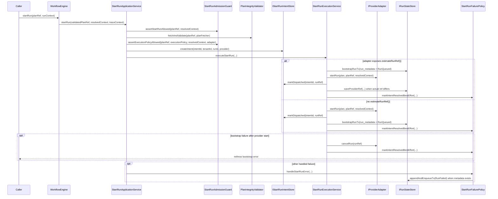

# StartRun Protocol (Normative v1)

[<- Back to Contracts Registry](../README.md)

**Status**: ACTIVE  
**Version**: v1  
**Stability**: Contracts - breaking changes require version bump  
**Consumers**: Engine reviewers, API orchestration, adapter implementers, state-store reviewers  
**References**:
[ADR-0012-plan-integrity-ownership.md](../../../../adr/ADR-0012-plan-integrity-ownership.md),
[ADR-0013-run-state-store-bootstrapRunTx.md](../../../../adr/ADR-0013-run-state-store-bootstrapRunTx.md),
[ADR-0014-run-driven-adapter-model.md](../../../../adr/ADR-0014-run-driven-adapter-model.md),
[ADR-0030-pre-dispatch-intent-log.md](../../../../adr/ADR-0030-pre-dispatch-intent-log.md)

---

## 1) Purpose

This artifact codifies the `startRun()` protocol already implemented in the
repository.

It does not introduce a new execution path.

Its job is to make the existing protocol reviewable without forcing readers to
reconstruct it from `WorkflowEngine`, `StartRunApplicationService`,
`StartRunAdmissionGuard`, `StartRunExecutionService`, and
`StartRunFailurePolicy`.

---

## 2) Entry Point And Owning Units

The public entry point remains:

```ts
interface IWorkflowEngine {
  startRun(planRef: PlanRef, context: RunContext): Promise<EngineRunRef>;
}
```

The current implementation units are:

| Role                    | Unit                                                                                                                                    | Responsibility                                                                                                                |
| ----------------------- | --------------------------------------------------------------------------------------------------------------------------------------- | ----------------------------------------------------------------------------------------------------------------------------- |
| Public facade           | [`WorkflowEngine`](../../../../../packages/@dvt/engine/src/core/WorkflowEngine.ts)                                                      | Parses `PlanRef` and `RunContext`, resolves initial run lineage, builds trace context, delegates to application service       |
| Application coordinator | [`StartRunApplicationService`](../../../../../packages/@dvt/engine/src/application/StartRunApplicationService.ts)                       | Orchestrates admission, integrity verification, intent creation, dispatch, and failure policy                                 |
| Admission boundary      | [`StartRunAdmissionGuard`](../../../../../packages/@dvt/engine/src/application/StartRunAdmissionGuard.ts)                               | Runs preconditions, adapter resolution, capability checks, and runExecutionContext admission                                  |
| Validation policy       | [`StartRunValidationPolicy`](../../../../../packages/@dvt/engine/src/services/startRun/StartRunValidationPolicy.ts)                     | Tenant access, `PlanRef` policy, schema/version validation, run-id validation, duplicate-run rejection, capability validation |
| Context admission       | [`RunExecutionContextAdmissionPolicy`](../../../../../packages/@dvt/engine/src/services/startRun/RunExecutionContextAdmissionPolicy.ts) | Validates `runExecutionContextRef` alignment and compatibility fingerprints                                                   |
| Dispatch + bootstrap    | [`StartRunExecutionService`](../../../../../packages/@dvt/engine/src/services/startRun/StartRunExecutionService.ts)                     | Calls provider adapter, marks intent dispatched, bootstraps run state, compensates on bootstrap failure                       |
| Failure handling        | [`StartRunFailurePolicy`](../../../../../packages/@dvt/engine/src/services/startRun/StartRunFailurePolicy.ts)                           | Logs/metrics, best-effort intent resolution, guarded `RunFailed` emission after persisted metadata exists                     |
| Metadata/event factory  | [`StartRunEventFactory`](../../../../../packages/@dvt/engine/src/services/startRun/StartRunEventFactory.ts)                             | Constructs `RunMetadata`, `RunQueued`, provider-ref updates, and failure events                                               |

---

## 3) End-To-End Protocol



---

## 4) Phase-By-Phase Specification

### 4.1 Admission

The admission phase is already implemented by:

- [`WorkflowEngine.startRun()`](../../../../../packages/@dvt/engine/src/core/WorkflowEngine.ts)
- [`StartRunApplicationService.startRunCore()`](../../../../../packages/@dvt/engine/src/application/StartRunApplicationService.ts)
- [`StartRunAdmissionGuard.assertStartRunAllowed()`](../../../../../packages/@dvt/engine/src/application/StartRunAdmissionGuard.ts)
- [`StartRunValidationPolicy.validateStartRunPreconditions()`](../../../../../packages/@dvt/engine/src/services/startRun/StartRunValidationPolicy.ts)
- [`StartRunAdmissionGuard.resolveAdapter()`](../../../../../packages/@dvt/engine/src/application/StartRunAdmissionGuard.ts)
- [`StartRunAdmissionGuard.assertExecutionPolicyAllowed()`](../../../../../packages/@dvt/engine/src/application/StartRunAdmissionGuard.ts)
- [`RunExecutionContextAdmissionPolicy.assertAllowed()`](../../../../../packages/@dvt/engine/src/services/startRun/RunExecutionContextAdmissionPolicy.ts)

The admission phase currently performs:

1. parse and normalize `PlanRef`
2. parse and normalize `RunContext`
3. resolve initial lineage fields:
   - `logicalAttemptId = 1`
   - `originRunId = runId`
4. tenant access check
5. `PlanRef` policy validation
6. `schemaVersion` validation
7. supported `planVersion` validation
8. `runId` format validation
9. duplicate-run rejection through `getRunMetadataByRunId()`
10. rate-limit check
11. adapter lookup
12. execution-policy capability checks
13. optional `runExecutionContextRef` alignment and compatibility checks

This phase rejects before any provider side effect.

### 4.2 Integrity Verification

The integrity phase is already implemented by:

- [`PlanIntegrityValidator.fetchAndValidate()`](../../../../../packages/@dvt/engine/src/security/planIntegrity.ts)
- invoked from [`StartRunApplicationService.startRunCore()`](../../../../../packages/@dvt/engine/src/application/StartRunApplicationService.ts)

The integrity phase currently performs:

1. fetch executable plan material from the configured `planFetcher`
2. parse the executable `ExecutionPlan`
3. validate plan metadata against `PlanRef`
4. recompute plan identity from plan core
5. reject before adapter dispatch if integrity fails

This is the authoritative integrity gate mandated by ADR-0012.

### 4.3 Intent Creation

The intent phase is already implemented by:

- [`StartRunApplicationService.createStartRunIntent()`](../../../../../packages/@dvt/engine/src/application/StartRunApplicationService.ts)
- [`IStartRunIntentStore.createIntent()`](../../../../../packages/@dvt/engine/src/ports/IStartRunIntentStore.ts)
- [`IdempotencyKeyBuilder.startRunIntentId()`](../../../../../packages/@dvt/engine/src/core/idempotency.ts)

The intent phase currently performs:

1. derive a deterministic `intentId`
2. persist a `PENDING` intent before provider dispatch
3. attach:
   - `tenantId`
   - `runId`
   - `provider`
   - `createdAt`

This is the crash-consistency entry point mandated by ADR-0030.

### 4.4 Dispatch

The dispatch phase is already implemented by:

- [`StartRunExecutionService.executeStartRun()`](../../../../../packages/@dvt/engine/src/services/startRun/StartRunExecutionService.ts)
- [`StartRunExecutionService.startAdapterAndMarkDispatched()`](../../../../../packages/@dvt/engine/src/services/startRun/StartRunExecutionService.ts)

The dispatch phase currently performs:

1. choose between:
   - `startRunWithEstimatedRef()`
   - `startRunWithoutEstimatedRef()`
2. call `adapter.startRun(plan, planRef, resolvedContext)`
3. enforce adapter-start timeout through `withTimeout(...)`
4. persist `DISPATCHED` intent state via `markDispatched(intentId, runRef)`
5. treat post-start intent persistence failure as a first-class error
   (`PostStartIntentPersistenceError`)

The adapter receives the already verified `ExecutionPlan` plus the original
`PlanRef`.

### 4.5 Bootstrap Behavior

Bootstrap behavior is already implemented by:

- [`StartRunExecutionService.startRunWithEstimatedRef()`](../../../../../packages/@dvt/engine/src/services/startRun/StartRunExecutionService.ts)
- [`StartRunExecutionService.startRunWithoutEstimatedRef()`](../../../../../packages/@dvt/engine/src/services/startRun/StartRunExecutionService.ts)
- [`StartRunExecutionService.bootstrapRunTxWithCompensation()`](../../../../../packages/@dvt/engine/src/services/startRun/StartRunExecutionService.ts)
- [`StartRunEventFactory.buildRunMetadata()`](../../../../../packages/@dvt/engine/src/services/startRun/StartRunEventFactory.ts)
- [`StartRunEventFactory.buildRunEvent()`](../../../../../packages/@dvt/engine/src/services/startRun/StartRunEventFactory.ts)

There are two current bootstrap branches.

#### Branch A: adapter provides `estimateRunRef()`

Implemented by `startRunWithEstimatedRef()`.

Current order:

1. derive estimated provider ref
2. build `RunMetadata` from the estimated ref
3. atomically call `bootstrapRunTx(...)` with:
   - `run_metadata`
   - first event: `RunQueued`
4. call `adapter.startRun(...)`
5. mark the intent `DISPATCHED`
6. if the actual provider ref differs from the estimated one, call
   `saveProviderRef(...)` fail-soft
7. best-effort resolve the intent

#### Branch B: adapter does not provide `estimateRunRef()`

Implemented by `startRunWithoutEstimatedRef()`.

Current order:

1. call `adapter.startRun(...)`
2. mark the intent `DISPATCHED`
3. build `RunMetadata` from the actual provider ref
4. atomically call `bootstrapRunTx(...)` with:
   - `run_metadata`
   - first event: `RunQueued`
5. best-effort resolve the intent

In both branches:

- `bootstrapRunTx` is the only write path for initial run metadata
- the first persisted lifecycle fact is `RunQueued`
- `RunMetadata` and `RunQueued` are built by `StartRunEventFactory`

### 4.6 Failure Handling And Compensation

Failure handling is already implemented by:

- [`StartRunExecutionService.bootstrapRunTxWithCompensation()`](../../../../../packages/@dvt/engine/src/services/startRun/StartRunExecutionService.ts)
- [`StartRunFailurePolicy.handleStartRunError()`](../../../../../packages/@dvt/engine/src/services/startRun/StartRunFailurePolicy.ts)
- [`StartRunFailurePolicy.markIntentResolvedBestEffort()`](../../../../../packages/@dvt/engine/src/services/startRun/StartRunFailurePolicy.ts)

Current failure behavior:

1. if bootstrap fails after provider start in the non-estimated branch:
   - call `adapter.cancelRun(runRef)` as compensation
   - best-effort resolve the intent
   - rethrow the bootstrap error
2. if `markDispatched(...)` fails after `adapter.startRun(...)` succeeded:
   - raise `PostStartIntentPersistenceError`
   - log/report the failure
   - do not fabricate a synthetic success path
3. if a start-run error reaches `StartRunFailurePolicy.handleStartRunError(...)`:
   - report metrics/logging
   - if metadata does not exist yet, rethrow without emitting `RunFailed`
   - if the tracked intent is still `PENDING`, rethrow without emitting `RunFailed`
   - otherwise append `RunFailed` best-effort through `appendAndEnqueueTx(...)`

This keeps failure emission aligned with persisted run existence rather than
inventing lifecycle facts for runs that never completed bootstrap.

---

## 5) Existing ADR-Governed Invariants

### 5.1 ADR-0012: Plan Integrity Ownership

This protocol MUST preserve:

- engine-side fetch and verification before adapter dispatch
- centralized `planId` verification from plan core
- adapter execution of the same verified `ExecutionPlan` object the engine
  approved
- fail-closed rejection before any adapter execution if integrity fails

Implemented today by:

- [`StartRunApplicationService.startRunCore()`](../../../../../packages/@dvt/engine/src/application/StartRunApplicationService.ts)
- [`PlanIntegrityValidator.fetchAndValidate()`](../../../../../packages/@dvt/engine/src/security/planIntegrity.ts)

### 5.2 ADR-0013: `bootstrapRunTx` Atomicity

This protocol MUST preserve:

- atomic persistence of:
  - `run_metadata`
  - first events
  - outbox rows
- use of `bootstrapRunTx(...)` for the first run write
- no mid-run metadata creation via non-bootstrap paths

Implemented today by:

- [`StartRunExecutionService.startRunWithEstimatedRef()`](../../../../../packages/@dvt/engine/src/services/startRun/StartRunExecutionService.ts)
- [`StartRunExecutionService.bootstrapRunTxWithCompensation()`](../../../../../packages/@dvt/engine/src/services/startRun/StartRunExecutionService.ts)
- [`IRunStateStore.bootstrapRunTx`](../../../../../packages/@dvt/engine/src/ports/IRunStateStore.ts)

### 5.3 ADR-0030: Pre-Dispatch Intent Log

This protocol MUST preserve:

- intent creation before provider dispatch
- `markDispatched(...)` after provider dispatch returns
- `markResolved(...)` on success and best-effort resolution on cleanup
- intent-store dependency as mandatory engine wiring
- reconciliation-compatible intent lifecycle:
  - `PENDING`
  - `DISPATCHED`
  - `RESOLVED`
  - `EXPIRED`

Implemented today by:

- [`StartRunApplicationService.createStartRunIntent()`](../../../../../packages/@dvt/engine/src/application/StartRunApplicationService.ts)
- [`StartRunExecutionService.startAdapterAndMarkDispatched()`](../../../../../packages/@dvt/engine/src/services/startRun/StartRunExecutionService.ts)
- [`StartRunFailurePolicy.markIntentResolvedBestEffort()`](../../../../../packages/@dvt/engine/src/services/startRun/StartRunFailurePolicy.ts)
- mandatory dependency checks in [`WorkflowEngine.validateDependencies()`](../../../../../packages/@dvt/engine/src/core/WorkflowEngine.ts)

---

## 6) Review Checklist

Reviewers can verify the protocol by checking:

1. `WorkflowEngine.startRun()` delegates only to `StartRunApplicationService`
2. admission happens before integrity and before any provider side effect
3. integrity verification happens before adapter dispatch
4. an intent is created before provider dispatch
5. provider dispatch marks the intent `DISPATCHED`
6. one of the two documented bootstrap branches executes
7. `RunQueued` is the first persisted lifecycle event
8. bootstrap failure in the non-estimated branch compensates with `cancelRun`
9. `RunFailed` is only emitted when persisted run metadata exists

No new protocol is defined by this artifact.

It documents the current protocol already implemented in code.
