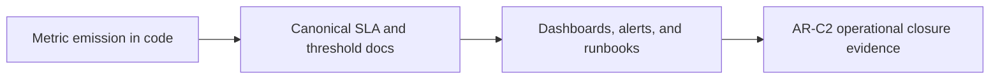

# Engine SLO Posture

This page is the current interpretation surface for engine and runtime SLOs.

It does not invent its own thresholds.

Canonical threshold and alert definitions live in:

- [API Runtime SLA Canonical](../../../runbooks/api-runtime-sla-canonical-20260404.md)
- [AR-C2 SLA signal threshold mapping](../../../runbooks/ar-c2-sla-signal-threshold-mapping-20260404.md)
- [Backend MVP Control-Plane Runbook](../../../runbooks/backend-mvp-control-plane-runbook-20260329.md)

Use this page to answer:

- which engine-adjacent signals are active today;
- which SLOs are implemented versus derived versus still planned;
- which operational claims should not be treated as current truth.

## Current posture

- Start-run latency and plan-compile latency are implemented signals.
- Snapshot freshness ratios are derived from emitted metrics.
- Outbox drain lag and event-delivery latency are implemented runtime signals.
- Dashboard and alert closure still route through `AR-C2`; do not treat this
  page as proof that all operational wiring is complete.

## Signal model

## Current engine/runtime SLO surface

| Signal family                         | Current posture                  | Canonical source                                                                     | Operational reading                                                          |
| ------------------------------------- | -------------------------------- | ------------------------------------------------------------------------------------ | ---------------------------------------------------------------------------- |
| Start-run latency                     | Implemented                      | [API Runtime SLA Canonical](../../../runbooks/api-runtime-sla-canonical-20260404.md) | Real active signal; use canonical thresholds there                           |
| Plan-compile latency                  | Implemented                      | [API Runtime SLA Canonical](../../../runbooks/api-runtime-sla-canonical-20260404.md) | Real active signal; use canonical thresholds there                           |
| Snapshot freshness and unknown ratios | Derived from implemented metrics | [API Runtime SLA Canonical](../../../runbooks/api-runtime-sla-canonical-20260404.md) | Use derived ratios, not hand-written freshness claims                        |
| Outbox drain lag                      | Implemented                      | [API Runtime SLA Canonical](../../../runbooks/api-runtime-sla-canonical-20260404.md) | Real runtime signal; canonical threshold wiring still closes through `AR-C2` |
| Event-delivery latency                | Implemented                      | [API Runtime SLA Canonical](../../../runbooks/api-runtime-sla-canonical-20260404.md) | Real runtime signal; alert routing must follow the threshold mapping doc     |
| Availability and error-budget posture | Supporting interpretation only   | [API Runtime SLA Canonical](../../../runbooks/api-runtime-sla-canonical-20260404.md) | Do not reuse the old Q1 budget examples as active truth                      |

## Engine-specific interpretation rules

- Engine SLOs cover control-plane behavior, not warehouse execution time.
- Data-plane task durations are useful measurements, but they are not the same
  thing as engine-owned control-plane SLOs.
- A second-provider fallback is not part of the current operational model; only
  Temporal is implemented today.
- If a threshold is not present in the canonical SLA and threshold-mapping docs,
  it is not an active alert policy.

## What is not current truth anymore

Do not use these as active operational posture:

- quarter-specific error-budget examples from February 2026;
- phase-labeled cost-per-run promises;
- Phase 1 or Phase 2 rollout wording as if it were the current operations model;
- fallback examples that assume a real Conductor production path exists today.

## Next closure path

The remaining operational closure is already tracked in Lane C:

1. dashboard wiring evidence (`AR-C2-T2`)
2. alert wiring evidence (`AR-C2-T3`)
3. sustained threshold validation evidence (`AR-C2-T4`)

Use Lane C, not this page, to decide whether the SLO program is closed.
