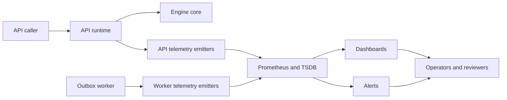

# Engine Observability Guide

This is the active observability routing surface for the engine/runtime stack.

Use it to answer these questions:

- which telemetry families are current and safe to reason from;
- which docs own thresholds, dashboards, and operator actions;
- which runtime endpoints and emitters exist today;
- which old observability claims are no longer valid.

This page does not define alert thresholds. Threshold ownership lives in the
canonical runtime SLA documents.

## Canonical companions

- [Engine SLO Posture](./SLOs.md)
- [Engine Severity Matrix](./runbooks/severity_matrix.md)
- [Engine Incident Response Runbook](./runbooks/incident_response.md)
- [API Runtime SLA Canonical](../../../runbooks/api-runtime-sla-canonical-20260404.md)
- [AR-C2 SLA Signal Threshold Mapping](../../../runbooks/ar-c2-sla-signal-threshold-mapping-20260404.md)
- [AR-C2 Observability Technical Manual](../../../guides/ar-c2-observability-technical-manual-20260404.md)
- [AR-C2 Observability User Manual](../../../guides/ar-c2-observability-user-manual-20260404.md)
- [Outbox Worker Runbook](../../../runbooks/outbox-worker-g5.md)
- [Backend MVP Control-Plane Runbook](../../../runbooks/backend-mvp-control-plane-runbook-20260329.md)

## Current posture

- API runtime and outbox worker telemetry are the current operator-facing
  observability surfaces.
- Only Temporal is implemented as a real provider runtime path today.
- Outbox worker health, readiness, ownership, lag, and delivery metrics are
  first-class operational signals.
- Dashboard and alert closure still belongs to Lane C `AR-C2`; do not claim a
  dashboard or alert is operationally closed unless the AR-C2 evidence surfaces
  prove it.

## Telemetry topology

## Current signal families

| Signal family                       | Logical signal                                                                     | Current source                                                                                         | Code anchor                                                                                            |
| ----------------------------------- | ---------------------------------------------------------------------------------- | ------------------------------------------------------------------------------------------------------ | ------------------------------------------------------------------------------------------------------ |
| API admission/runtime latency       | `dvt.api.run_start.latency_ms`                                                     | [API Runtime SLA Canonical](../../../runbooks/api-runtime-sla-canonical-20260404.md)                   | `apps/api/src/infrastructure/telemetry/ObservabilityStartRunSlaTelemetry.ts`                           |
| Planner/API compile latency         | `dvt.api.plan_compile.latency_ms`                                                  | [API Runtime SLA Canonical](../../../runbooks/api-runtime-sla-canonical-20260404.md)                   | `apps/api/src/infrastructure/telemetry/ObservabilityStartRunSlaTelemetry.ts`                           |
| Run-status freshness classification | `dvt.api.run_status.snapshot_staleness_result_total`                               | [API Runtime SLA Canonical](../../../runbooks/api-runtime-sla-canonical-20260404.md)                   | `apps/api/src/infrastructure/telemetry/ObservabilityRunStatusStalenessTelemetry.ts`                    |
| Unknown freshness fallback reasons  | `dvt.api.run_status.snapshot_staleness_fallback_unknown_total`                     | [API Runtime SLA Canonical](../../../runbooks/api-runtime-sla-canonical-20260404.md)                   | `apps/api/src/infrastructure/telemetry/ObservabilityRunStatusStalenessTelemetry.ts`                    |
| Outbox claimed-lag                  | `dvt_outbox_oldest_claimed_lag_seconds`                                            | [AR-C2 SLA Signal Threshold Mapping](../../../runbooks/ar-c2-sla-signal-threshold-mapping-20260404.md) | `apps/outbox-worker/src/ops/OutboxWorkerMonitor.ts`                                                    |
| Outbox drain lag                    | `dvt_delivery_outbox_drain_lag_seconds`                                            | [AR-C2 SLA Signal Threshold Mapping](../../../runbooks/ar-c2-sla-signal-threshold-mapping-20260404.md) | `apps/outbox-worker/src/ops/OutboxWorkerMonitor.ts`                                                    |
| Event delivery latency              | `dvt_delivery_event_delivery_latency_ms`                                           | [AR-C2 SLA Signal Threshold Mapping](../../../runbooks/ar-c2-sla-signal-threshold-mapping-20260404.md) | `apps/outbox-worker/src/ops/OutboxWorkerMonitor.ts`                                                    |
| Worker readiness and ownership      | `dvt_outbox_runtime_ready`, `dvt_outbox_runtime_owner`, `dvt_outbox_runtime_state` | [Outbox Worker Runbook](../../../runbooks/outbox-worker-g5.md)                                         | `apps/outbox-worker/src/ops/OperationalServer.ts`, `apps/outbox-worker/src/ops/OutboxWorkerMonitor.ts` |

## Operator surfaces

### API control plane

Use the backend MVP runbook for:

- `GET /healthz`
- `GET /readyz` when `DVT_READYZ_ENABLED=true`
- protected runtime route posture and auth diagnosis

Reference:

- [Backend MVP Control-Plane Runbook](../../../runbooks/backend-mvp-control-plane-runbook-20260329.md)

### Outbox worker runtime

Use the outbox worker runbook for:

- `GET /healthz`
- `GET /readyz`
- `GET /metrics`
- ownership posture, readiness, retry pressure, and delivery lag

Reference:

- [Outbox Worker Runbook](../../../runbooks/outbox-worker-g5.md)

## Reading rules

- Use logical signal names from the canonical SLA docs when discussing posture.
- Use exported underscore metric names only when writing PromQL.
- Treat stale and unknown freshness as derived ratios from the implemented
  staleness counters, not as standalone invented metrics.
- Treat the outbox claimed-lag metric as observational unless the canonical
  threshold docs say otherwise.
- Do not infer a second-provider dashboard, failover lane, or adapter health
  panel from historical Conductor material.

## What is no longer valid observability truth

Do not use these older assumptions as current operator guidance:

- `Phase 1` dashboard sketches and quarter-based rollout language;
- fake multi-provider dashboards that show Conductor as a live production path;
- threshold tables that are not traceable to the canonical SLA and mapping docs;
- ASCII mock dashboards or alert examples presented as if they were real wired
  operational panels.

## Current closure path

Lane C owns the remaining operational closeout:

1. `AR-C2-T2` dashboard wiring evidence
2. `AR-C2-T3` alert wiring and routing evidence
3. `AR-C2-T4` sustained threshold-validation evidence

Until those are closed with evidence, this guide should be read as the current
telemetry model and routing surface, not as proof that every panel and alert is
already live.
