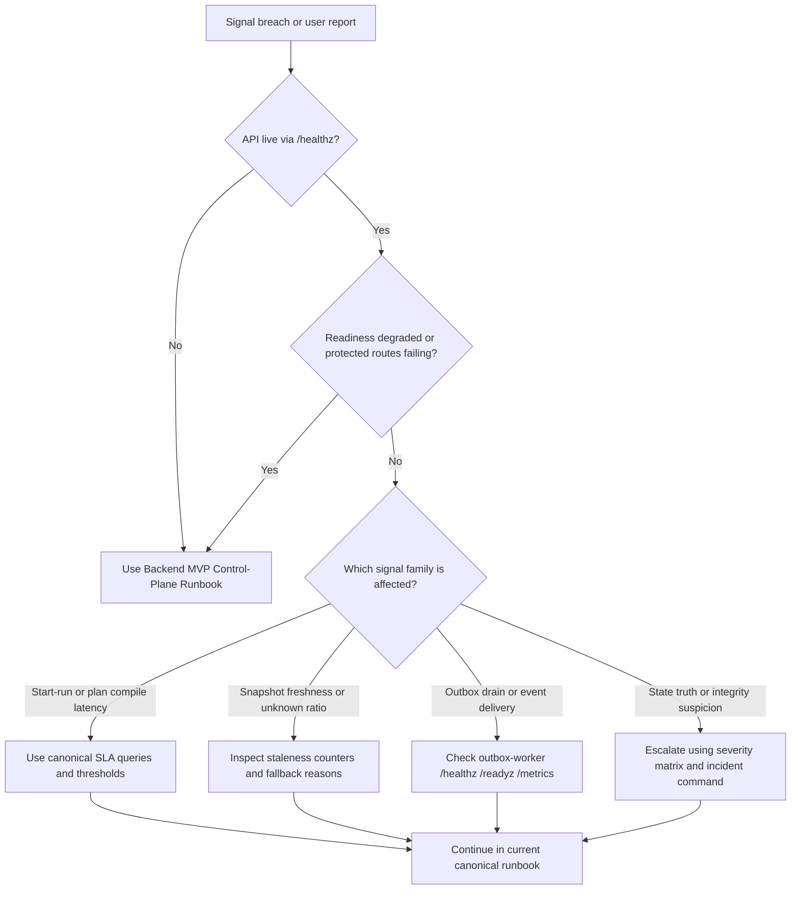

# Engine Incident Response Runbook

This is the current incident routing surface for engine/runtime operations.

Use it to decide:

- how to classify an engine/runtime incident quickly;
- which current health endpoints and metrics to verify first;
- which canonical runbook owns the next diagnostic step;
- which outdated recovery habits must not be used anymore.

This page is intentionally truth-first. It does not include shell recipes that
the repository cannot back with current operational surfaces.

## Canonical companions

- [Engine Severity Matrix](./severity_matrix.md)
- [Engine SLO Posture](../SLOs.md)
- [Engine Observability Guide](../observability.md)
- [Backend MVP Control-Plane Runbook](../../../../runbooks/backend-mvp-control-plane-runbook-20260329.md)
- [Outbox Worker Runbook](../../../../runbooks/outbox-worker-g5.md)
- [API Runtime SLA Canonical](../../../../runbooks/api-runtime-sla-canonical-20260404.md)
- [AR-C2 SLA Signal Threshold Mapping](../../../../runbooks/ar-c2-sla-signal-threshold-mapping-20260404.md)

## Current incident model

- Only one implemented provider runtime exists today: Temporal.
- API health and readiness posture are owned by the backend MVP control-plane
  runbook.
- Outbox delivery readiness, ownership, lag, and delivery latency are owned by
  the standalone outbox worker runtime.
- Severity classification must follow the current severity matrix, not the
  February phase plan.

## First-response decision tree

## First 5 minutes

1. Capture UTC time, impacted environment, affected tenant or project, and any
   known `runId`.
2. Classify the event with the [Engine Severity Matrix](./severity_matrix.md).
3. Verify API liveness with `/healthz`.
4. If readiness is enabled, verify `/readyz`.
5. If auth is available, sample one protected runtime read path (`GET /runs` or
   `GET /runs/:runId`) before assuming engine-core corruption.
6. If the symptom involves event delivery or lag, verify outbox-worker
   `/healthz`, `/readyz`, and `/metrics`.
7. Compare observed values against the canonical SLA and threshold-mapping docs
   before declaring a real breach.

## Incident families

### API unavailable or protected runtime misbehaving

Use:

- [Backend MVP Control-Plane Runbook](../../../../runbooks/backend-mvp-control-plane-runbook-20260329.md)

This is the authoritative path for:

- `/healthz` failures
- `/readyz` failures
- protected route registration issues
- `401` versus `403` diagnosis
- OIDC and runtime-readiness posture

### Start-run or plan-compile latency breach

Use:

- [API Runtime SLA Canonical](../../../../runbooks/api-runtime-sla-canonical-20260404.md)
- [AR-C2 SLA Signal Threshold Mapping](../../../../runbooks/ar-c2-sla-signal-threshold-mapping-20260404.md)

Check:

- `dvt_api_run_start_latency_ms_bucket`
- `dvt_api_plan_compile_latency_ms_bucket`

Do not substitute old `run completion` or `pause latency` dashboards for the
current Lane C signal set.

### Snapshot freshness or unknown-ratio breach

Use:

- [API Runtime SLA Canonical](../../../../runbooks/api-runtime-sla-canonical-20260404.md)

Check:

- `dvt_api_run_status_snapshot_staleness_result_total`
- `dvt_api_run_status_snapshot_staleness_fallback_unknown_total`

Treat this as a read-surface freshness problem first, not as proof that the
entire engine event model is corrupted.

### Outbox drain or event-delivery breach

Use:

- [Outbox Worker Runbook](../../../../runbooks/outbox-worker-g5.md)
- [AR-C2 SLA Signal Threshold Mapping](../../../../runbooks/ar-c2-sla-signal-threshold-mapping-20260404.md)

Check:

- worker `/healthz`
- worker `/readyz`
- worker `/metrics`
- `dvt_outbox_runtime_owner`
- `dvt_delivery_outbox_drain_lag_seconds`
- `dvt_delivery_event_delivery_latency_ms`

If ownership is false or readiness is red, treat the issue as runtime-ownership
or delivery-runtime posture before assuming downstream event-bus failure.

### State integrity or run-truth suspicion

Use:

- [Engine Severity Matrix](./severity_matrix.md)
- [System Delivery Status](../../../system-delivery-status.md)

Escalate immediately when:

- authoritative run truth is suspected to be corrupted;
- read surfaces contradict the current state-store truth model in a way that is
  not explained by known freshness windows;
- operators are considering manual mutation of run state.

## What not to do

Do not use these outdated habits:

- assuming `Temporal offline, Conductor available` as a fallback posture;
- treating February phase tables as current incident logic;
- performing ad hoc direct database state rewrites because an old runbook said
  so;
- declaring recovery from a mock dashboard or historical metric name that is not
  backed by the current canonical SLA docs.

## Escalation rule

- Sev0 or Sev1: incident command immediately
- Sev2: operational owner plus current runbook owner
- Sev3: backlog or next-sprint documentation and observability cleanup

For every Sev0 or Sev1 event, record:

1. trigger signal and source
2. threshold or failure symptom used for classification
3. impacted environment and scope
4. actions taken
5. follow-up docs or lane tasks opened
