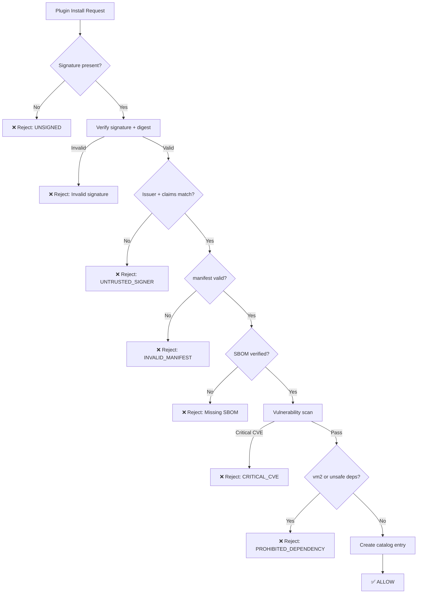
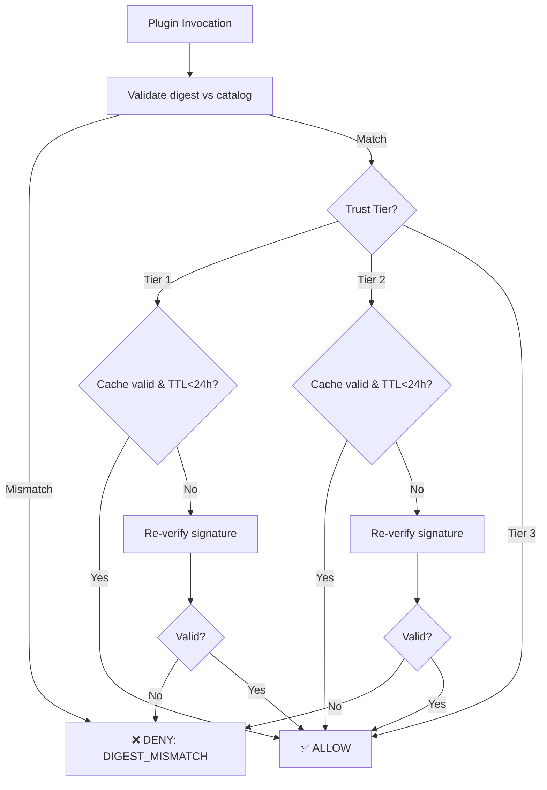

# PLUGIN_PROVENANCE_POLICY - Non-normative Appendices

**Parent Document**: [PLUGIN_PROVENANCE_POLICY.v1.md](PLUGIN_PROVENANCE_POLICY.v1.md)  
**Version**: 1.3  
**Date**: 2026-02-12  
**Status**: Non-normative (Informative)  
**Location**: docs/architecture/engine/security/PLUGIN_PROVENANCE_POLICY.APPENDICES.md

---

## Purpose

This document provides **non-normative guidance** for implementing the requirements defined in [PLUGIN_PROVENANCE_POLICY.v1.md](PLUGIN_PROVENANCE_POLICY.v1.md). Content here includes rationale, examples, implementation patterns, workflows, checklists, and compliance references.

**Status**: This document is **informative only**. For binding requirements, see the normative core document.

---

## Appendix A: Rationale

### A.1 Why Digest Verification Every Invocation?

Without per-invocation digest checks, an attacker with filesystem access could swap bundle bytes after signature verification passed. SHA-256 comparison adds negligible overhead (~μs) versus signature cryptography (~ms).

**Attack scenario**: Attacker with filesystem write access replaces signed plugin bundle with malicious code. Without digest verification, engine loads tampered code. With digest verification, hash mismatch triggers immediate rejection.

**Performance impact**: SHA-256 of 1MB bundle takes ~1-2ms on modern hardware. For comparison, ECDSA signature verification takes 5-50ms depending on key size and certificate chain depth.

---

### A.2 Why Not Re-Verify Signature Every Invocation?

Full signature verification (ECDSA/RSA + certificate chain + OIDC claims) can take 5-50ms. For high-throughput workflows (1000s invocations/sec), this creates DoS amplification risk and unnecessary latency. Digest verification prevents bundle-swap attacks; TTL-based re-verification (≤24h) balances revocation detection with performance.

**Performance analysis**:

- **Digest verification**: 1-2ms (SHA-256 computation)
- **Signature verification**: 5-10ms (ECDSA P-256) to 30-50ms (RSA 3072 + cert chain)
- **High-throughput scenario**: 10,000 invocations/hour × 50ms = 500 seconds/hour = 14% CPU overhead

**Hardline mode**: Deployments with maximum paranoia MAY configure full signature re-verification on every invocation via explicit configuration (accepted performance cost for zero-trust model).

---

### A.3 Why Fail Closed for Multi-Tenant SaaS?

In multi-tenant environments, failing open on revocation feed unavailability allows **all tenants** to execute potentially compromised plugins. Grace window (6h) provides operator time to restore feed without immediate incidents, but hard cutoff (fail closed) prevents indefinite execution of revoked plugins.

**Risk analysis**:

- **Fail open**: Single infrastructure failure (feed unavailable) enables all tenants to run revoked plugins indefinitely
- **Fail closed with grace**: 6-hour window allows emergency response; after grace period, revoked plugins blocked even if feed still unavailable
- **Single-tenant self-hosted**: Operator controls both infrastructure and risk; MAY choose fail-open policy

**Operational guidance**: Multi-tenant operators SHOULD monitor feed availability with automated alerting (target: 99.9% uptime). Consider multi-region redundancy for feed infrastructure.

---

### A.4 Why Block vm2?

Historical CVEs (CVE-2023-30547, CVE-2023-32313, CVE-2023-37466) demonstrate vm2 cannot reliably sandbox untrusted code. Package maintainers archived project citing fundamental architectural limitations.

**CVE history**:

- **CVE-2023-30547** (April 2023): Prototype pollution enabling arbitrary code execution
- **CVE-2023-32313** (May 2023): Constructor escape via Symbol.for
- **CVE-2023-37466** (July 2023): WeakMap-based sandbox bypass

**Maintainer statement**: "vm2 is no longer maintained. Consider using isolated-vm or worker_threads for sandboxing untrusted code." (Source: [vm2 GitHub](https://github.com/patriksimek/vm2#security))

**Alternatives**:

- **isolated-vm**: V8 isolates with memory/CPU limits (Node.js only)
- **worker_threads**: Process-level isolation (Node.js 12+)
- **gVisor**: Kernel-level sandboxing (production-grade for containers)

---

### A.5 Why Latest Vulnerability DB (Not Pinned Snapshot)?

Pinning DB version can miss newly disclosed critical CVEs between scans. Using freshest DB available maximizes CVE detection; recording DB metadata (timestamp, digest) enables audit reproducibility by re-running scan with historical snapshot.

**Example scenario**:

1. Plugin scanned on 2026-01-15 with CVE DB snapshot from 2026-01-15 → approved (no CVEs)
2. Critical CVE disclosed on 2026-01-20 affecting plugin dependency
3. If DB pinned to 2026-01-15: subsequent scans miss critical CVE until DB manually updated
4. If DB always-latest: scan on 2026-01-21 detects critical CVE and blocks deployment

**Reproducibility**: Catalog stores DB metadata (timestamp, digest, version). Auditors can re-run historical scans with exact DB snapshot used during original approval.

**Trade-off**: Latest DB may introduce false positives (newly disclosed CVEs in dependencies you don't use). Mitigation: exception process (ADR) for time-bounded waivers with security review.

---

### A.6 Why Unicode Normalization + Confusables Detection?

Attackers use lookalike characters (e.g., Cyrillic "а" vs Latin "a") for typosquatting. NFKC normalization + TR39 confusables detection prevents homograph attacks in package names.

**Attack examples**:

- `@dvt/slаck` (Cyrillic "а" U+0430) vs `@dvt/slack` (Latin "a" U+0061)
- `@dvt/s1ack` (digit "1") vs `@dvt/slack` (letter "l")
- `@dvt/ѕlack` (Cyrillic "ѕ" U+0455) vs `@dvt/slack` (Latin "s" U+0073)

**Unicode TR39 skeleton algorithm**: Reduces characters to canonical forms, detects confusable collisions:

```
skeleton("slаck") → "slack"  // Cyrillic "а" → Latin "a"
skeleton("slack") → "slack"
→ COLLISION DETECTED
```

**Implementation**: Apply NFKC normalization ([Unicode TR15](https://www.unicode.org/reports/tr15/)) followed by skeleton comparison ([Unicode TR39](https://www.unicode.org/reports/tr39/)). Reject package names with confusable collisions against existing packages.

---

### A.7 Why RE2 for Multi-Tenant SaaS?

Backtracking regex engines (JavaScript `RegExp`) vulnerable to ReDoS attacks via malicious patterns. RE2 guarantees linear-time execution (O(n) in input string length).

**ReDoS attack example**:

```javascript
const pattern = /^(a+)+$/;
const input = 'aaaaaaaaaaaaaaaaaaaX';
// Backtracking engine: exponential time (2^n)
// RE2: linear time (O(n))
```

**Attack scenario in trust root configuration**:

1. Tenant configures custom trust root with malicious `subjectPattern`
2. Pattern designed with nested quantifiers: `(a+)+`, `(a*)*`, `(a|a)*`
3. Engine evaluates pattern against certificate subject during verification
4. Backtracking engine hangs for seconds/minutes → DoS for all tenants

**RE2 guarantee**: All operations complete in O(n × m) time where n = input length, m = pattern size. No exponential blowup possible.

**References**:

- [OWASP ReDoS](https://owasp.org/www-community/attacks/Regular_expression_Denial_of_Service_-_ReDoS)
- [RE2 GitHub](https://github.com/google/re2)
- [re2 npm package](https://www.npmjs.com/package/re2) (Node.js binding)

---

## Appendix B: Examples

### B.1 plugin.manifest.json

```json
{
  "pluginId": "@dvt/slack",
  "version": "1.2.3",
  "apiVersion": "v1",
  "entrypoint": "./dist/index.js",
  "permissions": {
    "network": ["https://slack.com/*", "https://hooks.slack.com/*"],
    "filesystem": ["read:/tmp/slack-cache"],
    "environment": ["SLACK_TOKEN"]
  },
  "sbom": {
    "path": "./sbom.cdx.json",
    "digest": "sha256:abc123...def456"
  },
  "attestations": [
    {
      "type": "slsa-provenance",
      "digest": "sha256:fedcba...987654",
      "uri": "https://attestations.dvt.io/abc123"
    }
  ]
}
```

**Field explanations**:

- `pluginId`: Scoped package name (npm convention: `@org/name`)
- `apiVersion`: Plugin API contract version (engine checks compatibility)
- `entrypoint`: Relative path from bundle root to main executable
- `permissions`: Declared capabilities (not auto-granted; intersected with tier policy)
- `sbom.digest`: Integrity binding for bundled SBOM
- `attestations[]`: Optional SLSA provenance or other signed metadata

---

### B.2 Trust Root Configuration (Sigstore OIDC)

```yaml
pluginTrustRoots:
  # Official marketplace: GitHub Actions with strict claim constraints
  - issuer: 'https://token.actions.githubusercontent.com'
    subjectPattern: "^https://github\\.com/dvtengine/plugins/\\.github/workflows/.*$"
    claims:
      repository: '^dvtengine/plugins$'
      workflow: "^release\\.yml$"
      ref: "^refs/tags/v[0-9]+\\.[0-9]+\\.[0-9]+$"
    trustLevel: 'official'

  # Partner organization: Google Workspace with exact subject match
  - issuer: 'https://accounts.google.com'
    subjectExact: 'partner-ci@example.com'
    trustLevel: 'partner'

  # Self-hosted: Enterprise PKI (GPG)
  - issuer: 'customer-ca.internal'
    subjectExact: 'CN=DevOps Team'
    trustLevel: 'self-hosted'
```

**Sigstore OIDC claims** (GitHub Actions):

- `issuer`: GitHub OIDC issuer (always `https://token.actions.githubusercontent.com`)
- `subjectPattern`: Matches workflow identity (repo + workflow path)
- `repository`: Exact repository slug (prevents cross-repo attacks)
- `workflow`: Workflow file name (prevents workflow injection)
- `ref`: Git ref pattern (only signed tags, not branch commits)

**Pattern safety**:

- All patterns anchored (`^...$`)
- Use RE2 for evaluation in multi-tenant SaaS
- Alternative: use `subjectExact` for zero-regex deployments

---

### B.3 SBOM Example (CycloneDX)

```json
{
  "bomFormat": "CycloneDX",
  "specVersion": "1.4",
  "serialNumber": "urn:uuid:3e671687-395b-41f5-a30f-a58921a69b79",
  "version": 1,
  "metadata": {
    "timestamp": "2026-02-12T10:30:00Z",
    "component": {
      "type": "application",
      "name": "dvt-plugin-slack",
      "version": "1.2.3",
      "publisher": "DVT Official"
    }
  },
  "components": [
    {
      "type": "library",
      "name": "@slack/web-api",
      "version": "6.7.2",
      "purl": "pkg:npm/%40slack/web-api@6.7.2",
      "hashes": [
        {
          "alg": "SHA-256",
          "content": "abc123...def456"
        }
      ],
      "licenses": [
        {
          "license": {
            "id": "MIT"
          }
        }
      ]
    },
    {
      "type": "library",
      "name": "axios",
      "version": "1.6.0",
      "purl": "pkg:npm/axios@1.6.0",
      "hashes": [
        {
          "alg": "SHA-256",
          "content": "def456...abc123"
        }
      ]
    }
  ],
  "dependencies": [
    {
      "ref": "pkg:npm/%40slack/web-api@6.7.2",
      "dependsOn": ["pkg:npm/axios@1.6.0"]
    }
  ]
}
```

**Required elements**:

- `bomFormat`, `specVersion`: CycloneDX metadata
- `metadata.component`: Plugin identity
- `components[]`: All dependencies with purl + hashes
- `dependencies[]`: Dependency graph (parent → children)

**Vulnerability scanning integration**: Scanners use `purl` to query CVE databases; `hashes` verify integrity.

---

## Appendix C: Implementation Notes

### C.1 Signature Verification Tools

**Sigstore/Cosign** (keyless signing):

- **Use case**: Official marketplace, GitHub Actions CI/CD
- **Installation**: `npm install -g @sigstore/cli` or use Docker image
- **Verification**:
  ```bash
  cosign verify-blob \
    --bundle plugin.bundle \
    --certificate-oidc-issuer https://token.actions.githubusercontent.com \
    --certificate-identity https://github.com/dvtengine/plugins/.github/workflows/release.yml@refs/tags/v1.2.3 \
    plugin.tgz
  ```
- **Trust materials**: Fulcio roots + Rekor public key (bundled in Cosign)
- **References**: [Sigstore Docs](https://docs.sigstore.dev/), [Cosign CLI](https://docs.sigstore.dev/cosign/overview/)

**GPG** (self-hosted):

- **Use case**: Air-gapped deployments, enterprise PKI
- **Setup**: Distribute GPG public keys via secure channel
- **Verification**:
  ```bash
  gpg --verify plugin.tgz.sig plugin.tgz
  ```
- **Key management**: Use hardware tokens (YubiKey, Nitrokey) for signing keys

**Enterprise PKI** (X.509 certificates):

- **Use case**: Organizations with existing CA infrastructure
- **Verification**: OpenSSL or custom tooling against CA certificate chain
- **Example**:
  ```bash
  openssl dgst -sha256 -verify pubkey.pem -signature plugin.sig plugin.tgz
  ```

---

### C.2 Catalog Integrity Patterns

**PostgreSQL (Audit Triggers)**:

```sql
-- Plugin catalog table (append-only)
CREATE TABLE plugin_catalog (
  id SERIAL PRIMARY KEY,
  bundle_digest VARCHAR(64) NOT NULL,
  signer_identity JSONB NOT NULL,
  installed_at TIMESTAMP NOT NULL DEFAULT NOW()
);

-- Prevent updates/deletes
CREATE RULE plugin_catalog_no_update AS ON UPDATE TO plugin_catalog DO INSTEAD NOTHING;
CREATE RULE plugin_catalog_no_delete AS ON DELETE TO plugin_catalog DO INSTEAD NOTHING;

-- Audit log (every catalog mutation)
CREATE TABLE plugin_catalog_audit (
  id SERIAL PRIMARY KEY,
  catalog_entry_id INTEGER REFERENCES plugin_catalog(id),
  operation VARCHAR(10) NOT NULL,
  previous_hash VARCHAR(64),
  new_hash VARCHAR(64) NOT NULL,
  timestamp TIMESTAMP NOT NULL DEFAULT NOW()
);

-- Hash chain trigger
CREATE OR REPLACE FUNCTION plugin_catalog_audit_trigger()
RETURNS TRIGGER AS $$
BEGIN
  INSERT INTO plugin_catalog_audit (catalog_entry_id, operation, new_hash)
  VALUES (NEW.id, TG_OP, digest(NEW.bundle_digest, 'sha256'));
  RETURN NEW;
END;
$$ LANGUAGE plpgsql;

CREATE TRIGGER plugin_catalog_audit
AFTER INSERT ON plugin_catalog
FOR EACH ROW EXECUTE FUNCTION plugin_catalog_audit_trigger();
```

**Event-sourced** (append-only event log):

```typescript
// Event types
type PluginEvent =
  | { type: 'PluginInstalled'; bundleDigest: string; signerIdentity: object; timestamp: string }
  | { type: 'PluginRevoked'; bundleDigest: string; reason: string; timestamp: string };

// Event store (append-only)
class PluginEventStore {
  private events: PluginEvent[] = [];

  append(event: PluginEvent): void {
    this.events.push(event);
    // Immutable: no update/delete operations
  }

  getCatalog(): Map<string, PluginCatalogEntry> {
    // Rebuild catalog from event stream
    const catalog = new Map();
    for (const event of this.events) {
      if (event.type === 'PluginInstalled') {
        catalog.set(event.bundleDigest, { ...event, revoked: false });
      } else if (event.type === 'PluginRevoked') {
        const entry = catalog.get(event.bundleDigest);
        if (entry) entry.revoked = true;
      }
    }
    return catalog;
  }
}
```

---

### C.3 Vulnerability Scanning Tools

**npm/Node.js**:

- `npm audit` (built-in): `npm audit --json > audit-report.json`
- **Snyk**: `snyk test --json > snyk-report.json`
- **GitHub Dependabot**: Automatic PR-based alerts

**Python**:

- `pip-audit`: `pip-audit --format json > audit-report.json`
- **Safety**: `safety check --json > safety-report.json`

**General (multi-language)**:

- **OWASP Dependency-Check**: `dependency-check --project dvt-plugin --format JSON --out dc-report.json`
- **Trivy**: `trivy fs --security-checks vuln --format json . > trivy-report.json`

**CI Integration Example** (GitHub Actions):

```yaml
- name: Vulnerability Scan
  run: |
    npm audit --json > audit-report.json
    trivy fs --security-checks vuln --format json . > trivy-report.json

- name: Record DB Metadata
  run: |
    echo "DB_TIMESTAMP=$(date -u +%Y-%m-%dT%H:%M:%SZ)" >> scan-metadata.txt
    trivy --version >> scan-metadata.txt

- name: Block on Critical CVE
  run: |
    CRITICAL=$(jq '[.[] | select(.severity == "CRITICAL")] | length' trivy-report.json)
    if [ "$CRITICAL" -gt 0 ]; then
      echo "❌ Critical CVE detected"
      exit 1
    fi
```

---

### C.4 Regex Safety

**RE2 Library** (Node.js):

```javascript
const RE2 = require('re2');

// Safe regex compilation
function compilePattern(pattern) {
  try {
    return new RE2(pattern);
  } catch (err) {
    throw new Error(`Invalid regex pattern: ${err.message}`);
  }
}

// Safe matching (linear time guaranteed)
function matchSubject(pattern, subject) {
  const re = compilePattern(pattern);
  return re.test(subject);
}
```

**Pattern Validation** (reject dangerous patterns):

```javascript
function validatePattern(pattern) {
  // Check for nested quantifiers (ReDoS risk)
  const dangerousPatterns = [
    /\([^)]*\+\)[*+]/, // (a+)+ or (a+)*
    /\([^)]*\*\)[*+]/, // (a*)+ or (a*)*
    /\([^|]*\|[^)]*\)\*/, // (a|a)*
  ];

  for (const dangerous of dangerousPatterns) {
    if (dangerous.test(pattern)) {
      throw new Error('Pattern contains nested quantifiers (ReDoS risk)');
    }
  }

  // Check maximum length
  if (pattern.length > 1024) {
    throw new Error('Pattern exceeds 1024 characters');
  }

  return pattern;
}
```

**Compilation Timeout** (non-RE2 fallback):

```javascript
function compileWithTimeout(pattern, timeoutMs = 100) {
  const start = Date.now();
  try {
    // Attempt compilation
    const re = new RegExp(pattern);
    const elapsed = Date.now() - start;

    if (elapsed > timeoutMs) {
      throw new Error(`Pattern compilation exceeded ${timeoutMs}ms`);
    }

    return re;
  } catch (err) {
    throw new Error(`Pattern compilation failed: ${err.message}`);
  }
}
```

---

### C.5 Unicode Security

**Normalization** ([Unicode TR15](https://www.unicode.org/reports/tr15/)):

```javascript
function normalizePackageName(name) {
  // NFKC: Compatibility decomposition, followed by canonical composition
  return name.normalize('NFKC');
}
```

**Confusables Detection** ([Unicode TR39](https://www.unicode.org/reports/tr39/)):

```javascript
// Using confusables library
const { skeleton } = require('confusables');

function detectConfusables(newName, existingNames) {
  const newSkeleton = skeleton(normalizePackageName(newName));

  for (const existing of existingNames) {
    const existingSkeleton = skeleton(normalizePackageName(existing));

    if (newSkeleton === existingSkeleton && newName !== existing) {
      throw new Error(`Package name "${newName}" is confusable with existing "${existing}"`);
    }
  }
}
```

**Character Restrictions**:

```javascript
function validatePackageName(name) {
  // After normalization, only ASCII alphanumeric + hyphens/underscores
  if (!/^[@a-z0-9_-]+\/[a-z0-9_-]+$/.test(name)) {
    throw new Error('Package name must be ASCII alphanumeric with hyphens/underscores only');
  }

  // Case-insensitive collision check
  const lowerName = name.toLowerCase();
  if (existingPackages.has(lowerName)) {
    throw new Error(
      `Package name collides with existing (case-insensitive): ${existingPackages.get(lowerName)}`
    );
  }
}
```

---

### C.6 SBOM Formats

**CycloneDX** (JSON):

- **Specification**: [CycloneDX 1.4](https://cyclonedx.org/specification/overview/)
- **Generation**: `cyclonedx-npm` (Node.js), `cyclonedx-python` (Python)
- **Validation**: `cyclonedx-cli validate --input-file sbom.cdx.json`

**SPDX** (JSON):

- **Specification**: [SPDX 2.3](https://spdx.dev/specifications/)
- **Generation**: `spdx-sbom-generator` (multi-language)
- **Validation**: `spdx-tools validate sbom.spdx.json`

**Conversion** (CycloneDX ↔ SPDX):

- **Tool**: `cyclonedx-cli convert --input-format cyclonedx --output-format spdx`
- **Use case**: Interoperability with tools expecting specific format

---

## Appendix D: Workflows

### D.1 Plugin Installation Flow



**Decision points**:

1. **Signature present**: Bundle includes signature metadata (Cosign bundle or detached .sig file)
2. **Signature valid**: Cryptographic verification passed (digest match + cert chain valid)
3. **Trust root match**: Signer identity (issuer + subject + claims) matches configured trust roots
4. **Manifest valid**: `plugin.manifest.json` present, schema valid, `apiVersion` supported
5. **SBOM verified**: SBOM present (bundled or external), digest/signature valid
6. **Vulnerability scan**: No critical CVEs (CVSS ≥ 9.0); high CVEs (≥ 7.0) require ADR exception
7. **Prohibited deps**: No vm2 in dependency tree; native addons rejected for Tier 1

---

### D.2 Plugin Execution Flow



**Execution guarantees**:

- **All tiers**: Digest validated every invocation (prevents bundle-swap attacks)
- **Tier 1**: Signature re-verified at load + TTL ≤24h (or policy update triggers re-verification)
- **Tier 2**: Signature cached per process (≤24h TTL)
- **Tier 3**: Digest-only by default; full signature re-verification configurable

---

## Appendix E: Enforcement Checklist

### E.1 Installation Phase

- [ ] Unsigned bundle rejected (reasonCode: `UNSIGNED`)
- [ ] Unknown issuer rejected (reasonCode: `UNTRUSTED_SIGNER`)
- [ ] Digest mismatch rejected (reasonCode: `DIGEST_MISMATCH`)
- [ ] Invalid manifest rejected (reasonCode: `INVALID_MANIFEST`)
- [ ] Unsupported apiVersion rejected (reasonCode: `UNSUPPORTED_API_VERSION`)
- [ ] Missing SBOM rejected for Tier 1/2 (reasonCode: `MISSING_SBOM`)
- [ ] Invalid SBOM signature rejected (reasonCode: `INVALID_SBOM`)
- [ ] vm2 dependency rejected (reasonCode: `PROHIBITED_DEPENDENCY`)
- [ ] Native addon rejected for Tier 1 (reasonCode: `PROHIBITED_DEPENDENCY`)
- [ ] Critical CVE blocks installation (reasonCode: `CRITICAL_CVE`)
- [ ] Catalog entry created with integrity proof

**Testing approach**:

- **Unit tests**: Mock verification failures for each rejection criteria
- **Integration tests**: Use signed test bundles with deliberate violations (missing SBOM, critical CVE, vm2 dependency)
- **CI validation**: Automated checks against canonical reasonCode set

---

### E.2 Runtime Phase

- [ ] Digest validated every invocation (all tiers)
- [ ] Tier 1: Signature re-verified at load + TTL ≤24h
- [ ] Tier 2: Signature cached (≤24h TTL)
- [ ] Tier 3: Digest-only by default (configurable)
- [ ] Revoked plugin execution blocked (reasonCode: `REVOKED`)
- [ ] All reasonCodes match canonical set in Section 2.1 of [normative document](PLUGIN_PROVENANCE_POLICY.v1.md)

**Performance testing**:

- Measure digest verification overhead (target: <2ms per invocation)
- Measure signature re-verification overhead (target: <50ms for Tier 1 TTL refresh)
- Stress test: 10,000 invocations/sec with varying cache hit rates

---

### E.3 Configuration Audit

- [ ] Trust roots explicitly configured (no wildcard issuers)
- [ ] OIDC claim constraints configured (marketplace)
- [ ] Revocation feed URL configured + polling enabled
- [ ] Feed signature verification enabled
- [ ] Fallback policy: fail closed for SaaS Tier 1/2

**Audit procedure**:

1. Review trust root configuration (no `*` wildcards, all patterns anchored)
2. Verify OIDC claims include repository/workflow/ref constraints for official trust roots
3. Test revocation feed polling (simulate feed unavailability, verify fail-closed behavior)
4. Validate feed signature verification (test with invalid signature, verify rejection)

---

### E.4 Catalog Integrity

- [ ] Catalog entries append-only OR audit events immutable
- [ ] `CatalogIntegrityProof` API available (returns catalogRootHash, entryCount, auditLogDigest)
- [ ] CI validates catalog root hash changes only on legitimate mutations

**CI Integration**:

```bash
# Before install
BEFORE_HASH=$(curl -s http://localhost:8080/api/catalog/integrity | jq -r '.catalogRootHash')

# Install plugin
plugin-cli install @dvt/slack@1.2.3

# After install
AFTER_HASH=$(curl -s http://localhost:8080/api/catalog/integrity | jq -r '.catalogRootHash')

# Validate hash changed (immutable append)
if [ "$BEFORE_HASH" = "$AFTER_HASH" ]; then
  echo "❌ Catalog hash unchanged after install"
  exit 1
fi
```

---

### E.5 CI/CD Pipeline

- [ ] `plugin.manifest.json` generated with all required fields
- [ ] SBOM auto-generated with hashes + dependency graph + purl
- [ ] Lockfiles committed for reproducible builds
- [ ] Vulnerability scan runs before approval
- [ ] DB metadata recorded (timestamp, digest, version)
- [ ] Native addon detection scan runs

**CI Workflow Example** (GitHub Actions):

```yaml
name: Plugin Release

on:
  push:
    tags:
      - 'v*.*.*'

jobs:
  release:
    runs-on: ubuntu-latest
    permissions:
      id-token: write # Sigstore OIDC

    steps:
      - uses: actions/checkout@v4

      - name: Generate Manifest
        run: npm run generate:manifest

      - name: Generate SBOM
        run: cyclonedx-npm --output-file sbom.cdx.json

      - name: Vulnerability Scan
        run: |
          npm audit --json > audit-report.json
          trivy fs --format json . > trivy-report.json

      - name: Build Bundle
        run: npm pack

      - name: Sign with Cosign
        uses: sigstore/cosign-action@v2
        with:
          artifact: dvt-plugin-*.tgz

      - name: Upload Release
        uses: dvt/plugin-publish-action@v1
        with:
          bundle: dvt-plugin-*.tgz
          signature: dvt-plugin-*.tgz.bundle
```

---

## Appendix F: Compliance References

### Standards and Frameworks

- [RFC 2119](https://www.rfc-editor.org/rfc/rfc2119) - Key words for use in RFCs to Indicate Requirement Levels
- [RFC 8174](https://www.rfc-editor.org/rfc/rfc8174) - Ambiguity of Uppercase vs Lowercase in RFC 2119 Key Words
- [SLSA Framework](https://slsa.dev/) - Supply-chain Levels for Software Artifacts
- [NIST SP 800-161](https://csrc.nist.gov/publications/detail/sp/800-161/rev-1/final) - Cybersecurity Supply Chain Risk Management Practices
- [NIST SSDF](https://csrc.nist.gov/projects/ssdf) - Secure Software Development Framework
- [OWASP Supply Chain Security](https://owasp.org/www-project-software-supply-chain-security/) - Best practices and patterns

---

### Sigstore and Transparency

- [Sigstore Documentation](https://docs.sigstore.dev/) - Keyless signing architecture overview
- [Rekor Transparency Log](https://docs.sigstore.dev/rekor/overview/) - Immutable signature log
- [Cosign Overview](https://docs.sigstore.dev/cosign/overview/) - Container and artifact signing
- [Fulcio Certificate Authority](https://docs.sigstore.dev/fulcio/overview/) - OIDC-based code signing certificates

---

### SBOM and Vulnerability Management

- [CycloneDX Specification](https://cyclonedx.org/specification/overview/) - SBOM standard (JSON/XML)
- [SPDX Specification](https://spdx.dev/specifications/) - Software Package Data Exchange standard
- [Package URL (purl)](https://github.com/package-url/purl-spec) - Universal package identifier
- [OWASP Dependency-Check](https://owasp.org/www-project-dependency-check/) - Vulnerability scanner
- [Common Vulnerability Scoring System (CVSS) v3.1](https://www.first.org/cvss/v3.1/specification-document) - Vulnerability severity metrics

---

### Cryptography and Security

- [NIST Hash Functions](https://csrc.nist.gov/projects/hash-functions) - SHA-2/SHA-3 specifications
- [RFC 3161](https://www.rfc-editor.org/rfc/rfc3161) - Time-Stamp Protocol (TSP)
- [RFC 4880](https://www.rfc-editor.org/rfc/rfc4880) - OpenPGP Message Format
- [GitHub Actions OIDC](https://docs.github.com/en/actions/security-for-github-actions/security-hardening-your-deployments/about-security-hardening-with-openid-connect) - Keyless signing with GitHub CI/CD

---

### Regex and Unicode Security

- [OWASP ReDoS](https://owasp.org/www-community/attacks/Regular_expression_Denial_of_Service_-_ReDoS) - Regular Expression Denial of Service attacks
- [RE2 GitHub](https://github.com/google/re2) - Linear-time regex engine
- [re2 npm package](https://www.npmjs.com/package/re2) - Node.js binding for RE2
- [Unicode TR15](https://www.unicode.org/reports/tr15/) - Unicode Normalization Forms
- [Unicode TR39](https://www.unicode.org/reports/tr39/) - Unicode Security Mechanisms (confusables detection)

---

### Related DVT Documents

- [PLUGIN_PROVENANCE_POLICY.v1.md](PLUGIN_PROVENANCE_POLICY.v1.md) - **Parent normative document**
- [SECURITY_INVARIANTS.v1.md](SECURITY_INVARIANTS.v1.md) - INV-PLUGIN-01 (signature verification), INV-PLUGIN-05 (catalog integrity)
- [PluginSandbox.v1.0.md](../contracts/extensions/PluginSandbox.v1.0.md) - Trust Tier specification
- [THREAT_MODEL.md](THREAT_MODEL.md) - T13 (malicious plugin threat)
- [TENANT_ISOLATION_TESTS.v1.md](TENANT_ISOLATION_TESTS.v1.md) - Multi-tenant isolation test suite

---

_Last updated: 2026-02-12_  
_Version: 1.3 (tracks parent normative document)_  
_Status: Non-normative (Informative)_
