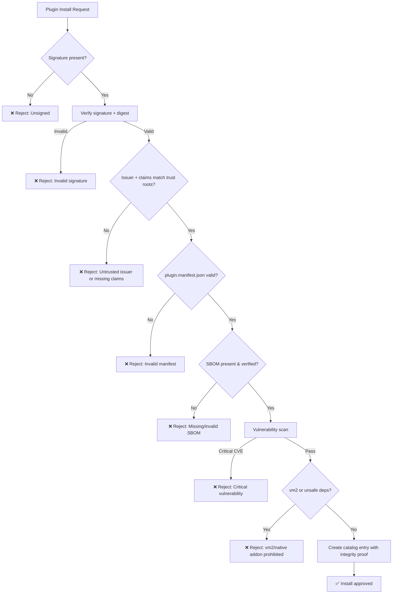
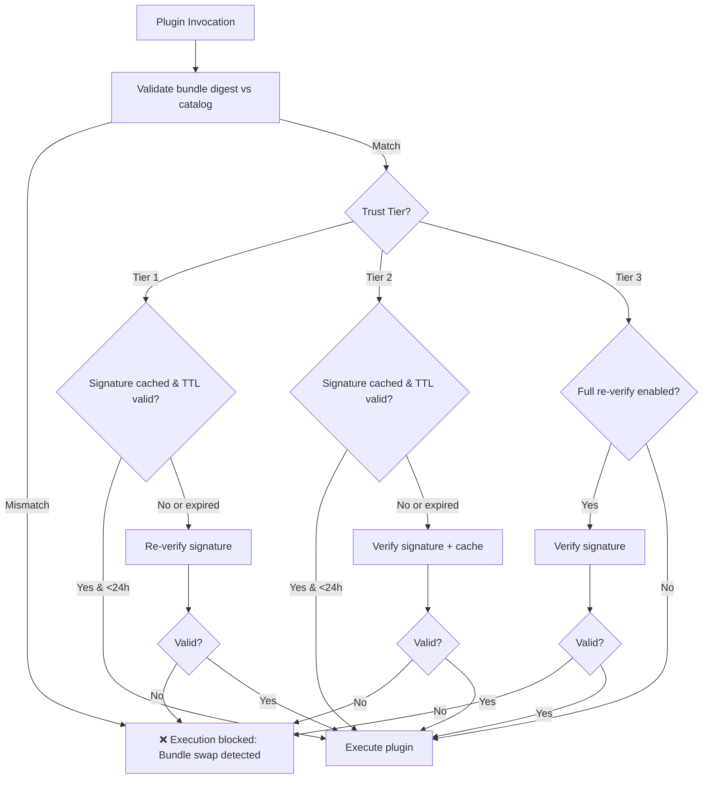

# PLUGIN_PROVENANCE_POLICY.v1.md - Plugin Supply Chain Security

**Version**: 1.0  
**Date**: 2026-02-12  
**Status**: Normative  
**Location**: docs/architecture/engine/security/PLUGIN_PROVENANCE_POLICY.v1.md

---

## Purpose

This document defines **mandatory supply chain security requirements** for DVT Engine plugins. All plugin bundles MUST comply with provenance verification requirements before installation or execution.

This is a **normative contract**: implementations MUST enforce these requirements. Deviation constitutes a security vulnerability.

---

## Threat Model

### Supply Chain Threats

| Threat                            | Likelihood | Impact   | Mitigation                                                   |
| --------------------------------- | ---------- | -------- | ------------------------------------------------------------ |
| **Malicious plugin**              | Medium     | Critical | Cryptographic signature verification (this policy)           |
| **Typosquatting**                 | Medium     | High     | Namespace verification, official marketplace curation        |
| **Compromised developer account** | Low        | Critical | Multi-factor authentication, key rotation, transparency logs |
| **Dependency confusion**          | Medium     | High     | SBOM verification, dependency pinning                        |
| **Backdoor in dependency**        | Low        | Critical | Vulnerability scanning, SLSA provenance                      |

**Key insight**: Without provenance verification, plugin marketplace is an **unrestricted code execution vector** for attackers.

---

## Policy Requirements

### 1. Cryptographic Signature Verification + Catalog Integrity

#### 1.1 Signature Verification (MANDATORY)

**Requirement**: All plugin bundles MUST be cryptographically signed before installation.

**Verification phases**:

- **Install time**: Signature verified when plugin added to catalog; validation binds signature → digest + trusted identity; results persisted to catalog
- **Load time**: Signature re-verified before loading plugin code into runtime process (once per process lifecycle; may be cached per deployment policy)
- **Invocation time**: Signature MAY be re-verified on each plugin invocation (tier-dependent; Tier 1 MUST re-verify, Tier 2/3 configurable)
- **Update time**: New signature required for every version update; old signature archived but not deleted

**Verification policy** (normative):

- **Sigstore/keyless signing** (RECOMMENDED for marketplace):
  - Engine MUST verify using Sigstore verification policy with:
    - **Fulcio root certificate(s)** for certificate chain validation (see [Sigstore Trust Root](https://docs.sigstore.dev/))
    - **Rekor public key** for transparency log inclusion proof
  - Verification binds artifact digest → OIDC identity (issuer/subject) → timestamp
  - See [Cosign verification patterns](https://docs.sigstore.dev/cosign/overview/)
- **Enterprise PKI/GPG** (alternative for self-hosted):
  - Engine MUST verify against explicitly configured trust roots (CA certificates or GPG keyring)
  - **Minimum cryptographic strength** (non-keyless modes): ECDSA P-256 or RSA 3072-bit keys
  - GPG: RFC 4880-compliant signature format

**Note**: "Sigstore/Cosign" is a verification policy, not an algorithm constraint. Cosign can verify multiple signature schemes; the normative requirement is the trust root configuration (Fulcio + Rekor for keyless, or enterprise roots for PKI). See [Sigstore documentation](https://docs.sigstore.dev/) for architecture.

**Signature binding**: Verification MUST bind:

1. **Artifact digest** (SHA-256 of exact plugin bundle bytes as transmitted, e.g., .tgz or .zip file)
2. **Trusted identity** (issuer/subject from certificate)
3. **Timestamp** (signature creation time):
   - **Sigstore**: Rekor inclusion proof time (see [Rekor overview](https://docs.sigstore.dev/rekor/overview/))
   - **GPG/PGP**: CI attestation timestamp or RFC3161 Timestamp Authority (TSA) if available

**Bundle structure** (normative clarification):

- Signature covers the **exact distribution artifact bytes** as installed (e.g., .tgz/.zip file)
- SBOM MUST be included in the signed bundle OR distributed separately with its own digest stored in catalog
- Provenance attestations (SLSA) MAY be attached as separate signed artifacts, linked by digest
- Verification uses catalog-stored digests to validate all components (bundle + SBOM + optional attestations)

**Plugin manifest** (MANDATORY):

Every plugin bundle MUST include a `plugin.manifest.json` file at the root of the archive. This manifest is the canonical contract for plugin identity and capabilities.

**Manifest schema** (normative, per [RFC 2119](https://www.rfc-editor.org/rfc/rfc2119)):

```json
{
  "pluginId": "@dvt/slack",
  "version": "1.2.3",
  "apiVersion": "v1",
  "entrypoint": "./dist/index.js",
  "permissions": {
    "network": ["https://slack.com/*", "https://hooks.slack.com/*"],
    "filesystem": ["read:/tmp/slack-cache"],
    "environment": ["SLACK_TOKEN"]
  },
  "sbom": {
    "path": "./sbom.cdx.json",
    "digest": "sha256:abc123...def456"
  },
  "attestations": [
    {
      "type": "slsa-provenance",
      "digest": "sha256:fedcba...987654",
      "uri": "https://attestations.example.com/abc123"
    }
  ]
}
```

**Required fields** (MUST):

- `pluginId`: Unique identifier (scoped package name)
- `version`: Semantic version ([semver](https://semver.org/))
- `apiVersion`: DVT plugin API contract version (e.g., `v1`, `v2`) for compatibility checks
- `entrypoint`: Relative path to main executable file
- `permissions`: Declared capability requests (network/filesystem/environment/subprocess)

**Optional fields** (SHOULD):

- `sbom.path`: Relative path to SBOM file within bundle
- `sbom.digest`: SHA-256 of SBOM content (MUST if `sbom.path` present)
- `attestations[]`: Array of linked provenance/attestation artifacts (digest + optional URI)

**Enforcement**:

- Engine MUST parse and validate manifest at install time
- Engine MUST reject bundles with missing/invalid manifest
- Engine MUST enforce declared permissions at runtime (sandboxing)
- Catalog MUST store manifest fields (`apiVersion`, `permissions`, `sbom.digest`) for audit

This manifest makes the plugin contract **testable and enforceable** without inspecting code.

**Catalog identity key** (normative): The catalog identity key MUST be the SHA-256 digest of the exact distribution artifact bytes (e.g., .tgz/.zip) as installed. This digest is the canonical identifier for "what code is installed"; same source with different packaging = different identity.

**Rejection criteria**:

- ❌ Unsigned bundles
- ❌ Unknown issuer/subject (not in trust root allowlist)
- ❌ Certificate invalid outside signing window OR identity does not satisfy trust policy at verification time (per configured policy)
- ❌ Digest mismatch (bundle tampered after signing)
- ❌ Revoked certificate or identity (see Revocation Model below)

**Catalog persistence**: The plugin catalog MUST store the following metadata for each installed plugin:

- **Bundle digest** (SHA-256 of artifact bytes)
- **Signer identity** (issuer + subject from certificate)
- **Rekor entry ID** (if Sigstore; transparency log inclusion proof)
- **SBOM digest** (SHA-256 of SBOM document)
- **Policy version** (digest of trust roots + validation rules at install time; enables re-validation on policy changes)

This install record is the **canonical source of truth** for plugin identity.

**Signature verification caching** (if enabled per tier):

- Cache key MUST include: `{bundleDigest, signerIdentity, trustRootPolicyVersion}`
- Cache TTL MUST be bounded (≤24 hours) OR invalidated immediately on trust-root/revocation updates
- Any cache hit MUST still verify on-disk bundle digest matches catalog digest (prevent bundle-swap attacks)

**Revocation Model** (normative):

- Engine MUST support:
  1. **Digest denylist**: Blocklist of known-bad artifact SHA-256 digests
  2. **Identity denylist**: Revoked (issuer, subject) pairs
  3. **Cutoff timestamp per identity**: After key compromise, block all signatures from `(issuer, subject)` created after `cutoffTime`
- Marketplace deployments MUST publish revocation notices in immutable channel (see Enforcement Checklist)
- **Re-validation on policy change** (normative):
  - Engine MUST perform re-validation sweep on startup and when revocation/trust root policy updates
  - Re-check all catalog entries against current policy (digest denylist, identity denylist, cutoffs)
  - If a plugin becomes revoked: mark catalog entry as `REVOKED` and fail closed on load/invocation attempts
  - Audit log MUST record re-validation results (plugins newly revoked, unchanged)
- Re-validation MUST occur when policy version changes (trust roots rotated, revocation list updated)

**Revocation Feed Interface** (MANDATORY for marketplace, RECOMMENDED for self-hosted):

Engine MUST support a **Revocation Feed** pull mechanism with signed updates:

```typescript
interface RevocationFeed {
  feedVersion: string; // Monotonic version (timestamp or sequence)
  feedSignature: string; // Signature over feed content (Sigstore or GPG)
  digestDenylist: string[]; // SHA-256 digests of revoked bundles
  identityDenylist: Array<{
    issuer: string;
    subject: string;
    revokedAt: string; // ISO8601 UTC timestamp
    reason?: string; // Optional: "key-compromise" | "policy-violation"
  }>;
  identityCutoffs: Array<{
    issuer: string;
    subject: string;
    cutoffTime: string; // ISO8601 UTC: block signatures after this time
    reason?: string;
  }>;
}
```

**Feed requirements** (normative, per [RFC 2119](https://www.rfc-editor.org/rfc/rfc2119)):

- **Pull model**: Engine MUST poll feed at configurable interval (default: hourly for marketplace, daily for self-hosted)
- **Signed updates**: Feed MUST be cryptographically signed (Sigstore or GPG); engine MUST reject unsigned/invalid feeds
- **Immediate application**: Engine MUST apply revocation updates immediately on receipt (trigger re-validation sweep)
- **Feed immutability**: Marketplace MUST retain historical feed versions (append-only) for audit
- **Transport**: Feed MAY be served via HTTPS, IPFS, or transparency log (e.g., Rekor entries)

**Feed discovery** (implementation guidance):

- **Marketplace**: Feed URL configured in trust root (e.g., `https://marketplace.dvt.io/api/v1/revocations`)
- **Self-hosted**: Feed URL configurable per deployment (or local file-based for air-gapped)
- **Transparency log mode**: Marketplace MAY publish revocation notices as Rekor entries; engines poll Rekor API

**Fallback policy** (when feed unavailable):

- Engine SHOULD cache last-known-good feed and apply cached revocations
- Engine MAY fail open (allow unverified) or fail closed (block all) per deployment policy (MUST be configurable)
- Audit log MUST record feed fetch failures and fallback decisions

See [OWASP Supply Chain Security](https://owasp.org/www-project-software-supply-chain-security/) for revocation best practices.

**Runtime bundle integrity** (when signature re-verification skipped):

- If Trust Tier configuration allows skipping runtime signature re-verification (e.g., Tier 3 self-hosted), execution MUST still validate that the on-disk bundle digest matches the installed digest from catalog
- This prevents "bundle swap on disk" attacks where an attacker replaces the signed bundle with malicious code after installation
- See [Sigstore bundle verification patterns](https://docs.sigstore.dev/) for implementation guidance

---

#### 1.3 Verification Result Contract (MANDATORY - Testability)

**Requirement**: All signature verification operations MUST produce a structured `VerificationResult` for audit and testing.

**VerificationResult schema** (normative):

```typescript
interface VerificationResult {
  bundleDigest: string; // SHA-256 of verified artifact
  signerIdentity: {
    issuer: string; // Certificate issuer (e.g., Sigstore Fulcio)
    subject: string; // OIDC identity (e.g., GitHub workflow)
    claims?: Record<string, string>; // Additional OIDC claims (repository, workflow, ref, sha)
  };
  matchedTrustRootId: string; // Digest or ID of trust root rule that matched
  signatureType: 'sigstore' | 'gpg' | 'pki'; // Verification method used
  signatureValid: boolean; // Signature cryptographically valid
  rekorInclusionValid?: boolean; // Transparency log inclusion proof valid (if present)
  policyVersion: string; // Digest of trust roots + rules at verification time
  timestamp: string; // Verification time (ISO8601 UTC)
  artifactSource?: string; // Marketplace URL or internal path
  decision: 'ALLOW' | 'DENY'; // Final enforcement decision
  reasonCode?: string; // Denial reason: UNSIGNED | UNTRUSTED_ISSUER | DIGEST_MISMATCH | REVOKED | CRITICAL_CVE | INVALID_MANIFEST
}
```

**Usage**:

- CI tests MUST assert against `VerificationResult` structure
- Audit logs MUST include `VerificationResult` for all install/load/invocation checks
- Runtime enforcement MUST use `decision` field as canonical authorization

**References**:

- [RFC 2119](https://www.rfc-editor.org/rfc/rfc2119) - MUST/SHOULD keywords
- [NIST SSDF](https://csrc.nist.gov/projects/ssdf) - Verification output requirements

---

#### 1.2 Catalog Integrity (MANDATORY)

**Requirement**: Catalog integrity MUST satisfy **INV-PLUGIN-05** in [SECURITY_INVARIANTS.v1.md](SECURITY_INVARIANTS.v1.md) (tamper-evident + fail-closed enforcement).

**Attack prevention**: Without catalog integrity, an attacker with database access could:

- Rewrite bundle digests to match a malicious plugin
- Delete install records to hide compromised plugins
- Modify signer identities to bypass trust root checks

**Normative invariant** (testable contract, per [RFC 2119](https://www.rfc-editor.org/rfc/rfc2119)):

Catalog entries MUST be **append-only** (no UPDATE/DELETE SQL operations) OR every mutation MUST emit an immutable audit event with:

- Previous entry hash (forming a hash chain)
- Mutation type (INSERT | UPDATE | DELETE)
- Timestamp (ISO8601 UTC)
- Actor identity (service account or user)

**Catalog integrity proof** (MUST for CI/testability):

Engine MUST provide a `CatalogIntegrityProof` routine or API endpoint that returns:

```typescript
interface CatalogIntegrityProof {
  catalogRootHash: string; // Merkle root or hash chain head
  entryCount: number; // Total catalog entries
  lastMutationTime: string; // ISO8601 UTC
  proofSignature?: string; // Optional: signed by catalog service
  auditLogDigest?: string; // SHA-256 of audit log (if event-sourced)
}
```

CI tests MUST validate:

- `catalogRootHash` changes only on legitimate mutations (install/update/remove)
- Audit log is append-only (no gaps in sequence numbers)
- Proof signature valid (if present)

**Implementation patterns**:

- **PostgreSQL**: Use audit triggers + sequential event log table with check constraints preventing updates/deletes
- **Event-sourced**: Store catalog as event stream (PluginInstalled, PluginUpdated, PluginRemoved events)
- **External integrity**: Periodically snapshot catalog Merkle root to blockchain/transparency log for external verification

**References**:

- [SECURITY_INVARIANTS.v1.md](SECURITY_INVARIANTS.v1.md) - INV-PLUGIN-05 (plugin catalog integrity), INV-AUDIT-01 (append-only audit logs)
- [OWASP Supply Chain Security](https://owasp.org/www-project-software-supply-chain-security/) - Catalog integrity best practices
- [NIST SSDF](https://csrc.nist.gov/projects/ssdf) - Secure software development framework

---

### 2. Trust Roots Configuration

**Requirement**: DVT Engine MUST maintain an explicit allowlist of trusted plugin issuers.

**Trust root types**:

- **Official marketplace**: DVT-operated plugin registry (highest trust)
- **Partner organizations**: Verified third-party vendors (medium trust)
- **Self-hosted**: Customer-signed plugins (requires explicit configuration)

**Configuration format** (illustrative example using Sigstore OIDC identity model):

```yaml
pluginTrustRoots:
  # GitHub Actions OIDC (see https://docs.github.com/en/actions/security-for-github-actions/security-hardening-your-deployments/about-security-hardening-with-openid-connect)
  - issuer: "https://token.actions.githubusercontent.com"
    subjectPattern: "^https://github\.com/dvtengine/plugins/\.github/workflows/.*$"  # Regex pattern (no wildcards unless explicit)
    claims:  # Additional OIDC claim constraints (MUST for official marketplace)
      repository: "^dvtengine/plugins$"  # Exact repo
      workflow: "^release\.yml$"  # Only release workflow
      ref: "^refs/tags/v[0-9]+\.[0-9]+\.[0-9]+$"  # Semver tags only
    trustLevel: "official"

  # Partner organization
  - issuer: "https://accounts.google.com"
    subjectPattern: "^partner@example\.com$"
    trustLevel: "partner"

  # Self-hosted (GPG-based)
  - issuer: "customer-ca.internal"
    subject: "CN=DevOps Team"
    trustLevel: "self-hosted"
```

**Note**: Subject patterns MUST NOT use wildcards unless explicitly configured with regex validation. No `*` or `?` glob patterns allowed in production.

**OIDC claim pinning** (MANDATORY for official marketplace, RECOMMENDED for partner/self-hosted):

- Trust policy MUST support additional claim constraints beyond issuer/subject:
  - `repository`: Exact repository identifier (prevents cross-repo attacks)
  - `workflow`: Workflow file path (prevents workflow injection)
  - `ref`: Git ref pattern (e.g., only signed tags, not branch builds)
  - `sha`: Commit SHA (optional, for maximum provenance binding)
  - `runner_environment`: Runner type (e.g., only GitHub-hosted, not self-hosted)
- Engine MUST extract claims from certificate SAN URI field ([Sigstore certificate spec](https://docs.sigstore.dev/))
- Catalog MUST store matched claims subset in `VerificationResult.signerIdentity.claims` for audit
- See [GitHub OIDC claims documentation](https://docs.github.com/en/actions/security-for-github-actions/security-hardening-your-deployments/about-security-hardening-with-openid-connect) for available claims

**Regex safety requirements** (normative):

- `subjectPattern` MUST be anchored (`^...$`) to prevent partial matches
- **Multi-tenant SaaS deployments** (critical security requirement):
  - Engine MUST NOT evaluate user-provided or tenant-configurable regex patterns with backtracking engines (e.g., JavaScript `RegExp`)
  - If runtime accepts subjectPattern configuration at all:
    - Patterns MUST come from operator-controlled allowlist (validated offline, referenced by digest)
    - Evaluation MUST use linear-time regex engine (e.g., [RE2](https://github.com/google/re2))
  - Recommended: Use RE2 library ([`re2` npm package](https://www.npmjs.com/package/re2) for Node.js)
- **Single-tenant/self-hosted deployments**: If linear-time regex not available:
  - Engine MUST reject patterns containing `(.*)*`, `(a+)+`, or similar nested quantifier patterns
  - Engine MUST enforce compilation timeout: **100ms** (abort on slow pattern compilation)
- Maximum pattern length: **1024 characters**
- See [OWASP ReDoS guidance](https://owasp.org/www-community/attacks/Regular_expression_Denial_of_Service_-_ReDoS) for safe pattern design

**OIDC identity mapping** (clarification):

- For **Sigstore keyless signing**, "issuer" and "subject" correspond to OIDC claims embedded in the certificate Subject Alternative Name (SAN) URI field
- Engine MUST extract issuer/subject from the certificate claims used by Cosign verification (see [Sigstore certificate specification](https://docs.sigstore.dev/))
- For **GitHub Actions OIDC**: issuer = `https://token.actions.githubusercontent.com`, subject = workflow path or repository (see [GitHub Actions OIDC docs](https://docs.github.com/en/actions/security-for-github-actions/security-hardening-your-deployments/about-security-hardening-with-openid-connect))

**Default policy**: Only `official` trust root enabled in multi-tenant SaaS deployments.

---

### 2.1 Marketplace Namespace Policy

**Requirement**: Official marketplace MUST enforce reserved namespaces to prevent typosquatting attacks.

**Namespace reservation rules**:

- **`@dvt/*`**: Reserved exclusively for DVT-official plugins (e.g., `@dvt/slack`, `@dvt/github`)
- **`@dvt-partner/<partnerId>/*`**: Reserved per verified partner organization (e.g., `@dvt-partner/acme/monitoring`)
- **Unscoped names**: Require manual approval before first-time publication

**Character restrictions**:

- Registry MUST apply **Unicode normalization** ([NFKC form](https://www.unicode.org/reports/tr15/)) before validation
- Registry MUST run **Unicode TR39 confusables detection** and reject names with confusable skeleton collisions (see [Unicode TR39](https://www.unicode.org/reports/tr39/))
- MUST reject any non-ASCII characters after normalization (no lookalike Unicode characters; e.g., Cyrillic "а" vs Latin "a")
- **Case-insensitive collision prevention** (normative): Registry MUST reserve case-insensitive namespace collisions (e.g., if `@dvt/slack` exists, reject `@DVT/slack`, `@Dvt/SLACK`, etc.)
- Final validation: ASCII alphanumeric + hyphens/underscores only

**Scope clarification** (normative):

- Unicode validation rules apply to **plugin package names and namespace identifiers only** (e.g., `@dvt/slack`, `acme-monitoring`)
- Arbitrary metadata fields (plugin descriptions, author names, URLs) MAY contain Unicode but are NOT subject to confusables rejection
- If plugin metadata includes URLs or hostnames, those fields SHOULD be validated separately using punycode/IDNA rules (see [RFC 5891](https://www.rfc-editor.org/rfc/rfc5891)) to prevent homograph attacks in contexts where URLs are displayed or processed

**Enforcement**: Package registry validates namespace ownership at publish time; unsigned packages attempting to use reserved namespaces rejected.

See [OWASP Supply Chain Security guidance](https://owasp.org/www-project-software-supply-chain-security/) for typosquatting mitigation strategies.

---

### 3. Transparency Log (RECOMMENDED)

**Requirement**:

- **Marketplace plugins**: Signatures SHOULD be recorded in a public transparency log (e.g., Sigstore Rekor)
- **Self-hosted offline deployments**: Transparency log MAY be omitted for air-gapped environments (see section 3.1 below)

**Benefits**:

- **Tamper detection**: Log entries are immutable; modifications detectable
- **Audit trail**: Historical record of all plugin releases
- **Key compromise detection**: If signing key compromised, transparency log reveals timing

**Implementation**: Sigstore Rekor provides public transparency log with certificate transparency guarantees.

---

### 3.1 Transparency Evidence in Air-Gapped Deployments (MANDATORY)

**Requirement**: Plugins intended for offline/air-gapped deployments MUST ship with a **Sigstore Cosign bundle** (signature + certificate + transparency inclusion proof) to enable verification without live transparency log access.

**Bundle contents** (per [Cosign bundle spec](https://docs.sigstore.dev/cosign/overview/)):

- **Signature**: Cryptographic signature over artifact digest
- **Certificate**: X.509 certificate containing OIDC identity (issuer/subject)
- **Inclusion proof**: Rekor transparency log inclusion proof (signed timestamp entry)

**Offline verification requirements**:

- Engine MUST verify:
  1. **Artifact digest**: SHA-256 of plugin bundle matches signed digest
  2. **Certificate identity**: Issuer/subject match trust root constraints
  3. **Inclusion proof**: Rekor entry signed by transparency log (when present in bundle)
- **Sigstore trust materials** (offline deployments):
  - Engine MUST ship with (or be configured with) Sigstore trust materials:
    - **Fulcio root certificate(s)**: For certificate chain validation (keyless signing)
    - **Rekor public key**: For transparency log inclusion proof verification
  - Trust materials MUST match the signing environment used by plugin authors
  - See [Sigstore trust root documentation](https://docs.sigstore.dev/) for current roots
- **Deployment mode policy** (normative):
  - **Air-gapped + keyless signing**: Bundle MUST include Rekor inclusion proof when available from signing process; offline verification validates inclusion proof signature and timestamp but CANNOT detect log inconsistency without gossip/online checks; deployments SHOULD perform online consistency checks when connectivity exists
  - **Air-gapped + offline enterprise PKI/GPG**: Rekor proof MAY be absent; engine MUST require explicit enterprise trust root (customer-managed CA certificate or GPG keyring) with documented out-of-band key distribution

**Rejection criteria**:

- ❌ Offline bundle missing certificate or signature
- ❌ Certificate identity not in configured trust roots
- ❌ Inclusion proof present but invalid (timestamp mismatch, wrong Rekor public key)

**References**:

- [Sigstore Documentation](https://docs.sigstore.dev/) - Keyless signing architecture
- [Cosign Bundle Verification](https://docs.sigstore.dev/cosign/overview/) - Offline verification patterns
- [Rekor Transparency Log](https://docs.sigstore.dev/rekor/overview/) - Inclusion proof format

---

### 4. SBOM (Software Bill of Materials) Generation

**Requirement**: All plugins MUST include an SBOM manifest listing dependencies.

**Format**: CycloneDX JSON (preferred) or SPDX

**Distribution modes** (normative):

1. **Bundled SBOM** (RECOMMENDED): SBOM included in signed plugin bundle
   - SBOM file path declared in `plugin.manifest.json` (`sbom.path`)
   - SBOM digest in manifest verified at install time
2. **External SBOM** (ALLOWED with constraints):
   - SBOM distributed separately from plugin bundle
   - **MUST be signed** (Sigstore/DSSE attestation or GPG signature) OR included in a signed attestation envelope
   - Catalog MUST store SBOM digest (SHA-256) and signature metadata (signer identity)
   - Engine MUST fetch and verify SBOM before plugin approval
   - **Fail closed**: If SBOM is missing or unverifiable for tiers requiring SBOM (Tier 1/2), plugin installation MUST be rejected

**External SBOM transport** (implementation guidance):

- Marketplace MAY host SBOMs at predictable URLs (e.g., `https://sbom.dvt.io/<pluginId>/<version>.cdx.json`)
- External SBOM MAY be attached as SLSA attestation (DSSE envelope with predicateType `https://cyclonedx.org/bom`)
- See [CycloneDX specification](https://cyclonedx.org/specification/overview/) and [SLSA attestations](https://slsa.dev/) for format guidance

**Required fields** (CycloneDX, see [specification](https://cyclonedx.org/specification/overview/)):

- Plugin name, version, publisher
- All direct and transitive dependencies (with versions)
- **Package URLs (purl)** for each component (enables universal package identification)
- **Hashes** (SHA-256 minimum) for integrity verification
- **Dependency graph** (parent-child relationships)
- License information (SPDX license IDs)

**Vulnerability scanning** (separate from SBOM):

- Vulnerability references (CVE IDs, GHSA, etc.) MAY be included in SBOM components for convenience
- Official marketplace MUST perform vulnerability scanning (see section 5) and attach scanning results as a separate signed report or stored metadata

**Example SBOM** (CycloneDX):

```json
{
  "bomFormat": "CycloneDX",
  "specVersion": "1.4",
  "metadata": {
    "component": {
      "name": "dvt-plugin-slack",
      "version": "1.2.3",
      "publisher": "DVT Official"
    }
  },
  "components": [
    {
      "name": "@slack/web-api",
      "version": "6.7.2",
      "purl": "pkg:npm/%40slack/web-api@6.7.2",
      "hashes": [
        {
          "alg": "SHA-256",
          "content": "abc123...def456"
        }
      ],
      "licenses": [{ "license": { "id": "MIT" } }]
    }
  ],
  "dependencies": [
    {
      "ref": "pkg:npm/%40slack/web-api@6.7.2",
      "dependsOn": ["pkg:npm/axios@1.6.0"]
    }
  ]
}
```

**Verification**: CI pipeline MUST generate SBOM during plugin build; included in signed bundle.

**Dependency Pinning**: Plugins MUST ship with lockfiles (package-lock.json, yarn.lock, poetry.lock, etc.) and CI MUST build from lockfiles to ensure reproducible builds and mitigate dependency confusion attacks (see [OWASP Supply Chain Security](https://owasp.org/www-project-software-supply-chain-security/)).

---

### 5. Vulnerability Scanning

**Requirement**: Official marketplace MUST scan plugin dependencies for known vulnerabilities before approval.

**Scanning tools**:

- **npm/Node.js**: `npm audit`, Snyk, GitHub Dependabot
- **Python**: `pip-audit`, Safety
- **General**: OWASP Dependency-Check, Trivy

**Reproducibility requirements** (normative):

- MUST define **CVSS source and threshold**: Use CVSS v3.1 Base Score (or vendor-specific severity mapping) with documented thresholds (e.g., Critical ≥ 9.0, High ≥ 7.0)
- MUST pin **scanner tool version** in CI to prevent drift (e.g., `trivy@0.50.0`, `npm-audit@10.5.0`)
- MUST record **vulnerability database metadata** used in each scan:
  - Database update timestamp (ISO8601 UTC)
  - Database digest (if available, e.g., Trivy DB SHA-256)
  - Database version identifier
- SHOULD use **latest vulnerability database** available at scan time (to detect newly disclosed CVEs)
- MUST store database metadata in catalog for reproducibility (enables re-running scan with exact DB snapshot if needed for audit)
- MUST support **exception process via ADR**: Time-bounded allow (≤90 days), requires security review + justification, audited in catalog metadata

**Rationale**: Pinning DB to a specific snapshot can miss newly disclosed critical CVEs. Instead, use freshest DB available but record what was used for reproducibility. In audits, re-run scan with recorded DB snapshot to reproduce exact results.

**Approval criteria**:

- ❌ **Critical vulnerabilities** (CVSS ≥ 9.0): Block plugin release
- ⚠️ **High vulnerabilities** (CVSS ≥ 7.0): Require remediation plan + timeline (or ADR exception)
- ✅ **Medium/Low vulnerabilities**: Documented in SBOM, user-acknowledged

**Continuous monitoring**: Re-scan on schedule (weekly); notify plugin authors of new CVEs.

**References**:

- [OWASP Dependency-Check](https://owasp.org/www-project-dependency-check/) - Vulnerability scanning best practices
- [NIST SP 800-161](https://csrc.nist.gov/publications/detail/sp/800-161/rev-1/final) - Supply chain risk management

---

### 6. Provenance Attestation (SLSA Build Track L2)

**Goal**: Achieve SLSA Build Track Level 2 for official marketplace plugins.

**Requirements**:

- **Build integrity**: Reproducible builds from source repository
- **Provenance metadata**: Build platform, source commit SHA, build timestamp
- **Signed attestation**: Provenance document cryptographically signed by build service

**SLSA Level 2 guarantees**:

- Build service generates provenance
- Provenance includes all build parameters
- Provenance signed by build platform (e.g., GitHub Actions, GitLab CI)

**Marketplace enforcement** (normative):

- Official marketplace plugins SHOULD require SLSA provenance attestation at publish time (MAY be MUST for hardline security posture via ADR)
- Catalog MUST store provenance attestation digest + builder identity (e.g., `github-actions`, commit SHA)
- Verification MAY optionally enforce builder identity allowlist (e.g., only official DVT CI/CD pipelines)

**Long-term goal**: SLSA L3 (hermetic builds) for maximum supply chain security.

**References**:

- [SLSA Framework](https://slsa.dev/) - Build provenance requirements
- [Sigstore Attestations](https://docs.sigstore.dev/) - DSSE attestation format

---

## vm2 Prohibition and Sandbox Escape Primitives

**Policy**: The `vm2` npm package is **PROHIBITED** in all plugin dependencies.

**Rationale**: vm2 has a history of critical sandbox escape vulnerabilities (CVE-2023-30547, CVE-2023-32313, CVE-2023-37466) and is not suitable for untrusted code execution. See [vm2 security notice](https://github.com/patriksimek/vm2#security) for historical context.

**Extended prohibition** (MUST for Tier 1/2, SHOULD for Tier 3):

- **Native addons** (node-gyp, .node binaries): Marketplace MUST block by default unless explicitly approved via security review
  - Native code bypasses JavaScript sandboxing and can access raw system APIs
  - Approval requires: source code audit, SBOM for native dependencies (C/C++ libraries), signed attestation from maintainer
  - Tier 1 plugins MUST NOT use native addons
  - Tier 2 plugins MAY use native addons after approval (ADR required)
- **Known sandbox-escape class dependencies**: Marketplace MUST maintain a denylist of packages with known sandbox bypass patterns
  - Examples: packages using `process.binding()`, `process._linkedBinding()`, direct V8 API access without isolation
  - Denylist updated via security advisories and CVE monitoring

**Enforcement**:

- CI pipeline MUST reject plugins with `vm2` in dependency tree (direct or transitive)
- CI pipeline MUST detect native addons (scan for `.node` files, `binding.gyp`, `node-gyp` in scripts)
- Scan results stored in catalog with rejection reason (`NATIVE_ADDON_BLOCKED`, `VM2_DETECTED`, `SANDBOX_ESCAPE_RISK`)
- Suggest alternatives: `isolated-vm`, `worker_threads`, gVisor sandboxing

**Migration path**: Plugins using vm2 or native addons MUST migrate to approved sandboxing mechanisms:

- **Node.js**: `isolated-vm` (V8 isolates) or `worker_threads` (process isolation)
- **System-level**: gVisor, Firecracker, containers with seccomp profiles

**Exception process** (Tier 2/3 only):

- Native addon exception requires ADR with:
  - Justification (why isolation-based alternatives insufficient)
  - Source code audit summary
  - Runtime permission constraints (filesystem, network, syscall allowlist)
  - Time-bounded approval (≤180 days, renewable)
- Exception audited in catalog metadata and plugin manifest (`permissions.nativeAddon: true`)

---

## Trust Tier Integration

Plugin provenance requirements vary by [Trust Tier](../contracts/extensions/PluginSandbox.v1.0.md):

| Trust Tier | Signature Required           | Runtime Re-Verification                                     | Trust Root                    | SBOM Required  | Vulnerability Scan | vm2 Allowed |
| ---------- | ---------------------------- | ----------------------------------------------------------- | ----------------------------- | -------------- | ------------------ | ----------- |
| **Tier 1** | ✅ Always (install + load)   | ✅ Digest every invocation + signature on load + TTL (≤24h) | Official only (+ OIDC claims) | ✅ Yes         | ✅ Yes             | ❌ Never    |
| **Tier 2** | ✅ Always (install + load)   | ⚠️ Digest every invocation + signature cached (≤24h TTL)    | Official + Partner            | ✅ Yes         | ✅ Yes             | ❌ Never    |
| **Tier 3** | ✅ Always (install + load\*) | ⚠️ Digest every invocation (default)\*\*                    | Self-hosted                   | ⚠️ Recommended | ⚠️ Recommended     | ❌ Never    |

\*Tier 3 load-time verification: Signature verification MANDATORY at install time and load time (first execution in process lifecycle). Catalog integrity (digest match) verified every invocation.

\*\*Tier 3 invocation-time default: Full signature re-verification MAY be skipped on invocations after load-time check (default: perform digest-only verification to prevent bundle-swap attacks). Single-tenant/self-hosted deployments MAY enable full signature re-verification via explicit configuration. Tier 3 MUST be disabled by default in multi-tenant SaaS (see INV-PLUGIN-04 in [SECURITY_INVARIANTS.v1.md](SECURITY_INVARIANTS.v1.md)).

**Tier 1 verification model** (normative clarification):

- **Install time**: Full signature verification (cryptographic + trust root + OIDC claims)
- **Load time**: Full signature verification (once per process lifecycle)
- **Invocation time**: MUST verify bundle digest on every call (fast); SHOULD re-verify full signature on TTL ≤24h or policy update
- **Rationale**: Digest verification (SHA-256 comparison) prevents bundle-swap attacks with negligible overhead. Full signature verification on every invocation can cause DoS amplification and is often unnecessary if install/load checks passed. TTL-based re-verification balances security (detects revocations) with performance.
- **Hardline mode** (optional via ADR): Deployments MAY configure full signature re-verification on every invocation for maximum paranoia, accepting performance cost.

---

## Implementation Workflow

### Plugin Installation



### Plugin Execution (Runtime)



**Notes**:

- **All tiers**: Bundle digest validated on EVERY invocation (fast, prevents bundle swap)
- **Tier 1**: Signature re-verification on load + TTL ≤24h (or policy update)
- **Tier 2**: Signature cached per process/TTL ≤24h
- **Tier 3**: Digest-only by default; full signature re-verification configurable
- **Caching**: Cache key = `{bundleDigest, signerIdentity, trustRootPolicyVersion}`

---

## Enforcement Checklist

Use this checklist to validate plugin provenance policy enforcement:

### Installation Phase

- [ ] Unsigned plugin bundle rejected with clear error message
- [ ] Unknown issuer rejected (not in trust root allowlist)
- [ ] Issuer/subject without required OIDC claims rejected (official marketplace)
- [ ] Tampered bundle rejected (digest mismatch)
- [ ] Missing or invalid `plugin.manifest.json` rejected
- [ ] Missing SBOM rejected (Tier 1/2)
- [ ] External SBOM without signature/verification rejected
- [ ] vm2 dependency detected and rejected
- [ ] Native addon detected and blocked (unless approved via ADR for Tier 2/3)
- [ ] Critical CVE blocks installation
- [ ] Catalog entry created with integrity proof (hash chain or event log)

### Runtime Phase

- [ ] All tiers: Bundle digest validated on EVERY invocation (prevents bundle swap)
- [ ] Tier 1: Signature re-verified at load + TTL ≤24h (or policy update)
- [ ] Tier 2: Signature re-verified on load time (with caching ≤24h TTL)
- [ ] Tier 3: Signature verification configurable (default: digest-only)
- [ ] Execution blocked if signature invalid at runtime
- [ ] Execution blocked if plugin marked `REVOKED` in catalog
- [ ] Manifest permissions enforced at runtime (sandboxing)

### Configuration Audit

- [ ] Trust roots explicitly configured (no wildcard "\*" issuer)
- [ ] Official marketplace trust root includes OIDC claim constraints (repository, workflow, ref)
- [ ] Official marketplace trust root enabled by default
- [ ] Self-hosted trust root disabled by default in multi-tenant SaaS
- [ ] Transparency log integration enabled (if Sigstore used)
- [ ] Revocation feed URL configured and polling enabled
- [ ] Revocation feed signature verification enabled

### Catalog Integrity

- [ ] Catalog entries are append-only OR emit immutable audit events
- [ ] `CatalogIntegrityProof` API/routine available for CI validation
- [ ] CI tests validate catalog root hash changes only on legitimate mutations
- [ ] Audit log is append-only (no sequence gaps)

### CI/CD Pipeline

- [ ] Plugin build generates `plugin.manifest.json` with all required fields
- [ ] Plugin build generates SBOM automatically (with hashes + dependency graph + purl)
- [ ] Lockfiles committed and used for reproducible builds
- [ ] Vulnerability scan runs before plugin approval
- [ ] Vulnerability scan records DB metadata (timestamp, digest, version)
- [ ] Signing step integrated into release workflow
- [ ] Provenance attestation generated (SLSA L2 goal)
- [ ] Native addon detection scan runs (blocks or requires approval)

### Revocation Model

- [ ] Engine supports artifact digest denylist (blocklist of known-bad SHA-256 hashes)
- [ ] Engine supports signer identity denylist (revoked issuer/subject pairs)
- [ ] **Marketplace deployments MUST** support minimum build timestamp cutoff per signer identity after key compromise
- [ ] **Marketplace MUST** publish revocation feed with signed updates (digest/identity denylists + cutoffs)
- [ ] **Engine MUST** poll revocation feed at configured interval (default: hourly for marketplace)
- [ ] **Engine MUST** apply revocation updates immediately (trigger re-validation sweep)
- [ ] Transparency log monitored for unexpected plugin releases (automated alerting on unsigned or suspicious entries)
- [ ] Fallback policy configured (fail open vs fail closed when feed unavailable)

---

## Compliance References

### Standards and Frameworks

- **RFC 2119**: [Key words for RFCs](https://www.rfc-editor.org/rfc/rfc2119) - MUST/SHOULD/MAY keyword definitions
- **SLSA Framework**: [Build Track v1.2](https://slsa.dev/) - Supply chain security levels
- **NIST SP 800-161**: [Cyber Supply Chain Risk Management](https://csrc.nist.gov/publications/detail/sp/800-161/rev-1/final)
- **NIST SSDF**: [Secure Software Development Framework](https://csrc.nist.gov/projects/ssdf) - Artifact integrity requirements

### Sigstore and Transparency

- **Sigstore**: [Keyless Signing](https://docs.sigstore.dev/) - Transparency log + certificate-based signing
  - [Rekor Overview](https://docs.sigstore.dev/rekor/overview/) - Transparency log for artifact signatures
  - [Cosign Overview](https://docs.sigstore.dev/cosign/overview/) - Container signing and verification
  - [Trust Root Documentation](https://docs.sigstore.dev/) - Fulcio roots and Rekor public keys

### SBOM and Vulnerability Scanning

- **CycloneDX**: [SBOM Standard](https://cyclonedx.org/specification/overview/) - Software Bill of Materials format
- **OWASP Dependency-Check**: [Vulnerability Scanning](https://owasp.org/www-project-dependency-check/)
- **OWASP Supply Chain Security**: [Supply Chain Guidance](https://owasp.org/www-project-software-supply-chain-security/)

### Cryptography and Security

- **SHA-256**: [NIST Hash Functions](https://csrc.nist.gov/projects/hash-functions/sha-3-project)
- **GitHub Actions OIDC**: [Security Hardening with OpenID Connect](https://docs.github.com/en/actions/security-for-github-actions/security-hardening-your-deployments/about-security-hardening-with-openid-connect)

### Regex and Unicode Security

- **RE2**: [Google RE2 Library](https://github.com/google/re2) - Linear-time regex engine
- **re2 npm package**: [Node.js RE2 binding](https://www.npmjs.com/package/re2) - Safe regex for JavaScript
- **OWASP ReDoS**: [Regular Expression Denial of Service](https://owasp.org/www-community/attacks/Regular_expression_Denial_of_Service_-_ReDoS)
- **Unicode TR15**: [Unicode Normalization Forms](https://www.unicode.org/reports/tr15/) - NFKC normalization
- **Unicode TR39**: [Unicode Security Mechanisms](https://www.unicode.org/reports/tr39/) - Confusable character detection

### Historical Context

- **vm2 Security Notice**: [Historical sandbox escapes](https://github.com/patriksimek/vm2#security) - Why vm2 is prohibited

---

## References

- [SECURITY_INVARIANTS.v1.md](SECURITY_INVARIANTS.v1.md) - INV-PLUGIN-01 (signature verification), INV-PLUGIN-05 (catalog integrity)
- [PluginSandbox.v1.0.md](../contracts/extensions/PluginSandbox.v1.0.md) - Trust Tier specification
- [THREAT_MODEL.md](THREAT_MODEL.md) - T13 (malicious plugin threat)

---

## Change Log

### Version 1.1 - 2026-02-12

**Major enhancements for testability and operational reality:**

1. **Plugin Manifest Contract**: Added mandatory `plugin.manifest.json` schema defining pluginId, version, apiVersion, entrypoint, permissions, SBOM path/digest, and attestation references. This makes plugin contracts testable without code inspection.

2. **Signature Verification Policy Clarification**: Separated verification policy (Sigstore with Fulcio/Rekor roots vs enterprise PKI) from cryptographic algorithm constraints. Emphasizes trust root configuration over algorithm branding.

3. **Extended Identity Model**: Added OIDC claim pinning (repository, workflow, ref, sha, runner_environment) beyond issuer/subject for official marketplace plugins. Prevents cross-repo and workflow injection attacks.

4. **Practical Tier 1 Verification**: Changed from "verify signature every invocation" to "verify digest every invocation + signature on load/TTL ≤24h". Prevents DoS amplification while maintaining bundle-swap protection. Full re-verification on every call available as hardline mode via ADR.

5. **Revocation Feed Interface**: Added normative `RevocationFeed` contract with signed digest/identity denylists and cutoff timestamps. Engines MUST poll at configured intervals and apply updates immediately.

6. **Testable Catalog Integrity**: Added `CatalogIntegrityProof` API requirement with catalogRootHash, entryCount, auditLogDigest. CI can validate append-only invariants and hash chain integrity.

7. **SBOM External Distribution Rules**: Tightened requirements for external SBOMs (MUST be signed, digest-bound in catalog, fail closed if unverifiable). Added transport guidance for DSSE attestations.

8. **Vulnerability DB Practicality**: Replaced "pin DB version" with "record DB metadata + use latest". Enables fresh CVE detection while maintaining audit reproducibility.

9. **Unicode Scope Clarification**: Limited confusables rules to package names/namespaces only. Added punycode/IDNA guidance for URL fields.

10. **Extended vm2 Prohibition**: Added native addon blocking (MUST for Tier 1, approval required for Tier 2/3) and sandbox-escape class dependency denylist. Added exception process with ADR requirements.

11. **Extended VerificationResult Schema**: Added `claims`, `matchedTrustRootId`, `signatureType`, `artifactSource` fields for comprehensive audit trails and multi-signer forensics.

**References**:

- [RFC 2119](https://www.rfc-editor.org/rfc/rfc2119) - Normative keywords
- [Sigstore Documentation](https://docs.sigstore.dev/) - Keyless signing architecture
- [GitHub OIDC](https://docs.github.com/en/actions/security-for-github-actions/security-hardening-your-deployments/about-security-hardening-with-openid-connect) - Claims model
- [OWASP Supply Chain Security](https://owasp.org/www-project-software-supply-chain-security/) - Industry best practices

---

_Last updated: 2026-02-12_  
_Version: 1.1_  
_Status: Normative - MUST comply_
