# THREAT_MODEL.md - DVT Engine Security Analysis

**Version**: 1.4  
**Date**: 2026-02-11  
**Status**: Informative (Living Document)  
**Location**: docs/architecture/engine/security/THREAT_MODEL.md

---

## Executive Summary

The DVT Engine is a multi-tenant workflow orchestration platform. This threat model documents:

- Threat actors and their capabilities  
- Assets to protect (plans, run state, audit logs)  
- Threat scenarios with likelihood/impact assessment  
- Security invariants (testable)  
- Security boundaries and mitigations (with visual trust lines)  
- Compliance requirements (SOC2, HIPAA, GDPR)  
- Plugin security model  
- Execution Semantics v1.9 alignment  

**Design principle**: Security enforced at architectural boundaries (API, Engine, StateStore, Plugin), not as afterthought.

---

## Threat Actors

### 1. External Attacker
- **Goal**: Access other tenant's data or infrastructure
- **Capabilities**: Network-based attacks, credential theft, zero-day exploits
- **Attack surface**: API endpoint, exposed credentials in logs, third-party dependencies
- **Likelihood**: High | **Impact**: Critical

### 2. Malicious Tenant
- **Goal**: Escape sandbox, DoS engine, exfiltrate data from other tenants
- **Capabilities**: Can write arbitrary workflow plans, install plugins, consume resources
- **Attack surface**: Plugin code execution, expensive plans (.e.g infinite loops), resource quotas
- **Likelihood**: Medium | **Impact**: High

### 3. Compromised Plugin
- **Goal**: Steal secrets, escape sandbox, DoS engine, exfiltrate data
- **Capabilities**: Execute code within plugin runtime, access plan secrets, call external APIs
- **Attack surface**: Plugin marketplace (supply chain), unsigned or unverified plugin bundles, plugin code execution
- **Likelihood**: Medium (unsigned plugins) / Low (signed but compromised) | **Impact**: Critical
- **Key Mitigation**: Cryptographic signature verification (INV-10), reject unsigned/unknown provenance, SBOM + vulnerability scanning (T13)

### 4. Insider Threat
- **Goal**: Excessive access to sensitive data, audit log tampering
- **Capabilities**: Database access, log access, override controls
- **Attack surface**: Database credentials, operator access, audit log storage
- **Likelihood**: Low | **Impact**: Critical

### 5. Noisy Neighbor / Accidental DoS
- **Goal**: Not malicious, but consumes excessive resources (honest mistake)
- **Capabilities**: Submits expensive plans, creates infinite loops
- **Attack surface**: Resource quotas, plan complexity limits
- **Likelihood**: High | **Impact**: Medium

---

## Assets to Protect

| Asset | Sensitivity | Rationale |
|-------|-------------|-----------|
| **Workflow Plans** | High | May contain business logic, credentials, API keys, PII |
| **Run State** | High | May contain intermediate results with PII, secrets, artifacts |
| **Audit Logs** | Medium | Compliance requirement (SOC2, HIPAA, GDPR), tamper-proof |
| **Infrastructure** | Medium | Compute, storage, network (DoS impact, cost) |
| **Plugin Marketplace** | Medium | Supply chain security, malicious code injection |
| **Tenant Metadata** | Low | Names, contact info, subscription tier |

---

## 🔐 Security Invariants (Testable)

Every DVT Engine deployment MUST satisfy these invariants. Violations are considered security incidents.

| ID | Invariant | Verification Method |
|---|---|---|
| INV-01 | Every command and event includes `{tenantId, projectId, environmentId}` as immutable scope identifiers; validated at every boundary that accesses tenant-scoped data | Code audit, penetration test |
| INV-02 | No plaintext secrets in plans, state, or logs; only secret references (IDs) via `ISecretsProvider`; engine never sees secret values | Secret scanner in CI, runtime log scrubbing |
| INV-03 | Audit log is append-only and tamper-evident (cryptographic signatures, write-once storage) | Integration test, key rotation audit |
| INV-04 | Tenant A cannot read, write, or infer existence of Tenant B's data via any channel (direct access, timing, error messages, resource limits) | Automated RLS test suite, timing analysis |
| INV-05 | Plugin runtime enforces explicit allowlist permissions + Trust Tiers (v1.9); no capability granted by default | Permission manifest validation, e2e test |
| INV-06 | Engine code is deterministic and has no side-effect I/O ports (network, filesystem) except via explicit Plugin or Adapter boundaries | Static analysis, dependency review |
| INV-07 | All authorization decisions, state mutations, and API calls are audited with immutable, timestamped records; operator actions include mandatory Decision Records (v1.9) | Audit log integration test |
| INV-08 | All StateStore methods require a `TenantScope` parameter; adapter denies by default if scope missing | Unit test, DB RLS validation |
| INV-09 | All plugin bundles are cryptographically signed; signature verified at install/load time; verification MUST bind signature → artifact digest and trusted identity (issuer/subject), rejecting unsigned/unknown provenance | CI enforcement, runtime check |
| INV-10 | All network egress from plugins is restricted to configured allowlist; denied by default; untrusted tier = zero egress | Integration test, network policy audit |

---

## Security Boundaries & Trust Lines

### Visual Trust Model (Illustrative)

Diagram is illustrative; normative requirements are defined in **Security Invariants** and **normative contracts**.  
This diagram visualizes trust boundaries but does not replace the text specification.

```mermaid
graph LR
    subgraph Internet
        User((User/Client))
    end

    subgraph API_Gateway [API Boundary - Trust Line 1]
        direction TB
        AuthN[Authentication JWT/mTLS]
        AuthZ{IAuthorization RBAC}
        Validate[Input Validation]
        RateLimit[Rate Limiting]
    end

    subgraph Core_Engine [Engine Boundary - Trust Line 2]
        direction TB
        Workflow[Workflow Orchestrator]
        ScopeCheck[Tenant Scope Enforcement]
        Determinism[Determinism Enforcer]
        State[(StateStore RLS + TenantScope)]
    end

    subgraph Audit_System [Audit Boundary - Trust Line 3]
        direction TB
        AuditLog[(Immutable Audit Store)]
        DecisionRec[Decision Records v1.9]
        Sign[HMAC Signer - KMS/HSM]
    end

    subgraph Sandbox [Plugin Boundary - Sandbox]
        direction TB
        Tier1[[Trust Tier 1: gVisor/isolated-vm]]
        Tier2[[Trust Tier 2: Container]]
        Tier3[[Trust Tier 3: Host Process]]
        Code[Plugin Code]
    end

    User -->|JWT/TLS| API_Gateway

    API_Gateway -->|Authorized Plan + Tenant Context| Core_Engine

    Core_Engine -->|Limited Context + TenantScope| Sandbox
    Core_Engine -->|State Reads/Writes| State

    State -.->|Audit Events| Audit_System
    Core_Engine -.->|Operator Actions + Justification| Audit_System
    API_Gateway -.->|AuthZ Decisions| Audit_System

    Sandbox -->|Egress Allowlist| Internet

    style AuthZ fill:#ff9900,stroke:#333
    style ScopeCheck fill:#ff9900,stroke:#333
    style AuditLog fill:#6c757d,stroke:#333
    style Tier1 fill:#28a745,stroke:#333
    style Tier2 fill:#ffc107,stroke:#333
    style Tier3 fill:#dc3545,stroke:#333
```

---

## Threat Scenarios

### High-Risk Scenarios

| # | Threat | Likelihood | Impact | Mitigation |
|---|--------|-----------|--------|-----------|
| **T1** | Tenant A reads Tenant B's plan via API | Medium | **Critical** | **Row-level security (RLS)** on plans table (INV-01); `tenantId` in all queries; RBAC authorization at API boundary per `IAuthorization.v1.md`; SQL-level tenant binding with session scope |
| **T2** | Plugin escapes sandbox, accesses host filesystem | Low | **Critical** | **Trust Tier enforcement** (Tier 1 gVisor: zero FS access; Tier 2/3: scoped temp only); resource limits (CPU, memory, network per tier); timeout enforcement; seccomp/AppArmor; no symlinks to sensitive paths; plugin manifest permission checks |
| **T3** | SQL Injection in API (SELECT * FROM plans WHERE id = {id}) | Low | **Critical** | Parameterized queries; ORM usage; input validation at API boundary; WAF; belt + suspenders: RLS prevents cross-tenant data exposure even if SQLi succeeds |
| **T4** | Audit log tampering (delete evidence of breach) | Low | **Critical** | **Append-only storage** (INV-06); cryptographic signatures (HMAC-SHA256) per entry; separate credentials for write-only signer vs. read-only auditor; immutable storage backend (S3 Object Lock, immutable table); KMS-backed HMAC key rotation |
| **T5** | Secret leak in logs (plan contains API key, logged as-is) | Medium | **High** | **ISecretsProvider**: Engine never logs secret values, only secret IDs; log scrubbing (regex scan for secret patterns); secrets excluded from Temporal history; encryption at rest for logs; redaction filters in observability pipeline |
| **T6** | Tenant B DoS engine with expensive plan (infinite loop, recursive calls) | Medium | **Medium** | Cost attribution (charge tenant for CPU/memory); per-tenant quotas (max 1000 concurrent runs); plan complexity limits; timeout enforcement per plugin tier; circuit breakers; rate limiting at API (INV-02) |
| **T7** | Insider access to prod database (engineer deletes customer audit logs) | Low | **Critical** | Encryption at rest (INV-08); separate audit DB with restricted access; multi-factor authentication for admin; audit log of database access; **Decision Records** (INV-09): All operator actions logged with actorId + justification; no anonymous admin operations |
| **T8** | Compromised dependency (e.g., Temporal SDK) contains backdoor | Low | **High** | Dependency scanning (Dependabot, Snyk); **SBOM generation** (CycloneDX); supply chain controls: all plugin bundles signed (Sigstore/Cosign); verification at install + load; SLSA Build Track L2 goal for official marketplace; provenance verification |
| **T13** | Malicious plugin unsigned or unknown provenance installed | Medium | **Critical** | **Supply chain enforcement**: All plugin bundles MUST be cryptographically signed (INV-10); verification binds signature → digest + trusted issuer; reject unsigned/unknown provenance; official marketplace enforces SBOM + vulnerability scan in CI; deny Tier 3 in multi-tenant SaaS by default |
| **T14** | Operator cancels workflow without justification (unauditable action) | Medium | **High** | **Decision Records mandatory** (INV-09): All PAUSE, CANCEL, RESTART operations emit Decision Record with `actorId` + `justificationText`; audit system flags missing justifications; alerting on anonymous operator actions; retention per compliance policy |

### Medium-Risk Scenarios

| # | Threat | Likelihood | Impact | Mitigation |
|---|--------|-----------|--------|-----------|
| **T9** | Plugin calls external API to exfiltrate data | Medium | **Medium** | **Tier-based network egress** (Tier 1: zero egress; Tier 2: allowlist only; Tier 3: monitored/audited); plugin manifest declares NET_EGRESS permission; runtime enforcement; logging all external calls; rate limiting per plugin |
| **T10** | Timing attack on authorization (slow response = resource exists) | Low | **Low** | Constant-time authorization checks; generic error messages; AuthZ decision cached per request; no early-exit based on resource existence |
| **T11** | CSRF attack (malicious website triggers action on behalf of user) | Low | **Medium** | CSRF tokens in forms; SameSite cookies (Strict/Lax); origin validation; double-submit cookie pattern; state parameter for OAuth flows |
| **T12** | Replay attack (replay old authorization token or API call) | Low | **High** | JWT expiration (short-lived tokens ≤15min); refresh token rotation; request signing with nonce (optional per API); TLS only (no plaintext); token revocation support via deny-list or version increment |
| **T15** | Secret rotation breaks running workflows (stale credentials) | Low | **Medium** | **ISecretsProvider** design: Activities resolve secret references at runtime (not at plan creation); version-aware secret retrieval (use latest unless pinned); graceful secret expiry handling; audit secret access per workflow run |

---

### 1. API Boundary (Authentication + Authorization)

**Location**: API gateway / REST endpoint  
**Trust Line**: Internet → Trusted Internal Network

**Responsibilities**:

- Authentication: Verify identity (JWT, OAuth2, mTLS)  
- Authorization: Evaluate RBAC policy per `IAuthorization.v1.md` contract  
- Input validation: Schema validation, size limits, injection defense  
- Rate limiting: Per-tenant quotas  
- TLS enforcement: Strict, modern ciphers only  

**Trust assumption**: API performs full AuthN + RBAC decision. Downstream components do not re-evaluate RBAC, but MUST enforce tenant-scope invariants (INV-01/INV-04).

**Audit**: All AuthZ decisions logged to Audit System (decision, actor, resource, outcome, timestamp).

---

### 2. Engine Boundary (Tenant Scope Enforcement)

**Location**: `IWorkflowEngine` interface  
**Trust Line**: Authorized Request → Tenant-Isolated Execution

**Responsibilities**:

- Assume commands are pre-authorized (RBAC complete at API)  
- Enforce tenant-scope invariants: Never process cross-tenant payloads; validate `tenantId` matches authenticated context  
- Enforce determinism: No side-effect I/O except via explicit Plugin/Adapter boundaries  
- Emit events to outbox (not direct side effects)  
- Reject malformed scope: No default tenant; explicit scope required; panic/fail-fast on validation failure  

**v1.9 Alignment**:

- Secrets: Engine never sees secret values; Activities resolve references at runtime via `ISecretsProvider`  
- History: Secrets explicitly excluded from Temporal/execution history  
- Decision Records: All operator actions (PAUSE, CANCEL) emit mandatory Decision Records with `actorId` + justification string  

---

### 3. StateStore Boundary (Row-Level Security + Scope Parameter)

**Location**: `IStateStoreAdapter` interface  
**Trust Line**: Engine → Persistent Storage

**Responsibilities**:

- All StateStore methods MUST require a `TenantScope` parameter (`tenantId`, `projectId`, `environmentId`)  
- Adapter MUST implement "deny by default" if scope is missing or malformed  
- Enforce row-level security (RLS) at database level where available; belt + suspenders: also enforce scope in adapter queries  
- RLS policies MUST bind tenant scope to session/transaction-scoped tenant context, enforced by the DB (or equivalent storage-enforced policy mechanism)  
- Encrypt sensitive data at rest using organization-approved cryptography, with KMS-backed key management and rotation. Keys MUST be tenant-safe (no cross-tenant key reuse without envelope encryption) and rotation MUST be auditable.  
- Audit all writes via outbox to Audit System  

**Guarantees**:

- `tenantId` must be in every row identifier (partition key or compound key)  
- Query results filtered by `tenantId` at DB level, not application level  
- No cross-tenant reads even if SQL injection occurs (RLS as second line of defense)  

**Implementation Example (Non-Normative)**:  
PostgreSQL RLS policy using `USING (tenant_id = current_setting('app.current_tenant')::TEXT)` with the application setting `app.current_tenant` per connection/transaction.  
Equivalent mechanisms exist for other datastores (native RLS, tenant-scoped partitions, policy-enforced access controls).

---

### 4. Audit Boundary (Immutable Record)

**Location**: `AuditLog.v1.md` contract implementation  
**Trust Line**: System Components → Tamper-Evident Storage

**Responsibilities**:

- Append-only: No deletion, no mutation; write-once semantics  
- Tamper-evident: Cryptographic signatures (HMAC-SHA256) per entry or batch  
- Write-only service identity: Log writer cannot read logs  
- Read path separate: Auditor role with distinct credentials  
- Key management: HMAC keys stored in KMS/HSM; signer service has sign-only permissions; regular rotation, auditable  
- Trusted time: All audit timestamps MUST be derived from a trusted time source (e.g., NTP-synchronized wall clock + monotonic clock) and recorded in UTC  

**Storage Options**:

- Immutable database table (no DELETE/UPDATE grants)  
- S3/Object storage with Object Lock (WORM)  
- Dedicated audit log service  

**v1.9 Alignment**:

- Decision Records: All operator-initiated state changes include mandatory justification fields  
- Retention tagging: PII/PHI flagged for pseudonymization at retention boundaries  

---

### 5. Plugin Boundary (Trust Tiers + Permission Model)

**Location**: Plugin execution environment  
**Trust Line**: Sandboxed Code → Isolated Runtime

**Trust Tiers (v1.9)**:

| Tier | Isolation Level | Network Egress | Filesystem | Deployment Constraint |
|---|---|---|---|---|
| Tier 1 | gVisor / isolated-vm | ❌ Zero by default | ❌ None | Default for untrusted plugins; multi-tenant SaaS |
| Tier 2 | Container (Docker) | ✅ Allowlist only | ✅ Temp dir | Trusted partner plugins |
| Tier 3 | Host process | ✅ Unrestricted | ✅ Restricted | MUST be disabled by default in multi-tenant SaaS deployments; permitted only in single-tenant/self-hosted or strongly isolated dedicated tenants |

**Core Responsibilities**:

- Resource limits: CPU, memory, disk, file descriptors, process count  
- Timeout enforcement: Kill process after N seconds (configurable per tier)  
- Filesystem: Tier 1 = none; Tier 2-3 = scoped temp directory (per-invocation, auto-cleaned)  
- Network: Tier 1 = zero egress; Tier 2 = explicit allowlist; Tier 3 = monitored unrestricted (SaaS: disabled)  
- Secrets: No direct access; only via `ISecretsProvider` with scoped secret IDs  
- Permission manifest: Plugin declares required capabilities; runtime enforces per tier  

**Supply chain controls**:

- All plugin bundles MUST be cryptographically signed (Sigstore/Cosign, GPG, or equivalent)  
- Verification MUST bind signature → artifact digest and trusted identity (issuer/subject), rejecting unsigned/unknown provenance  
- Signatures verified at install time and each load/execution (configurable per tier)  
- Official marketplace enforces SBOM generation + vulnerability scanning in CI  
- Dependency provenance verification: SLSA v1.2 Build Track L2 minimum for official marketplace artifacts (policy goal)  

---

## Plugin Permission Model

Plugins declare required permissions in manifest; runtime enforces deny-by-default + tier constraints.

| Permission | Tier 1 | Tier 2 | Tier 3 | Description |
|---|---:|---:|---:|---|
| NET_EGRESS | ❌ Denied | ✅ Allowlist | ✅ Unrestricted | Outbound HTTP(S) to allowed domains |
| READ_ARTIFACT | ❌ Denied | ✅ Scoped | ✅ Scoped | Read artifact from tenant storage |
| WRITE_ARTIFACT | ❌ Denied | ✅ Scoped | ✅ Scoped | Write artifact to tenant storage |
| READ_STATE | ❌ Denied | ⚠️ Narrow | ⚠️ Narrow | Read workflow state (explicit keys) |
| SECRETS_ACCESS | ❌ Denied | ❌ Denied | ❌ Denied | Never granted; use `ISecretsProvider` |
| FILESYSTEM_TEMP | ❌ Denied | ✅ 100MB | ✅ 1GB | Ephemeral scratch space |
| EXEC | ❌ Denied | ❌ Denied | ⚠️ Audit | Subprocess execution (audited) |

---

## Design Principles

### 1. Defense in Depth
Multiple layers of security:
- API boundary (RBAC)
- Database level (RLS, encryption)
- Plugin sandbox (resource limits)
- Audit trail (compliance)

### 2. Security by Design
Security decisions made **in Phase 1 documentation**, not bolted on in Phase 3.

### 3. Auditability First
**Every** authorization decision, state mutation, and API call is audited.

### 4. Least Privilege
- Plugins run with minimal permissions
- Service accounts have role-specific access
- Operators cannot override authorization

### 5. Tenant Isolation Invariant
**Invariant**: Tenant A cannot read, write, or infer Tenant B's data.

## Compliance Requirements

### SOC2 Type II
- **Audit Log**: All access to sensitive data logged (INV-06), searchable, tamper-proof (HMAC signatures)  
- **Access Control**: Documented RBAC per `IAuthorization.v1.md`; tested authorization; decision logs  
- **Change Management**: Audit trail of configuration changes; Decision Records for operator actions (INV-09)  
- **Incidence Response**: Plan for breach detection via audit logs; alerting on suspicious patterns; immutable log retention  

### HIPAA (Healthcare)
- **PHI Access Logging**: All access to Protected Health Information audited per `AuditLog.v1.md`; actor identification; timestamp  
- **Encryption**: At-rest (INV-08: AES-256, KMS-backed keys) and in-transit (TLS 1.3+)  
- **Audit Log Retention**: **6 years minimum** (45 CFR § 164.530(j)(2)); immutable storage; no deletion except cryptographic erasure at retention boundary  
- **Data Deletion**: Right to be forgotten implemented via **pseudonymization** (replace PII with cryptographic hash) or **cryptographic erasure** (delete encryption keys, rendering data irrecoverable); PHI tags in audit records enable selective erasure; retain metadata for compliance audits  
- **Access Controls**: Role-based access control; MFA for admin; audit all authorization decisions  

### GDPR (EU Data Protection)
- **Right to Access** (Art. 15): User can query audit logs for their data access history (personal data access report)  
- **Right to be Forgotten** (Art. 17): Delete user's data and audit logs; nuance: **retention obligations** (e.g., financial records, legal holds) may override erasure requests; implement via cryptographic erasure (delete keys, data becomes unrecoverable pseudonymous garbage) or pseudonymization (replace PII with irreversible hash, retain non-identifiable metadata)  
- **Data Minimization** (Art. 5(1)(c)): Don't log unnecessary PII; secret IDs instead of values; redact sensitive fields in audit logs  
- **Purpose Limitation** (Art. 5(1)(b)): Only audit for purposes disclosed in privacy policy (security, compliance, debugging); no secondary use without consent  
- **Retention Limits**: Define maximum retention periods per data category; enforce automated deletion at retention boundary unless legal hold applies  

### Retention Policy Summary

| Data Type | Retention Period | Erasure Method | Regulatory Basis |
|---|---|---|---|
| Audit logs (non-PHI) | 7 years | Cryptographic erasure (KMS key deletion) | SOC2, GDPR Art. 5(1)(e) |
| Audit logs (PHI) | 6 years | Cryptographic erasure + pseudonymization | HIPAA 45 CFR § 164.530(j)(2) |
| Workflow execution history | 90 days (default) | Soft delete (tombstone) → hard delete | Business policy, GDPR minimization |
| Decision Records | 3 years (operator actions) | Immutable retention (no deletion) | SOC2, internal audit |
| User PII (non-regulated) | Account deletion + 30 days | Hard delete (GDPR erasure request) | GDPR Art. 17 |
| Financial records | 7 years (varies by jurisdiction) | No deletion (legal hold) | Tax law, SOX |

**Cryptographic Erasure Definition**: Delete the encryption key used to encrypt data at rest, rendering ciphertext irrecoverable without the key. Equivalent to secure data deletion for compliance purposes (NIST SP 800-88r1). KMS audit logs MUST retain key deletion events for provenance.

---

## Implementation Validation Checklist

Use these checklists during code review to validate security controls implementation.

### RLS Enforcement (INV-01, INV-04)
- [ ] All StateStore queries include `tenantId` in WHERE clause  
- [ ] RLS policy enabled at database level (if supported by storage backend)  
- [ ] Test: Cross-tenant query attempt returns zero rows  
- [ ] Test: Missing `tenantId` parameter throws error (no default tenant)  
- [ ] Connection-scoped tenant binding (e.g., `SET app.current_tenant = ?`)  

### Audit Log Implementation (INV-06)
- [ ] All state mutations emit audit events to outbox  
- [ ] All authorization decisions logged (actor, action, resource, outcome)  
- [ ] HMAC signature computed per audit entry (or batch)  
- [ ] Audit writer credentials are write-only (cannot read logs)  
- [ ] Audit reader credentials are read-only (cannot write/delete)  
- [ ] Test: Attempt to DELETE audit record fails with permission error  
- [ ] Test: HMAC verification detects tampered audit entry  

### Plugin Security (INV-10)
- [ ] Plugin signature verification runs on install + load  
- [ ] Unsigned plugins rejected (no bypass flag in production)  
- [ ] Trust Tier enforcement: Tier 1 = zero FS/network; Tier 2 = allowlist; Tier 3 disabled in SaaS  
- [ ] Plugin manifest declares required permissions; runtime checks before granting access  
- [ ] Resource limits enforced (CPU, memory, timeout per tier)  
- [ ] Test: Tier 1 plugin network egress attempt blocked  
- [ ] Test: Plugin without READ_ARTIFACT permission cannot read artifacts  

### Tenant Scope (INV-01, INV-02, INV-04)
- [ ] All Engine methods require `TenantScope` parameter (no default)  
- [ ] API rate limiting per tenant (quota enforcement)  
- [ ] Panic/fail-fast on malformed scope (no silent fallback)  
- [ ] Test: Missing tenantId in API request returns 400 Bad Request  
- [ ] Test: Tenant A cannot access Tenant B resources (403 Forbidden)  

### Encryption (INV-08)
- [ ] StateStore adapter encrypts sensitive fields at rest (KMS-backed keys)  
- [ ] TLS 1.3+ enforced for all external APIs  
- [ ] Secrets access via `ISecretsProvider` only (no plaintext in config)  
- [ ] Test: Database dump shows encrypted ciphertext (not plaintext secrets)  
- [ ] Test: TLS 1.2 or lower connection rejected  

---

## Normative Contracts

The following contracts define security-critical interfaces and MUST be implemented as specified:

- **[IAuthorization.v1.md](contracts/security/IAuthorization.v1.md)**: Authorization interface (RBAC evaluation)  
- **[AuditLog.v1.md](contracts/security/AuditLog.v1.md)**: Audit log schema + immutability guarantees  
- **[ISecretsProvider.v1.md](contracts/security/ISecretsProvider.v1.md)**: Secrets resolution interface (reference → value at runtime)  
- **[DecisionRecord.v1.md](contracts/operations/DecisionRecord.v1.md)**: Operator action justification schema  

Implementations MUST conform to these contracts; divergence requires explicit architectural decision record (ADR) with security review.

---

## Mitigation Summary

| Control | Implemented | Phase |
|---------|-------------|-------|
| **API Authentication** | JWT, OAuth2 | Phase 0 (assumed) |
| **RBAC Authorization** | IAuthorization.v1.md contract | Phase 1 (docs), Phase 4 (impl) |
| **Row-Level Security (RLS)** | DB-enforced tenant isolation | Phase 2 (#6 StateStoreAdapter) |
| **Log Scrubbing** | Regex scan for secrets | Phase 1.5 (docs), Phase 2 (impl) |
| **Audit Log (append-only)** | AuditLog.v1.md contract + immutable stream | Phase 1 (docs), Phase 3 (impl) |
| **Encryption at Rest** | StateStore adapter responsibility | Phase 2 (#6) |
| **Plugin Sandbox** | Resource limits + seccomp | Phase 3 (epic) |
| **Cost Attribution** | Per-tenant quotas, metering | Phase 3 (epic) |
| **Dependency Scanning** | Dependabot, Snyk in CI | Phase 1.5 (docs), Phase 2 (impl) |

---

## References

- [IAuthorization.v1.md](contracts/security/IAuthorization.v1.md) - Authorization interface (RBAC evaluation)  
- [AuditLog.v1.md](contracts/security/AuditLog.v1.md) - Audit log schema + cryptographic signature requirements  
- [ISecretsProvider.v1.md](contracts/security/ISecretsProvider.v1.md) - Secrets resolution interface (no secrets in logs/history)  
- [DecisionRecord.v1.md](contracts/operations/DecisionRecord.v1.md) - Operator action justification schema (INV-09)  
- [IWorkflowEngine.v1.md](contracts/engine/IWorkflowEngine.v1.md) - Core engine interface with tenant scope requirements  

### Architecture Documentation

- [Product Definition](../../../README.md#product-definition) - Multi-tenant, auditability requirements  
- [design_principles.md](../design_principles.md) - Architecture principles (security by design)  
- [PluginSandbox.v1.0.md](contracts/extensions/PluginSandbox.v1.0.md) - Plugin isolation + Trust Tier specification  

### Regulatory References

- **HIPAA**: [45 CFR Part 164](https://www.ecfr.gov/current/title-45/subtitle-A/subchapter-C/part-164) - Security and Privacy Rules (PHI protection, audit log retention 6 years)  
- **GDPR**: [ICO Guide to GDPR](https://ico.org.uk/for-organisations/guide-to-data-protection/guide-to-the-general-data-protection-regulation-gdpr/) - Right to access (Art. 15), right to erasure (Art. 17), data minimization (Art. 5)  
- **NIST SP 800-88r1**: [Guidelines for Media Sanitization](https://csrc.nist.gov/publications/detail/sp/800-88/rev-1/final) - Cryptographic erasure equivalent to secure deletion  
- **SOC2**: [AICPA Trust Services Criteria](https://www.aicpa.org/topic/audit-assurance/trust-services) - Security, availability, confidentiality controls  

### Supply Chain Security

- **SLSA Framework**: [SLSA Build Track v1.2](https://slsa.dev/) - Supply chain security levels (L2 target for official marketplace)  
- **Sigstore**: [Sigstore Documentation](https://docs.sigstore.dev/) - Keyless signing + transparency log for software artifacts  
- **CycloneDX**: [SBOM Standard](https://cyclonedx.org/) - Software Bill of Materials format (plugin dependency tracking)  
- **OWASP Dependency-Check**: [Dependency Scanning](https://owasp.org/www-project-dependency-check/) - Vulnerability detection in dependencies  

---

_Last updated: 2026-02-11_  
_Version: 1.4_  
_Status: Living document - see [GitHub Issue #27](https://github.com/dunay2/dvt/issues/27) for v1.4 tracking_

