# Fowler Opportunity Planning Governance

This document is the repository-wide rule for identifying improvement
opportunities and turning them into planned work before implementation.

It complements the
[Command And Query Rail Governance](./command-query-rail-governance.md). The
command/query rail governs executable behavior. This document governs the
Fowler-style architecture review and planning model that decides whether the
work is mature, scoped, testable, and worth implementing now.

## Core Rule

No non-trivial behavior, boundary, workflow, adapter, route, worker, plugin, or
architecture-test change may be implemented unless the intended change is first
represented in a planning surface that records:

- the opportunity or problem being addressed;
- the root cause, not only the symptom;
- the Fowler pattern, DDD owner, hexagonal boundary, or SOLID principle being
  applied;
- the command/query rail affected, or an explicit statement that no new rail is
  introduced;
- the implementation surfaces allowed to change;
- the negative, architecture, and user-flow tests required for the slice;
- the drift or repetition that will be removed;
- the residual opportunity intentionally left for a later task.

Implementation outside this model is planning drift, even if the code passes
tests.

## Fowler Opportunity Model

Each review or implementation slice MUST classify findings into one of these
opportunity types:

<!-- markdownlint-disable MD060 -->

| Opportunity type        | Fowler-style signal                                      | Required planning response                                                   |
| ----------------------- | -------------------------------------------------------- | ---------------------------------------------------------------------------- |
| Boundary drift          | route, adapter, worker, or plugin owns domain behavior   | move behavior behind a domain-owned command/query, policy, facade, or port   |
| Responsibility overload | one module coordinates unrelated reasons to change       | split by owned concern using Service Layer, Gateway, Mapper, Policy, or View |
| Primitive obsession     | strings, booleans, or loose objects encode domain rules  | introduce value objects, discriminated unions, or policy objects             |
| Data clump              | argument trains or repeated option bags travel together  | introduce parameter objects or request objects                               |
| Feature envy            | module reads another component's internals to decide     | move the decision to the owner or expose an intention-revealing interface    |
| Duplicate semantics     | same product intent appears under several local names    | converge to one cataloged command/query or one named component API           |
| Hidden authority        | mock, fixture, cache, local storage, or UI state decides | route authority through the governed read/write boundary                     |
| Anemic domain           | service scripts mutate data with no invariant owner      | name the aggregate, policy, domain service, read model, or projection owner  |
| Test-only confidence    | tests prove thin barrels or strings but not semantics    | add semantic architecture tests and negative behavior tests                  |
| Documentation drift     | docs describe target state while code ships different    | update canonical docs and generated indexes in the same slice                |

<!-- markdownlint-enable MD060 -->

The opportunity list is not a backlog by itself. It becomes executable only
when attached to a lane task, story, closeout, proposal, ADR, component guide,
or contract document.

## Required Planning Matrix

Every governed slice that applies this model MUST include a matrix with these
columns before implementation starts:

<!-- markdownlint-disable MD060 -->

| Column                    | Meaning                                                                         |
| ------------------------- | ------------------------------------------------------------------------------- |
| `scenario`                | user, operator, API, worker, plugin, or system behavior being changed           |
| `opportunity`             | root opportunity type from this document                                        |
| `Fowler pattern`          | applied pattern, refactoring, or mature-system boundary rationale               |
| `DDD owner`               | aggregate, entity, value object, policy, domain service, read model, projection |
| `command/query rail`      | accepted/proposed command or query, or `none - internal presentation only`      |
| `implementation surfaces` | files, packages, adapters, routes, workers, or docs allowed to change           |
| `unit or package test`    | TDD red/green test proving local behavior                                       |
| `architecture test`       | semantic guard preventing the drift from returning                              |
| `user-flow test`          | Cypress, integration, workflow, or contract test when behavior is user-visible  |
| `out of scope`            | adjacent work explicitly not implemented                                        |

<!-- markdownlint-enable MD060 -->

If a proposed code change cannot be placed in the matrix, it is not ready to
implement.

## Repository-Level Flow

```mermaid
flowchart LR
    Finding["Finding or product gap"]
    Opportunity["Fowler opportunity classification"]
    Planning["Planning matrix"]
    Rail["Command/query and DDD ownership"]
    Tests["TDD + architecture + user-flow tests"]
    Implementation["Implementation through allowed surfaces"]
    Closeout["Docs, evidence, risk, and closeout"]

    Finding --> Opportunity
    Opportunity --> Planning
    Planning --> Rail
    Rail --> Tests
    Tests --> Implementation
    Implementation --> Closeout
```

## Test Expectations

The planning matrix decides the required tests:

- TDD unit or package tests are required for behavior changes.
- Negative tests are required for denied permission, invalid scope, stale
  revision, unavailable dependency, malformed input, duplicate delivery, and
  unsupported format when those failures can occur.
- Architecture tests are required when the slice fixes a boundary, ownership,
  naming, dependency, or documentation-traceability drift that can regress.
- Cypress or equivalent user-flow tests are required when the changed behavior
  is visible in the web product.
- Contract, integration, or workflow tests are required when the changed
  behavior crosses package, adapter, worker, provider, or API boundaries.

Passing only unit tests is not sufficient when the planning matrix names a
user-visible or architecture-visible risk.

## Mature-System Comparison

Mature systems do not treat "Fowler review" as a style critique. They use it to
decide where product intent, domain ownership, transaction boundaries,
read-model ownership, adapter responsibilities, and operational proof belong.

In DVT, the expected mature posture is:

- product behavior is named by command/query rail;
- domain rules live in aggregates, policies, domain services, value objects, or
  read models;
- route and worker code act as application controllers, service layers,
  gateways, assemblers, or presentation models;
- adapters implement ports and do not define product semantics;
- tests prove both successful behavior and fail-closed behavior;
- documentation records the current implementation truth, not only the target.

## Review Checklist

Use this checklist before implementation and again before closeout:

- Is the problem framed as a root opportunity instead of a symptom?
- Is there a planning matrix entry for every intended behavior or boundary
  change?
- Is the Fowler pattern or refactoring named, and is it actually appropriate?
- Is the DDD owner explicit and concrete?
- Is the command/query rail reused or updated before code changes?
- Are allowed implementation surfaces constrained?
- Are repeated semantics, legacy drift, or hidden authority removed rather than
  wrapped?
- Are TDD, negative, architecture, and user-flow tests present according to the
  matrix?
- Are out-of-scope items explicit so no unplanned behavior sneaks in?
- Do docs, code, tests, and generated indexes describe the same behavior?
