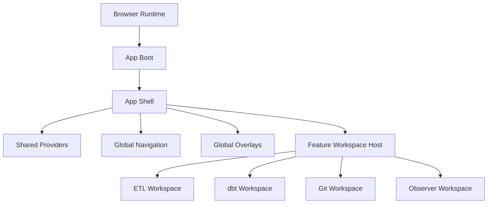
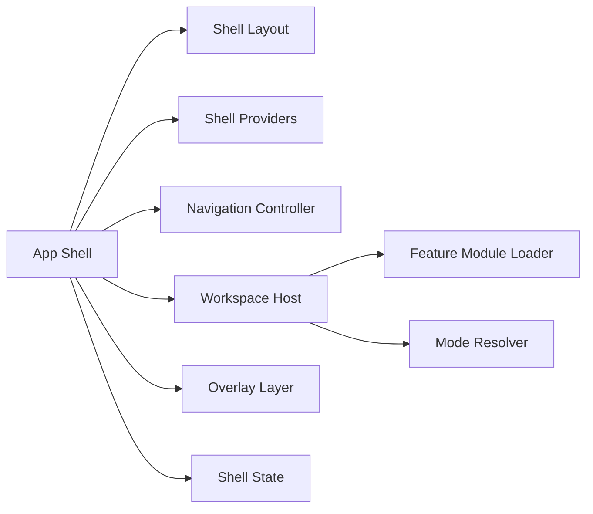
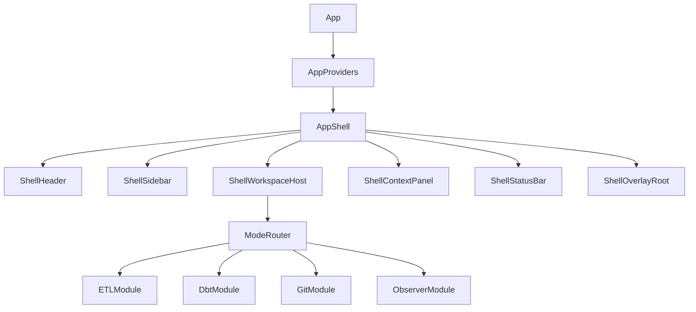
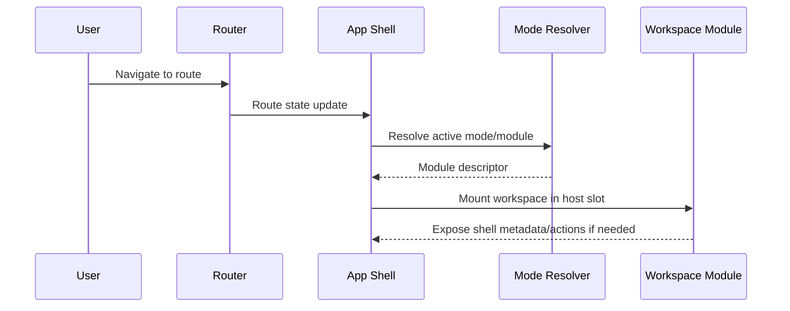
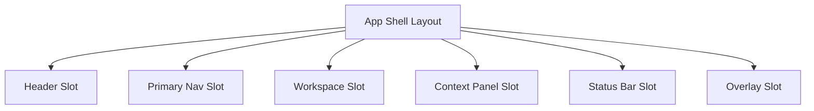
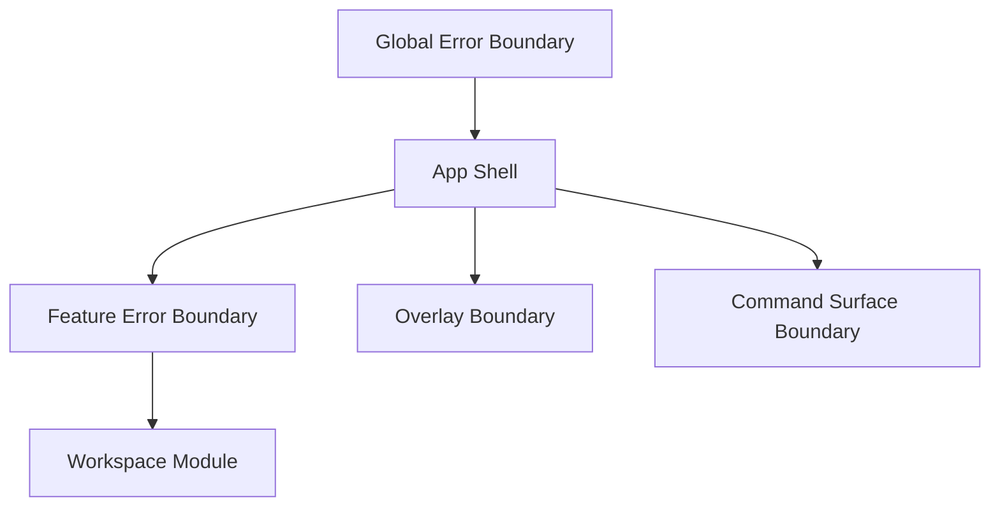
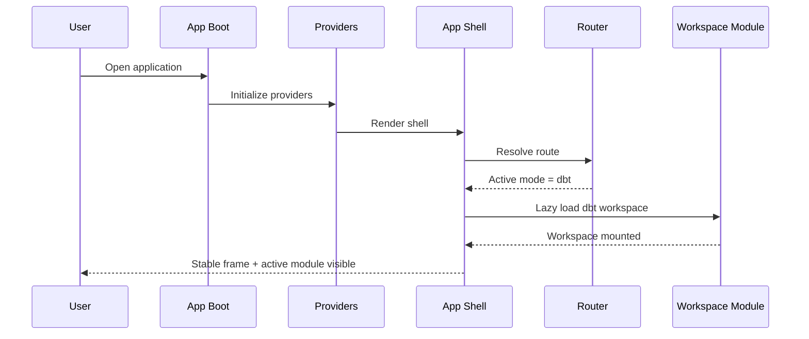

# App Shell

## 1. Purpose

The **App Shell** is the structural runtime frame of the frontend. It is responsible for hosting the global application layout, bootstrapping cross-cutting services, and providing the stable container in which all product modes run.

It is **not** the place for domain logic, workflow execution logic, or feature-specific orchestration. Its job is to provide a predictable outer frame for the product.

The App Shell should remain thin, stable, and mostly insensitive to the internal complexity of ETL mode, dbt mode, Git mode, observer mode, or future modules.

---

## 2. Objectives

The App Shell must solve these concerns:

- Provide the persistent frame of the application.
- Coordinate global navigation and top-level mode switching.
- Bootstrap shared runtime services.
- Host shared UI infrastructure such as panels, overlays, notifications, dialogs, and command surfaces.
- Isolate feature modules behind explicit boundaries.
- Preserve layout and interaction consistency across modes.
- Support future extensibility without turning into a god component.

---

## 3. Scope

### In scope

- Global layout composition
- Route and workspace framing
- Top bar / primary navigation / side navigation containers
- Shared providers
- Theme, session, preferences, feature flags, and permissions context wiring
- Shell-level commands and overlays
- Error boundaries at application frame level
- Lazy loading and mounting of feature workspaces
- Responsive layout behavior at shell level

### Out of scope

- Domain rules
- Planner or engine execution logic
- Workspace internals
- Canvas interaction logic
- dbt graph semantics
- ETL transformation behavior
- Git business rules
- Observer analytics logic

Those belong to dedicated bounded areas and must be plugged into the shell, not embedded in it.

---

## 4. Architectural role

The App Shell is the **outer UI composition boundary**.

It sits between:

- the platform/runtime layer
- the shared frontend infrastructure
- the feature workspaces

Conceptually:



The shell must know **how to host modules**, but not **how those modules work internally**.

---

## 5. Design principles

## 5.1 Thin shell

The App Shell must remain orchestration-focused.  
It should assemble structure, not accumulate feature decisions.

## 5.2 Stable frame, replaceable features

Feature modules should be mountable, replaceable, or evolvable without requiring major changes in the shell.

## 5.3 Explicit boundaries

The shell should communicate with feature modules via typed contracts, routing state, and application services.  
No hidden coupling through ad hoc imports or direct state mutation.

## 5.4 Persistent UI consistency

Global areas such as header, navigation, status bar, command palette, and notifications should behave consistently regardless of the active mode.

## 5.5 Progressive loading

Heavy workspaces must be lazy-loaded. The shell should support partial startup and graceful loading states.

## 5.6 Failure containment

A failure inside a feature module should not collapse the whole application frame unless the failure is truly global.

---

## 6. Core responsibilities

## 6.1 Bootstrap shared runtime

The shell initializes and wires the application-level providers:

- router
- authentication/session context
- permissions context
- theme and appearance
- internationalization
- feature flags
- query/cache provider
- telemetry hooks
- error boundaries
- global event and command surfaces

## 6.2 Compose the main frame

The shell composes the persistent frame:

- top header
- left navigation or mode switcher
- central workspace host
- optional right contextual panel
- bottom status/log area if globally applicable
- overlays and dialogs layer

## 6.3 Host feature workspaces

The shell chooses which workspace is active and mounts it into the workspace host region.

Typical hosted modes:

- ETL mode
- dbt mode
- edit/design mode
- room observer mode
- Git mode
- admin or settings mode in the future

## 6.4 Manage global navigation state

The shell owns navigation concerns such as:

- current route
- active mode
- selected workspace context
- restoration of last open context if required
- cross-mode navigation transitions

## 6.5 Provide cross-cutting interaction surfaces

The shell should host shared interaction primitives such as:

- command palette
- global search
- notifications
- modal manager
- confirmation dialogs
- keyboard shortcuts registry
- global activity indicators
- toasts and transient system messages

---

## 7. Logical decomposition

A clean App Shell can be decomposed into these major pieces.



### Shell Providers

Wraps all shared application providers.

### Shell Layout

Defines the persistent visual frame and slots.

### Navigation Controller

Resolves active route, mode, and navigation state.

### Workspace Host

Mounts the active workspace module.

### Overlay Layer

Hosts modal/dialog/command/notification surfaces.

### Shell State

Stores UI-level shell state only, not feature domain state.

---

## 8. Recommended component model

A practical composition could look like this:



Suggested responsibilities:

| Component            | Responsibility                                             |
| -------------------- | ---------------------------------------------------------- |
| `AppProviders`       | Bootstraps global providers                                |
| `AppShell`           | Composes the persistent frame                              |
| `ShellHeader`        | Global header, commands, title, environment, quick actions |
| `ShellSidebar`       | Primary navigation and mode switching                      |
| `ShellWorkspaceHost` | Main rendering slot for active module                      |
| `ShellContextPanel`  | Optional contextual side information                       |
| `ShellStatusBar`     | Status, sync, environment, telemetry summary               |
| `ShellOverlayRoot`   | Modals, toasts, command palette, drawers                   |
| `ModeRouter`         | Resolves active workspace module                           |

---

## 9. State ownership

A common frontend failure is allowing the shell to become the owner of too much state.

The recommended rule is:

- **Shell owns shell state**
- **Features own feature state**
- **Shared application services own shared cross-feature concerns**

### Shell state examples

Valid shell-owned state:

- active navigation item
- sidebar collapsed/expanded
- active top-level mode
- layout density
- currently opened global overlay
- active theme
- shell-level loading indicator

### State that should not live in the shell

- graph selection internals
- ETL node configuration
- dbt model execution details
- Git diff contents
- observer metric calculations
- canvas viewport semantics for specific modes unless standardized at product level

---

## 10. Routing and mode resolution

The App Shell should act as the stable frame around routing, not as a place where routing rules are mixed with feature internals.

Recommended flow:



A module descriptor may contain:

- mode identifier
- lazy loader
- permissions requirement
- optional shell configuration overrides
- title/icon metadata
- supported contextual panels
- command contributions

---

## 11. Shell-to-feature contract

The shell and feature modules should interact through an explicit contract.

Example conceptual contract:

```ts
export interface WorkspaceModuleContract {
  id: string;
  title: string;
  mountPath: string;
  requiresAuth?: boolean;
  requiredCapabilities?: string[];
  getShellConfig?: () => ShellConfigContribution;
  getCommands?: () => CommandContribution[];
}
```

This avoids hardcoding mode behavior directly into the shell.

Recommended contract areas:

- metadata
- permissions/capabilities
- lazy loading
- shell command contributions
- optional context panel contributions
- optional status bar contributions

---

## 12. Layout strategy

The App Shell should define **slots**, not rigid feature markup.

Suggested shell slots:

- `header`
- `primaryNav`
- `workspace`
- `contextPanel`
- `statusBar`
- `overlayRoot`

This gives a durable layout grammar that features can plug into without changing the shell structure.



---

## 13. Error handling model

The shell should provide layered failure containment.

### Global boundary

Protects the whole application frame from catastrophic bootstrap failures.

### Feature boundary

Each mounted workspace should run inside its own boundary where possible.

### Overlay/service boundary

Global overlays and async shell services should fail without destabilizing the workspace.

Recommended hierarchy:



---

## 14. Performance considerations

The App Shell has direct impact on perceived performance.

### Required measures

- Lazy-load heavy feature workspaces.
- Keep shell bundle small.
- Avoid shell-level re-renders caused by feature-local state.
- Memoize shell frame components where appropriate.
- Use suspense/loading boundaries per workspace.
- Defer non-critical telemetry and secondary providers.
- Prevent navigation from remounting the entire frame unnecessarily.

### Anti-patterns

- Storing large feature objects in shell state
- Passing unstable callbacks deeply through the shell
- Letting global providers become feature-specific
- Mounting all feature workspaces eagerly

---

## 15. Security and access control

The shell is not the authorization engine, but it is a primary enforcement surface for UI access.

Responsibilities:

- Hide or disable routes/modes the user cannot access.
- Resolve visible navigation from capability data.
- Prevent accidental mounting of unauthorized modules.
- Surface environment and tenant context clearly.
- Delegate authoritative permission validation to backend/application services.

The shell should never be the only protection layer, but it must not ignore access control either.

---

## 16. Observability responsibilities

The shell should emit frontend-level signals for:

- application bootstrap success/failure
- route transitions
- workspace mount/unmount
- shell command usage
- global error boundaries triggered
- shell render timings
- lazy-load timings for modules

This is useful for UX diagnostics and production support.

---

## 17. Example runtime flow



---

## 18. Recommended folder direction

One possible direction:

```text
src/
  app/
    App.tsx
    AppProviders.tsx
    AppShell.tsx
    routing/
      ModeRouter.tsx
      routes.ts
    shell/
      layout/
        ShellLayout.tsx
        ShellHeader.tsx
        ShellSidebar.tsx
        ShellWorkspaceHost.tsx
        ShellContextPanel.tsx
        ShellStatusBar.tsx
      overlays/
        ShellOverlayRoot.tsx
      state/
        shell.store.ts
      contracts/
        WorkspaceModuleContract.ts
      services/
        shell-navigation.service.ts
        shell-command.service.ts
```

The exact structure may vary, but the separation between:

- providers
- layout
- routing
- shell state
- shell contracts
- shell services

should remain explicit.

---

## 19. Main risks

| Risk                       | Description                                       | Impact | Mitigation                                                   |
| -------------------------- | ------------------------------------------------- | -----: | ------------------------------------------------------------ |
| Shell becomes a god object | Too many responsibilities accumulate in the shell |   High | Keep shell orchestration-only and extract services/contracts |
| Feature coupling           | Modules depend directly on shell internals        |   High | Use explicit contracts and module descriptors                |
| Global re-render pressure  | Shell rerenders on feature state updates          |   High | Isolate state ownership and memoize stable frame             |
| Route/module drift         | Routing rules become mixed with feature logic     | Medium | Centralize mode resolution behind a router/resolver          |
| Provider inflation         | Too many providers added without discipline       | Medium | Separate essential bootstrap providers from optional ones    |
| Inconsistent UX            | Each mode bypasses shell conventions              | Medium | Define shell contribution rules and slot discipline          |
| Weak failure isolation     | One broken module crashes the whole UI            |   High | Use layered error boundaries                                 |

---

## 20. Decision criteria

A good App Shell should satisfy these tests:

1. A new mode can be added without rewriting the frame.
2. A failing workspace does not automatically break the whole application.
3. The shell can be understood as a structural layer, not as a domain layer.
4. Global providers remain generic and cross-cutting.
5. Navigation, overlays, and layout remain consistent across modes.
6. Shell state remains small and intentional.
7. Feature modules can evolve independently behind contracts.

---

## 21. Target position for DVT+

For DVT+, the App Shell should become the stable application frame that hosts multiple operational perspectives of the product:

- design/build perspective
- ETL operational perspective
- dbt graph perspective
- Git/review perspective
- room observer / operational monitoring perspective

That means the shell is strategically important, but technically it must remain conservative.

A strong shell does **not** become smarter over time.  
It becomes **clearer, thinner, and more predictable** as the product grows.

---

## 22. Recommended next step

After defining the App Shell formally, the next design step should be:

**Specify the Shell component inventory and contracts**, including:

- ShellHeader
- ShellSidebar
- ShellWorkspaceHost
- ShellOverlayRoot
- ModeRouter
- WorkspaceModuleContract
- shell state boundaries
- shell-level command model

That is the right bridge from conceptual architecture into implementable frontend structure.
