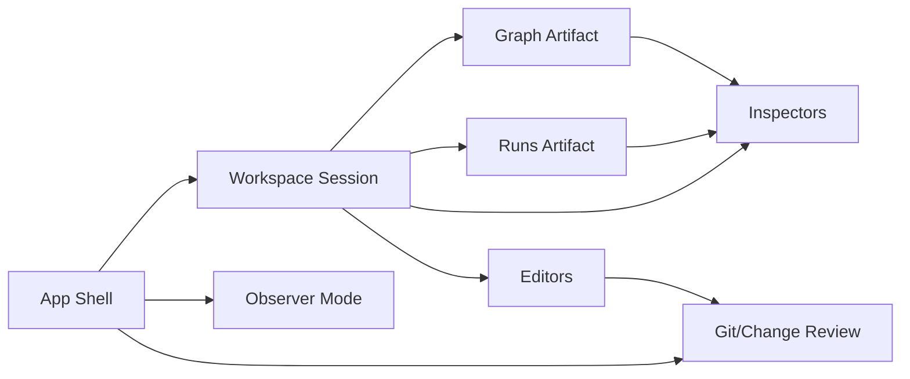
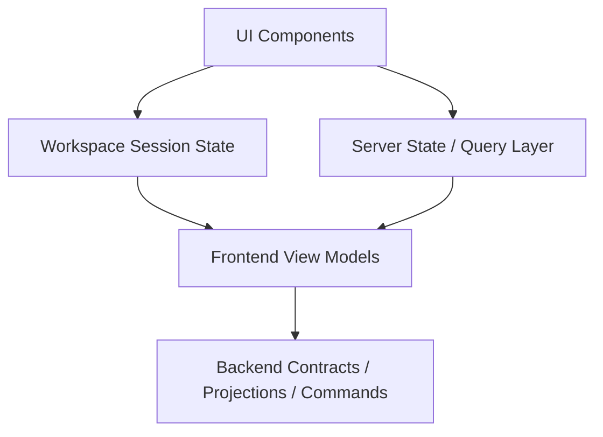

# Frontend Artifacts

## 1. Purpose

This document defines the main frontend artifacts for DVT+, their role, ownership boundaries, and the target direction for the product UI.

The purpose is not to describe implementation details file by file, but to establish a stable architectural view of the frontend as a set of explicit artifacts with clear responsibilities.

---

## 2. Scope

This artifact inventory covers the core front-end surfaces discussed so far:

- **App Shell**
- **Workspace Session**
- **Graph / Workflow Canvas**
- **Runs**
- **Inspector / Side Panels**
- **Editors**
- **Observer / Read-only modes**
- **Git / Change surfaces**
- **Shared UI infrastructure**

It is written to support progressive implementation. Not all artifacts need to exist in full from day one, but the boundaries should exist from the start.

---

## 3. Architectural Principle

The frontend should be treated as a composition of **UI artifacts**, not as a single React application full of coupled screens.

Each artifact should answer four questions:

1. **What user problem does it solve?**
2. **What state does it own?**
3. **What state does it only read?**
4. **What backend/domain contract does it depend on?**

The frontend must remain aligned with the broader DVT+ doctrine:

- the UI does not execute workflows
- the UI does not invent domain state
- the UI renders explicit contracts, projections, and commands
- the UI may compose views, but it must not become a hidden orchestration layer

---

## 4. Primary Frontend Artifacts

### 4.1 App Shell

#### Responsibility

The App Shell is the structural container of the product. It provides:

- top-level navigation
- workspace chrome
- mode switching
- layout persistence
- session restoration hooks
- global command entry points

#### Owns

- current application section
- layout mode
- active workspace identifier
- top-level feature flags
- shell-level panel visibility

#### Does not own

- graph semantics
- run state
- workflow execution logic
- domain object persistence

#### Target direction

The App Shell should evolve into a stable platform container capable of hosting multiple work modes:

- ETL mode
- dbt mode
- edit/design mode
- observer/read-only mode
- git/change review mode

#### Notes

The shell must stay thin. If the shell starts accumulating domain decisions, the architecture will rot quickly.

---

### 4.2 Workspace Session

#### Responsibility

Workspace Session represents the user’s current working context inside the application.

It answers:

- what is open
- what is selected
- what is focused
- what is pinned
- what is dirty
- what can be restored after refresh or reconnect

#### Owns

- active tab or board
- selected node / edge / asset
- open inspectors
- viewport state
- transient user interactions
- unsaved local UI edits

#### Reads

- workflow graph projection
- run summaries
- artifact metadata
- source control status

#### Target direction

Workspace Session should be modeled explicitly as a first-class frontend domain artifact rather than an accidental mix of component state.

This is important because the session becomes the bridge between:

- layout
- navigation
- editors
- graph exploration
- execution observation

---

### 4.3 Graph Artifact

#### Responsibility

The Graph artifact is the visual representation of workflows, model dependencies, operational links, and selected execution topology.

#### Capabilities

- render nodes and edges
- support zoom, pan, selection, multi-selection
- support overlays such as status, lineage, errors, timings
- support multiple visual modes
- support layout strategies

#### Visual modes

- design graph
- lineage graph
- execution graph
- dependency graph
- filtered operational view

#### Owns

- graph viewport
- visual layout state
- graph-specific interaction state

#### Reads

- canonical graph structure
- node metadata
- run overlay data
- validation annotations

#### Constraints

The graph must not become the source of truth for the workflow domain. It is a projection and interaction surface, not the domain model itself.

---

### 4.4 Runs Artifact

#### Responsibility

The Runs artifact exposes execution history, current runs, statuses, errors, timings, retries, and drill-down into execution evidence.

#### Capabilities

- list runs
- filter by status, time, workflow, environment
- inspect run details
- navigate to execution evidence
- correlate run status with graph overlays

#### Reads

- run snapshots
- event-derived projections
- enriched operational status when available

#### Target direction

The Runs surface should be split conceptually into:

1. **Run List** — operational overview
2. **Run Detail** — focused inspection
3. **Run Evidence** — logs, events, artifacts, lineage, timings

#### Constraint

The frontend should make a visible distinction between:

- snapshot state
- provider-enriched state
- stale or delayed state

Otherwise the operator will misread operational truth.

---

### 4.5 Inspector and Side Panels

#### Responsibility

Inspectors are focused contextual readers/editors attached to the current selection.

Examples:

- node inspector
- edge inspector
- run inspector
- metadata inspector
- schema inspector
- lineage inspector
- validation inspector

#### Owns

- panel open/closed state
- local editing buffer when applicable
- current tab within the inspector

#### Reads

- selected entity projection
- validation output
- static metadata
- run annotations

#### Target direction

Inspectors should be modular and composable. A monolithic right panel will become a dumping ground.

---

### 4.6 Editors

#### Responsibility

Editors are specialized artifact surfaces for mutable content.

Examples:

- SQL editor
- YAML/config editor
- model definition editor
- policy editor
- naming/format settings editor

#### Capabilities

- strict formatting
- deterministic linting
- syntax-aware errors
- diff support
- readonly and editable modes

#### Important principle

Any editor in DVT+ should be deterministic in formatting and reproducibility. Two equivalent edits should not result in noisy structural drift in Git.

This has direct implications for:

- linter strategy
- prettier/formatter strategy
- SQL formatter policy
- naming convention policy
- serialized document ordering

---

### 4.7 Observer / Read-only View

#### Responsibility

Observer mode is a safe non-destructive frontend artifact for reviewing operational state, topology, and evidence without enabling structural edits.

#### Use cases

- operations users
- audits
- incident analysis
- stakeholder review
- demo/read-only access

#### Requirements

- readonly enforcement at interaction level
- strong visual distinction from edit mode
- evidence-first navigation
- no accidental mutation paths

#### Architectural value

This mode is not cosmetic. It is an important product boundary for RBAC and auditability.

---

### 4.8 Git / Change Review Surface

#### Responsibility

This artifact exposes change tracking, diffs, generated code drift, and versioned review workflows.

#### Capabilities

- pending changes view
- semantic diff where possible
- generated vs edited artifact comparison
- branch or revision context
- review checkpoints

#### Key requirement

Because DVT+ aims for deterministic and auditable generation, the frontend should help the user distinguish:

- intentional changes
- formatting-only changes
- generated changes
- hand-authored changes
- stale projections

This surface is essential if the product wants serious engineering usage rather than only visual editing.

---

## 5. Shared UI Infrastructure Artifacts

### 5.1 Design System Layer

Should provide:

- typography
- spacing
- panel primitives
- tabs
- split views
- tables
- forms
- badges/status tokens
- command surfaces

Without this layer, the application will fragment visually and structurally.

### 5.2 State Management Layer

Should separate clearly:

- UI state
- server state
- session state
- long-lived cached projections

Recommended architectural shape already discussed:

- **Zustand** for local UI/workspace state
- **TanStack Query** for server state and polling

### 5.3 Routing and Navigation Layer

Should support deep-linkable artifacts:

- workspace
- run detail
- selection
- mode
- filters

If the UI cannot deep link to stateful views, collaboration and review become weaker.

### 5.4 Formatting and Linting Layer

Must normalize:

- SQL formatting
- text/config formatting
- naming conventions
- generated output stability

This is not just developer tooling. It is part of the product’s auditability story.

---

## 6. Artifact Interaction Map

---

## 7. Layer View

---

## 8. Mode Matrix

| Artifact          | Edit Mode | dbt Mode | ETL Mode | Observer Mode | Git Mode       |
| ----------------- | --------- | -------- | -------- | ------------- | -------------- |
| App Shell         | Yes       | Yes      | Yes      | Yes           | Yes            |
| Workspace Session | Yes       | Yes      | Yes      | Limited       | Limited        |
| Graph             | Yes       | Yes      | Yes      | Yes           | Optional       |
| Runs              | Yes       | Yes      | Yes      | Yes           | Limited        |
| Inspectors        | Yes       | Yes      | Yes      | Read-only     | Read-only      |
| Editors           | Yes       | Yes      | Yes      | No            | Diff/read-only |
| Git Surface       | Optional  | Yes      | Yes      | Read-only     | Primary        |

---

## 9. Risks if Artifacts Are Not Separated

### 9.1 Shell bloat

If App Shell owns feature logic, every new capability becomes harder to evolve.

### 9.2 Graph-centric product trap

If everything is forced through the graph, operational workflows, diffs, evidence inspection, and configuration editing become weak.

### 9.3 Inspector dumping ground

If the side panel becomes the default place for every feature, the product will become incoherent.

### 9.4 Session drift

If workspace session is not modeled explicitly, refresh/reconnect behavior becomes inconsistent and frustrating.

### 9.5 Weak audit UX

If Git/change review and observer mode are secondary, the product will not meet serious engineering expectations.

---

## 10. Target Frontend Direction

The frontend should evolve toward a **multi-artifact workbench** rather than a single-screen editor.

That means:

- shell as platform container
- session as explicit working context
- graph as one artifact among several
- runs as operational artifact
- editors as deterministic authoring surfaces
- observer mode as audit-safe projection
- git surface as engineering-grade review layer

This direction is more scalable than treating the product as a single canvas application.

---

## 11. Suggested Implementation Order

1. **App Shell**
2. **Workspace Session**
3. **Graph Artifact**
4. **Inspector system**
5. **Runs artifact**
6. **Editors**
7. **Observer mode**
8. **Git/change review surface**

This order reduces architectural drift while still allowing visible progress.

---

## 12. Final Position

The main frontend problem is not rendering components. The main problem is defining durable artifact boundaries.

If these artifacts are made explicit early, the frontend can scale into a serious workbench.
If they are not, the product will likely collapse into a visually impressive but structurally confused UI.

---

## References

- React Flow: https://reactflow.dev/
- Zustand: https://zustand.docs.pmnd.rs/
- TanStack Query: https://tanstack.com/query/latest
- ELK Layout: https://eclipse.dev/elk/
- Dagre: https://github.com/dagrejs/dagre
- OpenLineage: https://openlineage.io/
