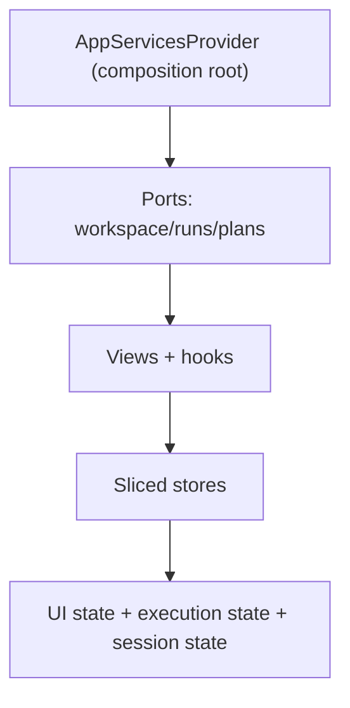

# F-04 Frontend Data Boundary Technical Manual

## Goal

Define the technical boundary for frontend data access in the web app using composition-root wiring, explicit ports, and store slices.

## Runtime Model

- Composition root resolves mode and wires services once.
- UI modules consume ports/hooks, not transport-specific clients.
- State is split by concern (`session`, `uiLayout`, `execution`, `canvasInteraction`).

## Ownership Rules

1. `resolveDataSource()` is allowed only in composition-root/config ownership modules.
2. Runtime query keys must come from `queryKeys.ts`.
3. Runtime modules must not import `stores/appStore`.
4. Feature views must depend on ports (`app/ports/*`) and shared services from context.

## Current Technical Invariants

- `queryKey` inline arrays are blocked by architecture test.
- direct import of `stores/appStore` in runtime source is blocked by architecture test.
- mode-resolution leakage outside owner modules is blocked by architecture test.
- `startRun` must use `ExecutionPlan.planRef`; runtime start is rejected in UI when `planRef` is missing.

## StartRun PlanRef Boundary

`ExecutionPlan` in the web app now carries optional `planRef` metadata for
run-start.

On the API path, `planRef` is backend-owned:

- `POST /plans/preview` returns `{ plan, planRef }` after successful preview and
  persistence.
- `POST /plans/import` returns `{ plan, planRef }` for a readable persisted
  plan.
- `plansService.api` maps `planRef` directly from that envelope and rejects
  payloads that omit it.

The runtime boundary is fail-closed:

1. `useCanvasExecutionActions` resolves `planRef` from `currentPlan`.
2. If `planRef` is absent, the hook must:
   - not call `runsService.startRun`,
   - emit an explicit user error,
   - reopen the plan modal.
3. If `planRef` exists, start-run continues through `IRunsPort`.

Mock mode may still use deterministic fixture data, but the API path must never
reconstruct `uri`, `sha256`, or version fields client-side.

This keeps runtime behavior aligned with the engine contract boundary where run
execution is `PlanRef`-driven.

## Required Test Layers

- `unit`: service adapters, selectors, mappers.
- `integration`: view + hook behavior per route.
- `architecture`: boundary checks for imports/query keys/mode ownership.

## Refactor Guidance (>200 line files)

When a file exceeds policy target, split by responsibility:

1. view shell layout
2. state selectors/actions
3. domain transforms/mappers
4. presentational fragments

Avoid extracting only to move complexity; each split must reduce boundary width and improve testability.

## Decommission Path for Legacy `appStore`

- keep as compatibility adapter only.
- remove mirror writes first.
- remove unused selectors/actions.
- delete once runtime and test harnesses fully migrated.
