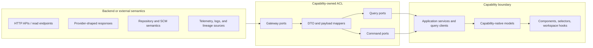

# Frontend ACL Ownership Map

## 1. Purpose

This document defines the canonical frontend anti-corruption-layer ownership map
for capability boundaries that talk to backend contracts or other foreign
system semantics.

It closes:

- `FD-DEC-04` in the frontend coverage and decision register
- `WS-02` in the frontend architecture deepening work plan

Its role is to make one point explicit:

> Every capability must be able to answer which query ports, command ports,
> gateway ports, and mappers own its backend seam without inference.

## 2. Architectural role

This document is canonical for ACL ownership across frontend capabilities.

DDD role:

- each bounded context owns its own translation boundary
- foreign semantics stop at the capability ACL, not in components or workspace
- cross-capability collaboration happens after translation, not before it

Hexagonal-compatible role:

- query ports own read-model access from the capability perspective
- command ports own state-changing user intents from the capability perspective
- gateway ports own foreign API, protocol, provider, or repository semantics
- mappers own translation from foreign payloads into capability-native models

SOLID note:

- SOLID is used here as a design-quality goal, not as Fowler taxonomy
- the evidence for these seams is grounded in Fowler-compatible layering,
  mapper, gateway, DTO, and service-boundary sources

## 3. Canonical ACL rules

The following rules are mandatory for every capability ACL:

1. Backend DTOs, provider payloads, repository payloads, and telemetry payloads
   must terminate in capability-owned gateways and mappers.
2. Query ports may return only capability-native models, projections, or shared
   kernel references. They must not return raw transport DTOs.
3. Command ports may accept only explicit intent inputs and may return only
   explicit capability-native results, acknowledgements, or capability flags.
4. Workspace, Graph, and Inspector must consume translated capability models or
   shared-kernel models. They must not become secondary ACL owners.
5. Shared-kernel types such as `SelectionContext`, `WorkspaceTab`, and
   `WorkspaceLayout` must remain coordination contracts, never transport
   envelopes.
6. If two capabilities talk to the same backend family, each still owns its own
   frontend-side mapping unless a single shared mapper is explicitly declared as
   canonical and semantically safe.

## 4. Standard ACL shape

Translation stop line:

- foreign payloads stop at gateway and mapper boundaries
- application services, stores, selectors, and components work only with
  capability-native models after that line

## 5. Ownership matrix

| Capability    | Query family                     | Command family         | Gateway family                  | Mapper owner             |
| ------------- | -------------------------------- | ---------------------- | ------------------------------- | ------------------------ |
| Planning      | plan projections and analysis    | none                   | planner read and artifact refs  | Planning capability      |
| Runs          | run reads and diagnostics        | run lifecycle commands | runs read, actions, enrichment  | Runs capability          |
| Artifacts     | catalog, detail, preview, export | none                   | artifact read, content, export  | Artifacts capability     |
| Git           | workspace, diff, conflicts, sync | stage, discard, commit | repository, formatting, policy  | Git capability           |
| Lineage       | graph, neighborhood, evidence    | none                   | lineage projection and evidence | Lineage capability       |
| Observability | system, workflow, run, step, log | none                   | observability, telemetry, logs  | Observability capability |

## 6. Capability ownership details

### 6.1 Planning

Foreign source families:

- canonical plan projections
- plan analysis and bottleneck projections
- plan validation and policy results
- artifact references related to a plan
- plan-to-run navigation payloads

Canonical ownership:

- Planning owns the translation from planner-facing DTOs into frontend-native
  models such as `PlanView`, `PlanDiffView`, `PlanValidationIssueView`,
  artifact-reference views, and related-run views.
- Planning query ports are read-only in the current canonical baseline.
- Planning does not currently own a backend command seam in the frontend
  architecture corpus.

Exact query ports:

- `PlanProjectionQueryPort`
- `PlanAnalysisQueryPort`
- `PlanValidationQueryPort`
- `PlanDiffQueryPort`
- `PlanArtifactRefsQueryPort`
- `PlanRelatedRunsQueryPort`

Exact command ports:

- none in current canonical baseline

Exact gateway ports:

- `PlannerReadGatewayPort`
- `PlannerAnalysisGatewayPort`
- `PlannerValidationGatewayPort`
- `PlannerArtifactReferenceGatewayPort`

Not allowed:

- components rendering `ExecutionPlan` DTOs directly
- step-specific transport payloads escaping the planning mapper layer
- Workspace or Inspector inventing their own plan DTO translations

### 6.2 Runs

Foreign source families:

- run summaries and snapshots
- run events and diagnostics
- action-capability payloads
- optional provider-enriched status payloads

Canonical ownership:

- Runs owns the translation from run DTOs into frontend-native models such as
  `RunSummaryVM`, `RunStatusVM`, `RunEventVM`, `RunDiagnosticsVM`, and run
  action models.
- Runs owns the frontend command seam for cancel, retry, and resume.
- Provider-shaped enrichment remains behind the Runs ACL and must not leak into
  general-purpose components.

Exact query ports:

- `RunListQueryPort`
- `RunDetailQueryPort`
- `RunEventsQueryPort`
- `RunDiagnosticsQueryPort`
- `RunActionsQueryPort`

Exact command ports:

- `CancelRunCommandPort`
- `RetryRunCommandPort`
- `ResumeRunCommandPort`

Exact gateway ports:

- `RunsReadGatewayPort`
- `RunsActionsGatewayPort`
- `RunEnrichmentGatewayPort`

Not allowed:

- presentational components parsing snapshot or provider payloads directly
- enriched provider fields overwriting canonical snapshot truth in mapper output
- command buttons posting transport shapes from components

### 6.3 Artifacts

Foreign source families:

- artifact metadata
- content descriptors and preview payloads
- download handles or signed references
- redaction and permission payloads when artifacts are not fully readable

Canonical ownership:

- Artifacts owns translation from artifact transport payloads into stable
  artifact list, detail, preview, content, and download reference models.
- Artifacts is read-only in the current canonical baseline.
- Artifact references exposed by Planning or Runs remain foreign until the
  Artifacts ACL resolves them.

Exact query ports:

- `ArtifactCatalogQueryPort`
- `ArtifactDetailQueryPort`
- `ArtifactPreviewQueryPort`
- `ArtifactContentQueryPort`
- `ArtifactDownloadQueryPort`

Exact command ports:

- none in current canonical baseline

Exact gateway ports:

- `ArtifactsReadGatewayPort`
- `ArtifactsContentGatewayPort`
- `ArtifactsDownloadGatewayPort`

Repository-local policy note:

- There is not yet a standalone Artifacts capability specification with exact
  port names.
- The exact Artifacts port family defined here is repository-local canonical
  policy anchored to `front-artifacts.md` and to the Planning and Runs
  documents that already reference artifact seams.

Not allowed:

- Planning or Runs embedding artifact preview DTOs in their own native models
- components resolving download transport semantics without the Artifacts ACL

### 6.4 Git

Foreign source families:

- repository status and diff payloads
- staged, unstaged, and conflict state
- commit and sync results
- formatter, linter, and policy-check results

Canonical ownership:

- Git owns the translation from repository-facing payloads into stable frontend
  query models such as `GitWorkspaceQueryModel`, diff views, conflict views,
  and sync-state views.
- Git owns the frontend command seam for stage, unstage, discard, commit, and
  sync.
- Repository, formatting, and policy semantics remain behind Git gateways.

Exact query ports:

- `GitWorkspaceStateQueryPort`
- `GitDiffQueryPort`
- `GitConflictsQueryPort`
- `GitSyncStateQueryPort`

Exact command ports:

- `StageChangesCommandPort`
- `UnstageChangesCommandPort`
- `DiscardChangesCommandPort`
- `CreateCommitCommandPort`
- `SyncBranchCommandPort`

Exact gateway ports:

- `RepositoryGatewayPort`
- `FormattingGatewayPort`
- `PolicyGatewayPort`

Not allowed:

- raw CLI-oriented output rendered directly in components
- shell or workspace code staging files without going through Git command ports
- formatter and policy payloads leaking into generic components without mapping

### 6.5 Lineage

Foreign source families:

- lineage projections
- neighborhood expansion payloads
- evidence payloads
- multi-source lineage inputs such as dbt artifacts, execution events,
  OpenLineage-derived projections, and static metadata catalogs

Canonical ownership:

- Lineage owns the translation from backend lineage projections into
  capability-native graph and evidence models.
- Lineage is read-only in the current canonical baseline.
- Multi-source normalization belongs to Lineage gateways and mappers, not to
  the graph renderer.

Exact query ports:

- `LineageProjectionQueryPort`
- `LineageNeighborhoodQueryPort`
- `LineageEvidenceQueryPort`
- `LineageImpactQueryPort`
- `LineageDiffQueryPort`

Exact command ports:

- none in current canonical baseline

Exact gateway ports:

- `LineageProjectionGatewayPort`
- `LineageEvidenceGatewayPort`

Not allowed:

- Graph components making source-specific assumptions about OpenLineage, dbt, or
  execution-event payloads
- Workspace or Inspector merging lineage payloads on their own

### 6.6 Observability

Foreign source families:

- run snapshots
- run events
- aggregated telemetry metrics
- correlated logs
- system-health and workflow-health payloads

Canonical ownership:

- Observability owns the translation from observability DTOs into stable system,
  workflow, run, step, and log-oriented views.
- Observability is read-only in the current canonical baseline.
- Snapshot, event, telemetry, and log semantics remain behind the Observability
  ACL and must be combined only through capability-owned query and mapper logic.

Exact query ports:

- `SystemHealthQueryPort`
- `WorkflowObservabilityQueryPort`
- `RunObservabilityQueryPort`
- `StepObservabilityQueryPort`
- `CorrelatedLogsQueryPort`

Exact command ports:

- none in current canonical baseline

Exact gateway ports:

- `ObservabilityReadGatewayPort`
- `TelemetryMetricsGatewayPort`
- `CorrelatedLogGatewayPort`

Not allowed:

- reconstructing run truth in the browser from raw events
- treating logs as the primary source of current run state
- components combining snapshots, metrics, and logs ad hoc

### 6.7 Contexts without primary backend ACL ownership

The following contexts must not own primary backend ACLs in the current
frontend architecture:

- Workspace
- Graph
- Inspector
- App Shell

Their job is to coordinate, compose, route, and render translated capability
models. They may consume:

- shared-kernel contracts
- capability-native models returned by query ports
- explicit command ports exposed by a capability

They must not consume:

- backend DTOs
- provider payloads
- repository payloads
- telemetry transport shapes

## 7. Negative rules

The following anti-patterns are prohibited by this map:

- one "shared frontend API client" that returns raw payloads to many
  capabilities
- one mega-mapper that translates several bounded contexts at once
- components returning or storing transport DTOs as local truth
- Workspace stores doubling as foreign-system adapters
- query hooks whose public return types are backend DTOs
- command handlers that accept transport payloads assembled in the component

## 8. Architectural precedents and evidence

### 8.1 Fowler primary sources

Primary sources:

- Martin Fowler, [Bounded Context](https://martinfowler.com/bliki/BoundedContext.html)
- Martin Fowler, [Presentation Domain Data Layering](https://martinfowler.com/bliki/PresentationDomainDataLayering.html)
- Martin Fowler, [Separated Presentation](https://martinfowler.com/eaaDev/SeparatedPresentation.html)
- Martin Fowler, [Data Mapper](https://martinfowler.com/eaaCatalog/dataMapper.html)
- Martin Fowler, [Data Transfer Object](https://martinfowler.com/eaaCatalog/dataTransferObject.html)
- Martin Fowler, [Gateway](https://martinfowler.com/eaaCatalog/gateway.html)
- Randy Stafford on martinfowler.com,
  [Service Layer](https://martinfowler.com/eaaCatalog/serviceLayer.html)

Precedent classification:

- `compatible precedent` for capability-local ownership of translation
  boundaries, gateway seams, mapper seams, and application-facing service
  operations

### 8.2 Non-Fowler primary reference for the named ACL pattern

No materially applicable Fowler-authored page was found for the
Anti-Corruption Layer pattern as a named standalone pattern page.

Primary non-Fowler source:

- Azure Architecture Center,
  [Anti-corruption Layer pattern](https://learn.microsoft.com/en-us/azure/architecture/patterns/anti-corruption-layer)

Why this source is authoritative:

- it is an official architecture-pattern reference from a mature, production
  platform
- it defines the ACL as a facade or adapter layer between subsystems that do
  not share the same semantics
- it explicitly states that the translation layer contains the logic necessary
  to translate between the two systems

Precedent classification:

- `exact precedent` for the named ACL concept as a translation layer between
  semantically different subsystems

### 8.3 Repository-local canonical policy

The exact capability-to-port matrix in this document is repository-local
canonical policy.

This includes:

- the exact port-family names
- the exact mapper ownership split per capability
- the Artifacts port family, because the Artifacts capability still lacks its
  own standalone architecture document

That policy is anchored to the Fowler-compatible sources above, plus the exact
ACL pattern reference from Azure Architecture Center.

## 9. References

- [Frontend DDD Target Architecture](./frontend-ddd-target-architecture.md)
- [Frontend Architecture Execution Plan](./frontend-architecture-execution-plan.md)
- [Frontend Coverage Map And Open Decision Register](./review/frontend-coverage-map-and-open-decision-register.md)
- [Frontend Architecture Deepening Work Plan](./review/frontend-architecture-deepening-work-plan.md)
- [Frontend Architecture - Planning Capability](./planning/frontend-planning-capability-architecture.md)
- [Runs Frontend Architecture](./runs/dvt-runs-frontend-architecture.md)
- [Frontend Artifacts](./artifacts/front-artifacts.md)
- [Git Mode Architecture](./git/git-mode-architecture.md)
- [DVT+ Frontend Lineage](./lineage/dvt-frontend-lineage.md)
- [Frontend Observability Architecture](./observability/front-observability-architecture-dvt.md)
