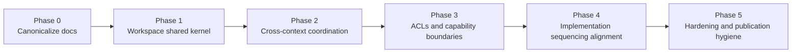

# Frontend Architecture Execution Plan

## 1. Purpose

This document defines the architecture program required to turn the current
frontend document set into an implementable frontend architecture.

It complements, but does not replace:

- the capability architecture documents
- the DDD target architecture
- the implementation-facing refactoring plan in
  `docs/architecture/frontend/review/frontend-architecture-review-and-critical-action-plan.md`

## 2. Inputs

Primary inputs:

- [Frontend Documentation Quality Review And Remediation Plan](./review/frontend-documentation-quality-review-and-remediation-plan.md)
- [Frontend DDD Target Architecture](./frontend-ddd-target-architecture.md)
- [DVT+ Frontend Architecture Introduction](./dvt-frontend-architecture-introduction.md)
- [Workspace Domain Specification](./workspace/workspace-domain-specification.md)
- [Workspace Orchestration - Cross-Feature Coordination Mechanism](./workspace/workspace-orchestration.md)
- [Frontend Architecture Review and Critical Action Plan](./review/frontend-architecture-review-and-critical-action-plan.md)

Governing sources:

- [AGENTS.md](../../../AGENTS.md)
- [Governance Document And Rule Inventory](../../planning/status/governance-document-rule-inventory.md)
- [AI Work Protocol](../../guides/ai-work-protocol.md)
- [Reference Architecture](../reference-architecture.md)
- [ADR-0034 - Bounded Context Boundaries And Communication Rules](../../adr/ADR-0034-bounded-context-boundaries-and-communication-rules.md)

## 3. Program outcome

The target outcome is a frontend that is:

- governed by one canonical architecture set
- decomposed by explicit frontend bounded contexts
- coordinated through a workspace shared kernel
- translated from backend contracts through ACLs
- implementable in small shippable slices

## 4. Execution principles

### 4.1 Architecture first, but only at the right level

Architecture must define:

- boundaries
- shared language
- interaction rules
- sequencing constraints

Architecture must not pretend to solve every component and store detail upfront.

### 4.2 Every phase must leave a usable baseline

Each phase must produce a stable and readable result, not a half-declared
target state.

### 4.3 Shared kernel before capability proliferation

Do not expand feature work until these are canonical and agreed:

- `moduleId` versus `workbenchMode`
- `SelectionContext`
- `WorkspaceTab`
- `WorkspaceLayout`
- cross-feature orchestration rules

### 4.4 ACLs before DTO-driven UI growth

Do not let feature modules hard-bind themselves to backend payloads. The
translation layer must be declared before feature complexity rises.

## 5. Phased plan

### Phase 0 - Canonicalize the frontend document set

**Objective**

Turn the frontend docs from a wide draft corpus into a clear baseline.

**Deliverables**

- updated frontend index
- documentation quality review
- DDD target architecture
- this execution plan

**Fitness function**

A reader can answer these questions from the canonical set only:

- what is authoritative
- what is current reality
- what is target architecture
- what is reference-only

### Phase 1 - Define the Workspace shared kernel

**Objective**

Turn the workspace from a strong idea into the canonical interaction kernel of
the frontend.

**Required outputs**

- canonical shared-kernel vocabulary
- explicit module and workbench mode taxonomy
- explicit ownership of session, layout, and orchestration

**Fitness function**

No feature document requires readers to guess who owns selection, tabs,
layout, or mode semantics.

### Phase 2 - Formalize cross-context coordination

**Objective**

Make Workspace the mediated coordination boundary for feature interactions.

**Required outputs**

- domain sequence diagrams for core flows
- capability docs aligned to mediated interaction rules
- implementation review aligned to the same rule set

**Fitness function**

Every core cross-feature interaction can be expressed as:

1. user intent
2. workspace coordination
3. shared-kernel update or context resolution
4. capability projection response

### Phase 3 - Declare ACLs and capability boundaries

**Objective**

Prevent backend DTOs and provider-shaped semantics from becoming the
frontend's native language.

**Required outputs**

- ACL map for Planning, Runs, Artifacts, Git, and Observability
- capability docs updated to refer to translated frontend models
- documented query and command boundaries for major capabilities

**Fitness function**

The frontend architecture can explain how backend contracts are translated
without referring to component-local adapters or direct DTO rendering.

### Phase 4 - Align implementation sequencing to the architecture

**Objective**

Bridge architecture and code refactoring without letting one replace the other.

**Required outputs**

- explicit dependency map between architecture phases and refactoring tasks
- one list of decision gates before deep feature work

**Fitness function**

Implementation slices cannot begin out of architectural order without that
violation being visible.

### Phase 5 - Hardening and publication hygiene

**Objective**

Raise the frontend corpus from serious draft to publication-ready baseline.

**Required outputs**

- normalized frontmatter and owner vocabulary
- mojibake and editorial drift removed
- exploratory notes reclassified or archived

**Fitness function**

The frontend docs read like one governed architecture corpus rather than a set
of adjacent design notes.

## 6. Decision gates

### Gate G1 - Language gate

Canonical meaning exists for:

- `moduleId`
- `workbenchMode`
- `SelectionContext`
- `WorkspaceTab`
- `WorkspaceLayout`

### Gate G2 - Coordination gate

The mediated interaction rule is explicit and repeated consistently:

- feature contexts do not control each other directly
- Workspace coordinates cross-feature effects

### Gate G3 - ACL gate

Each major capability has a declared translation boundary to backend
contracts.

### Gate G4 - Authority gate

The frontend index clearly distinguishes:

- current reality
- canonical target docs
- implementation review docs
- reference-only notes

## 7. Dependency graph

## 8. Architecture-to-implementation handoff

This plan does not replace the implementation-facing work in
[Frontend Architecture Review and Critical Action Plan](./review/frontend-architecture-review-and-critical-action-plan.md).

The correct relationship is:

- this document sequences architecture decisions
- the review document sequences code refactors

The code refactor program should not move ahead of the architecture program in
these areas:

- shared kernel definitions
- workspace-mediated communication
- mode taxonomy
- ACL boundaries

## 9. Risks and mitigations

| Risk                                   | Description                                                 | Mitigation                                                                |
| -------------------------------------- | ----------------------------------------------------------- | ------------------------------------------------------------------------- |
| Over-documenting without consolidation | More docs are added but authority remains unclear           | Keep the index authoritative and limit the canonical set.                 |
| Architecture drift from code reality   | The target docs diverge from `apps/web` and the review plan | Keep the implementation review as a companion, not a separate worldview.  |
| Shared kernel becomes a dumping ground | Too many types move into shared scope                       | Apply a strict shared-kernel rule: only cross-context concepts enter.     |
| ACLs remain implicit                   | Capability docs keep using backend payload terms directly   | Make ACL ownership explicit in each capability document update.           |
| Hygiene work is postponed forever      | Governance issues remain after architecture is written      | Keep Phase 5 as an explicit named phase with visible completion criteria. |

## 10. Recommended next slices

After this baseline, the next serious frontend slices should be:

1. metadata and hygiene normalization across the existing frontend docs
2. workspace shared-kernel canonicalization
3. capability doc alignment to the DDD baseline
4. code-level implementation slices that follow the refactoring review order

## 11. References

- [Frontend Documentation Quality Review And Remediation Plan](./review/frontend-documentation-quality-review-and-remediation-plan.md)
- [Frontend DDD Target Architecture](./frontend-ddd-target-architecture.md)
- [DVT+ Frontend Architecture Introduction](./dvt-frontend-architecture-introduction.md)
- [Workspace Domain Specification](./workspace/workspace-domain-specification.md)
- [Workspace Orchestration - Cross-Feature Coordination Mechanism](./workspace/workspace-orchestration.md)
- [Frontend Architecture Review and Critical Action Plan](./review/frontend-architecture-review-and-critical-action-plan.md)
- Fowler, _Refactoring: Improving the Design of Existing Code_ (2nd ed.)
- Fowler, _Patterns of Enterprise Application Architecture_
- Evans, _Domain-Driven Design_
