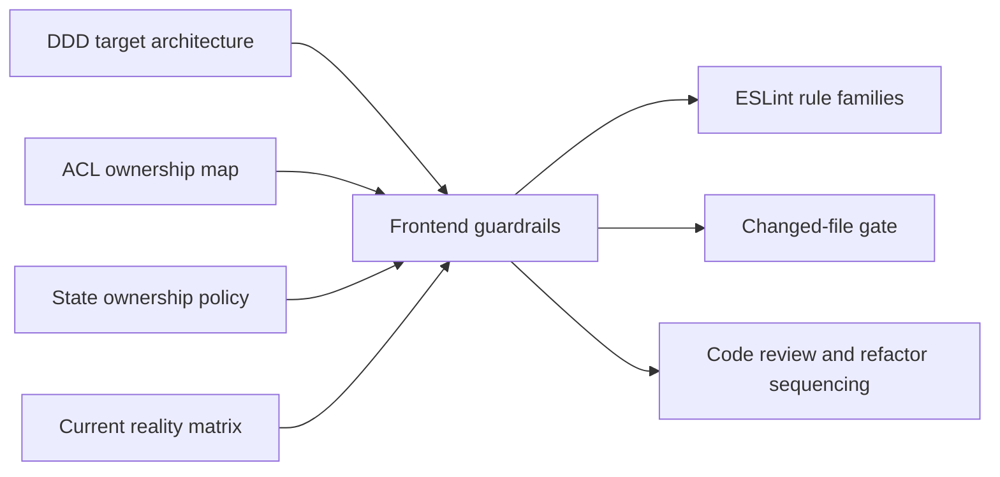
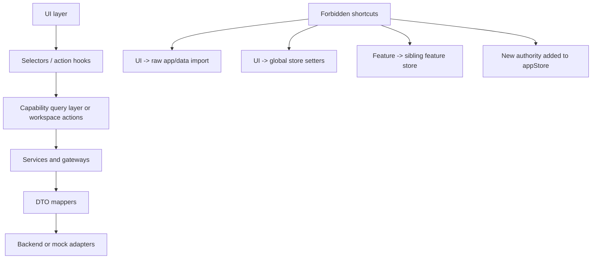
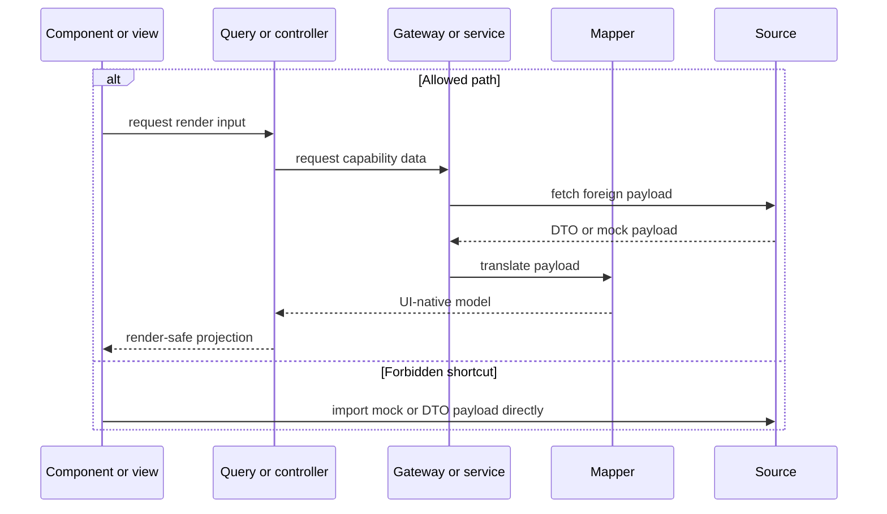
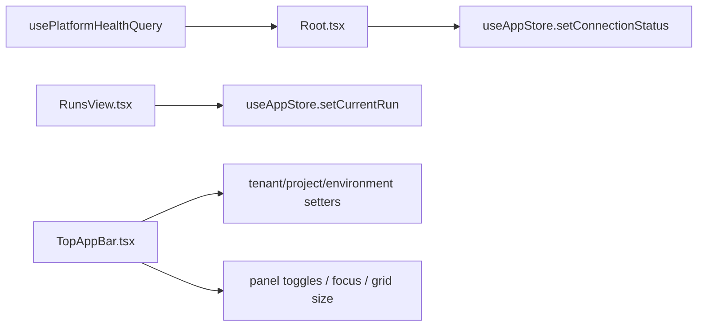
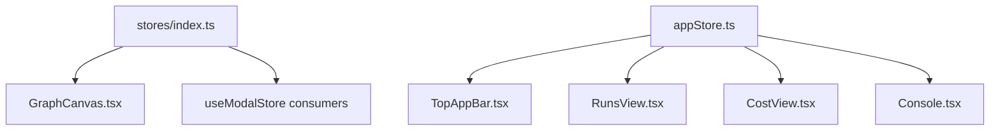
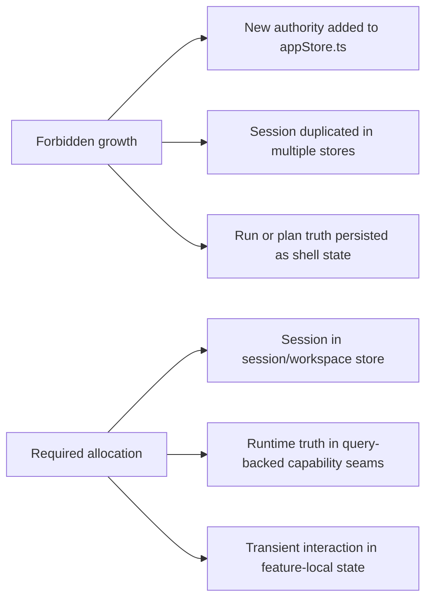
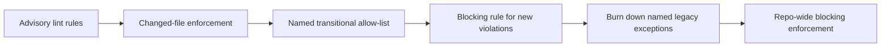
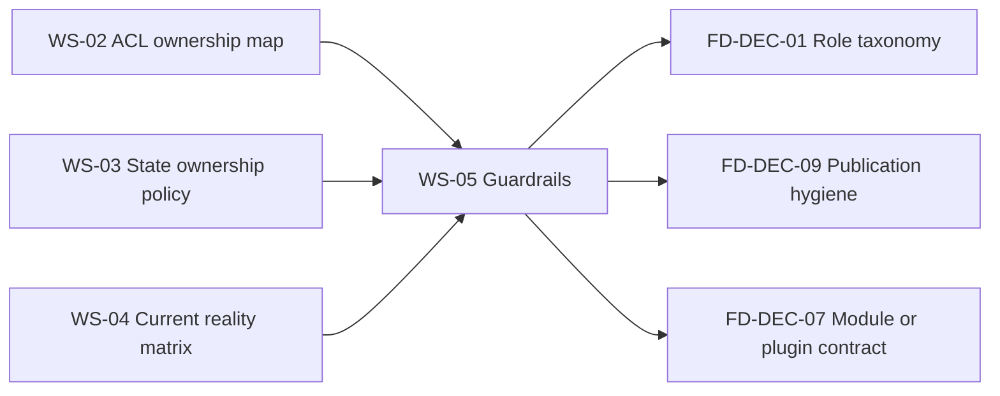

# Frontend Architecture Guardrails

## 1. Purpose

This document closes:

- `FD-DEC-10` in the frontend coverage and decision register
- `WS-05` in the frontend architecture deepening work plan

Its role is to turn already-closed frontend architecture decisions into one
canonical, enforceable guardrail baseline.

Those decisions already exist in the corpus:

- [Frontend DDD Target Architecture](./frontend-ddd-target-architecture.md)
- [Frontend ACL Ownership Map](./frontend-acl-ownership-map.md)
- [Frontend State Ownership And Persistence Policy](./frontend-state-ownership-and-persistence-policy.md)
- [Frontend Current Reality Matrix](./review/frontend-current-reality-matrix.md)

This document makes the next step explicit:

> Architecture rules must stop being prose-only. They need named guardrail
> families, measurable examples from `apps/web`, and a staged enforcement path.

## 2. Architectural role

This document is the canonical source for frontend architectural guardrails.

It defines:

- which frontend drift patterns are prohibited
- which current `apps/web` files demonstrate those drift patterns
- which enforcement mechanisms fit the repository's current tooling
- how adoption moves from advisory checks to blocking checks without a big-bang
  rewrite

It does not replace:

- the target architecture
- the ACL ownership map
- the state ownership policy
- the current-reality matrix

Those documents define the rules and the current posture. This document defines
how those rules become guardrails.

### 2.1 Guardrail scope map



**Evidence classification**

- Repo evidence:
  [frontend-ddd-target-architecture.md](./frontend-ddd-target-architecture.md),
  [frontend-acl-ownership-map.md](./frontend-acl-ownership-map.md),
  [frontend-state-ownership-and-persistence-policy.md](./frontend-state-ownership-and-persistence-policy.md),
  [frontend-current-reality-matrix.md](./review/frontend-current-reality-matrix.md),
  [package.json](../../../package.json),
  [eslint.config.cjs](../../../eslint.config.cjs),
  [check-changed.cjs](../../../scripts/check-changed.cjs)
- Fowler evidence: `compatible precedent` from
  [Bounded Context](https://martinfowler.com/bliki/BoundedContext.html),
  [Presentation Domain Data Layering](https://martinfowler.com/bliki/PresentationDomainDataLayering.html),
  and
  [Refactoring](https://www.martinfowler.com/books/refactoring.html)
- Repository policy: `local canonical policy` because the mapping from closed
  architecture docs to enforcement surfaces is repository-specific

## 3. Canonical guardrail families

The frontend guardrail baseline consists of four mandatory families.

| Guardrail ID | Mandatory rule                                                                                     | Primary enforcement family                                                    | Current drift examples                                                                                                                                                                                                                                  |
| ------------ | -------------------------------------------------------------------------------------------------- | ----------------------------------------------------------------------------- | ------------------------------------------------------------------------------------------------------------------------------------------------------------------------------------------------------------------------------------------------------- |
| `FG-01`      | Components and views must not consume raw mock payloads or transport-shaped payloads directly.     | `no-restricted-imports`, mapper/query/controller boundaries                   | [GraphCanvas.tsx](../../../apps/web/src/app/components/GraphCanvas.tsx), [useCapabilitiesQuery.ts](../../../apps/web/src/app/queries/useCapabilitiesQuery.ts), [usePlatformHealthQuery.ts](../../../apps/web/src/app/queries/usePlatformHealthQuery.ts) |
| `FG-02`      | Components and views must not mutate shared workbench state directly through global store setters. | `no-restricted-syntax`, bounded action hooks, allow-listed transitional files | [Root.tsx](../../../apps/web/src/app/Root.tsx), [RunsView.tsx](../../../apps/web/src/app/views/RunsView.tsx), [TopAppBar.tsx](../../../apps/web/src/app/components/TopAppBar.tsx)                                                                       |
| `FG-03`      | Feature code must not couple through legacy store barrels or cross-feature store imports.          | `no-restricted-imports`, path restrictions, capability-local selectors        | [GraphCanvas.tsx](../../../apps/web/src/app/components/GraphCanvas.tsx), [CostView.tsx](../../../apps/web/src/app/views/CostView.tsx), [stores/index.ts](../../../apps/web/src/app/stores/index.ts)                                                     |
| `FG-04`      | No new duplicated authority may be added to global stores.                                         | changed-file linting, code review gate, follow-up repo-wide lint rules        | [appStore.ts](../../../apps/web/src/app/stores/appStore.ts), [sessionStore.ts](../../../apps/web/src/app/stores/sessionStore.ts)                                                                                                                        |

### 3.1 Guardrail dependency model



**Evidence classification**

- Repo evidence:
  [frontend-acl-ownership-map.md](./frontend-acl-ownership-map.md),
  [frontend-state-ownership-and-persistence-policy.md](./frontend-state-ownership-and-persistence-policy.md),
  [appStore.ts](../../../apps/web/src/app/stores/appStore.ts),
  [GraphCanvas.tsx](../../../apps/web/src/app/components/GraphCanvas.tsx)
- Fowler evidence: `compatible precedent` from
  [Presentation Domain Data Layering](https://martinfowler.com/bliki/PresentationDomainDataLayering.html),
  [Separated Presentation](https://martinfowler.com/eaaDev/SeparatedPresentation.html),
  [Data Mapper](https://martinfowler.com/eaaCatalog/dataMapper.html),
  [Gateway](https://martinfowler.com/articles/gateway-pattern.html)
- Repository policy: `local canonical policy` because the exact allowed path
  for DVT frontend code is repository-specific

## 4. Measured examples from the current app

The guardrails below are grounded in concrete `apps/web` examples. They are not
generic frontend advice.

### 4.1 `FG-01` Raw payload and mock-data stop line

Mandatory rule:

- components and routed views must not import `app/data/**` directly
- components must not render transport-shaped payloads without a mapper,
  selector, or view-model boundary

Current measured examples:

- [GraphCanvas.tsx](../../../apps/web/src/app/components/GraphCanvas.tsx)
  imports `mockNodes` and `mockExecutionPlan` directly from
  `../data/mockData`
- [plansService.ts](../../../apps/web/src/app/services/plans/plansService.ts),
  [runsService.ts](../../../apps/web/src/app/services/runs/runsService.ts),
  and
  [workspaceService.ts](../../../apps/web/src/app/services/workspace/workspaceService.ts)
  still contain mock-backed adapters, which is acceptable only at the adapter
  or service seam, not inside component rendering
- [useCapabilitiesQuery.ts](../../../apps/web/src/app/queries/useCapabilitiesQuery.ts)
  and
  [usePlatformHealthQuery.ts](../../../apps/web/src/app/queries/usePlatformHealthQuery.ts)
  are valid query boundaries, but their transport shapes must terminate before
  direct component rendering becomes the dominant pattern

### 4.1.1 Raw payload stop line



**Evidence classification**

- Repo evidence:
  [GraphCanvas.tsx](../../../apps/web/src/app/components/GraphCanvas.tsx),
  [useCapabilitiesQuery.ts](../../../apps/web/src/app/queries/useCapabilitiesQuery.ts),
  [usePlatformHealthQuery.ts](../../../apps/web/src/app/queries/usePlatformHealthQuery.ts),
  [plansService.ts](../../../apps/web/src/app/services/plans/plansService.ts),
  [runsService.ts](../../../apps/web/src/app/services/runs/runsService.ts)
- Fowler evidence:
  `exact precedent` for
  [Data Transfer Object](https://martinfowler.com/eaaCatalog/dataTransferObject.html)
  and
  [Data Mapper](https://martinfowler.com/eaaCatalog/dataMapper.html);
  `compatible precedent` from
  [Separated Presentation](https://martinfowler.com/eaaDev/SeparatedPresentation.html)
- Mechanism evidence: `exact precedent` from
  [no-restricted-imports](https://eslint.org/docs/latest/rules/no-restricted-imports)
- Repository policy: `local canonical policy` because this repository defines
  `app/data/**` as a forbidden direct UI import surface

### 4.2 `FG-02` Shared-store mutation boundary

Mandatory rule:

- components and routed views do not mutate shared workbench state directly
  through global store setters
- they use shell/workspace/capability action hooks or application services
- the composition root may carry temporary exceptions while the migration is
  incomplete, but those exceptions must remain named and bounded

Current measured examples:

- [Root.tsx](../../../apps/web/src/app/Root.tsx) reads query state and writes
  `setConnectionStatus` into `useAppStore`
- [RunsView.tsx](../../../apps/web/src/app/views/RunsView.tsx) writes
  `currentRun` into `useAppStore`
- [TopAppBar.tsx](../../../apps/web/src/app/components/TopAppBar.tsx)
  mutates multiple global concerns directly through `useAppStore` setters and
  toggles

### 4.2.1 Shared-store mutation pressure today



**Evidence classification**

- Repo evidence:
  [Root.tsx](../../../apps/web/src/app/Root.tsx),
  [RunsView.tsx](../../../apps/web/src/app/views/RunsView.tsx),
  [TopAppBar.tsx](../../../apps/web/src/app/components/TopAppBar.tsx),
  [appStore.ts](../../../apps/web/src/app/stores/appStore.ts)
- Fowler evidence: `compatible precedent` from
  [Separated Presentation](https://martinfowler.com/eaaDev/SeparatedPresentation.html),
  [Presentation Domain Data Layering](https://martinfowler.com/bliki/PresentationDomainDataLayering.html),
  and
  [Bounded Context](https://martinfowler.com/bliki/BoundedContext.html)
- Mechanism evidence: `exact precedent` from
  [no-restricted-syntax](https://eslint.org/docs/latest/rules/no-restricted-syntax)
  and
  [no-restricted-properties](https://eslint.org/docs/latest/rules/no-restricted-properties)
- Repository policy: `local canonical policy` because the exact action-hook
  boundary and temporary allow-list are repo-specific migration choices

### 4.3 `FG-03` Cross-feature import and legacy barrel boundary

Mandatory rule:

- new feature code must not import from the legacy `stores/index.ts` barrel
- feature code must not coordinate by importing sibling feature stores
- shared coordination must flow through Workspace selectors, action hooks, or
  capability query/controller seams

Current measured examples:

- [GraphCanvas.tsx](../../../apps/web/src/app/components/GraphCanvas.tsx)
  imports `useCanvasStore` and `useModalStore` from `../stores`
- [CostView.tsx](../../../apps/web/src/app/views/CostView.tsx) reads
  `currentRun` from `useAppStore`, coupling the cost surface to shell-level
  shared state rather than a bounded Runs projection
- [stores/index.ts](../../../apps/web/src/app/stores/index.ts) still exports
  parallel stores and still carries `data?: any` in the tab model

### 4.3.1 Current coupling map



**Evidence classification**

- Repo evidence:
  [stores/index.ts](../../../apps/web/src/app/stores/index.ts),
  [GraphCanvas.tsx](../../../apps/web/src/app/components/GraphCanvas.tsx),
  [CostView.tsx](../../../apps/web/src/app/views/CostView.tsx),
  [Console.tsx](../../../apps/web/src/app/components/Console.tsx)
- Fowler evidence: `compatible precedent` from
  [Bounded Context](https://martinfowler.com/bliki/BoundedContext.html)
  and
  [Refactoring](https://www.martinfowler.com/books/refactoring.html)
- Mechanism evidence: `exact precedent` from
  [no-restricted-imports](https://eslint.org/docs/latest/rules/no-restricted-imports)
- Repository policy: `local canonical policy` because the forbidden
  import-path zones are repository-specific

### 4.4 `FG-04` No new duplicated authority or mega-store growth

Mandatory rule:

- no new session, run, plan, or capability authority may be added to
  `appStore.ts` or any equivalent global store
- new state must land in the owner declared by the state policy:
  capability query layer, Workspace coordination store, or feature-local state

Current measured examples:

- [appStore.ts](../../../apps/web/src/app/stores/appStore.ts) still duplicates
  `selectedTenant`, `selectedProject`, and `selectedEnvironment` while also
  delegating to `useSessionStore`
- `currentPlan` and `currentRun` still live in
  [appStore.ts](../../../apps/web/src/app/stores/appStore.ts)
- [sessionStore.ts](../../../apps/web/src/app/stores/sessionStore.ts) already
  exists as the more correct session nucleus, which means the remaining issue
  is drift and incomplete migration, not missing design

### 4.4.1 Authority allocation target



**Evidence classification**

- Repo evidence:
  [appStore.ts](../../../apps/web/src/app/stores/appStore.ts),
  [sessionStore.ts](../../../apps/web/src/app/stores/sessionStore.ts),
  [frontend-state-ownership-and-persistence-policy.md](./frontend-state-ownership-and-persistence-policy.md)
- Fowler evidence:
  `exact precedent` from
  [Data Clump](https://martinfowler.com/bliki/DataClump.html);
  `compatible precedent` from
  [Presentation Domain Data Layering](https://martinfowler.com/bliki/PresentationDomainDataLayering.html)
  and
  [Client Session State](https://martinfowler.com/eaaCatalog/clientSessionState.html)
- Repository policy: `local canonical policy` because the exact owner mapping
  across session, runtime truth, and transient state is this repository's
  canonical policy

## 5. Candidate enforcement mechanisms

The repository already has the right enforcement surfaces:

- [eslint.config.cjs](../../../eslint.config.cjs)
- [package.json](../../../package.json)
- [check-changed.cjs](../../../scripts/check-changed.cjs)

WS-05 therefore does not require inventing a new enforcement framework. It
requires using the current framework more deliberately.

### 5.1 Guardrail-to-mechanism map

| Guardrail | Candidate mechanism             | Initial scope                                                 | Enforcement shape                                                                                  |
| --------- | ------------------------------- | ------------------------------------------------------------- | -------------------------------------------------------------------------------------------------- |
| `FG-01`   | `no-restricted-imports`         | `apps/web/src/app/components/**`, `apps/web/src/app/views/**` | block direct imports from `app/data/**` and similar mock payload paths                             |
| `FG-02`   | `no-restricted-syntax`          | `components/**`, `views/**`                                   | flag direct destructuring of mutable APIs from global stores, then narrow to mutator-only patterns |
| `FG-03`   | `no-restricted-imports`         | `components/**`, `views/**`, future capability folders        | block imports from `stores/index` and from sibling feature-store paths                             |
| `FG-04`   | changed-file lint + review gate | changed files touching `appStore.ts` or future global stores  | reject new authority growth that contradicts the state policy                                      |

### 5.2 Candidate ESLint snippets

The snippets below are examples of the mechanism class, not a claim that the
repository has already enabled them.

Example for `FG-01` and `FG-03`:

```js
{
  files: ['apps/web/src/app/components/**/*.{ts,tsx}', 'apps/web/src/app/views/**/*.{ts,tsx}'],
  rules: {
    'no-restricted-imports': [
      'warn',
      {
        patterns: [
          {
            group: ['../data/*', '../../data/*', '../../../data/*'],
            message:
              'Components and views must not import mock or transport payloads directly. Use a query/controller or adapter seam.',
          },
          {
            group: ['../stores', '../stores/*', '../../stores', '../../stores/*'],
            message:
              'Components and views must not coordinate through the legacy stores barrel or sibling stores.',
          },
        ],
      },
    ],
  },
}
```

Example for `FG-02`:

```js
{
  files: ['apps/web/src/app/components/**/*.{ts,tsx}', 'apps/web/src/app/views/**/*.{ts,tsx}'],
  rules: {
    'no-restricted-syntax': [
      'warn',
      {
        selector:
          "VariableDeclarator[id.type='ObjectPattern'][init.type='CallExpression'][init.callee.name=/^use(App|Canvas|Tabs|Modal)Store$/]",
        message:
          'UI layers must consume bounded selectors or action hooks, not destructure mutable store APIs directly.',
      },
    ],
  },
}
```

### 5.3 Enforcement boundary



**Evidence classification**

- Repo evidence:
  [eslint.config.cjs](../../../eslint.config.cjs),
  [package.json](../../../package.json),
  [check-changed.cjs](../../../scripts/check-changed.cjs)
- Fowler evidence:
  `exact precedent` from
  [Refactoring](https://www.martinfowler.com/books/refactoring.html)
  and
  [Strangler Fig Application](https://martinfowler.com/bliki/StranglerFigApplication.html)
- Mechanism evidence:
  `exact precedent` from
  [no-restricted-imports](https://eslint.org/docs/latest/rules/no-restricted-imports),
  [no-restricted-syntax](https://eslint.org/docs/latest/rules/no-restricted-syntax),
  and
  [no-restricted-properties](https://eslint.org/docs/latest/rules/no-restricted-properties)
- Repository policy: `local canonical policy` because the staged rollout and
  allow-list strategy are repository-specific execution choices

## 6. Adoption sequence

The correct delivery style is Fowler-style incremental hardening, not a sudden
repo-wide clampdown.

### 6.1 Canonical rollout order

1. Advisory rules on changed frontend files only.
2. Blocking rules for new imports from `app/data/**` and `stores/index`.
3. Named allow-list for transitional files that already violate the target:
   `Root.tsx`, `RunsView.tsx`, `TopAppBar.tsx`, `GraphCanvas.tsx`,
   `CostView.tsx`, and `stores/index.ts`.
4. Burn down the allow-list one file at a time as refactors land.
5. Make the rules repo-wide only after the allow-list is small and explicit.

### 6.2 Why staged adoption is mandatory

- `apps/web` still carries mock-backed adapters and a legacy global store.
- `eslint.config.cjs` currently relaxes several rules for `apps/web`.
- the current reality matrix shows real surfaces and real drift, not a clean
  greenfield codebase.

This means the correct enforcement strategy is "block new drift first, then
strangle old drift", not "pretend the legacy drift is already gone".

### 6.3 Guardrail decision graph



**Evidence classification**

- Repo evidence:
  [frontend-architecture-deepening-work-plan.md](./review/frontend-architecture-deepening-work-plan.md),
  [frontend-coverage-map-and-open-decision-register.md](./review/frontend-coverage-map-and-open-decision-register.md)
- Fowler evidence: `compatible precedent` from
  [Bounded Context](https://martinfowler.com/bliki/BoundedContext.html)
  and `exact precedent` from
  [Strangler Fig Application](https://martinfowler.com/bliki/StranglerFigApplication.html)
- Repository policy: `local canonical policy` because this is the repo's own
  remaining closure dependency graph

## 7. Architectural precedents and evidence

### 7.1 Fowler primary sources

- Martin Fowler,
  [Bounded Context](https://martinfowler.com/bliki/BoundedContext.html)
- Martin Fowler,
  [Presentation Domain Data Layering](https://martinfowler.com/bliki/PresentationDomainDataLayering.html)
- Martin Fowler,
  [Separated Presentation](https://martinfowler.com/eaaDev/SeparatedPresentation.html)
- Martin Fowler,
  [Data Mapper](https://martinfowler.com/eaaCatalog/dataMapper.html)
- Martin Fowler,
  [Data Transfer Object](https://martinfowler.com/eaaCatalog/dataTransferObject.html)
- Martin Fowler,
  [Gateway](https://martinfowler.com/articles/gateway-pattern.html)
- Martin Fowler,
  [Client Session State](https://martinfowler.com/eaaCatalog/clientSessionState.html)
- Martin Fowler,
  [Data Clump](https://martinfowler.com/bliki/DataClump.html)
- Martin Fowler,
  [Refactoring](https://www.martinfowler.com/books/refactoring.html)
- Martin Fowler,
  [Strangler Fig Application](https://martinfowler.com/bliki/StranglerFigApplication.html)

### 7.2 Official mechanism sources

- [no-restricted-imports](https://eslint.org/docs/latest/rules/no-restricted-imports)
- [no-restricted-syntax](https://eslint.org/docs/latest/rules/no-restricted-syntax)
- [no-restricted-properties](https://eslint.org/docs/latest/rules/no-restricted-properties)

These non-Fowler sources are used only for the exact enforcement mechanism,
because Fowler is materially applicable to the architectural rule but not to
the ESLint rule name or AST-selector syntax.

### 7.3 Repo evidence surfaces

- [package.json](../../../package.json)
- [eslint.config.cjs](../../../eslint.config.cjs)
- [check-changed.cjs](../../../scripts/check-changed.cjs)
- [appStore.ts](../../../apps/web/src/app/stores/appStore.ts)
- [sessionStore.ts](../../../apps/web/src/app/stores/sessionStore.ts)
- [stores/index.ts](../../../apps/web/src/app/stores/index.ts)
- [Root.tsx](../../../apps/web/src/app/Root.tsx)
- [TopAppBar.tsx](../../../apps/web/src/app/components/TopAppBar.tsx)
- [GraphCanvas.tsx](../../../apps/web/src/app/components/GraphCanvas.tsx)
- [RunsView.tsx](../../../apps/web/src/app/views/RunsView.tsx)
- [CostView.tsx](../../../apps/web/src/app/views/CostView.tsx)
- [Console.tsx](../../../apps/web/src/app/components/Console.tsx)
- [useCapabilitiesQuery.ts](../../../apps/web/src/app/queries/useCapabilitiesQuery.ts)
- [usePlatformHealthQuery.ts](../../../apps/web/src/app/queries/usePlatformHealthQuery.ts)
- [plansService.ts](../../../apps/web/src/app/services/plans/plansService.ts)
- [runsService.ts](../../../apps/web/src/app/services/runs/runsService.ts)
- [workspaceService.ts](../../../apps/web/src/app/services/workspace/workspaceService.ts)

## 8. Repository-local canonical policy

The following are repository-local canonical policy decisions:

- `FG-01` through `FG-04` are the mandatory frontend guardrail families
- `app/data/**` is a forbidden direct UI import surface
- `stores/index.ts` is a legacy migration surface, not an allowed import target
  for new frontend work
- the first enforcement target is "new drift on changed files", not a
  repo-wide legacy crackdown
- temporary exceptions must be explicit, named by file, and steadily removed

## 9. References

- [Frontend Architecture](./index.md)
- [Frontend DDD Target Architecture](./frontend-ddd-target-architecture.md)
- [Frontend Architecture Execution Plan](./frontend-architecture-execution-plan.md)
- [Frontend ACL Ownership Map](./frontend-acl-ownership-map.md)
- [Frontend State Ownership And Persistence Policy](./frontend-state-ownership-and-persistence-policy.md)
- [Frontend Current Reality Matrix](./review/frontend-current-reality-matrix.md)
- [Frontend Coverage Map And Open Decision Register](./review/frontend-coverage-map-and-open-decision-register.md)
- [Frontend Architecture Deepening Work Plan](./review/frontend-architecture-deepening-work-plan.md)
- [Frontend Architecture Review and Critical Action Plan](./review/frontend-architecture-review-and-critical-action-plan.md)
