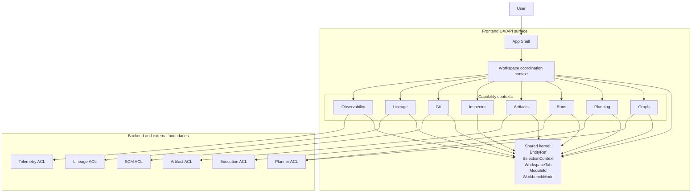
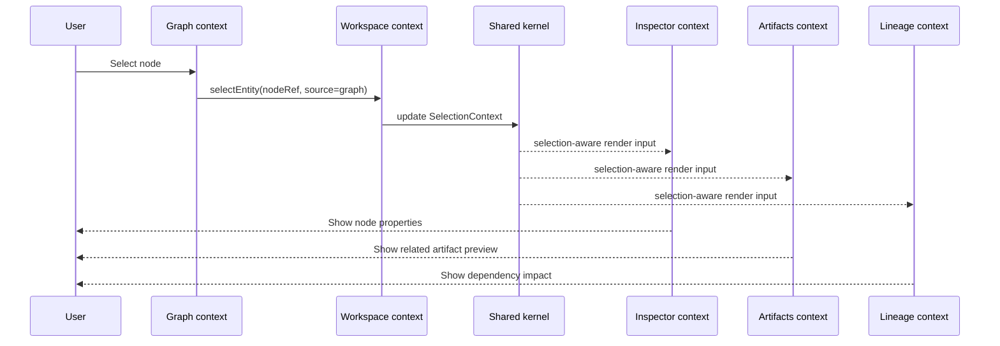
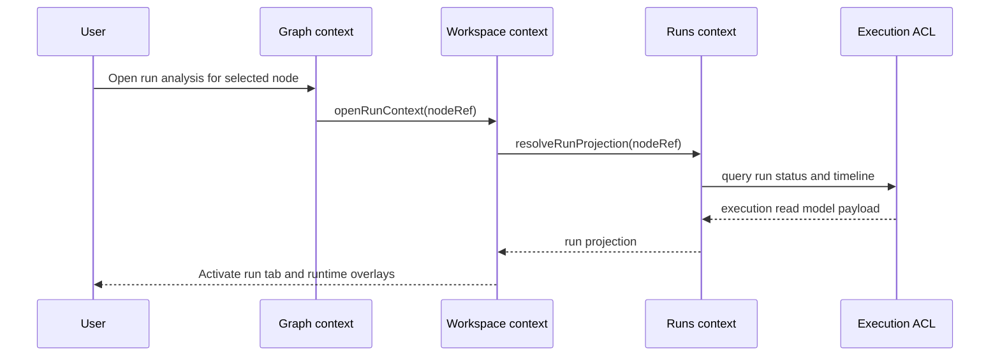
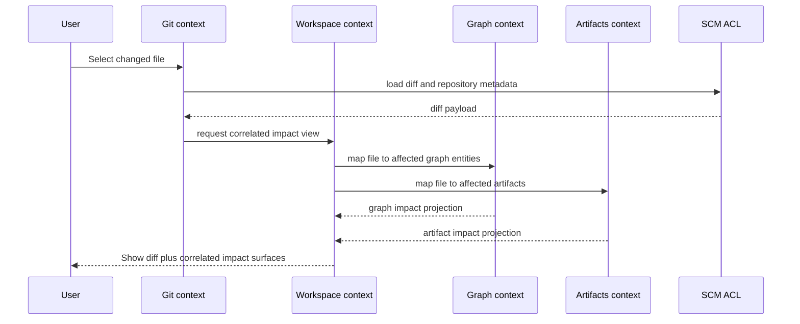

# Frontend DDD Target Architecture

## 1. Purpose

This document defines the DDD target architecture for the frontend inside the
DVT UX/API surface.

Its job is to provide one canonical domain map so the capability documents
under `docs/architecture/frontend/` behave like companion specifications
instead of parallel authority.

## 2. Governing sources

- [DVT Domain Language](../../concepts/domain-language.md)
- [Reference Architecture](../reference-architecture.md)
- [ADR-0034 - Bounded Context Boundaries And Communication Rules](../../adr/ADR-0034-bounded-context-boundaries-and-communication-rules.md)
- [DVT+ Frontend Architecture Introduction](./dvt-frontend-architecture-introduction.md)
- [App Shell](./appshell/app-shell.md)
- [Workspace Domain Specification](./workspace/workspace-domain-specification.md)
- [Workspace Session Model Specification](./workspace/session/workspace-session-model-specification.md)
- [Selection Context Model Specification](./workspace/selection-context-model-specification.md)
- [Workspace Tab Model Specification](./workspace/workspace-tab-model-specification.md)
- [Workspace Layout Model Specification](./workspace/workspace-layout-model-specification.md)
- [Frontend ACL Ownership Map](./frontend-acl-ownership-map.md)
- [Frontend State Ownership And Persistence Policy](./frontend-state-ownership-and-persistence-policy.md)
- [Workspace Orchestration - Cross-Feature Coordination Mechanism](./workspace/workspace-orchestration.md)
- [Workflow / Graph Workbench - Surfaces and Operating Modes](./views/workflow/workflow-graph-workbench-surfaces-and-operating-modes.md)
- [Runs Frontend Architecture](./runs/dvt-runs-frontend-architecture.md)
- [Frontend Architecture - Planning Capability](./planning/frontend-planning-capability-architecture.md)
- [DVT+ Frontend Lineage](./lineage/dvt-frontend-lineage.md)
- [Frontend Architecture - Inspector](./inspector/inspector-frontend-architecture.md)
- [Git Mode Architecture](./git/git-mode-architecture.md)

## 3. Position inside DVT

Per [Reference Architecture](../reference-architecture.md), the frontend lives
inside the DVT UX/API surface. It is not a peer of Planner, Execution, State,
or Artifacts at the repository domain level.

Within that UX/API surface, the frontend still needs bounded contexts of its
own. Those contexts organize frontend behavior, interaction, and translation of
backend contracts into user-facing workbench semantics.

## 4. Target domain statement

The frontend is a workbench-oriented domain surface with:

- one shell composition boundary
- one workspace coordination context
- multiple capability contexts
- one shared kernel for cross-surface interaction
- explicit anti-corruption layers to backend contracts
- one canonical state ownership and persistence policy for browser-resident
  state

## 5. Bounded contexts and roles

| Context       | Kind         | Owns                                                                                                    | Must not own                                         |
| ------------- | ------------ | ------------------------------------------------------------------------------------------------------- | ---------------------------------------------------- |
| App Shell     | Composition  | global frame, routing shell, providers, workspace host, overlays                                        | feature behavior, workspace semantics                |
| Workspace     | Coordination | session, tabs, layout, module selection, workbench mode, selection context, cross-feature orchestration | graph semantics, run semantics, git semantics        |
| Graph         | Capability   | canonical graph UI model, graph commands, graph selectors, canvas projection                            | workspace coordination, run authority                |
| Planning      | Capability   | plan inspection views, plan diff projections, planning workflows in UI                                  | planner backend semantics, execution lifecycle       |
| Runs          | Capability   | run list/detail projections, runtime overlays, execution evidence views                                 | execution authority, graph structure authority       |
| Artifacts     | Capability   | artifact browsing, previews, generated output projections, artifact correlation                         | immutable artifact storage authority                 |
| Inspector     | Capability   | selected-entity detail views, editing forms, section composition                                        | ownership of canonical selection                     |
| Git           | Capability   | repository review projections, diff workflows, commit preparation UI, policy hints                      | repository authority, workspace session authority    |
| Lineage       | Capability   | dependency exploration, impact projections, traceability views                                          | graph editing authority, workspace session authority |
| Observability | Capability   | operational read models, metric projections, user-facing diagnostics                                    | telemetry authority, run authority                   |

## 6. Shared kernel

The frontend needs one shared kernel so capability contexts can collaborate
without directly importing each other's private models.

The shared kernel should stay small and stable. It contains only concepts that
must be understood consistently across contexts:

- `EntityRef` and `ContextOrigin` in
  [Selection Context Model Specification](./workspace/selection-context-model-specification.md)
- [SelectionContext](./workspace/selection-context-model-specification.md)
- [WorkspaceTab](./workspace/workspace-tab-model-specification.md)
- [WorkspaceLayout](./workspace/workspace-layout-model-specification.md)
- `ModuleId`
- `WorkbenchMode`

Rule: if a type is only meaningful inside one capability context, it does not
belong in the shared kernel.

## 7. Strategic relationships

| Relationship                          | Type                  | Meaning                                                                   |
| ------------------------------------- | --------------------- | ------------------------------------------------------------------------- |
| App Shell -> Workspace                | Customer-Supplier     | Shell hosts workspace, but Workspace owns workbench semantics.            |
| Workspace -> Graph                    | Customer-Supplier     | Workspace asks Graph for projections and selection-aware behavior.        |
| Workspace -> Runs                     | Customer-Supplier     | Workspace coordinates runtime views but does not own run semantics.       |
| Workspace -> Artifacts                | Customer-Supplier     | Workspace coordinates artifact views but does not own artifact semantics. |
| Workspace -> Inspector                | Customer-Supplier     | Inspector renders from shared context owned by Workspace.                 |
| Workspace -> Git                      | Customer-Supplier     | Git contributes review surfaces into the workbench.                       |
| Workspace -> Lineage                  | Customer-Supplier     | Lineage contributes dependency projections into the workbench.            |
| Frontend contexts -> backend contexts | Anti-Corruption Layer | Backend contracts are translated into frontend models before use.         |

## 8. Context map

## 9. Communication rules

### 9.1 Cross-feature effects are mediated by Workspace

Feature contexts do not call each other's components, stores, or private action
APIs directly.

Allowed pattern:

- Graph raises an intent through Workspace application services
- Workspace updates shared kernel state
- Inspector, Artifacts, Lineage, or Runs react through their own selectors and
  facades

Forbidden pattern:

- Graph directly opens Inspector internals
- Runs directly mutates Graph selection state
- Git directly controls Lineage component state

### 9.2 Backend contracts cross the boundary through ACLs

Each capability context must translate backend contracts into frontend domain
models before they become part of the UI domain.

Canonical owner:
[Frontend ACL Ownership Map](./frontend-acl-ownership-map.md)

### 9.3 Runtime overlays are read models

Runtime data enriches design surfaces but does not silently mutate the
canonical design model.

### 9.4 Commands and queries remain distinct

The frontend may share a coordination kernel, but it should still separate:

- state-changing user intents
- read-model projections

### 9.5 State ownership and persistence are explicit

Canonical owner:
[Frontend State Ownership And Persistence Policy](./frontend-state-ownership-and-persistence-policy.md)

The frontend must keep these boundaries explicit:

- server state and runtime truth stay in capability-owned query layers behind
  ACLs
- Workspace owns coordination state and explicit workbench session state
- feature-local transient interaction stays inside the owning capability unless
  another bounded context must react
- browser persistence is limited to explicit session/workbench state, never to
  live runtime truth

## 10. Domain sequences

### 10.1 Node selection across the workbench

### 10.2 Open run analysis from a selected graph entity

### 10.3 Review change impact in Git mode

## 11. Canonical frontend language

Use these terms consistently:

- `moduleId`: shell-level mounted product module
- `workbenchMode`: interaction mode inside a workbench
- `selection`: canonical shared selection context
- `projection`: frontend read model used for rendering
- `overlay`: derived visualization layered on canonical state
- `tab`: typed work surface instance
- `workspace`: coordination context for the active workbench session

Do not treat these pairs as synonyms:

- `moduleId` and `workbenchMode`
- `selection` and `focus`
- `projection` and `payload`
- `overlay` and `state authority`

## 12. Decision summary

The target frontend architecture is:

- shell-composed
- workspace-coordinated
- capability-bounded
- shared-kernel based
- ACL-translated at backend boundaries

That is the DDD baseline the rest of the frontend architecture documents should
refine.

## 13. References

- [Reference Architecture](../reference-architecture.md)
- [ADR-0034 - Bounded Context Boundaries And Communication Rules](../../adr/ADR-0034-bounded-context-boundaries-and-communication-rules.md)
- [DVT+ Frontend Architecture Introduction](./dvt-frontend-architecture-introduction.md)
- [App Shell](./appshell/app-shell.md)
- [Workspace Domain Specification](./workspace/workspace-domain-specification.md)
- [Selection Context Model Specification](./workspace/selection-context-model-specification.md)
- [Workspace Tab Model Specification](./workspace/workspace-tab-model-specification.md)
- [Workspace Layout Model Specification](./workspace/workspace-layout-model-specification.md)
- [Frontend ACL Ownership Map](./frontend-acl-ownership-map.md)
- [Workspace Orchestration - Cross-Feature Coordination Mechanism](./workspace/workspace-orchestration.md)
- [Workflow / Graph Workbench - Surfaces and Operating Modes](./views/workflow/workflow-graph-workbench-surfaces-and-operating-modes.md)
- [Runs Frontend Architecture](./runs/dvt-runs-frontend-architecture.md)
- [Frontend Architecture - Planning Capability](./planning/frontend-planning-capability-architecture.md)
- [DVT+ Frontend Lineage](./lineage/dvt-frontend-lineage.md)
- [Git Mode Architecture](./git/git-mode-architecture.md)
