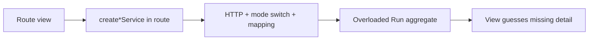
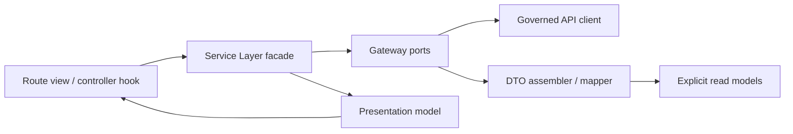
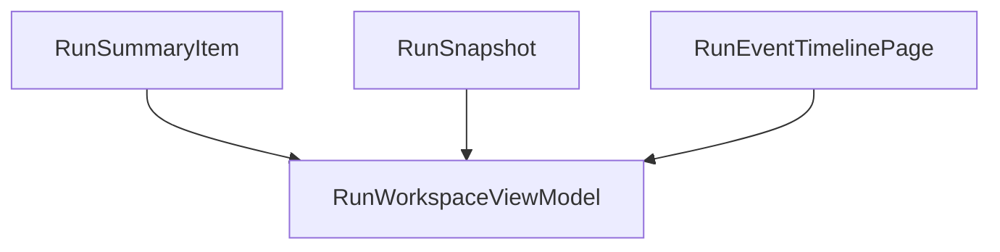
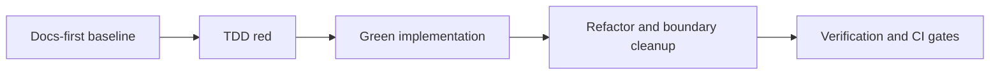

# Frontend Fowler Implementation Pattern

## Purpose

This document defines the canonical frontend implementation pattern for DVT
routes that consume multiple backend read models.

It is the baseline for `F-07` and for future route-level capabilities.

## Anti-Pattern To Avoid

Do not compose route behavior with mixed concerns in one layer:

- view calls `create*Service` directly;
- service mixes gateway strings, DTO translation, mode switching, and
  route-specific fallback policy;
- route consumes one overloaded aggregate type that hides read-model boundaries;
- UI infers detail from missing arrays or placeholder values.

## Target Fowler Pipeline

The route must be implemented with explicit layers:

- `Gateway`: transport and route strings;
- `Assembler`: DTO normalization and mapping to frontend read models;
- `Service Layer / Facade`: route-level orchestration and fallback policy;
- `Presentation Model`: route-facing model consumed by the view.

## Read-Model Split

The frontend must keep read models explicit and separate:

- `RunSummaryItem`: list and index concerns
- `RunSnapshot`: lifecycle snapshot authority
- `RunEventTimelinePage`: ordered event feed
- `RunWorkspaceViewModel`: route-facing composition model

No single `Run` type should hide these semantics.

## No-Legacy Rule

For active route flows covered by a Fowler pilot:

- no compatibility model that pretends snapshot payloads are full aggregates;
- no route-level fallback that fabricates steps, artifacts, or metrics from
  empty placeholders;
- no direct route ownership of transport endpoints.

## Fowler Rationale

- Service Layer owns route policy: loading, partial, degraded, not-found.
- Gateway owns endpoint strings and transport details.
- Assembler owns DTO normalization and mapping discipline.
- Presentation model isolates the view from backend payload shape drift.

## Delivery Sequence

Use strict docs-first and TDD-first ordering.

## F-07 Worked Example

`F-07` applies this pattern to Runs:

- gateway contract uses `POST /runs/start`, `GET /runs`, `GET /runs/:runId`,
  `GET /runs/:runId/events`;
- facade composes snapshot + timeline into `RunWorkspaceViewModel`;
- route consumes the presentation model and never invents missing detail.

## Related Pages

- [Frontend Data-Boundary Architecture](frontend-data-boundary-architecture.md)
- [Runs Frontend Architecture](runs/dvt-runs-frontend-architecture.md)
- [Frontend Runtime Contract Technical Manual](runs/frontend-runtime-contract-technical-manual.md)
- [F-07 Frontend Runtime Contract Baseline Plan](../../planning/proposals/mandatory/runtime-and-contracts/f-07-frontend-runtime-contract-baseline-plan-20260404.md)
