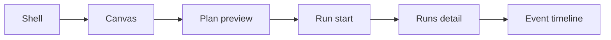

# Frontend Runtime Modes User Manual

## Purpose

This manual explains how operators and developers should interpret frontend behavior in `mock` and `api` modes.

## Runtime Modes

### `mock` mode

- used for local development and UX iteration;
- data is synthetic or locally derived;
- network-backed capability checks can be unavailable without blocking basic UI navigation.

### `api` mode

- used for integration and operational validation;
- views consume backend-backed data through governed adapters;
- route behavior must follow runtime contracts exposed by `apps/api`.

Mode selection is done once at frontend composition boot. Views should not branch on mode.

## Shell Guarantees

The shell should expose clear states:

- `loading`: backend state is being resolved;
- `empty`: no data exists for the selected context;
- `degraded`: partial backend availability;
- `offline`: backend unreachable;
- `read-only`: user can inspect but cannot execute mutation actions.

## Route Behavior Under Target Model

- Canvas: renders graph and planning actions through controller hooks and facades.
- Runs: list/detail/events flow reads runtime data through `RunsPort`.
- Diff: reads diff data through `WorkspacePort` or dedicated diff port.
- Artifacts: reads artifact surfaces via adapter-backed services.
- Admin: reads capabilities, role, and audit views through governed clients.

No route should decide API/mock mode locally.

## Failure Interpretation

- capability unavailable: specific feature reported as not available by backend;
- backend failure: request failed due to network or HTTP error;
- permissions failure: action denied by auth/role posture.

Operators should distinguish “feature unavailable” from “system offline”.

## Route Journey (Operator)

Mode selection is not part of this route journey.
