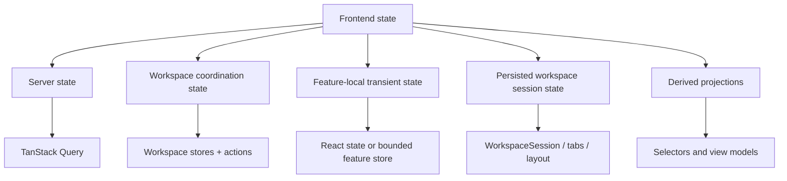
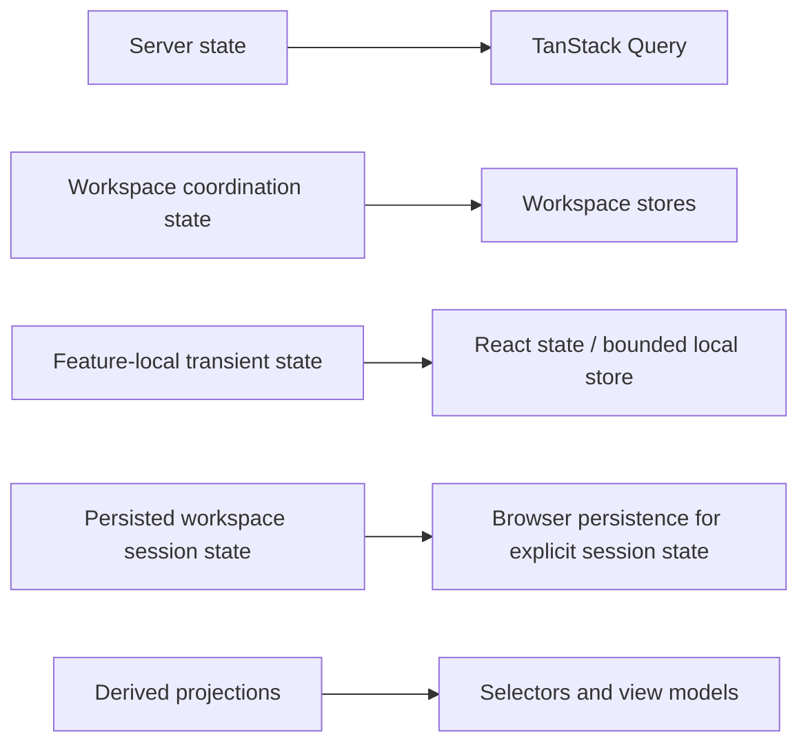
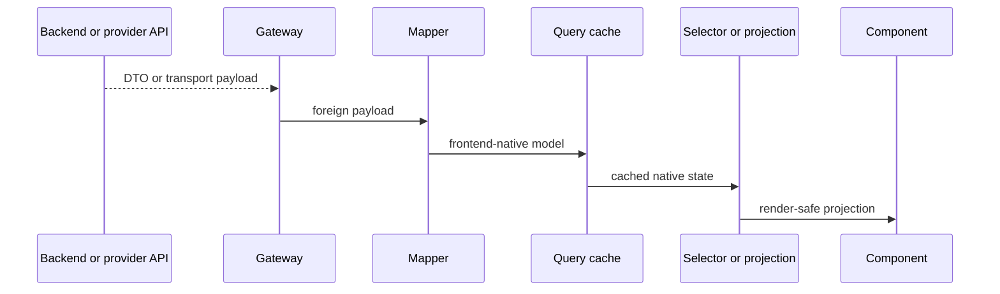
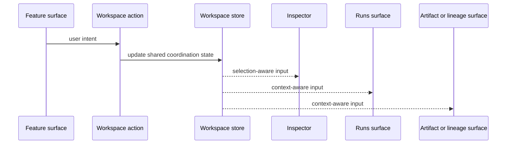
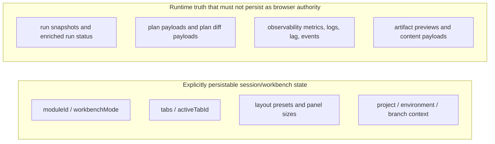
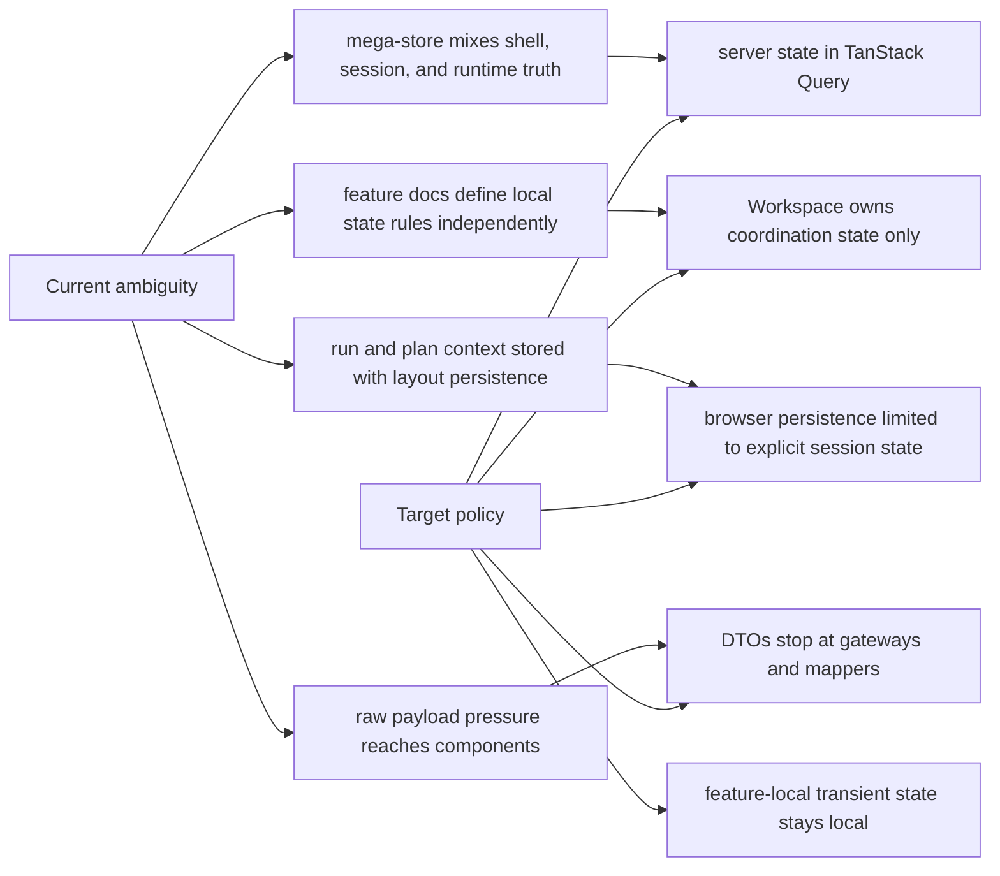
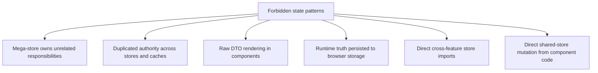
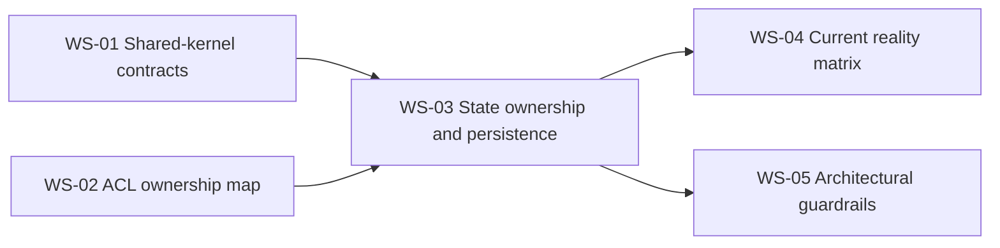

# Frontend State Ownership And Persistence Policy

## 1. Purpose

This document defines the canonical frontend-wide policy for state ownership,
persistence, and state-boundary discipline inside the DVT workbench.

It closes:

- `FD-DEC-05` in the frontend coverage and decision register
- `FD-DEC-06` in the frontend coverage and decision register
- `WS-03` in the frontend architecture deepening work plan

Its role is to make one point explicit:

> Every frontend state category must have one default owner, one default
> persistence posture, and one explicit rule for how foreign payloads stop
> before they become frontend-native state.

## 2. Architectural role

This document is canonical for frontend state ownership and persistence.

DDD role:

- bounded contexts keep their own native models
- Workspace owns cross-context coordination state
- backend/runtime truth remains outside Workspace session authority

Hexagonal-compatible role:

- query-backed server state lives behind capability ACLs and query clients
- coordination state lives behind workspace action functions and workspace
  stores
- feature-local interaction state stays inside the capability or component that
  owns it
- persistence happens only for explicit session/workbench contracts

SOLID note:

- SOLID is used here as a design-quality goal, not as Fowler taxonomy
- the evidence for these rules is grounded in Fowler-documented layering,
  DTO, mapper, gateway, session-state, and read/write-separation sources

## 3. Canonical state taxonomy

The frontend uses five state classes.

- `Server state`: owned by the capability query layer, implemented through
  TanStack Query, and treated as non-authoritative browser cache only.
- `Workspace coordination state`: owned by the Workspace bounded context,
  implemented through workspace stores plus workspace actions, and persisted
  only when it is explicit `WorkspaceSession` state.
- `Feature-local transient state`: owned by the feature or component,
  implemented through React local state or a bounded local store, and not
  persisted by default.
- `Persisted workspace session state`: owned by the Workspace session model,
  implemented through session contracts and layout references, and eligible for
  explicit restore or persistence.
- `Derived projections and selectors`: owned by selectors and view models,
  implemented through selectors, mappers, and projection functions, and never
  treated as authoritative browser truth.

### 3.1 State taxonomy map

Evidence mode:

- `compatible precedent`:
  [Presentation Domain Data Layering](https://martinfowler.com/bliki/PresentationDomainDataLayering.html),
  [Separated Presentation](https://martinfowler.com/eaaDev/SeparatedPresentation.html),
  [Bounded Context](https://martinfowler.com/bliki/BoundedContext.html)
- `exact precedent`:
  [TanStack Query](https://tanstack.com/query/latest),
  [create - Zustand](https://zustand.docs.pmnd.rs/reference/apis/create),
  [Managing State - React](https://react.dev/learn/managing-state)
- `local canonical policy`: this repository maps those state classes to those
  exact mechanisms

### 3.2 State ownership matrix

Evidence mode:

- `compatible precedent`:
  [Client Session State](https://martinfowler.com/eaaCatalog/clientSessionState.html),
  [Presentation Domain Data Layering](https://martinfowler.com/bliki/PresentationDomainDataLayering.html)
- `exact precedent`:
  [Important Defaults | TanStack Query React Docs](https://tanstack.com/query/latest/docs/framework/react/guides/important-defaults?from=reactQueryV3),
  [create - Zustand](https://zustand.docs.pmnd.rs/reference/apis/create),
  [Choosing the State Structure - React](https://react.dev/learn/choosing-the-state-structure)
- `local canonical policy`: browser persistence is limited to explicit
  workbench session contracts, not query caches

## 4. Canonical rules

The following rules are mandatory for the frontend architecture corpus.

1. Server state is backend-owned and browser-cached, not browser-authored.
2. Server state belongs in TanStack Query or an equivalent capability query
   layer, not in Workspace stores.
3. Workspace stores own cross-context coordination state only.
4. Feature-local transient state belongs to the feature or component that owns
   the interaction.
5. Browser persistence is allowed only for explicit session/workbench state.
6. Runtime truth must not persist to `localStorage`, `sessionStorage`, or any
   equivalent browser store.
7. Raw DTOs stop at gateways and mappers before reaching stores or components.
8. Derived selectors and projections are not new sources of truth.
9. Cross-feature coordination happens through Workspace actions and shared
   kernel state, not direct feature-to-feature store writes.

### 4.1 Server state rule

Server state includes:

- plan payloads and plan projections returned by backend APIs
- run snapshots, diagnostics, action capabilities, and event pages
- artifact metadata, previews, download handles, and content payloads
- lineage, observability, telemetry, and log query results

Mandatory rule:

- server state is fetched, cached, invalidated, and refreshed through a query
  layer owned by the capability boundary
- query caches may hold browser copies of runtime truth, but those copies are
  non-authoritative and refreshable
- server payloads must be mapped before components or workspace stores consume
  them

### 4.2 Workspace coordination state rule

Workspace coordination state includes:

- current `SelectionContext`
- active `WorkspaceTab` and tab lifecycle
- active `WorkspaceLayout`
- active `moduleId`
- active `workbenchMode`
- explicit restoration metadata for the active workbench session

Mandatory rule:

- Workspace stores own only coordination and restorable workbench context
- Workspace stores must not duplicate remote query caches for runs, plans,
  artifacts, or observability payloads
- feature components read shared workspace state through selectors or hooks and
  mutate it only through workspace actions

### 4.3 Feature-local transient state rule

Feature-local transient state includes:

- hover state
- drag state
- local panel toggles
- temporary compare inputs
- filters not shared outside the owning feature
- in-progress form edits

Mandatory rule:

- use React local state by default
- use a bounded feature-local store only when the interaction spans several
  components inside the same capability and would otherwise create prop-drill
  noise or unstable local duplication
- do not escalate feature-local transient state into Workspace unless another
  bounded context needs to react to it

### 4.4 Persisted workspace session state rule

The following state is eligible for explicit browser persistence or restoration:

- workspace identity
- project, environment, and branch context where applicable
- active `moduleId`
- active `workbenchMode` when valid for the mounted module
- open tabs and active tab identity
- layout presets, panel visibility, and panel sizes
- selection only when restoration semantics explicitly allow it

The following state is not eligible for browser persistence as runtime truth:

- run snapshots or provider-enriched status
- run diagnostics or event streams
- plan payloads, plan diff payloads, or validation payloads
- observability metrics, lag values, logs, or event pages
- raw artifact previews or content payloads

### 4.5 Derived projection rule

Derived selectors and view models may summarize or reshape state, but they
must never:

- replace the source query cache
- replace the source workspace store
- persist themselves as a second authoritative copy
- embed raw DTOs as opaque payload bags

### 4.6 Canonical data flow

Evidence mode:

- `compatible precedent`:
  [Separated Presentation](https://martinfowler.com/eaaDev/SeparatedPresentation.html),
  [Data Mapper](https://martinfowler.com/eaaCatalog/dataMapper.html),
  [Data Transfer Object](https://martinfowler.com/eaaCatalog/dataTransferObject.html),
  [Table Data Gateway](https://www.martinfowler.com/eaaCatalog/tableDataGateway.html)
- `exact precedent`:
  [TanStack Query](https://tanstack.com/query/latest),
  [Important Defaults | TanStack Query React Docs](https://tanstack.com/query/latest/docs/framework/react/guides/important-defaults?from=reactQueryV3)
- `local canonical policy`: no raw transport payload crosses the mapper line
  into component-facing or workspace-facing state

### 4.7 Workspace coordination flow

Evidence mode:

- `compatible precedent`:
  [Bounded Context](https://martinfowler.com/bliki/BoundedContext.html),
  [Separated Presentation](https://martinfowler.com/eaaDev/SeparatedPresentation.html)
- `exact precedent`:
  [create - Zustand](https://zustand.docs.pmnd.rs/reference/apis/create)
- `local canonical policy`: this repository standardizes shared Workspace
  stores plus workspace actions as the coordination mechanism

## 5. Invariants

The following invariants define the policy.

### 5.1 Single-authority invariant

Every materially important piece of state must have one canonical owner.

If two stores can both claim to own the same active run, active plan, or
selection truth, the model is invalid.

### 5.2 No runtime-truth persistence invariant

Browser persistence must never be treated as the canonical source for live run
state, plan payloads, observability metrics, or provider-enriched status.

### 5.3 No transport-leakage invariant

Components and workspace stores do not own transport envelopes.

DTOs terminate at gateways and mappers.

### 5.4 No backend-cache duplication invariant

Workspace or feature stores must not become hand-rolled copies of query cache
data.

### 5.5 Explicit rehydration invariant

Only session/workbench state that has explicit restoration semantics may be
rehydrated after reload or re-entry.

### 5.6 No cross-feature store-coupling invariant

Feature components do not import sibling feature stores in order to coordinate
UI behavior.

### 5.7 Persistence boundary

Evidence mode:

- `exact precedent`:
  [Client Session State](https://martinfowler.com/eaaCatalog/clientSessionState.html),
  [Perspectives - Eclipse Platform](https://help.eclipse.org/latest/topic/org.eclipse.platform.doc.isv/guide/workbench_perspectives.htm),
  [Customize window layouts and personalize tabs in Visual Studio](https://learn.microsoft.com/en-us/visualstudio/ide/customizing-window-layouts-in-visual-studio?view=vs-2022)
- `compatible precedent`:
  [Presentation Domain Data Layering](https://martinfowler.com/bliki/PresentationDomainDataLayering.html)
- `local canonical policy`: only explicit session/workbench state is treated as
  persistable client session state in this repository

## 6. Anti-patterns and migration posture

The following patterns are prohibited by this policy.

- mega-stores that mix shell, session, layout, runtime truth, and feature
  internals
- duplicated authoritative copies across query cache, workspace store, and
  feature store
- raw DTO rendering in components
- persisting runtime truth to browser storage
- direct cross-feature store imports for UI coordination
- direct shared-store mutation from component render paths

### 6.1 Current ambiguity to target policy

Evidence mode:

- `compatible precedent`:
  [Presentation Domain Data Layering](https://martinfowler.com/bliki/PresentationDomainDataLayering.html),
  [Separated Presentation](https://martinfowler.com/eaaDev/SeparatedPresentation.html)
- `exact precedent`:
  [Choosing the State Structure - React](https://react.dev/learn/choosing-the-state-structure)
- `local canonical policy`: the migration target for this repository is the
  state split declared in this document

### 6.2 Anti-pattern map

Evidence mode:

- `compatible precedent`:
  [Separated Presentation](https://martinfowler.com/eaaDev/SeparatedPresentation.html),
  [Data Transfer Object](https://martinfowler.com/eaaCatalog/dataTransferObject.html),
  [Bounded Context](https://martinfowler.com/bliki/BoundedContext.html)
- `exact precedent`:
  [Choosing the State Structure - React](https://react.dev/learn/choosing-the-state-structure)
- `local canonical policy`: the forbidden patterns above become guardrail
  candidates for the frontend architecture program

### 6.3 Decision dependency graph

Evidence mode:

- `compatible precedent`:
  [Bounded Context](https://martinfowler.com/bliki/BoundedContext.html)
- `local canonical policy`: this repository executes frontend closure in the
  dependency order declared by the deepening work plan

## 7. Architectural precedents and evidence

### 7.1 Fowler primary sources

- Martin Fowler,
  [Bounded Context](https://martinfowler.com/bliki/BoundedContext.html)
- Martin Fowler,
  [Presentation Domain Data Layering](https://martinfowler.com/bliki/PresentationDomainDataLayering.html)
- Martin Fowler,
  [Separated Presentation](https://martinfowler.com/eaaDev/SeparatedPresentation.html)
- Martin Fowler,
  [Data Mapper](https://martinfowler.com/eaaCatalog/dataMapper.html)
- Martin Fowler,
  [Data Transfer Object](https://martinfowler.com/eaaCatalog/dataTransferObject.html)
- Martin Fowler,
  [Table Data Gateway](https://www.martinfowler.com/eaaCatalog/tableDataGateway.html)
- Martin Fowler,
  [Client Session State](https://martinfowler.com/eaaCatalog/clientSessionState.html)
- Martin Fowler article including CQRS discussion,
  [What do you mean by "Event-Driven"?](https://martinfowler.com/articles/201701-event-driven.html)

### 7.2 Official mechanism sources

- [TanStack Query](https://tanstack.com/query/latest)
- [Important Defaults | TanStack Query React Docs](https://tanstack.com/query/latest/docs/framework/react/guides/important-defaults?from=reactQueryV3)
- [create - Zustand](https://zustand.docs.pmnd.rs/reference/apis/create)
- [Managing State - React](https://react.dev/learn/managing-state)
- [Choosing the State Structure - React](https://react.dev/learn/choosing-the-state-structure)

### 7.3 Mature-system fallback precedents

- Eclipse Platform,
  [Perspectives](https://help.eclipse.org/latest/topic/org.eclipse.platform.doc.isv/guide/workbench_perspectives.htm)
- Visual Studio,
  [Customize window layouts and personalize tabs in Visual Studio](https://learn.microsoft.com/en-us/visualstudio/ide/customizing-window-layouts-in-visual-studio?view=vs-2022)

These non-Fowler sources are used only where Fowler does not define the exact
workbench-layout or client-mechanism concept being documented.

### 7.4 Repository-local canonical policy

The following decisions are repository-local canonical policy:

- server state defaults to TanStack Query
- Workspace stores own coordination state only
- feature-local transient state defaults to React local state or bounded
  feature-local stores
- explicit browser persistence is limited to session/workbench state
- runtime truth is never persisted as browser authority
- query caches and workspace stores are not interchangeable

## 8. References

- [Frontend Architecture](index.md)
- [Frontend DDD Target Architecture](frontend-ddd-target-architecture.md)
- [Frontend ACL Ownership Map](frontend-acl-ownership-map.md)
- [Workspace Domain Specification](workspace/workspace-domain-specification.md)
- [Workspace Session Model Specification](workspace/session/workspace-session-model-specification.md)
- [Workspace Orchestration - Cross-Feature Coordination Mechanism](workspace/workspace-orchestration.md)
- [Frontend Architecture - Planning Capability](planning/frontend-planning-capability-architecture.md)
- [Runs Frontend Architecture](runs/dvt-runs-frontend-architecture.md)
- [Frontend Observability Architecture](observability/front-observability-architecture-dvt.md)
- [Frontend Coverage Map And Open Decision Register](review/frontend-coverage-map-and-open-decision-register.md)
- [Frontend Architecture Deepening Work Plan](review/frontend-architecture-deepening-work-plan.md)
