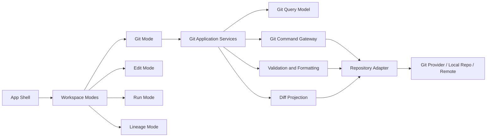
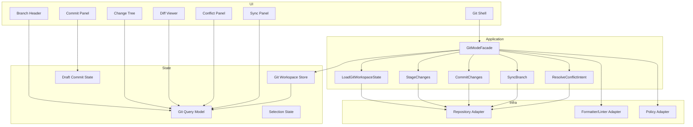
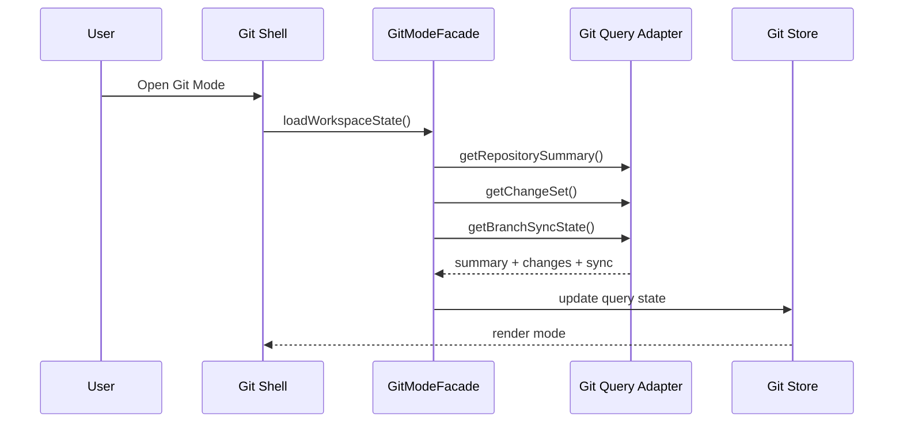
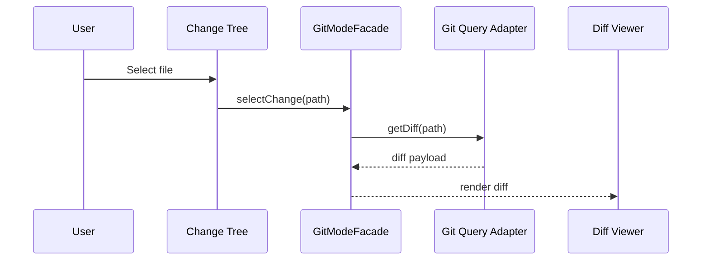
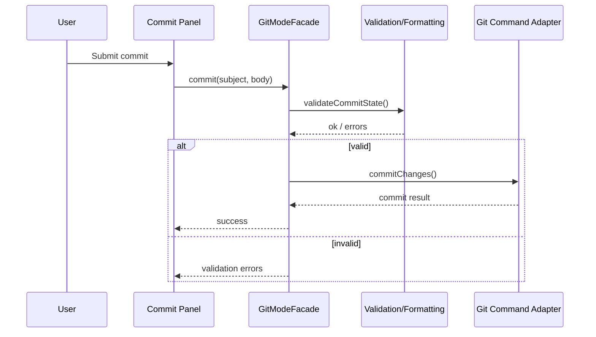

# Git Mode Architecture

## 1. Purpose

Git Mode is the frontend operating mode focused on **versioned change management** across the workspace.  
Its purpose is not limited to showing repository status. It must provide a controlled surface for:

- inspecting local and remote change state,
- understanding how workspace edits map to versioned artifacts,
- preparing commits with deterministic formatting,
- reviewing diffs before persistence,
- handling branch-oriented workflows,
- coordinating project state with generated artifacts and execution-related metadata.

Within DVT+, Git Mode is part of the **product control plane** of the frontend.  
It should behave as a governed editing and review environment, not as a generic code editor clone.

---

## 2. Scope

Git Mode should cover the following frontend concerns:

1. **Repository visibility**
   - active branch,
   - ahead/behind state,
   - dirty files,
   - staged vs unstaged changes,
   - merge/rebase/conflict state.

2. **Change review**
   - file-level diff navigation,
   - semantic grouping by domain area,
   - generated vs user-authored changes,
   - structural awareness for key artifact types.

3. **Authoring support**
   - commit message workflow,
   - validation hooks,
   - formatting/linting status,
   - policy warnings before commit.

4. **Workflow actions**
   - stage/unstage,
   - discard/revert,
   - commit,
   - pull/rebase/sync,
   - push,
   - branch switch/create,
   - PR handoff integration later.

5. **Traceability**
   - relation between UI actions and affected repository files,
   - visibility of generated SQL, metadata, manifests, config, docs and policies.

Git Mode should not become a full Git client replacement in the first iterations.  
Complex history surgery, cherry-pick flows, interactive rebase editors or advanced stash workflows can remain outside the initial scope.

---

## 3. Product Role in the Frontend

Git Mode sits between:

- the **workspace editing surface**,
- the **artifact generation pipeline**,
- and the **repository integration boundary**.

It is therefore a cross-cutting mode, not an isolated page.

### Core product responsibility

Git Mode answers this question:

> What changed, why did it change, and is the repository state safe to persist?

This makes it a critical governance surface for a deterministic and auditable platform.

---

## 4. Architectural Position



Git Mode should remain dependent on **application services and projections**, not on raw Git CLI concepts directly inside UI components.

---

## 5. Frontend Design Principles

## 5.1 Deterministic review first

The UI should privilege safe review over fast mutation.  
A user must see:

- exactly which files changed,
- whether the change is manual or generated,
- whether formatting/linting is satisfied,
- whether the current branch is safe to push.

## 5.2 Domain-aware grouping

Flat file lists are weak for this product.  
Git Mode should group changes by business area, for example:

- models,
- generated SQL,
- planner/configuration,
- workflow definitions,
- docs,
- tests,
- UI/frontend files.

## 5.3 Generated content must be explicit

Generated artifacts must never be visually mixed with hand-authored edits without distinction.  
The UI should clearly label:

- generated,
- user-authored,
- derived/generated-but-edited,
- unknown origin.

## 5.4 Commands must be bounded

The UI should expose a narrow set of safe actions.  
Dangerous operations should be explicit and context-aware.

## 5.5 Git state is read-model driven

UI components should not reconstruct repository state ad hoc.  
A Git read model should project repository status into stable frontend view state.

---

## 6. Suggested Bounded Structure



---

## 7. Main UI Components

## 7.1 Git Shell

Top-level container for the mode.

Responsibilities:

- route-level composition,
- loading and error boundaries,
- mode toolbar integration,
- layout split management,
- keyboard shortcuts registration,
- panel visibility orchestration.

It should not contain Git business rules.

## 7.2 Branch Header

Shows:

- repository identity,
- current branch,
- dirty indicator,
- ahead/behind counts,
- sync state,
- conflict/rebase state.

This component should be summary-only and driven by query state.

## 7.3 Change Tree

Lists changed files grouped by category.

Recommended grouping dimensions:

- domain group,
- file type,
- generated/manual origin,
- staged/unstaged/conflicted state.

Capabilities:

- stage/unstage per file,
- bulk stage by group,
- select file to inspect diff,
- reveal policy issues per file.

## 7.4 Diff Viewer

A central component of Git Mode.

Should support:

- unified diff,
- split diff,
- syntax-highlighted text where applicable,
- structural tabs for key assets later,
- generated artifact previews,
- conflict chunk visualization.

For DVT+, a plain textual diff is necessary but not sufficient for all file types.  
Future structural diff views may be needed for:

- workflow metadata,
- dbt model config,
- YAML policies,
- generated SQL blocks.

## 7.5 Commit Panel

Handles:

- commit message drafting,
- validation feedback,
- commit scope hints,
- summary of staged changes,
- optional policy checklist.

It should integrate tightly with formatting and lint status so that the user understands why a commit is blocked.

## 7.6 Sync Panel

Exposes branch synchronization actions:

- fetch status,
- pull/rebase status,
- push eligibility,
- remote divergence summary.

## 7.7 Conflict Panel

Only visible when required.

Should provide:

- file list in conflict,
- conflict type,
- guided resolution state,
- escape path back to manual resolution if necessary.

---

## 8. State Model

A practical frontend state split:

```mermaid
classDiagram
    class GitWorkspaceState {
      +repositoryId: string
      +branchName: string
      +isDirty: boolean
      +aheadCount: number
      +behindCount: number
      +syncState: string
      +operationState: string
      +hasConflicts: boolean
    }

    class GitChangeItem {
      +path: string
      +domainGroup: string
      +changeType: string
      +originType: string
      +isStaged: boolean
      +isConflicted: boolean
      +policyFlags: string[]
    }

    class GitDiffState {
      +selectedPath: string
      +viewMode: string
      +diffText: string
      +isLoading: boolean
    }

    class CommitDraftState {
      +subject: string
      +body: string
      +validationErrors: string[]
      +isCommittable: boolean
    }

    class GitWorkspaceState --> GitChangeItem
    class GitWorkspaceState --> GitDiffState
    class GitWorkspaceState --> CommitDraftState
```

### State separation recommendation

Use at least four slices:

1. **Repository summary state**
2. **Change collection state**
3. **Selection/diff state**
4. **Commit draft / command state**

This keeps query refresh separate from transient editor interaction.

---

## 9. Key Use Cases

## 9.1 Open Git Mode



## 9.2 Review a changed file



## 9.3 Commit staged changes



---

## 10. Domain-Specific Enhancements for DVT+

Git Mode in DVT+ should eventually be better than a generic SCM panel because the product understands its own artifact ecosystem.

### Proposed enhancements

#### 10.1 Artifact-origin awareness

Each changed file should expose origin metadata such as:

- generated by planner,
- generated by renderer,
- authored in editor,
- imported from repository,
- external/manual modification.

#### 10.2 Impact hints

When possible, a changed artifact should display likely impact:

- affects run compilation,
- affects generated SQL,
- affects planner graph,
- affects lineage metadata,
- affects only UI/documentation.

#### 10.3 Audit-safe commit preparation

Commit workflow may include policy checks such as:

- generated files out of sync with source models,
- formatting drift,
- missing docs/test updates,
- inconsistent branch state,
- unresolved generated/manual conflicts.

#### 10.4 Semantic diff modes

Later, Git Mode can offer specialized diff tabs:

- text diff,
- SQL normalized diff,
- model config diff,
- graph diff,
- lineage-impact preview.

That would be a real differentiator.

---

## 11. Integration Points

Git Mode touches several frontend subsystems.

| Subsystem         | Integration purpose                                         |
| ----------------- | ----------------------------------------------------------- |
| App Shell         | Mode routing, layout regions, global actions                |
| Workspace Session | Current project/repo context                                |
| Artifacts         | Generated file awareness and previews                       |
| Runs              | Explain whether uncommitted changes affect execution safety |
| Graph/Lineage     | Show downstream effect of changed assets                    |
| Settings          | Formatting, commit conventions, diff preferences            |
| Notifications     | Commit/push/sync feedback                                   |
| Policy Engine     | Block or warn on invalid repository state                   |

---

## 12. Error States to Model Explicitly

Git UI commonly fails when errors are collapsed into one generic state.  
This mode should distinguish at least:

- repository unavailable,
- authentication failure,
- detached HEAD,
- untracked repo state,
- merge conflict active,
- rebase in progress,
- formatter failure,
- policy validation failure,
- diff load failure,
- push rejected,
- remote changed since last fetch.

Each of these affects available commands differently.

---

## 13. Risks in a Weak Implementation

If Git Mode is implemented as a superficial source-control panel, the likely failures are:

1. **No distinction between generated and manual edits**  
   Result: repository trust degrades.

2. **No domain grouping**  
   Result: large change sets become unreadable.

3. **Commands coupled directly into components**  
   Result: mode becomes fragile and hard to test.

4. **No read-model projection**  
   Result: duplicated state logic across tree, diff and commit panels.

5. **No policy awareness**  
   Result: invalid commits are easy to produce.

6. **No conflict strategy**  
   Result: merge/rebase flows break the UX abruptly.

7. **Diff viewer only text-based for all cases**  
   Result: high-value artifacts remain difficult to review.

---

## 14. Recommended Incremental Delivery

### Phase 1 — Functional baseline

- branch header,
- changed file list,
- staged/unstaged support,
- text diff viewer,
- commit panel,
- push/pull status,
- basic validation.

### Phase 2 — Product hardening

- domain grouping,
- generated/manual tagging,
- policy warnings,
- conflict state handling,
- better query caching,
- command telemetry.

### Phase 3 — DVT-aware differentiation

- artifact origin metadata,
- impact hints,
- semantic diff modes,
- execution safety indicators,
- lineage/graph cross-links.

---

## 15. Initial Acceptance Criteria

A first serious implementation should satisfy these criteria:

1. Opening Git Mode loads repository summary and change set through a facade, not directly from components.
2. The UI distinguishes staged, unstaged and conflicted files.
3. Diff state is decoupled from change tree state.
4. Commit action is blocked on validation failure with explicit reasons.
5. Generated artifacts can be visually distinguished from manual files.
6. Branch divergence and sync state are visible before push/pull actions.
7. Error states are typed and reflected in available actions.
8. The design allows future semantic diff extensions without replacing the shell.

---

## 16. Recommended Internal Interfaces

Illustrative frontend-facing contracts:

```ts
export interface GitModeFacade {
  loadWorkspaceState(): Promise<void>;
  refreshWorkspaceState(): Promise<void>;
  selectChange(path: string): Promise<void>;
  stageChanges(paths: string[]): Promise<void>;
  unstageChanges(paths: string[]): Promise<void>;
  discardChanges(paths: string[]): Promise<void>;
  createCommit(input: CommitInput): Promise<void>;
  syncBranch(): Promise<void>;
}

export interface CommitInput {
  subject: string;
  body?: string;
}

export interface GitWorkspaceQueryModel {
  repositoryId: string;
  branchName: string;
  aheadCount: number;
  behindCount: number;
  isDirty: boolean;
  hasConflicts: boolean;
  changes: GitChangeItem[];
  selectedDiff?: GitDiffView;
}
```

The final interface names may differ, but the separation should remain.

---

## 17. Conclusion

Git Mode should be treated as a **governed review and persistence surface**, not as an accessory panel.

For DVT+, this mode is strategically important because the product depends on:

- deterministic artifacts,
- repository-backed traceability,
- controlled formatting and policy enforcement,
- safe transition from local edits to versioned state.

A weak Git mode produces operational ambiguity.  
A strong Git mode becomes one of the core trust surfaces of the frontend.
